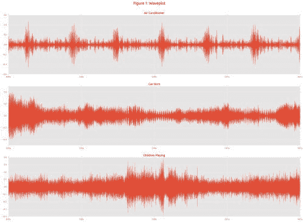
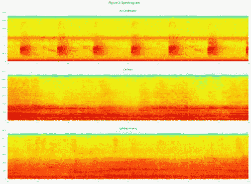

# 使用 Tensorflow 的神经网络进行城市声音分类

> 原文：[`www.kdnuggets.com/2016/09/urban-sound-classification-neural-networks-tensorflow.html`](https://www.kdnuggets.com/2016/09/urban-sound-classification-neural-networks-tensorflow.html)

**由 Aaqib Saeed，特温特大学**。

我们每天都会接触到不同的声音，比如汽车喇叭声、警报声和音乐等。如何教计算机自动将这些声音分类到不同类别中呢！

在这篇博客文章中，我们将学习使用机器学习技术将城市声音分类到不同类别中。之前的博客文章涉及了分类问题，其中数据可以轻松地表示为向量形式。例如，在文本数据集中，语料库中的每个单词成为特征，tf-idf 分数成为其值。同样，在[异常检测数据集](http://aqibsaeed.github.io/2016-08-10-logistic-regression-tf/)中，我们看到两个特征“吞吐量”和“延迟”被输入到分类器中。但在声音数据中，特征提取并不像想象的那样简单。今天，我们将首先了解可以从声音数据中提取哪些特征，以及如何使用开源库[Librosa](http://librosa.github.io)在 Python 中轻松提取这些特征。

要开始这个教程，请确保你已经安装了以下工具：

+   Tensorflow

+   Librosa

+   Numpy

+   Matplotlib

### 数据集

我们需要一个标记的数据集，以便将其输入到机器学习算法中。幸运的是，一些研究人员发布了[城市声音数据集](https://serv.cusp.nyu.edu/projects/urbansounddataset/)。该数据集包含 8,732 个标记的声音片段（每个 4 秒），分为十个类别：*空调、汽车喇叭、儿童玩耍、狗吠、钻孔、引擎怠速、枪声、电锯、警报声和街头音乐*。数据集默认被分为 10 折。要获取数据集，请访问以下[链接](https://serv.cusp.nyu.edu/projects/urbansounddataset/urbansound8k.html)，如果你想在研究中使用该数据集，请不要忘记致谢。在此数据集中，声音文件为*.wav*格式，但如果你有其他格式的文件，如*.mp3*，建议将其转换为*.wav*格式。这是因为*.mp3*是一种有损的音乐压缩技术，更多信息请查看这个[链接](http://www.premiumbeat.com/blog/when-to-use-wav-files-when-to-use-mp3-files-what-is-the-difference-between-the-two-formats/)。为了简化问题，我们只使用来自一个折的数据。

让我们读取一些声音文件并进行可视化，以了解每个声音片段之间的差异。Matplotlib 的*specgram*方法执行所有所需的频谱计算和绘图。同样，Librosa 提供了方便的方法用于绘制波形和对数功率谱图。通过查看图 1、2 和 3 中的图示，我们可以看到不同类别的声音片段之间的明显差异。

*图 1\. 波形图。*

*图 2\. 功率谱图。*

*图 3\. 声音日志功率谱图。*

* * *

## 我们的 3 个最佳课程推荐

 1\. [Google 网络安全证书](https://www.kdnuggets.com/google-cybersecurity) - 快速开启网络安全职业生涯

 2\. [Google 数据分析专业证书](https://www.kdnuggets.com/google-data-analytics) - 提升你的数据分析技能

 3\. [Google IT 支持专业证书](https://www.kdnuggets.com/google-itsupport) - 支持你所在组织的 IT

* * *

### 更多相关话题

+   [使用卷积神经网络（CNNs）进行图像分类](https://www.kdnuggets.com/2022/05/image-classification-convolutional-neural-networks-cnns.html)

+   [使用 Tensorflow 训练图像分类模型的指南](https://www.kdnuggets.com/2022/12/guide-train-image-classification-model-tensorflow.html)

+   [使用 TensorFlow 和 Keras 构建和训练你的第一个神经网络](https://www.kdnuggets.com/2023/05/building-training-first-neural-network-tensorflow-keras.html)

+   [神经网络之前值得尝试的 10 件简单事情](https://www.kdnuggets.com/2021/12/10-simple-things-try-neural-networks.html)

+   [使用 PyTorch 进行可解释的神经网络](https://www.kdnuggets.com/2022/01/interpretable-neural-networks-pytorch.html)

+   [深度神经网络不会引领我们走向 AGI](https://www.kdnuggets.com/2021/12/deep-neural-networks-not-toward-agi.html)
