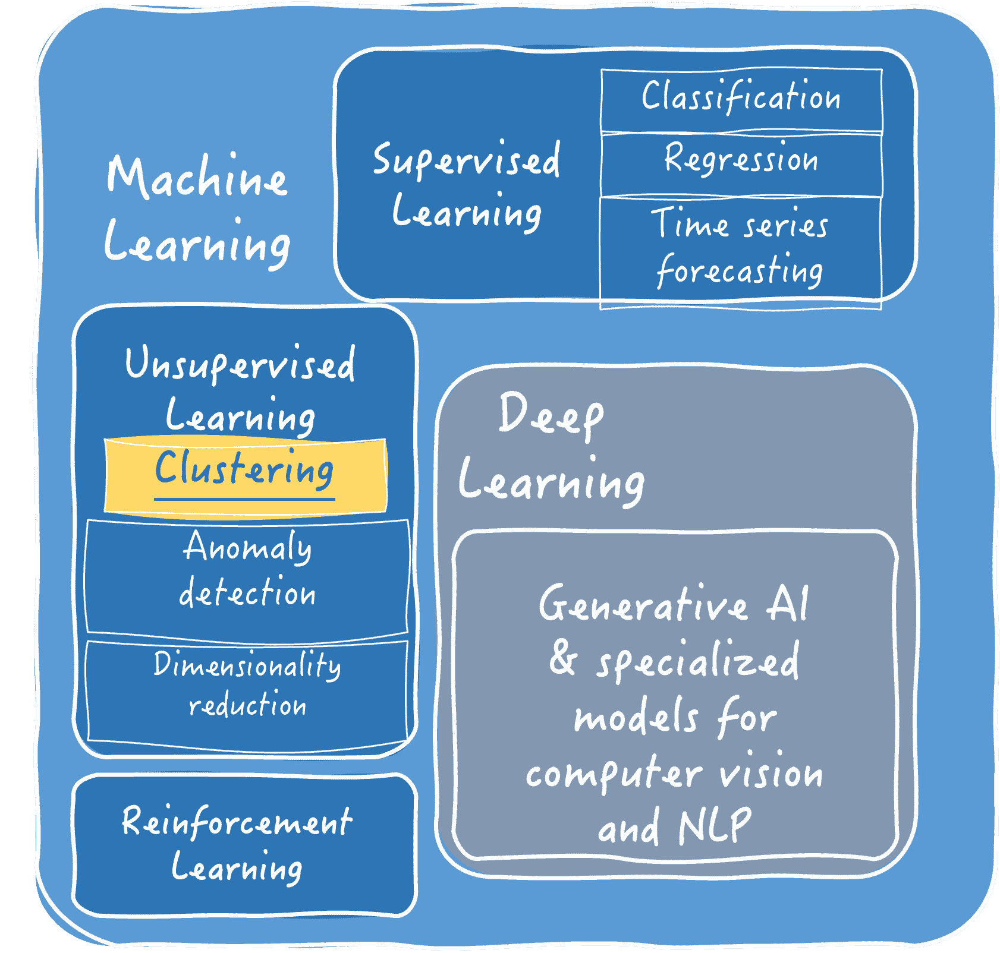
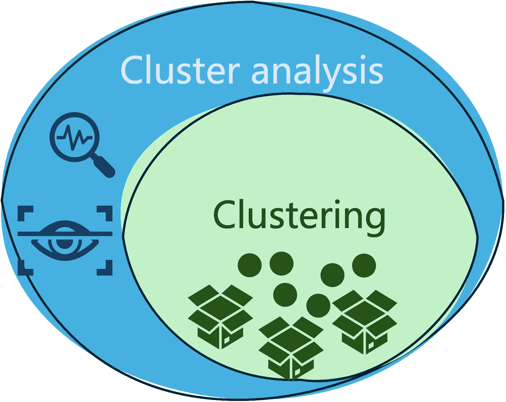
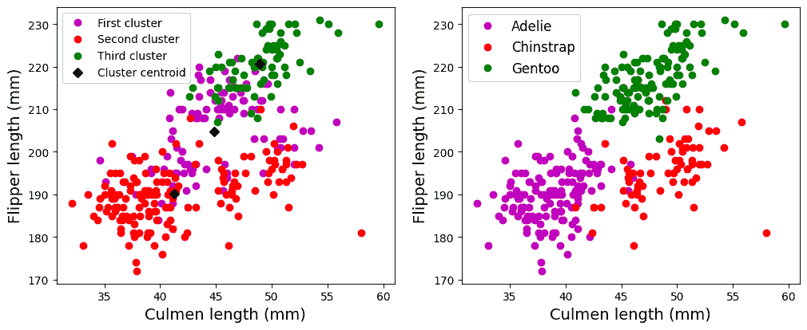
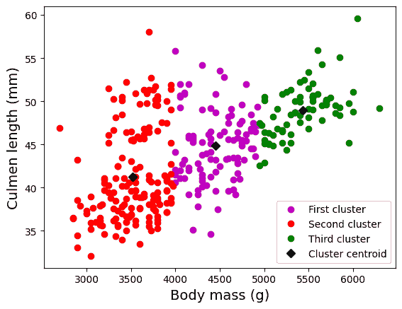

# 使用聚类分析对数据进行分段

> 原文：[`www.kdnuggets.com/using-cluster-analysis-to-segment-your-data`](https://www.kdnuggets.com/using-cluster-analysis-to-segment-your-data)


图片来源：Pexels

机器学习（简称 ML）不仅仅是关于预测。还有其他无监督的过程，其中聚类尤为突出。本文介绍了聚类和聚类分析，突出展示了聚类分析在分段、分析和从相似数据组中获取洞察的潜力。

* * *

## 我们的前三大课程推荐

 1. [Google 网络安全证书](https://www.kdnuggets.com/google-cybersecurity) - 快速进入网络安全领域。

 2. [Google 数据分析专业证书](https://www.kdnuggets.com/google-data-analytics) - 提升你的数据分析技能

 3. [Google IT 支持专业证书](https://www.kdnuggets.com/google-itsupport) - 在 IT 方面支持你的组织

* * *

## 什么是聚类？

简单来说，聚类是**将相似的数据项组合在一起**的同义词。这就像是在超市里将相似的水果和蔬菜放在一起。

让我们进一步阐述这个概念：聚类是一种**无监督学习**任务：这是机器学习方法的一个广泛类别，其中数据被假定为事先未标记或未分类的，目标是发现数据中潜在的模式或洞察。具体而言，聚类的目的是发现具有*相似*特征或属性的数据观察组。

这是聚类在机器学习技术谱系中的定位：



为了更好地理解聚类的概念，可以考虑在超市中寻找具有相似购物行为的顾客群体，或者在电子商务平台上将大量产品分成类别或相似项。这些都是涉及聚类过程的现实世界场景的常见示例。

#### 常见的聚类技术

存在各种数据聚类方法。三种最受欢迎的方法类别是：

+   **迭代聚类**：这些算法反复将（有时重新分配）数据点分配到各自的簇中，直到它们收敛到一个“足够好”的解决方案。最受欢迎的迭代聚类算法是**k 均值**，它通过将数据点分配给由代表点（簇质心）定义的簇，并逐步更新这些质心，直到达到收敛。

+   **层次聚类**：顾名思义，这些算法使用自上而下的方法（将数据点集合拆分直到得到所需数量的子组）或自下而上的方法（逐渐将相似的数据点像气泡一样合并成越来越大的组）构建一个基于树状结构的层次体系。**AHC**（*Agglomerative Hierarchical Clustering*，聚合层次聚类）是自下而上的层次聚类算法的一个常见示例。

+   **基于密度的聚类**：这些方法识别数据点的高密度区域以形成簇。**DBSCAN**（*Density-Based Spatial Clustering of Applications with Noise*，基于密度的空间聚类算法）是这一类别下的一个流行算法。

## *聚类*和*簇分析*是一样的吗？

此时的关键问题可能是：聚类和簇分析是否指的是相同的概念？

毫无疑问，两者关系密切，但它们并不相同，并且之间存在细微的差别。

+   聚类是将相似数据分组的过程，使得同一组或簇中的任何两个对象彼此之间比不同组中的两个对象更为相似。

+   同时，簇分析是一个更广泛的术语，它不仅包括数据的分组（聚类）过程，还包括在特定领域背景下对获得的簇进行*分析、评估*和*解释*。

以下图示说明了这两个常被混淆的术语之间的区别和关系。



## 实际示例

从现在开始，让我们专注于簇分析，通过一个实际的示例来说明：

1.  对数据集进行分段。

1.  分析获得的簇

注意：本示例中的附带代码假定对 Python 语言及其库（如用于训练聚类模型的 sklearn、用于数据处理的 pandas 和用于数据可视化的 matplotlib）有一定的基础知识。

我们将以**[Palmer Archipelago Penguins](https://www.kaggle.com/datasets/parulpandey/palmer-archipelago-antarctica-penguin-data)**数据集为例说明簇分析，该数据集包含有关企鹅标本的观察数据，并将这些标本分类为三种不同的物种：Adelie、Gentoo 和 Chinstrap。该数据集在训练分类模型时非常受欢迎，但在寻找数据簇方面也有很多意义。加载数据集文件后，我们只需假设“物种”类属性是未知的。

```py
import pandas as pd
penguins = pd.read_csv('penguins_size.csv').dropna()
X = penguins.drop('species', axis=1)
```

我们还将从数据集中删除两个描述企鹅性别和观察到该标本的岛屿的分类特征，保留其余的数值特征。我们还将已知标签（物种）存储在一个单独的变量*y*中：稍后它们将方便我们将获得的簇与数据集中实际的企鹅分类进行比较。

```py
X = X.drop(['island', 'sex'], axis=1)
y = penguins.species.astype("category").cat.codes
```

通过以下几行代码，可以应用*sklearn*库中可用的 K-means 聚类算法，来找到数据中的若干个簇。我们只需要指定要找到的簇的数量，在这个例子中，我们将数据分成 k=3 个簇：

```py
from sklearn.cluster import KMeans
kmeans = KMeans(n_clusters = 3, n_init=100)
X["cluster"] = kmeans.fit_predict(X)
```

上述代码的最后一行将聚类结果，即分配给每个数据实例的簇的 ID，存储在一个名为“cluster”的新属性中。

现在是时候生成一些簇的可视化图来进行分析和解释了！以下代码片段稍长，但归结起来就是生成两个数据可视化图：第一个图展示了围绕两个数据特征——嘴喙长度和翅膀长度——的散点图，以及每个观测值所属的簇，第二个可视化图展示了每个数据点所属的实际企鹅物种。

```py
plt.figure (figsize=(12, 4.5))
# Visualize the clusters obtained for two of the data attributes: culmen length and flipper length
plt.subplot(121)
plt.plot(X[X["cluster"]==0]["culmen_length_mm"],
X[X["cluster"]==0]["flipper_length_mm"], "mo", label="First cluster")
plt.plot(X[X["cluster"]==1]["culmen_length_mm"],
X[X["cluster"]==1]["flipper_length_mm"], "ro", label="Second cluster")
plt.plot(X[X["cluster"]==2]["culmen_length_mm"],
X[X["cluster"]==2]["flipper_length_mm"], "go", label="Third cluster")
plt.plot(kmeans.cluster_centers_[:,0], kmeans.cluster_centers_[:,2], "kD", label="Cluster centroid")
plt.xlabel("Culmen length (mm)", fontsize=14)
plt.ylabel("Flipper length (mm)", fontsize=14)
plt.legend(fontsize=10)

# Compare against the actual ground-truth class labels (real penguin species)
plt.subplot(122)
plt.plot(X[y==0]["culmen_length_mm"], X[y==0]["flipper_length_mm"], "mo", label="Adelie")
plt.plot(X[y==1]["culmen_length_mm"], X[y==1]["flipper_length_mm"], "ro", label="Chinstrap")
plt.plot(X[y==2]["culmen_length_mm"], X[y==2]["flipper_length_mm"], "go", label="Gentoo")
plt.xlabel("Culmen length (mm)", fontsize=14)
plt.ylabel("Flipper length (mm)", fontsize=14)
plt.legend(fontsize=12)
plt.show
```

这里是可视化图：



通过观察这些簇，我们可以提取出初步的见解：

+   在不同簇之间的数据点（企鹅）之间存在微妙但不太明显的分隔，并且发现一些子组之间有轻微的重叠。这并不一定让我们得出聚类结果好坏的结论：我们在数据集的多个属性上应用了 k-means 算法，但该可视化图仅显示了两个属性：'嘴喙长度'和'翅膀长度'下的数据点在簇中的位置。可能还有其他属性对，簇在视觉上表现得更加明显分开。

这引出了一个问题：如果我们尝试在训练模型时使用的其他两个变量下可视化我们的簇，会怎样？

让我们尝试可视化企鹅的体重（克）和嘴喙长度（毫米）。

```py
plt.plot(X[X["cluster"]==0]["body_mass_g"],
X[X["cluster"]==0]["culmen_length_mm"], "mo", label="First cluster")
plt.plot(X[X["cluster"]==1]["body_mass_g"],
X[X["cluster"]==1]["culmen_length_mm"], "ro", label="Second cluster")
plt.plot(X[X["cluster"]==2]["body_mass_g"],
X[X["cluster"]==2]["culmen_length_mm"], "go", label="Third cluster")
plt.plot(kmeans.cluster_centers_[:,3], kmeans.cluster_centers_[:,0], "kD", label="Cluster centroid")
plt.xlabel("Body mass (g)", fontsize=14)
plt.ylabel("Culmen length (mm)", fontsize=14)
plt.legend(fontsize=10)
plt.show
```



这个图看起来非常清晰！现在我们将数据分为三个可区分的组。通过进一步分析我们的可视化图，我们可以从中提取出额外的见解：

+   在发现的簇与'体重'和'嘴喙长度'属性值之间存在强烈的关系。从图的左下角到右上角，第一个组的企鹅因其较低的'体重'值而较小，但它们的嘴喙长度差异很大。第二组的企鹅体型中等，'嘴喙长度'值也在中等到较高范围。最后，第三组的企鹅则以体型较大和较长的嘴喙为特征。

+   还可以观察到，有一些异常值，即具有远离大多数的非典型值的数据观测点。这在可视化区域的最上方的点上尤其明显，表明一些观察到的企鹅在所有三个组中都有过长的嘴喙。

## 总结

这篇文章阐述了聚类分析的概念和实际应用，聚类分析是寻找数据中具有相似特征或属性的元素子组，并分析这些子组以提取有价值或可操作的见解的过程。从市场营销到电子商务再到生态项目，聚类分析在各种现实世界领域得到广泛应用。

[](https://www.linkedin.com/in/ivanpc/)****[Iván Palomares Carrascosa](https://www.linkedin.com/in/ivanpc/)**** 是 AI、机器学习、深度学习和大型语言模型领域的领导者、作家、演讲者和顾问。他培训和指导他人如何在现实世界中利用 AI。

### 更多相关内容

+   [Segment Anything Model：图像分割的基础模型](https://www.kdnuggets.com/2023/07/segment-anything-model-foundation-model-image-segmentation.html)

+   [使用日常语言直接与您的数据对话](https://www.kdnuggets.com/2023/12/datagpt-talk-directly-data-everyday-language)

+   [为您的 AI 之旅加速！加入 Uplimit 的免费 AI 建设课程](https://www.kdnuggets.com/2024/01/uplimit-supercharge-your-ai-journey-openai-course)

+   [如何让大型语言模型与您的软件协同工作](https://www.kdnuggets.com/how-to-make-large-language-models-play-nice-with-your-software-using-langchain)

+   [您文本分类任务的最佳架构：基准测试选项](https://www.kdnuggets.com/2023/04/best-architecture-text-classification-task-benchmarking-options.html)

+   [掌握 SQL、Python、数据清洗、数据处理和探索性数据分析的指南合集](https://www.kdnuggets.com/collection-of-guides-on-mastering-sql-python-data-cleaning-data-wrangling-and-exploratory-data-analysis)
