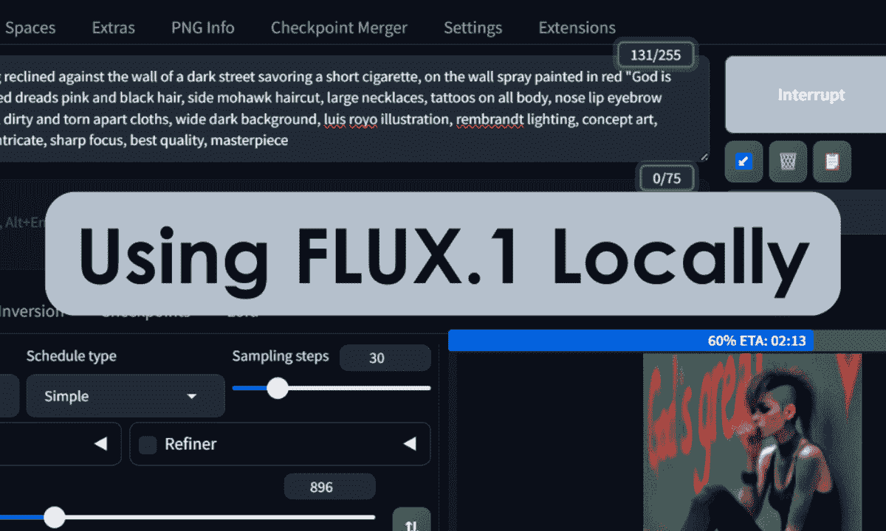
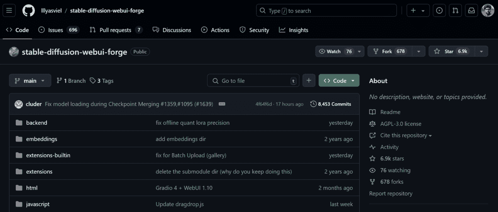
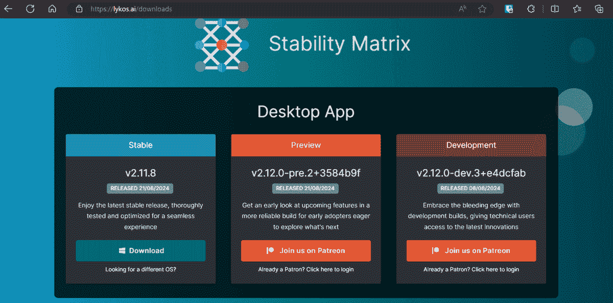
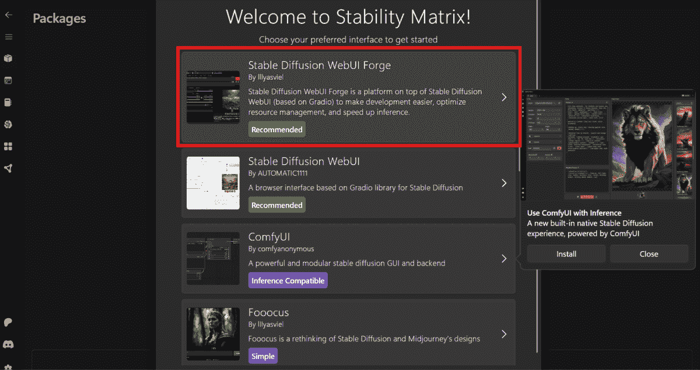
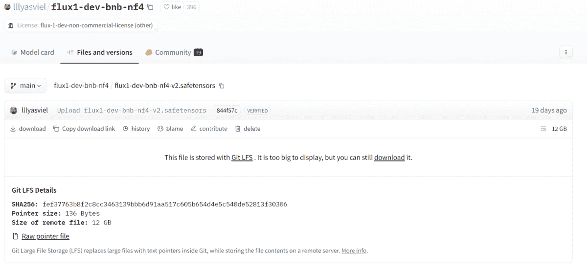
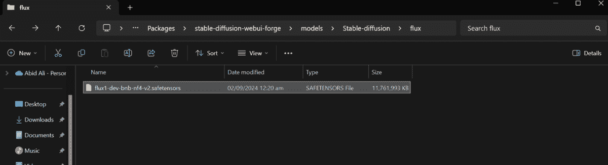
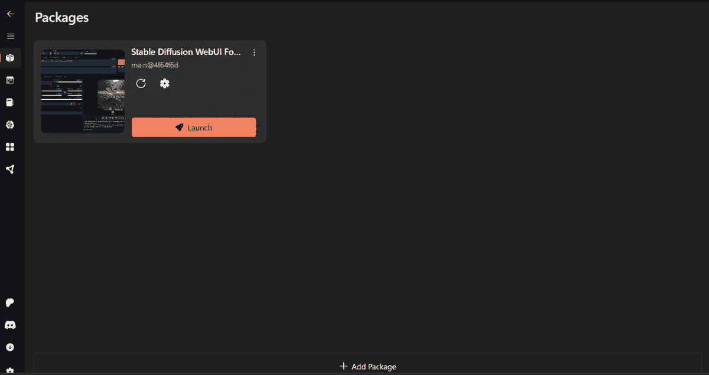
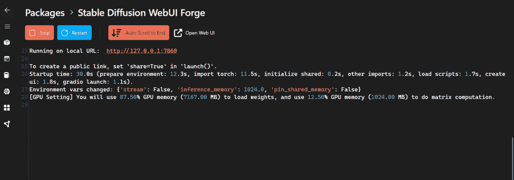
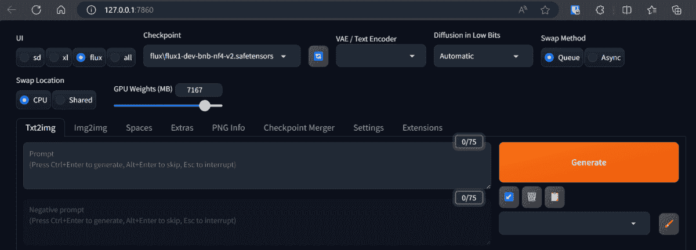
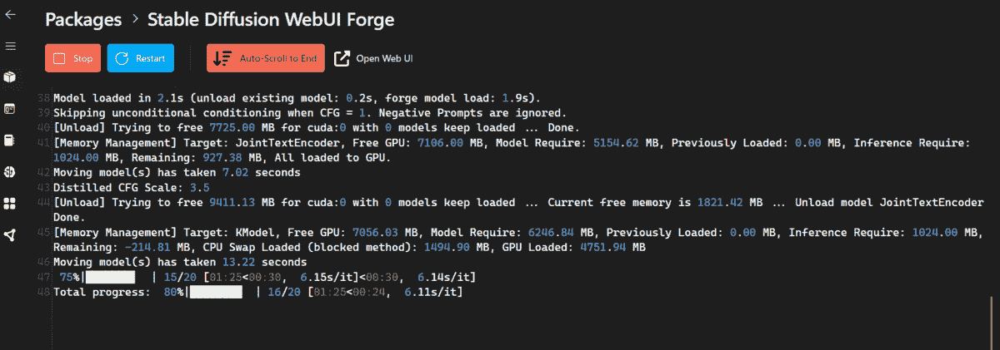

# 在本地使用 FLUX.1

> 原文：[`www.kdnuggets.com/using-flux-1-locally`](https://www.kdnuggets.com/using-flux-1-locally)

图片来源：作者 | Canva Pro

在本教程中，我们将学习如何轻松安装 Stable Diffusion WebUI Forge，然后下载量化版本的 FLUX.1 [dev] 并使用它生成高质量图像。它提供了逐步的指南，使你能够使用笔记本电脑生成和修改生成的图像和艺术作品。

* * *

## 我们的前三名课程推荐

1\. [Google 网络安全证书](https://www.kdnuggets.com/google-cybersecurity) - 快速进入网络安全职业。

2\. [Google 数据分析专业证书](https://www.kdnuggets.com/google-data-analytics) - 提升你的数据分析技能

3\. [Google IT 支持专业证书](https://www.kdnuggets.com/google-itsupport) - 支持你的组织 IT

* * *

## 什么是 FLUX.1？

[FLUX.1](https://blackforestlabs.io/flux-1/) 是由 BlackForestLabs 创建的一系列新的图像生成模型。它通过提供高图像细节、严格遵循提示、多样的风格和复杂的场景渲染，为 AI 行业设立了新的标准。该模型确立了其作为将文本转化为生动图像的最先进解决方案。

FLUX.1 有三种变体：FLUX.1 [pro]、FLUX.1 [dev] 和 FLUX.1 [schnell]。它超越了领先的模型，如 Midjourney v6.0 和 DALL·E 3 (HD)，在图像生成领域设立了新的标准，并为生成媒体的未来创新铺平了道路。

## 安装 Stable Diffusion WebUI Forge

开发者可以通过 GitHub 仓库 ([lllyasviel/stable-diffusion-webui-forge](https://github.com/lllyasviel/stable-diffusion-webui-forge)) 轻松安装 Stable Diffusion WebUI Forge。

对于非技术用户而言，使用技术指南安装 Stable Diffusion WebUI Forge 可能会很棘手。这就是为什么 [Stability Matrix](https://lykos.ai/downloads) 提供了一个用户友好的替代方案，允许任何人轻松在笔记本电脑上体验最先进的模型，而无需复杂的安装过程。

**1.** 访问 [Lykos AI](https://lykos.ai/downloads) 网站，下载稳定版桌面应用程序。

**2.** 解压下载的文件，并双击 `StabilityMatrix.exe` 文件以启动安装程序。

**3.** 安装完成后，我们将被重定向到 Stability Matrix 应用程序，在那里我们将被要求选择我们喜欢的界面。请选择“Stable Diffusion WebUI Forge”。

**4.** 它会要求你下载基础模式；请跳过安装推荐模型。完成所有操作需要 15 分钟。

## 设置 FLUX.1 [dev] 模型

**5.** 在安装完成 Stable Diffusion WebUI Forge 后，前往 [flux1-dev-bnb-nf4-v2.safetensors](https://huggingface.co/lllyasviel/flux1-dev-bnb-nf4/blob/main/flux1-dev-bnb-nf4-v2.safetensors) Hugging Face 模型库，下载 FLUX.1-dev 模型的量化版本。为什么选择量化版本？因为它可以在 VRAM 较小的 GPU 上运行？即便如此，你仍需要一个 8GB VRAM 的 GPU。

**6.** 导航到 StabilityMatrix 文件夹，并按照以下路径：C:\Users\<USER_NAME>\StabilityMatrix\Packages\stable-diffusion-webui-forge\models\Stable-diffusion

**7.** 创建一个名为“flux”的新文件夹，并将下载的 FLUX.1 [dev] 模型文件移动到其中，如下所示。

**8.** 前往 Stability Matrix 应用程序，导航到 Packages 菜单以启动 Stable Diffusion WebUI Forge。

**9.** 几秒钟后，你将被引导到新的窗口，显示 Gradio 网络应用程序，或者你也可以直接点击本地 URL。

**10.** 在网络应用程序中，选择 Flux UI 并将检查点更改为模型文件。

就这样。你只需要输入详细的提示并按下生成按钮。

## 使用 FLUX.1 [dev] 模型

**11.** 选择“Text2img”标签，并在提示框中输入详细提示。确保添加所有细节，如下所示。

> **提示：** *“一位瘦削的朋克女性倚靠在黑暗街道的墙边，品味着一根短烟，墙上用红色喷漆写着‘上帝是伟大的’，超现实主义，详细的编织粉色和黑色头发，侧面莫霍克发型，大项链，全身纹身，鼻子、嘴唇和眉毛穿孔，磨损的短款背心，肮脏破烂的衣物，广阔的黑暗背景，路易斯·罗约插图，伦勃朗光线，概念艺术，幻想艺术，超详细，复杂，清晰对焦，最佳质量，杰作”。*

由于这是一个需要大量 VRAM 的大型模型，生成过程可能需要几分钟。如果你的系统变得缓慢或短暂冻结，我强烈建议减少 GPU 权重。

我们甚至可以在 StableMatrix 应用程序中查看详细日志。

最终，我们得到了符合提示的高质量图像。即便是文字也没有任何故障。

**12.** 让我们尝试另一种不同设置的提示。

> **提示：** *“一个中年男性木匠在他阳光明媚的工作坊里。他的手经历了风霜，表情专注，正小心地雕刻一块富有红木的细节。他的盐胡须修剪整齐，穿着一件磨损的皮围裙，下面是一件法兰绒衬衫。窗户透进的温暖午后光线中，尘埃微粒在舞动，营造出舒适的氛围。”*

再次运行的结果超现实，与 Stable Diffusion XL 模型相比，没有视觉故障，照明效果更好。

## 结论

在本地使用生成式 AI 模型为你提供了完全的隐私保护和无限创建图像的自由，没有任何提示创意的限制。

在本教程中，我们介绍了安装和使用 Stable Diffusion Forge 生成超现实图像的最简单方法，使用的是 FLUX.1 [dev] 模型。如果你有兴趣了解更多关于生成式 AI 的内容，可以在 LinkedIn 上关注我。

****[Abid Ali Awan](https://www.polywork.com/kingabzpro)**** ([@1abidaliawan](https://www.linkedin.com/in/1abidaliawan)) 是一位认证的数据科学专业人士，热衷于构建机器学习模型。目前，他专注于内容创作和撰写关于机器学习和数据科学技术的技术博客。Abid 拥有技术管理硕士学位和电信工程学士学位。他的愿景是使用图神经网络为挣扎于心理疾病的学生构建一个 AI 产品。

### 更多相关主题

+   [在本地使用 Groq Llama 3 70B：逐步指南](https://www.kdnuggets.com/using-groq-llama-3-70b-locally-step-by-step-guide)

+   [运行 LlaMA 2 的简单指南](https://www.kdnuggets.com/a-simple-guide-to-running-llama-2-locally)

+   [Ollama 教程：在本地运行 LLM 变得超级简单](https://www.kdnuggets.com/ollama-tutorial-running-llms-locally-made-super-simple)

+   [使用 LM Studio 在本地运行 LLM](https://www.kdnuggets.com/run-an-llm-locally-with-lm-studio)

+   [运行 Llama 3 的最简单方法](https://www.kdnuggets.com/easiest-way-of-running-llama-3-locally)

+   [使用 Python 自动化 Microsoft Excel 和 Word](https://www.kdnuggets.com/2021/08/automate-microsoft-excel-word-python.html)
