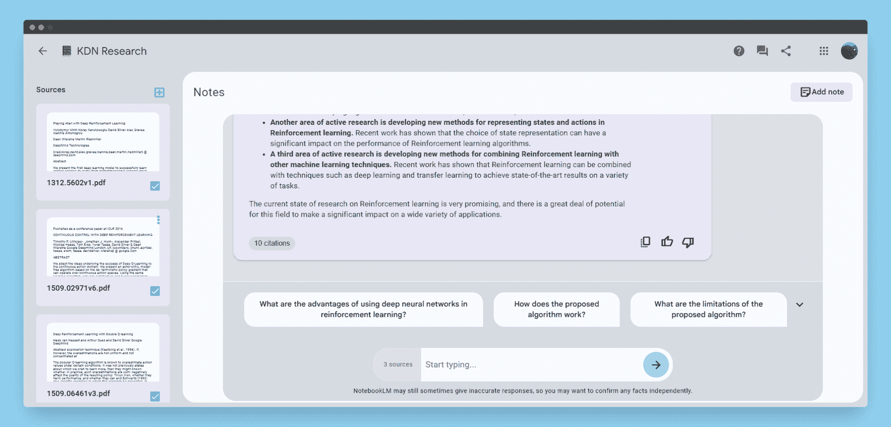
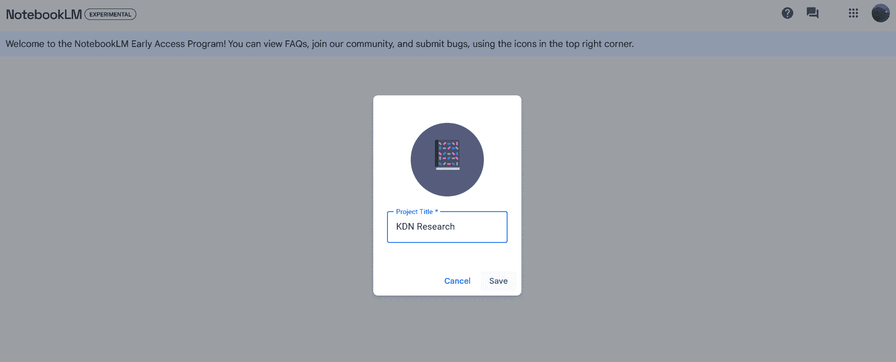
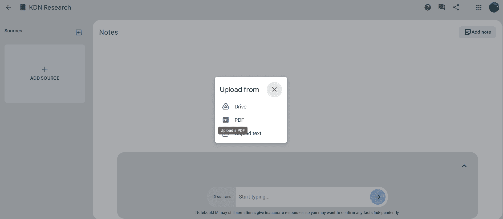
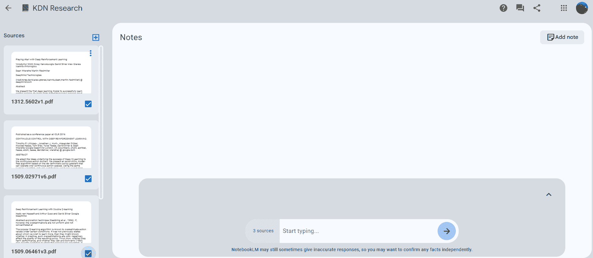
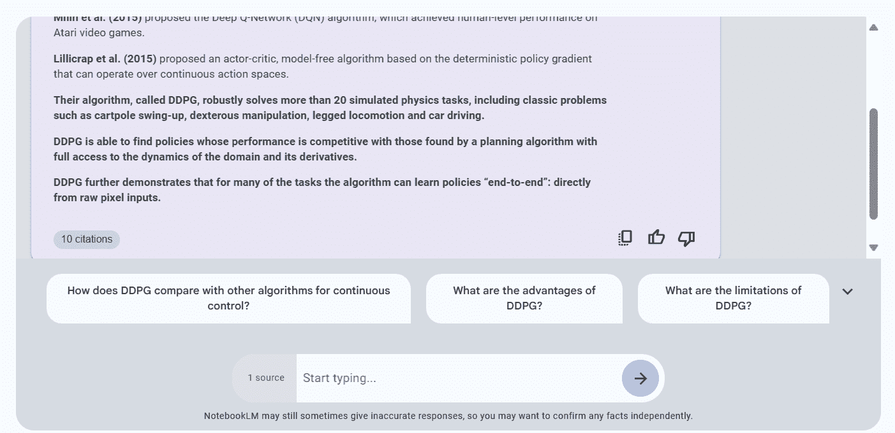
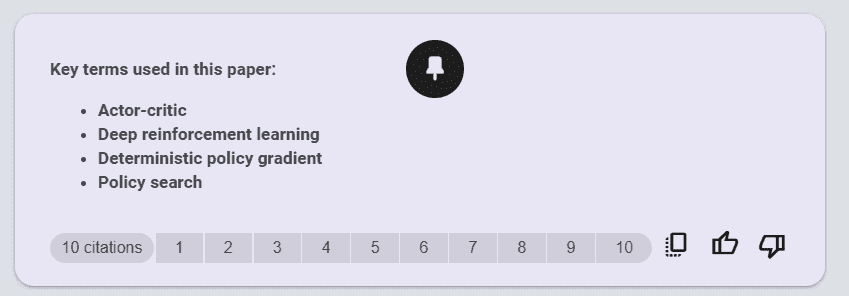
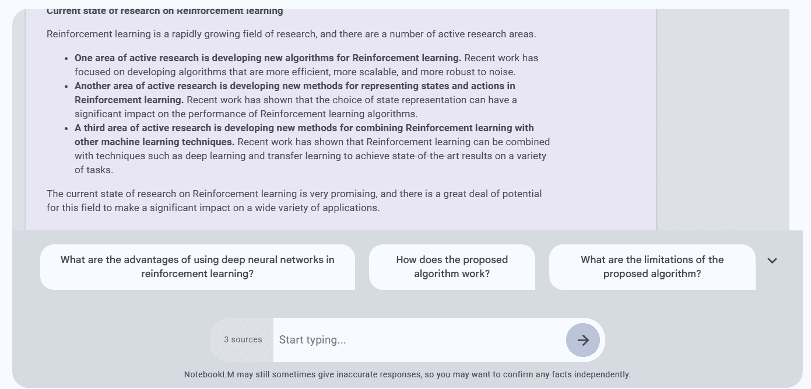
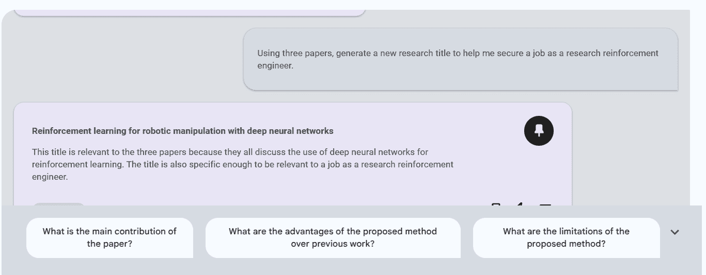
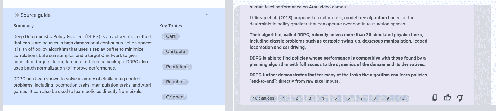
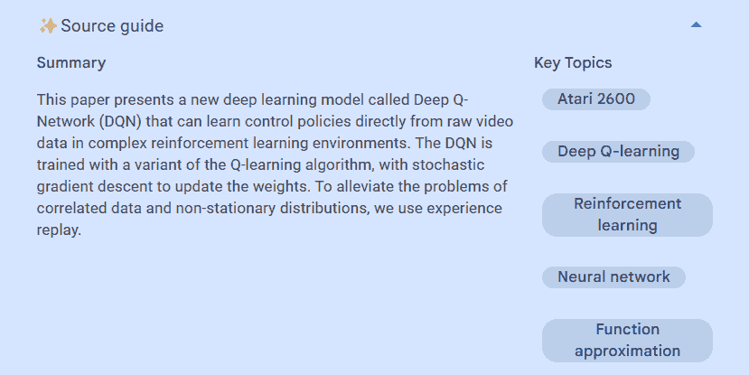

# 使用谷歌的 NotebookLM 进行数据科学：综合指南

> 原文：[`www.kdnuggets.com/using-google-notebooklm-for-data-science-a-comprehensive-guide`](https://www.kdnuggets.com/using-google-notebooklm-for-data-science-a-comprehensive-guide)

图片来源：作者

随着数据科学世界的不断发展，行业内专业人员使用的工具和技术也在进步。谷歌的 NotebookLM 提供了一种独特而强大的方式来理解你的数据和信息。这篇博客文章深入探讨了 NotebookLM 的功能、工作原理以及它为数据科学研究人员打开的众多可能性。

* * *

## 我们的前三大课程推荐

 1\. [谷歌网络安全证书](https://www.kdnuggets.com/google-cybersecurity) - 快速进入网络安全职业。

 2\. [谷歌数据分析专业证书](https://www.kdnuggets.com/google-data-analytics) - 提升你的数据分析技能

 3\. [谷歌 IT 支持专业证书](https://www.kdnuggets.com/google-itsupport) - 支持你的组织的 IT

* * *

# 什么是 NotebookLM？

谷歌的新实验产品 NotebookLM 基于最新的大型语言模型进展。它类似于其他由大型语言模型（LLMs）驱动的应用程序，如 ChatPDF、ChatGPT 和 Poe，这些应用程序允许用户上传数据文件并提出问题。这些应用程序提供相同的功能和能力。

那么，它有什么特别之处？

NotebookLM 是一个专用应用程序，允许你上传最多 10 个文档。你可以轻松上传你的资料，这些资料可以包括谷歌文档、计算机上的 PDF 文件或任何少于 50,000 字的文本内容。

NotebookLM 解决了使用 ChatGPT 和 Poe 的限制。它允许你上传超过三个文档，并在几秒钟内理解大文档。

# 使用 NotebookLM 进行数据科学

使用 NotebookLM 非常简单。你可以在几秒钟内上传谷歌文档、计算机上的 PDF 文件或任何文本内容。一旦你的资料被上传，NotebookLM 就成为你查询和创意头脑风暴的首选工具。

首先，我们将访问“notebooklm.google.com”网站并创建一个项目。

我下载了关于强化学习的热门研究论文的 PDF 文件：

1.  [连续控制与深度强化学习](https://www.google.com/url?q=https://arxiv.org/pdf/1509.02971v6.pdf&sa=D&source=editors&ust=1701622288884005&usg=AOvVaw3cUvdykWUrRNplc6FvBPmm)

1.  [用深度强化学习玩 Atari 游戏](https://www.google.com/url?q=https://arxiv.org/pdf/1312.5602v1.pdf&sa=D&source=editors&ust=1701622288884364&usg=AOvVaw3bIFcwxMo2GPCiJkjrvX6J)

1.  [使用双重 Q 学习的深度强化学习](https://www.google.com/url?q=https://arxiv.org/pdf/1509.06461v3.pdf&sa=D&source=editors&ust=1701622288884615&usg=AOvVaw38AvhIaLcWT251aMpQI3Fe)

然后我们将这些 PDF 一一上传到我们的项目中。

上传文件后，我们选择那些作为背景信息使用。

## 总结

我们将选择“深度强化学习中的连续控制”研究论文，并要求 NotebookLM 为我们总结。

提示：“请总结一下这篇研究论文。尽量使用项目符号。”

获取答案只花了几秒钟。还提供了进一步的问题。

## 术语提取

我们将要求它现在创建论文中使用的关键术语列表。

提示：“创建这篇论文中使用的关键术语列表。”

它不仅为我们提供了关键术语，还指明了它们在论文中的位置。

## 强化学习分析

我们现在将使用这三篇论文来了解研究趋势。

提示：“分析所有三篇研究论文，并提供对强化学习当前研究状态的分析。”

表现非常出色。

## 创意协助

我们现在将使用它，并请 AI 帮助我们决定一个能够确保获得机器学习工程师职位的最终年项目标题。

提示：“使用三篇论文，生成一个新的研究标题，帮助我获得作为研究强化工程师的职位。”

很好，但不够出色。

# 高级功能

## 引用

询问有关您来源的任何问题，NotebookLM 将回答这些问题，并附上来自这些文档的引用。

## 文档指南

当您上传新的来源时，NotebookLM 会创建一个“来源指南”，总结文档内容并建议关键主题和问题。

## 记笔记

每个笔记本包含一个笔记部分，您可以在其中记录由 NotebookLM 揭示的想法或信息。

# 可访问性和限制

+   设备兼容性：目前，NotebookLM 在桌面计算机上体验最佳。

+   访问限制：最初仅在美国和个人 Google 账户中提供。

+   内容限制：每个笔记本可以包含十个来源和一个笔记，每个来源的字数上限为 50,000 字。

# 协作与共享

+   协作功能：笔记本可以与同事或同学共享，提供查看者或编辑者访问权限。

+   多源交互：用户可以在与单一来源或所有来源之间切换。

# 定价和可用性

NotebookLM 正处于早期测试阶段，目前免费提供。访问权限正在逐步开放给小范围用户，感兴趣的用户可以选择注册以加入等待名单。

# 重要指南

尽管 NotebookLM 提供了令人兴奋的机会，但必须注意上传的内容。避免上传包含个人或敏感信息的文档。同时，请注意它是一个实验性项目，目前仅限于早期访问计划的成员。

# 结论

Google's NotebookLM 在数据科学家和专业人士解读复杂信息方面是一个重要突破。由于我们大多数信息都在 PDF 文件中并存储在计算机上，NotebookLM 使你只需添加所有文件并提出关键问题即可理解法律合同。尽管与 ChatGPT 相比，NotebookLM 在某些功能和准确性上有所欠缺，但它有很大潜力，随着不断发展，将成为你工作空间中的重要工具。

****[Abid Ali Awan](https://www.polywork.com/kingabzpro)**** ([@1abidaliawan](https://www.linkedin.com/in/1abidaliawan)) 是一名认证数据科学专业人士，热衷于构建机器学习模型。目前，他专注于内容创作和撰写有关机器学习和数据科学技术的技术博客。Abid 拥有技术管理硕士学位和电信工程学士学位。他的愿景是利用图神经网络为那些面临心理健康问题的学生构建 AI 产品。

### 相关话题

+   [数据分析师必备工具的全面指南](https://www.kdnuggets.com/a-comprehensive-guide-to-essential-tools-for-data-analysts)

+   [正态分布的全面指南](https://www.kdnuggets.com/2022/06/comprehensive-guide-normal-distribution.html)

+   [MLOps 全面指南](https://www.kdnuggets.com/2023/08/comprehensive-guide-mlops.html)

+   [NLP、NLU 和 NLG：有什么不同？全面指南](https://www.kdnuggets.com/2022/06/nlp-nlu-nlg-difference-comprehensive-guide.html)

+   [卷积神经网络全面指南](https://www.kdnuggets.com/2023/06/comprehensive-guide-convolutional-neural-networks.html)

+   [Pinecone 向量数据库全面指南](https://www.kdnuggets.com/a-comprehensive-guide-to-pinecone-vector-databases)
