# 本地使用 Groq Llama 3 70B：分步指南

> 原文：[`www.kdnuggets.com/using-groq-llama-3-70b-locally-step-by-step-guide`](https://www.kdnuggets.com/using-groq-llama-3-70b-locally-step-by-step-guide)

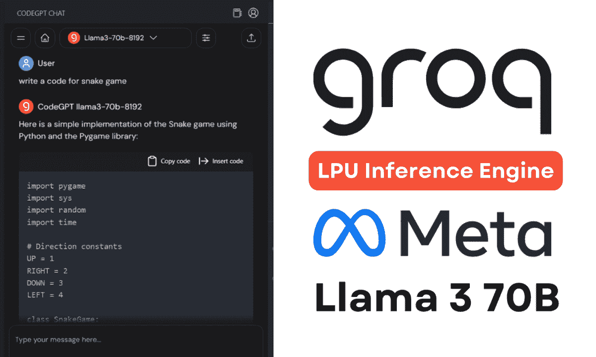

作者提供的图片

每个人都专注于构建更好的 LLM（大型语言模型），而 Groq 专注于 AI 的基础设施方面，使这些大型模型运行得更快。

* * *

## 我们的三大课程推荐

 1\. [Google 网络安全证书](https://www.kdnuggets.com/google-cybersecurity) - 快速进入网络安全职业生涯。

 2\. [Google 数据分析专业证书](https://www.kdnuggets.com/google-data-analytics) - 提升您的数据分析技能

 3\. [Google IT 支持专业证书](https://www.kdnuggets.com/google-itsupport) - 支持您的组织 IT

* * *

在本教程中，我们将学习 Groq LPU 推理引擎以及如何在本地笔记本电脑上使用 API 和 Jan AI。我们还将将其集成到 VSCode 中，以帮助我们生成代码、重构代码、编写文档和生成测试单元。我们将免费创建自己的 AI 编程助手。

## 什么是 Groq LPU 推理引擎？

[Groq](https://groq.com/) LPU（语言处理单元）推理引擎旨在为计算密集型应用程序提供快速响应，尤其是具有序列组件的应用程序，如 LLMs。

与 CPU 和 GPU 相比，LPU 具有更大的计算能力，这减少了预测一个词所需的时间，使得文本序列生成更快。此外，LPU 还解决了内存瓶颈，相较于 GPU 提供了更好的性能。

简而言之，Groq LPU 技术使您的 LLMs 非常快速，实现实时 AI 应用。阅读 [Groq ISCA 2022 论文](https://wow.groq.com/isca-2022-paper/) 以了解更多关于 LPU 架构的信息。

## 安装 Jan AI

Jan AI 是一个本地运行开源和专有大型语言模型的桌面应用程序。它可以在 Linux、macOS 和 Windows 上下载和安装。我们将通过访问 [Releases · janhq/jan (github.com)](https://github.com/janhq/jan/releases) 并点击 `.exe` 扩展名的文件来下载和安装 Jan AI。

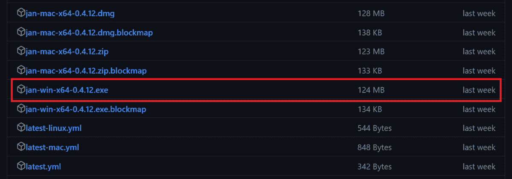

如果您希望本地使用 LLMs 以增强隐私，请阅读 在笔记本电脑上使用 LLMs 的 5 种方法 博客，并开始使用顶级开源语言模型。

## 创建 Groq Cloud API

要在 Jan AI 中使用 Groq Llama 3，我们需要一个 API。为此，我们将通过访问 [`console.groq.com/`](https://console.groq.com/) 创建一个 Groq Cloud 帐户。

如果你想测试 Groq 提供的各种模型，可以通过进入“Playground”选项卡、选择模型并添加用户输入，无需任何设置。

在我们的案例中，它非常快。生成速度为每秒 310 个标记，这是我一生中见过的最快的。即使是 Azure AI 或 OpenAI 也无法产生这样的结果。

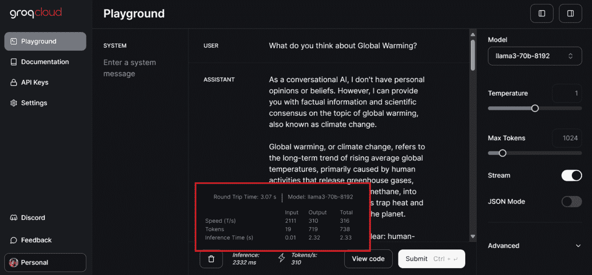

要生成 API 密钥，请点击左侧面板上的“API 密钥”按钮，然后点击“创建 API 密钥”按钮以生成并复制 API 密钥。

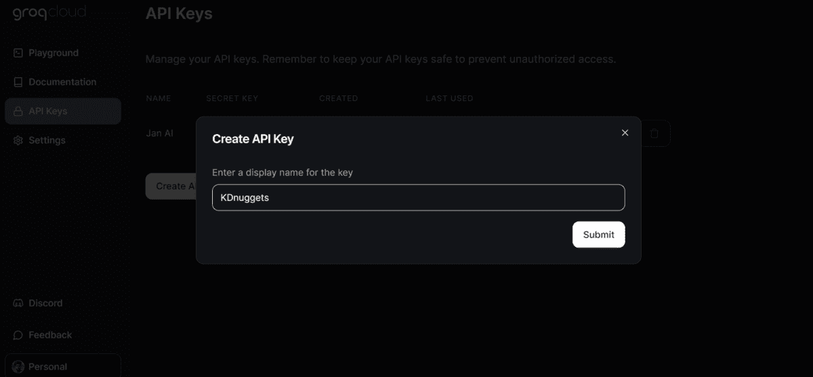

## 在 Jan AI 中使用 Groq

在下一步中，我们将把 Groq Cloud API 密钥粘贴到 Jan AI 应用中。

启动 Jan AI 应用，进入设置，在扩展部分选择“Groq 推理引擎”选项，并添加 API 密钥。

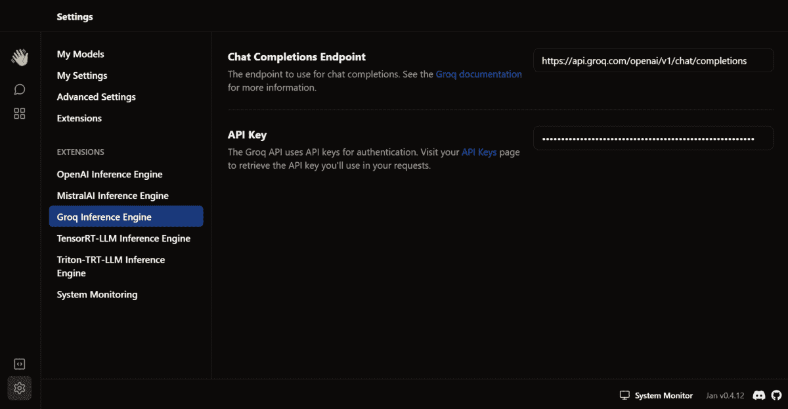

然后，返回到对话窗口。在模型部分，选择“Remote”部分中的 Groq Llama 3 70B 并开始提示。

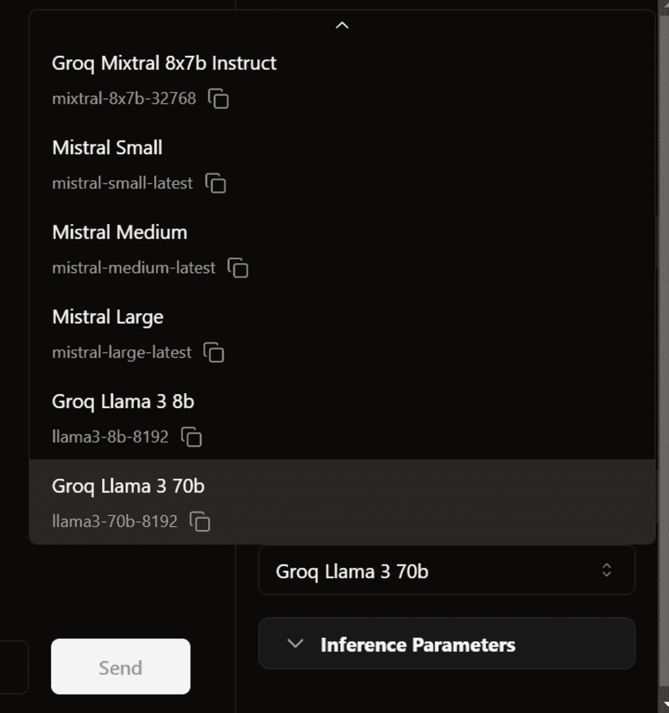

响应生成速度非常快，以至于我都来不及跟上。

> **注意**：API 的免费版本有一些限制。访问 [`console.groq.com/settings/limits`](https://console.groq.com/settings/limits) 以了解更多信息。

## 在 VSCode 中使用 Groq

接下来，我们将尝试将相同的 API 密钥粘贴到 CodeGPT VSCode 扩展中，并建立我们自己的免费 AI 编码助手。

在扩展选项卡中搜索并安装 CodeGPT 扩展。

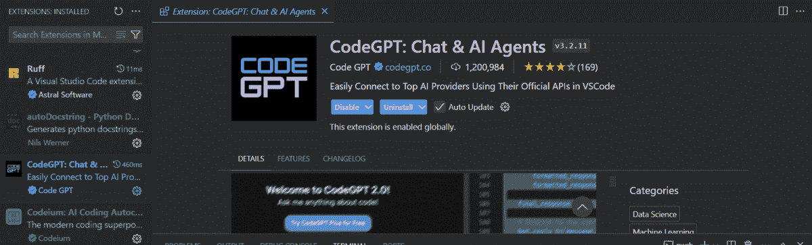

CodeGPT 选项卡将出现供你选择模型提供商。

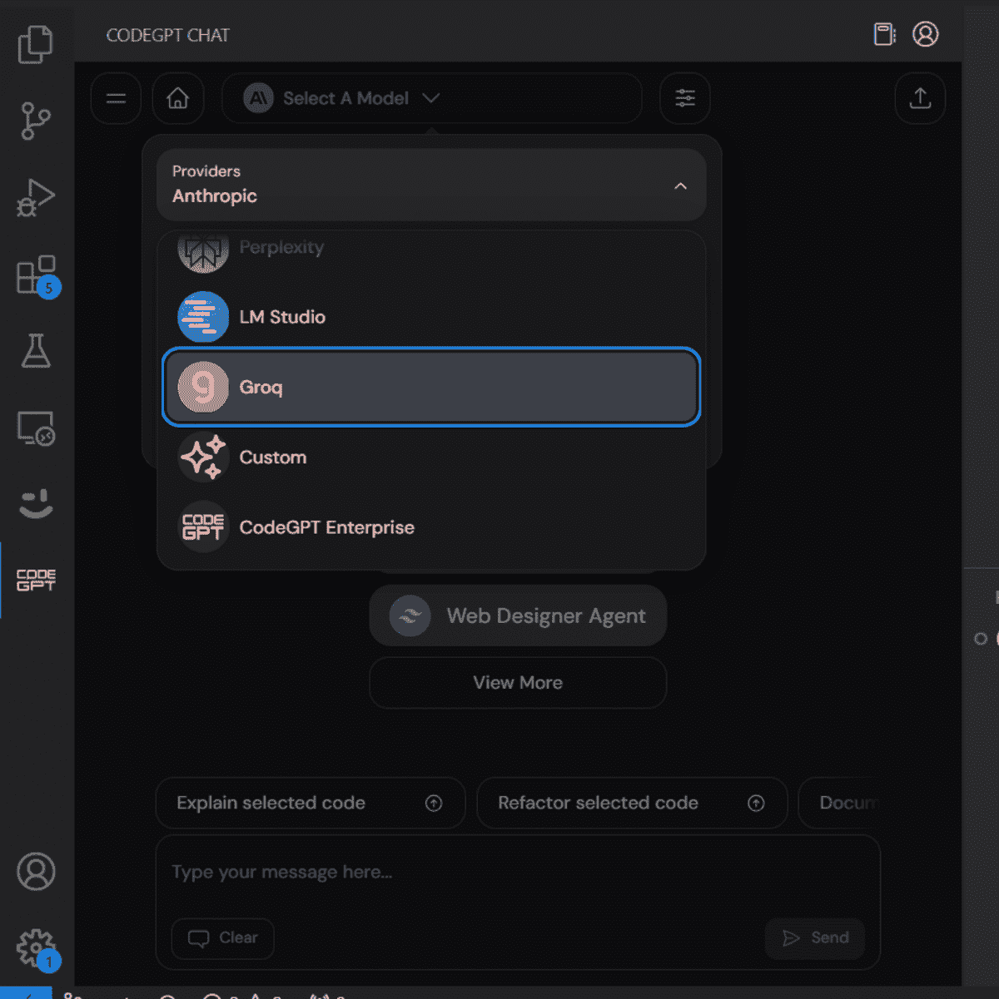

当你选择 Groq 作为模型提供商时，它会要求你提供 API 密钥。只需粘贴相同的 API 密钥即可开始使用。你甚至可以为 CodeGPT 生成另一个 API 密钥。

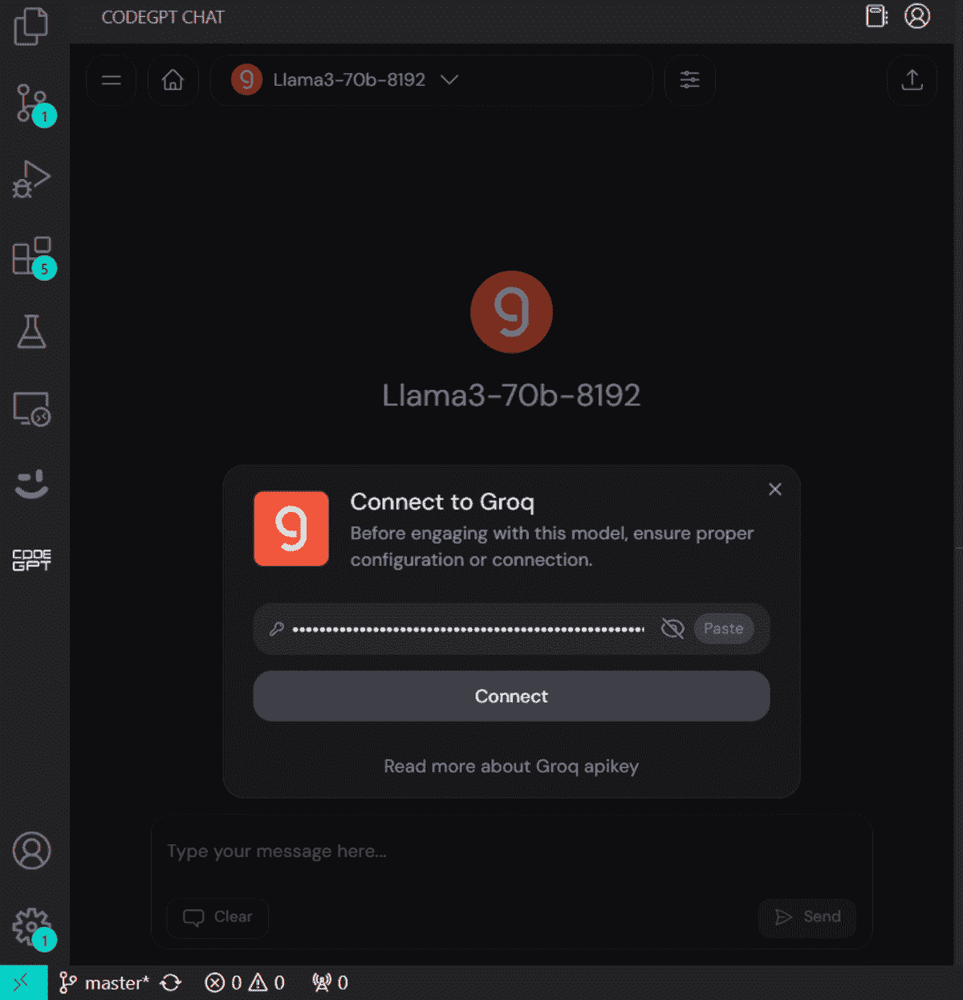

我们现在将要求它为蛇形游戏编写代码。生成和运行代码花费了 10 秒钟。

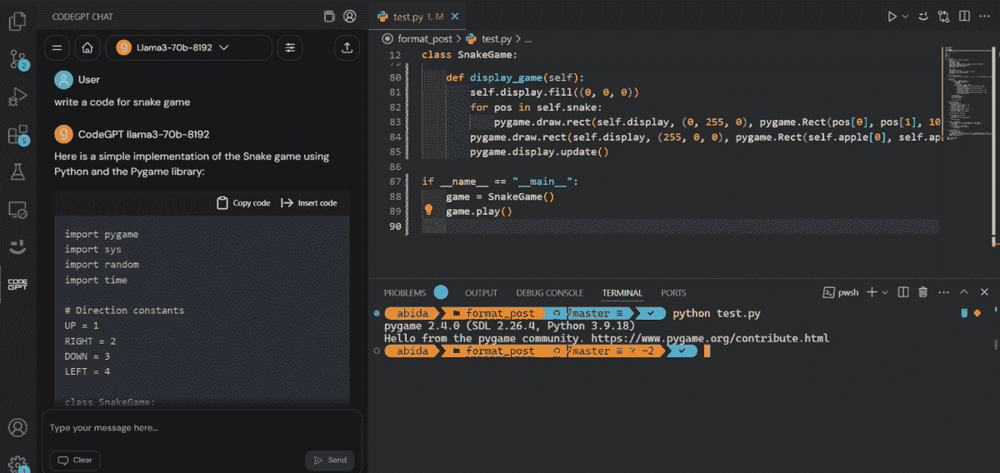

这是我们蛇形游戏的演示。

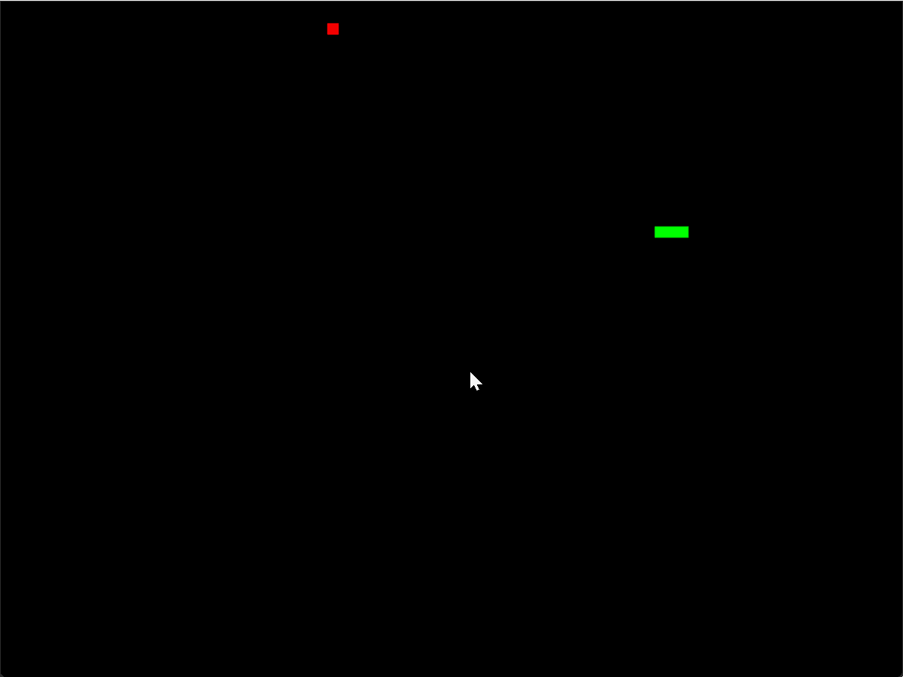

了解一下五大 AI 编程助手，成为一名 AI 驱动的开发者和数据科学家。记住，AI 的目的是帮助我们，而不是取代我们，因此要开放心态，利用它来提升你的代码编写能力。

## 结论

在本教程中，我们学习了 Groq 推理引擎以及如何通过 Jan AI Windows 应用程序在本地访问它。更棒的是，我们通过使用 CodeGPT VSCode 扩展将其集成到我们的工作流程中，这真是太棒了。它实时生成响应，为更好的开发体验提供了帮助。

现在，大多数公司将开发自己的推理引擎以匹配 Groq 的速度。否则，Groq 在几个月内将夺得第一。

****[Abid Ali Awan](https://www.polywork.com/kingabzpro)****（[@1abidaliawan](https://www.linkedin.com/in/1abidaliawan)）是一位认证的数据科学专业人士，热衷于构建机器学习模型。目前，他专注于内容创作并撰写有关机器学习和数据科学技术的技术博客。Abid 拥有技术管理硕士学位和电信工程学士学位。他的愿景是利用图神经网络开发一款 AI 产品，帮助那些在心理健康方面挣扎的学生。

### 更多相关内容

+   [Llama, Llama, Llama：用你的内容进行本地 RAG 的 3 个简单步骤](https://www.kdnuggets.com/3-simple-steps-to-local-rag-with-your-content)

+   [本地运行 LlaMA 2 的简单指南](https://www.kdnuggets.com/a-simple-guide-to-running-llama-2-locally)

+   [运行 Llama 3 的最简单方法](https://www.kdnuggets.com/easiest-way-of-running-llama-3-locally)

+   [如何成为数据科学家指南（一步步的方法）](https://www.kdnuggets.com/2021/05/guide-become-data-scientist.html)

+   [如何构建数据科学项目：一步步指南](https://www.kdnuggets.com/2022/05/structure-data-science-project-stepbystep-guide.html)

+   [使用 Python 和 Beautiful Soup 进行网页抓取的一步步指南](https://www.kdnuggets.com/2023/04/stepbystep-guide-web-scraping-python-beautiful-soup.html)
