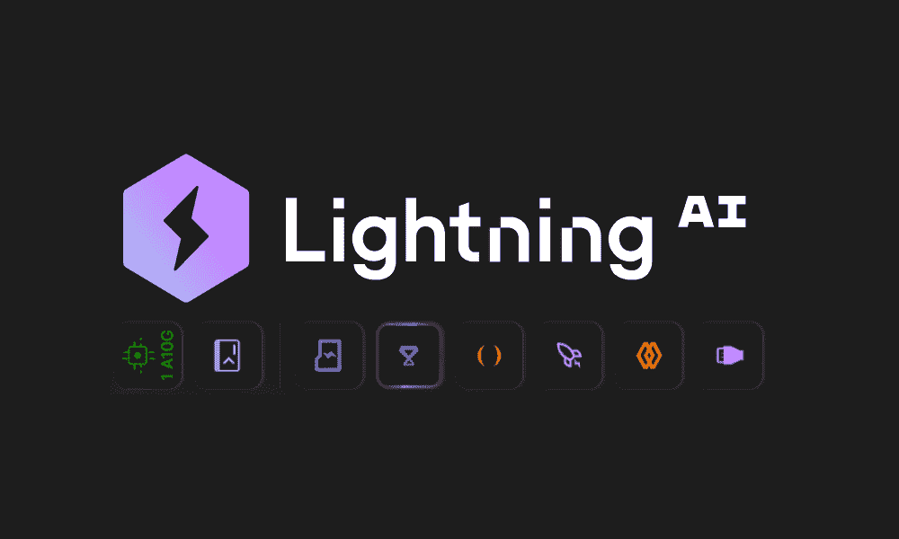
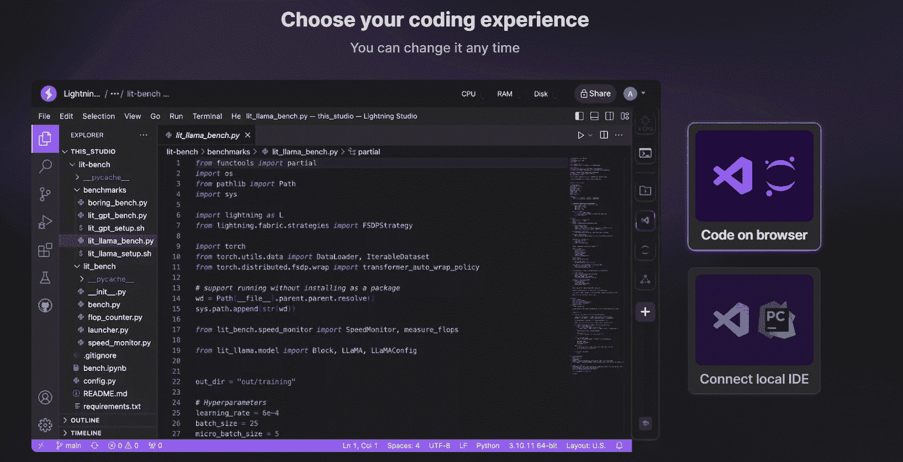
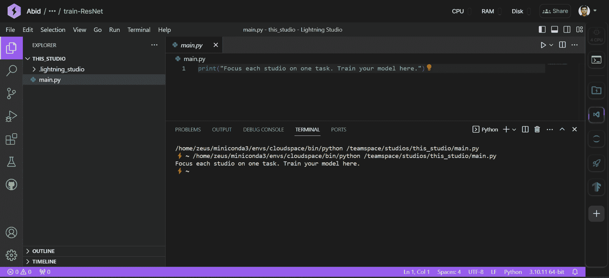
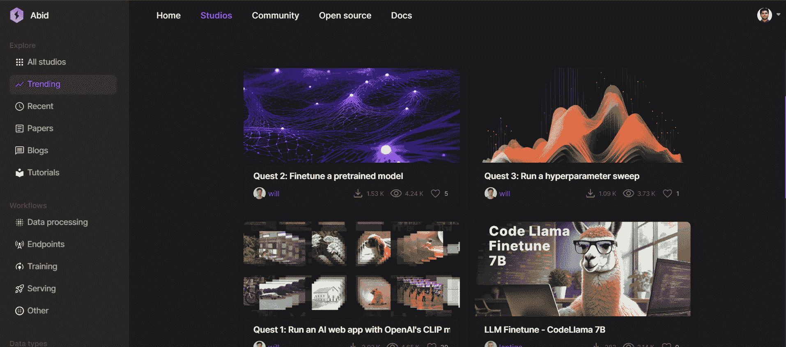
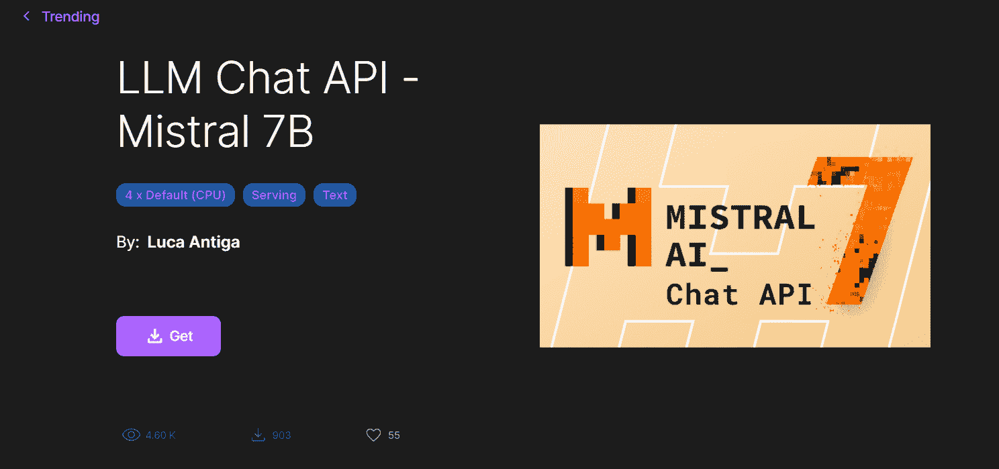
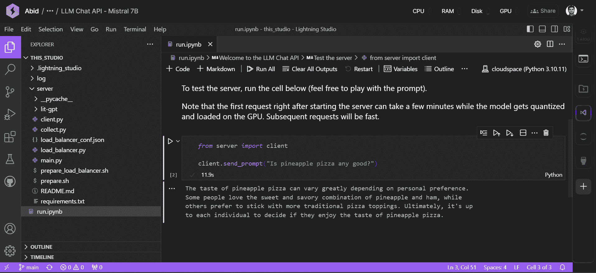
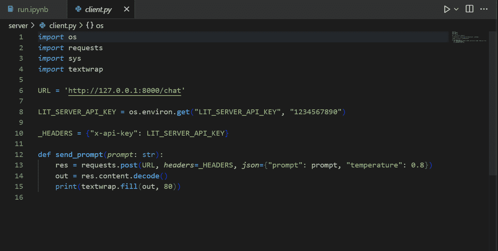
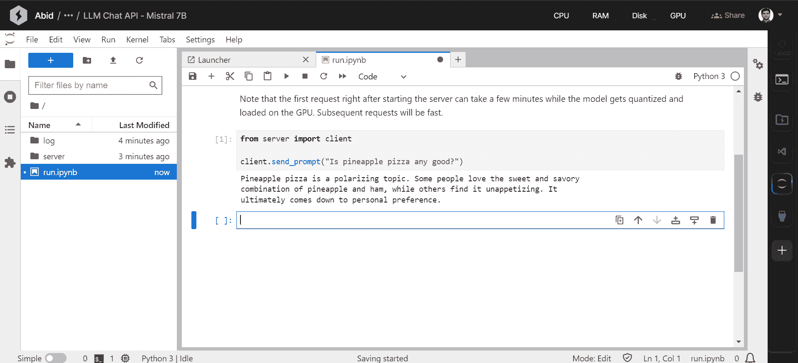
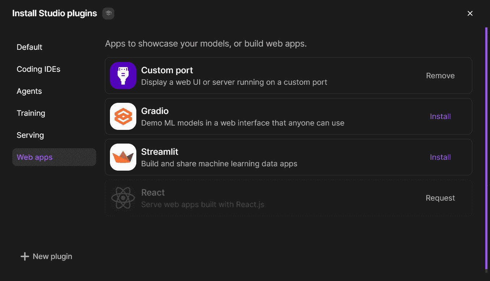

# 免费使用 Lightning AI Studio

> 原文：[`www.kdnuggets.com/using-lightning-ai-studio-for-free`](https://www.kdnuggets.com/using-lightning-ai-studio-for-free)

图片来源：作者

在这篇文章中，我们将了解一个既免费又用户友好的新云 IDE。它是 Google Colab 的升级版，允许您保存项目、使用必要的插件，并免费在 GPU 上运行生成模型。

* * *

## 我们的三大课程推荐

 1\. [谷歌网络安全证书](https://www.kdnuggets.com/google-cybersecurity) - 快速进入网络安全职业

 2\. [谷歌数据分析专业证书](https://www.kdnuggets.com/google-data-analytics) - 提升您的数据分析技能

 3\. [谷歌 IT 支持专业证书](https://www.kdnuggets.com/google-itsupport) - 支持您的组织 IT 需求

* * *

# 什么是 Lightning AI Studio？

[Lightning AI Studio](https://lightning.ai/) 是一个基于云的 AI 开发平台（类似于 Google Colab），旨在消除为机器学习项目设置本地环境的麻烦。

以下是 Lightning AI Studio 的主要功能：

1.  它将流行的机器学习工具集成到一个界面中，因此您无需在不同工具之间切换。这使得构建可扩展的 AI 应用和端点变得更加容易。

1.  不需要环境设置。您可以在浏览器中编写代码或连接本地 IDE（VSCode 或 PyCharm）。您还可以轻松切换 CPU 和 GPU，无需环境变更。

1.  它支持托管和共享使用 Streamlit、Gradio、React JS 等构建的 AI 应用。它还支持通过协同编码实现多用户合作。

1.  它提供了无限存储空间，支持上传和共享文件，以及连接 S3 存储桶。

1.  它支持使用数千个 GPU（付费选项）进行大规模模型训练。您可以大规模并行运行超参数调整、数据预处理和模型部署。

1.  它提供了本地开发体验，同时利用了云基础设施的强大功能。

1.  发现社区模板（Studio），可在几分钟内在您的云端用数据快速部署、微调和训练模型，无需设置。

您的 Jupyter Notebook / VSCode 在云端提供了可扩展的硬件，用于训练大型语言模型和进行快速推理。

# 入门指南

您可以在 lightning.ai/sign-up 创建一个免费账户。要获得即时验证，请确保使用官方公司或 .edu 邮箱。我使用了 @kdnuggets.com 邮箱，得到了即时访问。

一旦创建了账户，请按照几个简单的步骤自定义您的 Studio 体验。要获得 7 小时的免费 GPU，您需要验证您的电话号码。

完成初步步骤后，你将被引导到一个包含基本 Python 文件的示例项目中。仅需几分钟，你的 Studio 就会准备好处理图像并微调 Renest 模型。要开始，简单地编写代码并执行文件。

用户界面 (UI) 与 VSCode 相似，但右侧面板提供了更多选项。

# Lightning AI Studios

Lighting AI 平台提供了由用户设计的项目模板 Studio。这些模板包括代码、环境设置和数据，帮助你启动项目。你可以在平台上找到各种 Studio 模板，如训练、微调、预处理、推理和超参数搜索模板。你可以轻松搜索并浏览这些模板，找到适合你需求的模板。

例如，访问 Mistral 7B API。点击“获取”并等待其完成。

点击`run.ipynb`文件并运行第一个单元。

访问 Mistral 7B API 后，代码会返回结果。要查看客户端代码，请进入服务器文件夹并打开`client.py`文件。

我经常使用 VSCode，发现开始使用 Lightning AI Studio 非常简单。

# Lightning AI Studio 插件

如果你对 Jupyter Notebook 的 UI 感到舒适，可以通过点击右侧面板上的 Jupyter Notebook 按钮来切换 IDE。右侧面板是你可以找到各种 Lightning AI Studio 插件的地方。

要添加新的插件，点击“+”按钮，然后从 IDE、AI Agents、Training、Serving 和 Webapps 插件中进行选择。

就这么简单。现在你可以享受 VSCode 和 Jupyter Notebook 扩展的 Studio 插件。

# 结论

Lightning AI Studio 提供了一个完整的平台，满足你的机器学习需求——从实验模型架构到部署应用程序。这个用户友好的平台配备了所有必要的功能，免去拼凑各种工具的麻烦。

你可以利用云计算的强大功能和规模，而无需学习云计算或基础设施管理的复杂性。开发者已经抽象了复杂性，使得即使没有云计算经验的数据科学家也能独立开发和部署解决方案。

无论你是想原型设计一个想法还是构建一个生产级应用程序，Lightning AI Studio 都能满足你的需求。免费层级提供所有核心功能，包括 Studio GPUs，以加速训练。这使得 Lightning AI Studio 成为学习和创建有影响力的机器学习应用程序的理想选择。

****[Abid Ali Awan](https://www.polywork.com/kingabzpro)**** ([@1abidaliawan](https://www.linkedin.com/in/1abidaliawan)) 是一位认证的数据科学专业人士，热爱构建机器学习模型。目前，他专注于内容创作和撰写关于机器学习和数据科学技术的技术博客。Abid 拥有技术管理硕士学位和电信工程学士学位。他的愿景是利用图神经网络构建一个帮助精神疾病学生的 AI 产品。

### 更多相关话题

+   [使用 LM Studio 本地运行 LLM](https://www.kdnuggets.com/run-an-llm-locally-with-lm-studio)

+   [开始使用 PyTorch Lightning](https://www.kdnuggets.com/2022/12/getting-started-pytorch-lightning.html)

+   [深入了解深度学习库：PyTorch 和 Lightning AI](https://www.kdnuggets.com/introduction-to-deep-learning-libraries-pytorch-and-lightning-ai)

+   [提升你的 AI 之旅！加入 Uplimit 的免费 AI 构建课程…](https://www.kdnuggets.com/2024/01/uplimit-supercharge-your-ai-journey-openai-course)

+   [真正免费的课程：AI 和 ML 版](https://www.kdnuggets.com/free-courses-that-are-actually-free-ai-ml-edition)

+   [使用 Python 自动化 Microsoft Excel 和 Word](https://www.kdnuggets.com/2021/08/automate-microsoft-excel-word-python.html)
