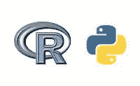

# 同时使用 Python 和 R：3 种主要方法

> 原文：[`www.kdnuggets.com/2015/12/using-python-r-together.html`](https://www.kdnuggets.com/2015/12/using-python-r-together.html)

 评论

**作者：Ajay Ohri，DecisionStats**。

* * *

## 我们的前 3 名课程推荐

 1\. [Google 网络安全证书](https://www.kdnuggets.com/google-cybersecurity) - 快速进入网络安全职业轨道。

 2\. [Google 数据分析专业证书](https://www.kdnuggets.com/google-data-analytics) - 提升你的数据分析水平

 3\. [Google IT 支持专业证书](https://www.kdnuggets.com/google-itsupport) - 支持你的组织的 IT 工作

* * *

为什么有人想在同一软件中使用 R 和 Python？难道我们还没有看到足够多的关于哪种语言更好的辩论吗？即使在这个网站（一个行业风向标），我也能找到四篇这样的文章，这里 是 Datacamp 的，Stichfix，辩论 和 KDnuggets 调查。好吧，如果数据科学和数据科学家不能决定选择哪个数据来帮助他们决定使用哪种语言，那么这里有一篇关于如何同时使用这两者的文章。

### 数据科学家：

思考 Python 和 R

而不仅仅是 PYTHON 或 R

这里是一些这样做的理由：

1.  两者都是稳定的语言，具有有趣的互补特性。你可以在一种语言中获得更好的包，然后将它们与另一种语言中的数据结合起来。例如，使用 R 中的时间序列预测（forecast::auto.arima）和决策树（[`www.statmethods.net/<wbr>advstats/cart.html`](http://www.statmethods.net/advstats/cart.html)），然后在 Python 中进行数据处理。

1.  这两种语言相互借鉴。即使是经验丰富的包开发者，如 Hadley Wickham（Rstudio），也借鉴了 Beautiful Soup（python）来制作用于网页抓取的[rvest](http://blog.rstudio.org/2014/11/24/rvest-easy-web-scraping-with-r/)。Yhat 从 `sqldf` 中借鉴了代码来制作[pandasql](http://blog.yhathq.com/posts/pandasql-sql-for-pandas-dataframes.html)。开发者可以专注于创新，而不是在另一种语言中重新发明轮子。

1.  客户不在乎代码是用哪种语言编写的，客户关心的是洞察力。

1.  你不太可能因错误、功能请求或版本兼容性问题而被束缚。

1.  对数据科学家来说，掌握这两种语言更具吸引力（或者像我们这些年长的人喜欢在《哈佛商业评论》宣布[data scientist 为最性感职业](https://hbr.org/2012/10/data-scientist-the-sexiest-job-of-the-21st-century/)之前说的那样，更酷）。

1.  数据科学中只有四种主要语言（~91% 根据 KDnuggets 调查），每个人都可以从自己的语言中使用 SQL。SQL 是没有争议的。

那么如何做到这一点呢？截至 2015 年 12 月，有三种主要方法可以同时使用 Python 和 R。

1.  使用 Python 包 `rpy2` 在 Python 中使用 R。你可以在 [这里](https://sites.google.com/site/aslugsguidetopython/data-analysis/pandas/calling-r-from-python) 查看示例。你也可以使用 [rPython](http://www.programmingr.com/content/calling-python-r-rpython/) 包在 R 中使用 Python。

1.  使用 [Jupyter 与 IR 内核](http://blog.revolutionanalytics.com/2015/09/using-r-with-jupyter-notebooks.html) - Jupyter 项目以 Julia Python 和 R 命名，使 iPython 的交互性扩展到其他语言。

1.  使用 [Beaker notebook](http://decisionstats.com/2015/12/07/decisionstats-interview-scott-draves-beaker-notebook/) - 受 Jupyter 启发，Beaker Notebook 允许你在一个代码块中切换一种语言，在另一个代码块中切换另一种语言，以简化共享对象（数据）的传递。

我希望我能说所有这些方法都简单而流畅，但实际上并非如此。我喜欢 Python 在数据清洗中的强大功能，也喜欢 R 在统计学中的丰富包和函数库。将来 R 和 Python 的结合是否会增长？让我们拭目以待。但如果你不知道，你还可以使用[SAS 语言与 R 和 Python](http://blog.revolutionanalytics.com/2015/05/call-r-and-python-from-base-sas.html)(使用 Java)。这确实很酷。

**简介： [Ajay Ohri](https://plus.google.com/+AjayOhri/)** 是分析初创公司 DECISIONSTATS 的创始人。他是《 [R for Business Analytics](http://www.springer.com/statistics/book/978-1-4614-4342-1)》和《 [R for Cloud Computing](http://www.springer.com/statistics/computational+statistics/book/978-1-4939-1701-3)》的作者。

**相关：**

+   将 Python 和 R 集成到数据分析流程中，第一部分

+   数据科学编程：Python 与 R 的对比

+   R 与 Python 在数据科学中的比较：赢家是…

### 更多相关内容

+   [数据科学家和数据工程师如何协作？](https://www.kdnuggets.com/2022/08/data-scientists-data-engineers-work-together.html)

+   [将人类和 AI 代理结合起来以提升客户体验](https://www.kdnuggets.com/2024/06/softweb/bringing-human-and-ai-agents-together-for-enhanced-customer-experience)

+   [使用 Python 的自动化机器学习：不同方法的比较…](https://www.kdnuggets.com/2023/03/automated-machine-learning-python-comparison-different-approaches.html)

+   [机器学习的数据标注：市场概述、方法和工具](https://www.kdnuggets.com/2021/12/data-labeling-ml-overview-and-tools.html)

+   [机器学习的最佳领域：自然语言处理和文档分析中的纯方法](https://www.kdnuggets.com/2022/05/machine-learning-sweet-spot-pure-approaches-nlp-document-analysis.html)

+   [多标签自然语言处理：类别不平衡和损失函数的分析……](https://www.kdnuggets.com/2023/03/multilabel-nlp-analysis-class-imbalance-loss-function-approaches.html)
