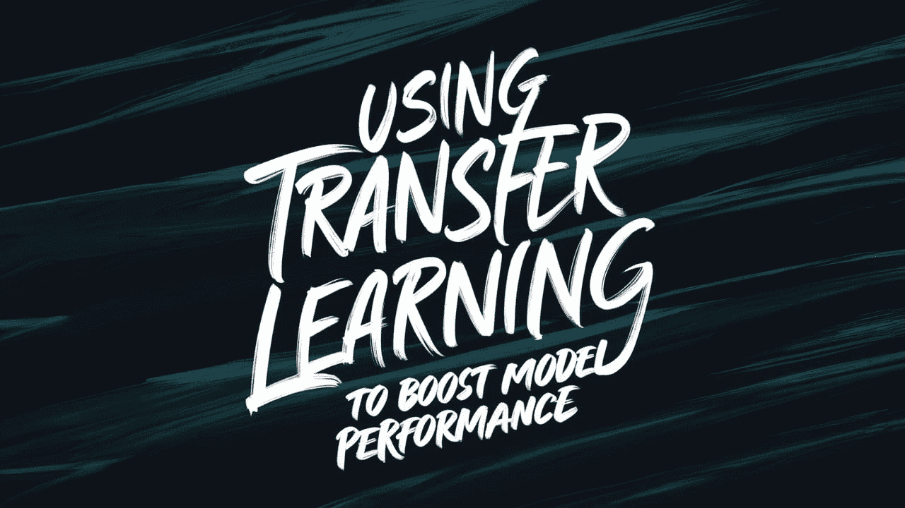
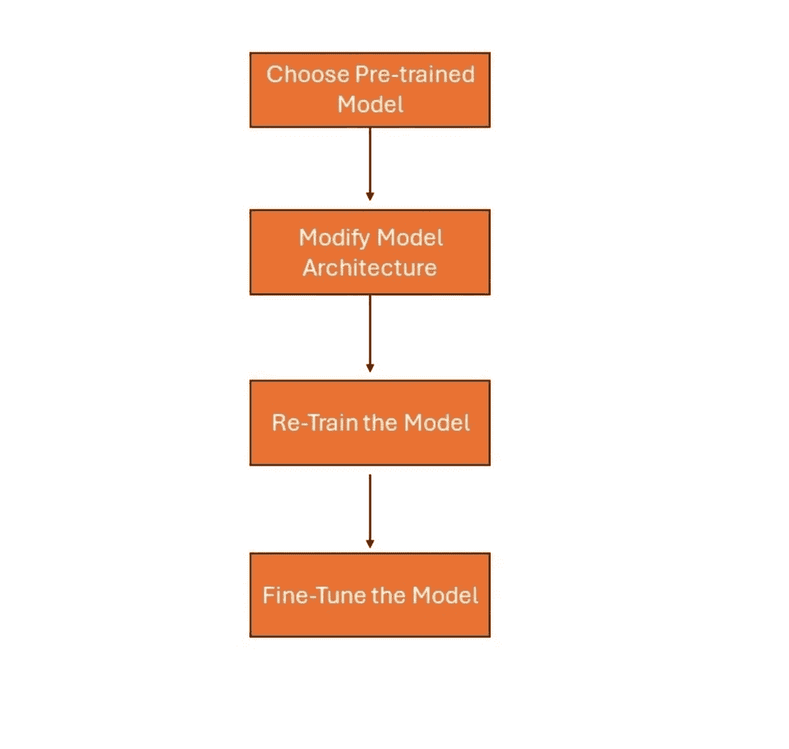
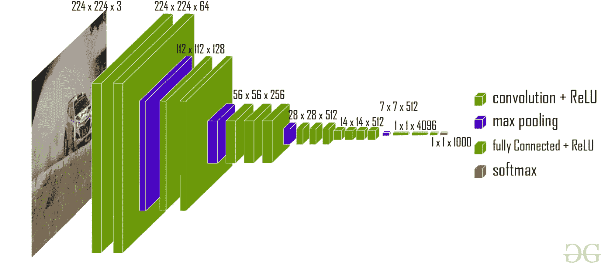
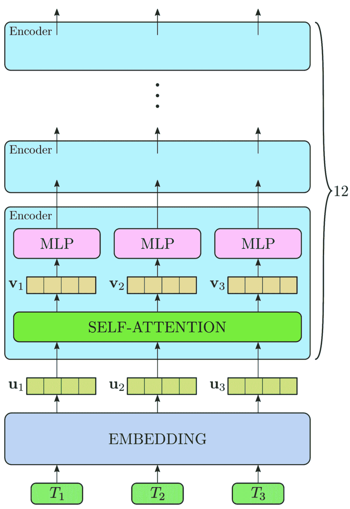

# 使用迁移学习来提升模型性能

> 原文：[`www.kdnuggets.com/using-transfer-learning-to-boost-model-performance`](https://www.kdnuggets.com/using-transfer-learning-to-boost-model-performance)



你是否考虑过如何在不开发新模型的情况下提升机器学习模型的性能？这就是迁移学习发挥作用的地方。在本文中，我们将概述迁移学习及其优点和挑战。

* * *

## 我们的前三个课程推荐

 1\. [谷歌网络安全证书](https://www.kdnuggets.com/google-cybersecurity) - 快速进入网络安全职业的快车道。

 2\. [谷歌数据分析专业证书](https://www.kdnuggets.com/google-data-analytics) - 提升你的数据分析能力

 3\. [谷歌 IT 支持专业证书](https://www.kdnuggets.com/google-itsupport) - 支持你的组织进行 IT 工作

* * *

## 什么是迁移学习？

迁移学习意味着一个为一个任务训练的模型可以用于另一个类似的任务。然后你可以使用一个预训练模型，并根据所需任务对其进行修改。让我们讨论迁移学习的各个阶段。

图片来源：作者

1.  **选择预训练模型**：选择一个在类似任务上用大型数据集训练过的模型。

1.  **修改模型架构**：根据你的具体任务调整预训练模型的最终层。如果需要，还可以添加新的层。

1.  **重新训练模型**：在你的新数据集上训练修改后的模型。这使得模型能够学习你特定任务的细节，同时也利用了在原始训练中学到的特征。

1.  **微调模型**：解冻一些预训练层，继续训练你的模型。这使得模型能够通过微调权重更好地适应新任务。

## 迁移学习的好处

迁移学习提供了几个重要的优势：

1.  **节省时间和资源**：微调需要的时间和计算资源较少，因为预训练模型已经针对特定数据集进行了大量迭代训练。这个过程已经捕捉了重要特征，因此减少了新任务的工作量。

1.  **提高性能**：预训练模型从大量数据集中学习，因此具有更好的泛化能力。这使得在新的任务上，即使新数据集相对较小，也能提高性能。初始训练中获得的知识有助于实现更高的准确性和更好的结果。

1.  **需要更少的数据**：转移学习的一个主要优势是其在较小数据集上的有效性。预训练模型已经获得了有用的模式和特征信息。因此，即使给定的数据很少，它也能表现得相当不错。

## 转移学习的类型

转移学习可以分为三种类型：

### 特征提取

特征提取意味着使用模型在新数据上学到的特征。例如，在图像分类中，我们可以利用预定义卷积神经网络中的特征来搜索图像中的重要特征。以下是一个使用 Keras 中的预训练 VGG16 模型进行图像特征提取的示例：

```py
import numpy as np
from tensorflow.keras.applications import VGG16
from tensorflow.keras.preprocessing import image
from tensorflow.keras.applications.vgg16 import preprocess_input

# Load pre-trained VGG16 model (without the top layers for classification)
base_model = VGG16(weights='imagenet', include_top=False)

# Function to extract features from an image
def extract_features(img_path):
    img = image.load_img(img_path, target_size=(224, 224))  # Load image and resize
    x = image.img_to_array(img)  # Convert image to numpy array
    x = np.expand_dims(x, axis=0)  # Add batch dimension
    x = preprocess_input(x)  # Preprocess input according to model's requirements
    features = base_model.predict(x)  # Extract features using VGG16 model
    return features.flatten()  # Flatten to a 1D array for simplicity

# Example usage
image_path = 'path_to_your_image.jpg'
image_features = extract_features(image_path)
print(f"Extracted features shape: {image_features.shape}") 
```

### 微调

微调涉及调整特征提取步骤以及新模型的某些方面，以匹配特定任务。这种方法在中等规模的数据集上最为有效，并且当你希望提升模型在特定任务上的能力时非常有用。例如，在自然语言处理（NLP）中，一个标准的 BERT 模型可能会被调整或在少量医学文本上进一步训练，以更好地完成医学实体识别。以下是一个使用 BERT 进行情感分析的示例，其中在自定义数据集上进行了微调：

```py
from transformers import BertTokenizer, BertForSequenceClassification, AdamW
import torch
from torch.utils.data import DataLoader, TensorDataset

# Example data (replace with your dataset)
texts = ["I love this product!", "This is not what I expected.", ...]
labels = [1, 0, ...]  # 1 for positive sentiment, 0 for negative sentiment, etc.

# Load pre-trained BERT model and tokenizer
model_name = 'bert-base-uncased'
tokenizer = BertTokenizer.from_pretrained(model_name)
model = BertForSequenceClassification.from_pretrained(model_name, num_labels=2)  # Example: binary classification

# Tokenize input texts and create DataLoader
inputs = tokenizer(texts, padding=True, truncation=True, return_tensors="pt")
dataset = TensorDataset(inputs['input_ids'], inputs['attention_mask'], torch.tensor(labels))
dataloader = DataLoader(dataset, batch_size=16, shuffle=True)

# Fine-tuning parameters
optimizer = AdamW(model.parameters(), lr=1e-5)

# Fine-tune BERT model
model.train()
for epoch in range(3):  # Example: 3 epochs
    for batch in dataloader:
        optimizer.zero_grad()
        input_ids, attention_mask, target = batch
        outputs = model(input_ids, attention_mask=attention_mask, labels=target)
        loss = outputs.loss
        loss.backward()
        optimizer.step() 
```

### 领域适应

领域适应提供了如何利用从预训练模型的源领域获得的知识应用到不同目标领域的见解。当源领域和目标领域在特征、数据分布或甚至语言上有所不同时，这种方法是必需的。例如，在情感分析中，我们可能会将从产品评论中学到的情感分类器应用于社交媒体帖子，因为这两者使用了非常不同的语言。以下是一个将情感分析从产品评论适应到社交媒体帖子的示例：

```py
# Function to adapt text style 
def adapt_text_style(text):
    # Example: replace social media language with product review-like language
    adapted_text = text.replace("excited", "positive").replace("#innovation", "new technology")
    return adapted_text

# Example usage of domain adaptation
social_media_post = "Excited about the new tech! #innovation"
adapted_text = adapt_text_style(social_media_post)
print(f"Adapted text: {adapted_text}")

# Use sentiment classifier trained on product reviews
# Example: sentiment_score = sentiment_classifier.predict(adapted_text) 
```

## 预训练模型

预训练模型是已经在大规模数据集上训练过的模型。它们从广泛的数据中捕获知识和模式。这些模型被用作其他任务的起点。让我们讨论一些常见的在机器学习中使用的预训练模型应用。

### VGG（视觉几何组）

VGG 的架构包括多个 3×3 的卷积滤波器层和池化层。它能够识别图像中的边缘和形状等详细特征。通过在大规模数据集上训练，VGG 学会了识别图像中的不同物体。它可以用于目标检测和图像分割。

 VGG-16 | CNN 模型（来源：[GeeksforGeeks](https://www.geeksforgeeks.org/vgg-16-cnn-model/)）

### ResNet（残差网络）

ResNet 使用残差连接来训练模型。这些连接使梯度更容易在网络中流动。这可以防止梯度消失问题，帮助网络有效训练。ResNet 能够成功训练具有数百层的模型。ResNet 在图像分类和人脸识别等任务中表现优异。

 ResNet-50 架构（来源：[研究论文](https://www.researchgate.net/figure/An-illustration-of-ResNet-50-layers-architecture_fig1_350421671)）

### BERT（双向编码器表示模型）

BERT 用于自然语言处理应用。它使用基于变换器的模型来理解句子中词汇的上下文。它学习猜测缺失的词汇并理解句子意义。BERT 可用于情感分析、问答和命名实体识别。

 BERT 架构的高层次视图（来源：[研究论文](https://www.researchgate.net/figure/Simplified-high-level-view-of-the-BERT-architecture-7-8-The-word-tokens-are_fig2_355938108)）

## 微调技术

### 层冻结

层冻结意味着选择预训练模型中的某些层，并在用新数据训练时防止这些层发生变化。这是为了保留模型从原始训练中学到的有用模式和特征。通常，我们会冻结捕捉图像中边缘或文本中基本结构的早期层。

### 学习率调整

调整学习率对于平衡模型已学到的内容和新数据非常重要。通常，微调时使用的学习率低于最初使用大数据集时的学习率。这有助于模型适应新数据，同时保持大部分已学习的权重。

## 挑战与注意事项

让我们探讨迁移学习的挑战以及如何解决这些问题。

1.  **数据集大小和领域迁移**：在微调时，应当有充足的数据用于相关任务，同时微调通用模型时，这种方法的缺点是新的数据集可能较小或与模型最初适应的数据差异较大。为了解决这个问题，可以添加更多与模型已经训练过的数据更相关的数据。

1.  **超参数调整**：在使用预训练模型时，调整超参数非常重要。这些参数相互依赖，决定了模型的表现如何。可以使用网格搜索等技术或自动化工具来寻找最优的超参数设置，从而在验证数据上获得高性能。

1.  **计算资源**：深度神经网络的微调计算上要求很高，因为这些模型可能拥有数百万个参数。训练和预测输出需要强大的加速器，如 GPU 或 TPU。这些需求通常由云计算平台来解决。

## 总结

总之，迁移学习在提升人工智能模型性能的各个应用领域中，作为一块基石。通过利用像 VGG、ResNet、BERT 等预训练模型，实践者可以有效地利用现有知识来应对图像分类、自然语言处理、医疗保健、自动驾驶系统等复杂任务。

**[Jayita Gulati](https://www.linkedin.com/in/jayitagulati1998/)** 是一位对构建机器学习模型充满热情的机器学习爱好者和技术作家。她拥有利物浦大学计算机科学硕士学位。

### 更多相关话题

+   [提升你的机器学习模型性能！](https://www.kdnuggets.com/2023/04/manning-boost-machine-learning-model-performance.html)

+   [使用 PyTorch 的迁移学习实用指南](https://www.kdnuggets.com/2023/06/practical-guide-transfer-learning-pytorch.html)

+   [使用 Python 监控 MLOps 流水线中的模型性能](https://www.kdnuggets.com/2023/05/monitor-model-performance-mlops-pipeline-python.html)

+   [使用大型语言模型时优化性能和成本的策略](https://www.kdnuggets.com/strategies-for-optimizing-performance-and-costs-when-using-large-language-models-in-the-cloud)

+   [TensorFlow 在计算机视觉中的应用 - 迁移学习变得简单](https://www.kdnuggets.com/2022/01/tensorflow-computer-vision-transfer-learning-made-easy.html)

+   [什么是迁移学习？](https://www.kdnuggets.com/2022/01/transfer-learning.html)
