# 使用 ‘What-If 工具’ 调查机器学习模型

> 原文：[`www.kdnuggets.com/2019/06/using-what-if-tool-investigate-machine-learning-models.html`](https://www.kdnuggets.com/2019/06/using-what-if-tool-investigate-machine-learning-models.html)

 评论

**由 [Parul Pandey](https://twitter.com/pandeyparul) 编写**。

在可解释和可理解的机器学习时代，仅仅训练模型并获取预测结果是不够的。为了真正产生影响并获得良好的结果，我们还应该能够探查和调查我们的模型。此外，在继续使用模型之前，还应清楚地考虑算法公平性约束和偏差。

调查模型需要提出很多问题，并且需要具有侦探般的洞察力来探查和寻找模型中的问题和不一致之处。此外，这种任务通常复杂，需要编写大量的自定义代码。幸运的是，**What-If 工具**的创建解决了这一问题，使得广泛的用户能够轻松准确地检查、评估和调试机器学习系统。

### **What-If 工具 (WIT)**

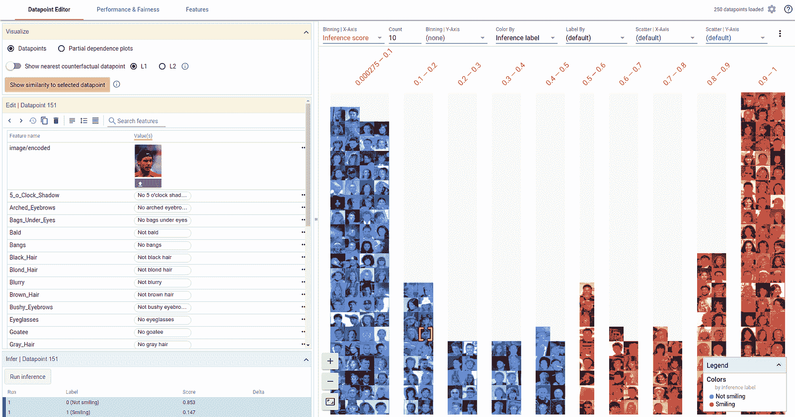

[**What-If 工具**](https://pair-code.github.io/what-if-tool) 是一个互动式可视化工具，旨在调查机器学习模型。简称 WIT，它通过让人们检查、评估和比较机器学习模型来帮助理解分类或回归模型。由于其用户友好的界面和对复杂编码的较少依赖，从开发者、产品经理、研究人员到学生，任何人都可以用它来达到自己的目的。

**WIT** 是 Google 在 [PAIR](https://ai.google/research/teams/brain/pair)（人类与 AI 研究）计划下发布的开源可视化工具。PAIR 将 [Google](https://ai.google/) 的研究人员聚集在一起，研究和重新设计人们与 AI 系统互动的方式。

该工具可以通过 TensorBoard 访问，也可以作为扩展在 Jupyter 或 [Colab](https://colab.research.google.com/github/tensorflow/tensorboard/blob/master/tensorboard/plugins/interactive_inference/What_If_Tool_Notebook_Usage.ipynb) 笔记本中使用。

### **优点**

该工具的目的是通过仅仅使用一个可视化界面，给人们提供一种简单、直观且强大的方式来操作训练好的机器学习模型。以下是 WIT 的主要优点。

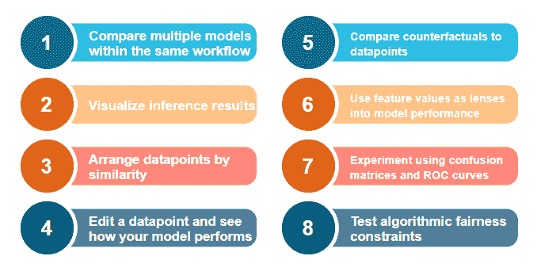使用 What-If 工具可以做什么？

我们将在使用该工具的示例演示中覆盖以上所有要点。

### **演示**

为了展示 What-If 工具的功能，PAIR 团队发布了一套使用预训练模型的[demos](https://pair-code.github.io/what-if-tool/index.html#demos)。你可以在笔记本中运行这些演示，也可以直接通过网页运行。

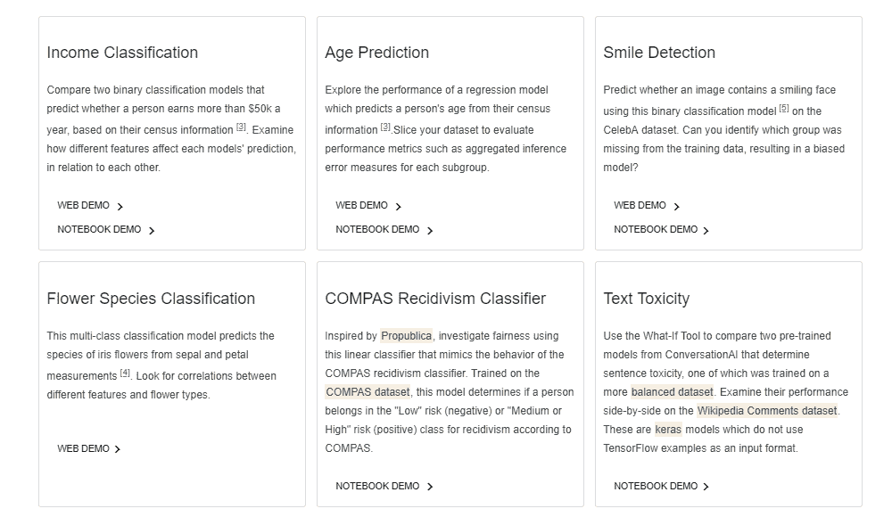

试试 What-If 工具吧！

### **使用**

WIT 可以在[Jupyter](https://jupyter.org/) 或 [Colab](https://colab.research.google.com/) 笔记本中使用，也可以在[TensorBoard](https://www.tensorflow.org/tensorboard)网页应用中使用。这一点在[文档](https://github.com/tensorflow/tensorboard/tree/master/tensorboard/plugins/interactive_inference#what-if-tool)中解释得非常清楚，我强烈建议你阅读，因为在这篇简短的文章中无法解释整个过程。

> 整个概念是先训练一个模型，然后使用 What-If 工具可视化训练好的分类器在测试数据上的结果。

#### [在 TensorBoard 中使用 WIT](https://github.com/tensorflow/tensorboard/tree/master/tensorboard/plugins/interactive_inference#what-do-i-need-to-use-it-in-tensorboard)

要在 TensorBoard 中使用 WIT，你的模型需要通过[TensorFlow 模型服务](https://www.tensorflow.org/serving)进行服务，且待分析的数据必须以[TFRecords](https://medium.com/mostly-ai/tensorflow-records-what-they-are-and-how-to-use-them-c46bc4bbb564) 文件的形式存储在磁盘上。有关更多细节，请参阅[文档](https://github.com/tensorflow/tensorboard/tree/master/tensorboard/plugins/interactive_inference#what-do-i-need-to-use-it-in-tensorboard)。

#### [在笔记本中使用 WIT](https://github.com/tensorflow/tensorboard/tree/master/tensorboard/plugins/interactive_inference#notebook-mode-details)

要在笔记本中访问 WIT，你需要一个 WitConfigBuilder 对象来指定待分析的数据和模型。[文档](https://github.com/tensorflow/tensorboard/tree/master/tensorboard/plugins/interactive_inference#notebook-mode-details) 提供了在笔记本中使用 WIT 的逐步指南。

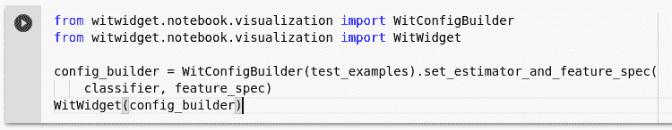

你还可以使用一个[演示笔记本](https://colab.research.google.com/github/pair-code/what-if-tool/blob/master/WIT_Model_Comparison.ipynb)并编辑代码来包括你的数据集以开始工作。

### 演练

现在让我们通过一个例子来探索 WIT 工具的功能。这个例子取自网站上提供的演示，名为 **收入分类**，其中我们需要根据个人的普查信息预测其年收入是否超过 $50k。数据集属于[UCI 人口普查数据集](http://archive.ics.uci.edu/ml/datasets/Census+Income)，包含了年龄、婚姻状况和教育水平等多个属性。

#### 概述

让我们开始对数据集进行一些探索。这里是一个[链接](https://pair-code.github.io/what-if-tool/uci.html)，可以跟随网络演示进行操作。

WIT 包含两个主要面板。**右侧面板**包含加载的数据集中的单个数据点的可视化。

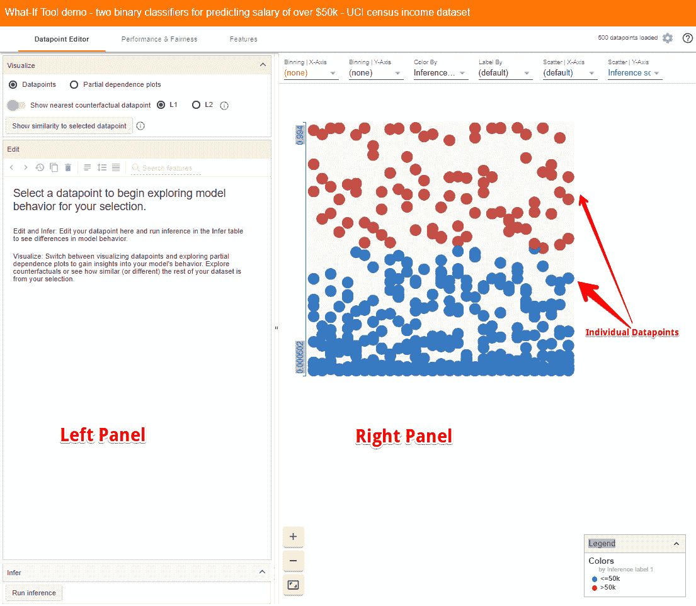

在这种情况下，**蓝点**是模型推断收入**低于 50k** 的人，而**红点**是模型推断收入**高于 50k** 的人。默认情况下，WIT 使用[正向分类阈值](https://developers.google.com/machine-learning/crash-course/classification/thresholding)为 0.5。这意味着如果推断分数为 0.5 或更高，该数据点被认为属于正类，即高收入。

> 这里值得注意的是，数据集在[Facets Dive](https://pair-code.github.io/facets/)中进行了可视化。Facets Dive 是**FACETS**工具的一部分，该工具由 PAIR 团队开发，帮助我们理解数据的各种特征并进行探索。如果你对这个工具不熟悉，可以参考我之前写的[这篇文章](https://towardsdatascience.com/visualising-machine-learning-datasets-with-googles-facets-462d923251b3)，了解 FACETS 的功能。

还可以通过从下拉菜单中选择字段，以不同的方式组织数据点，包括混淆矩阵、散点图、直方图和小型多个图。以下是一些示例。

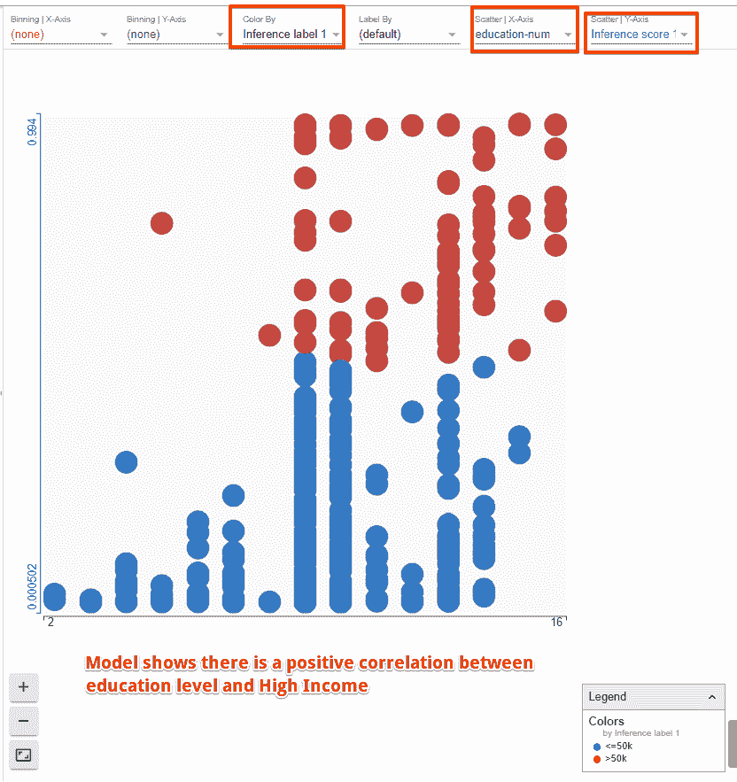

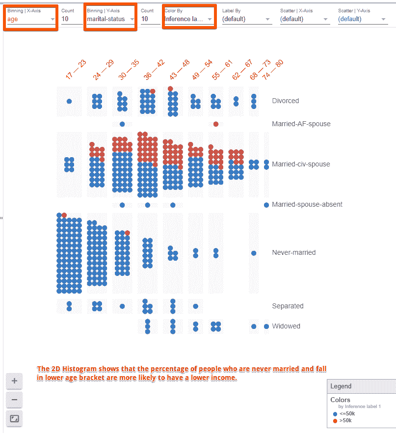

**左侧面板**包含三个选项卡：Datapoint Editor、Performance & Fairness 和 Features。

#### 1. Datapoint Editor 选项卡

Datapoint 编辑器通过以下方式帮助执行数据分析：

+   **查看和编辑数据点的详细信息**

允许深入查看选中的数据点，该数据点在右侧面板上会被突出显示为黄色。我们可以尝试将年龄从 53 改为 58，然后点击“Run inference”按钮，查看这对模型性能有何影响。

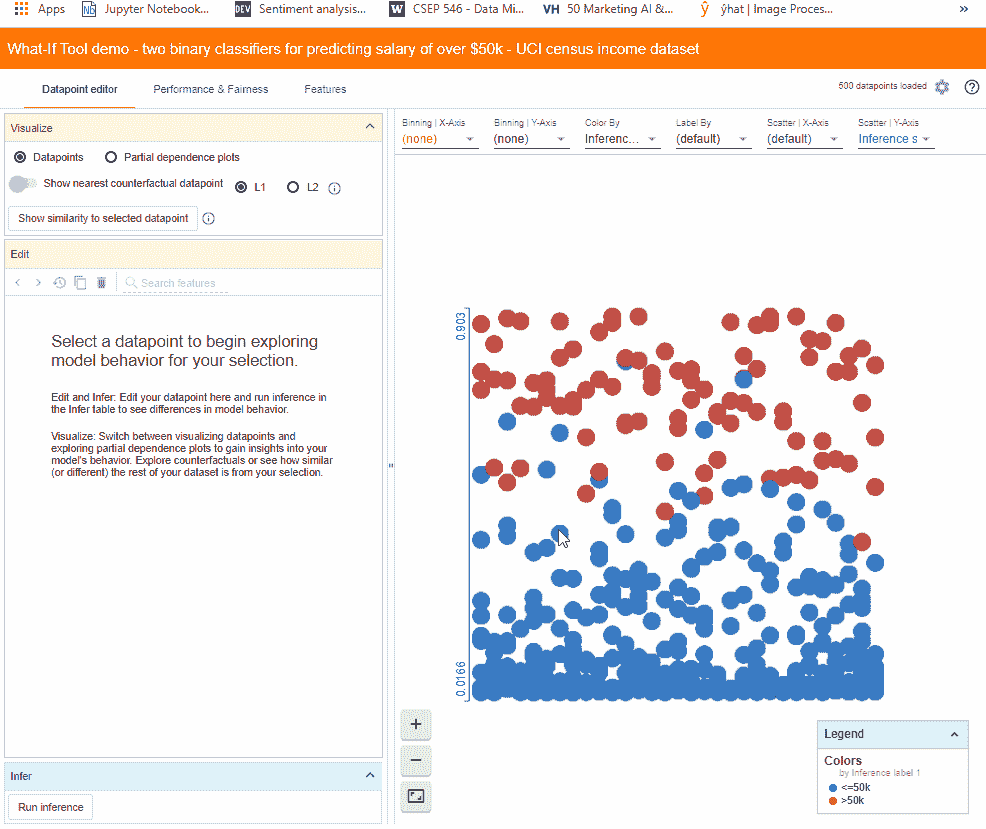

通过简单地改变这个人的年龄，模型现在预测这个人属于高收入类别。对于这个数据点，之前正类（高收入）的推断分数为 0.473，负类（低收入）的分数为 0.529。然而，通过改变年龄，正类的分数变为 0.503。

+   **查找最近的反事实**

了解模型行为的另一种方法是查看哪些小的变化集可以导致模型改变决策，这称为**反事实**。通过一次点击，我们可以看到最相似的反事实，它在绿色中突出显示，与我们选择的数据点进行比较。在数据点编辑标签中，我们现在也可以看到反事实的特征值与原始数据点的特征值并排显示。绿色文本表示两个数据点的特征差异。WIT 使用[L1 和 L2](https://www.kaggle.com/residentmario/l1-norms-versus-l2-norms)距离来计算数据点之间的相似性。

在这种情况下，最近的反事实略微年长，具有不同的职业和资本收益，但其他方面是相同的。

我们还可以通过“**显示与选定数据点的相似性**”按钮查看所选点与其他点之间的相似性。WIT 测量从选定点到其他每个数据点的距离。让我们将*X*轴散点图更改为显示与选定数据点的 L1 距离。

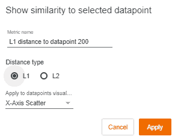

+   **分析部分依赖图**

部分依赖图（PDP 或 PD 图）展示了一个或两个特征对机器学习模型预测结果的边际影响（[J. H. Friedman 2001](https://statweb.stanford.edu/~jhf/ftp/trebst.pdf)）。

一个数据点的年龄和教育的 PDP 如下：

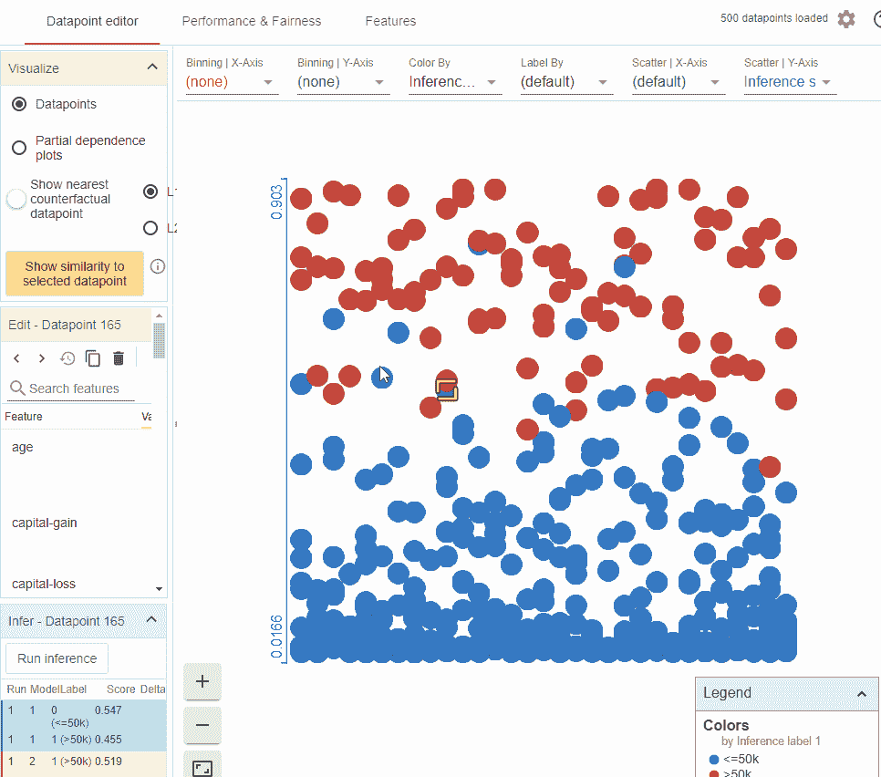

上图显示了：

+   模型已经学会了年龄与收入之间的正相关关系

+   更高的学位使模型在高收入方面更加自信。

+   高资本收益是高收入的一个非常强的指标，比任何其他单一特征要强得多。

#### 2\. 性能与公平性标签

此标签允许我们使用混淆矩阵和 ROC 曲线来查看模型的整体性能。

+   **模型性能分析**

为了衡量模型的性能，我们需要告诉工具什么是基准真实特征，即模型试图预测的特征，在这种情况下是“**收入超过 50K**”。

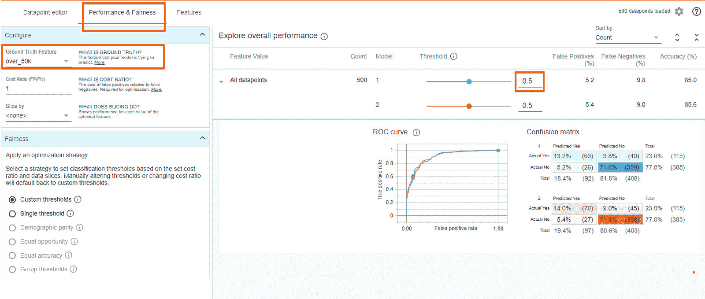

我们可以看到，在默认的 0.5 阈值水平下，我们的模型约 15%的时间是错误的，其中大约 5%是假阳性，10%是假阴性。调整阈值来查看其对模型准确性的影响。

还有一个“**成本比**”的设置和一个“**优化阈值**”按钮，这些也可以进行调整。

+   **机器学习公平性**

机器学习中的公平性与模型构建和预测结果一样重要。训练数据中的任何偏差都会反映在训练后的模型中，如果这种模型被部署，结果输出也会有偏差。WIT 可以通过几种不同的方式帮助调查公平性问题。我们可以设置一个输入特征（或特征集）来切片数据。例如，看看性别对模型性能的影响。

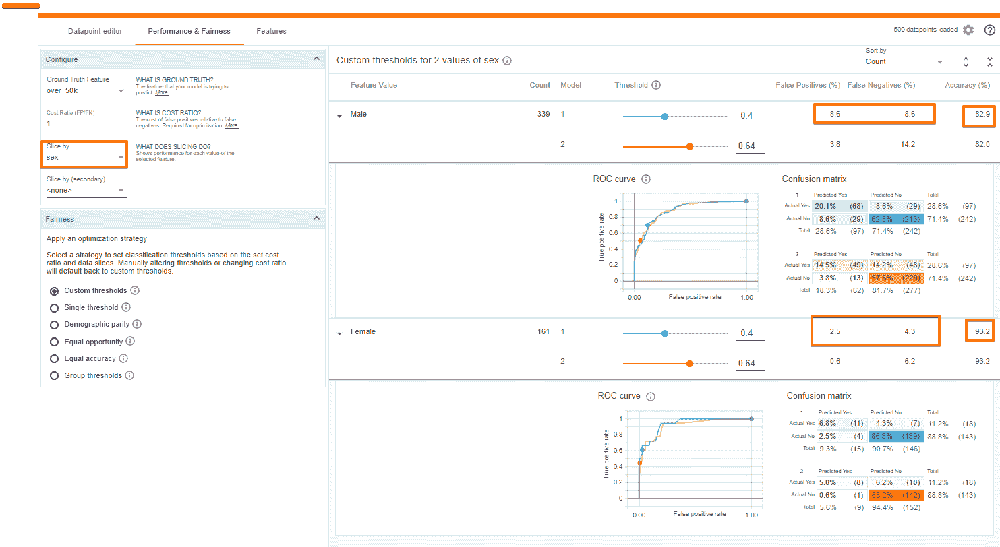

性别对模型性能的影响。

我们可以看到，模型对女性的预测比对男性更准确。此外，模型对女性预测高收入的频率远低于对男性的预测（女性为 9.3% vs 男性为 28.6%）。一个可能的原因是数据集中女性的代表性不足，我们将在下一部分中探讨这一点。

此外，该工具可以在考虑多种与算法公平性相关的约束条件（如人口统计公平性或平等机会）的情况下，最佳设置两个子集的决策阈值。

#### 3\. 特征选项卡

特征选项卡提供了数据集中每个特征的总结统计信息，包括直方图、分位数图和条形图。该选项卡还允许查看数据集中每个特征值的分布。例如，我们来探讨性别、资本收益和种族特征。

我们推断*资本收益*非常不均匀，大多数数据点的值为 0。

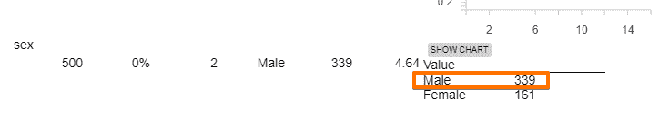

本国分布 || 性别分布

同样，大多数数据点来自美国，而女性在数据集中并未得到很好的代表。由于数据存在偏差，其预测自然会只针对某一组。毕竟，模型从提供的数据中学习，如果源数据有偏斜，结果也会有偏斜。机器学习在许多应用和领域中证明了其实力。然而，机器学习模型在工业应用中的一个关键难题是确定用于训练模型的原始输入数据是否包含歧视性偏差。

### 结论

这只是对一些“如果”工具功能的快速浏览。WIT 是一个非常实用的工具，它将探查模型的能力交到最需要的人手中。简单地创建和训练模型并不是机器学习的目的，而是理解模型如何以及为何被创建，才是机器学习的真正意义。

#### 参考文献：

1.  [What-If 工具：无代码探查机器学习模型](https://ai.googleblog.com/2018/09/the-what-if-tool-code-free-probing-of.html)

1.  [`pair-code.github.io/what-if-tool/walkthrough.html`](https://pair-code.github.io/what-if-tool/walkthrough.html)

1.  [`github.com/tensorflow/tensorboard/tree/master/tensorboard/plugins/interactive_inference`](https://github.com/tensorflow/tensorboard/tree/master/tensorboard/plugins/interactive_inference)

[原文](https://towardsdatascience.com/using-what-if-tool-to-investigate-machine-learning-models-913c7d4118f)。已获得许可转载。

**简介：** [Parul Pandey](https://twitter.com/pandeyparul) 是一位数据科学爱好者，曾在电力行业的分析部门工作。现在，Parul 为国内外出版物撰写与数据科学和人工智能相关的文章，试图将数据科学术语普及给大众。

**相关：**

+   [数据科学家是思考者：执行与探索及其对你的意义](https://www.kdnuggets.com/2019/06/data-scientists-thinkers-execution-exploration.html)

+   [命令行中的数据科学：数据探索](https://www.kdnuggets.com/2018/02/data-science-command-line-book-exploring-data.html)

+   [TensorFlow 入门终极指南](https://www.kdnuggets.com/2018/09/ultimate-guide-tensorflow.html)

* * *

## 我们的三大课程推荐

 1\. [谷歌网络安全证书](https://www.kdnuggets.com/google-cybersecurity) - 快速进入网络安全职业轨道

 2\. [谷歌数据分析专业证书](https://www.kdnuggets.com/google-data-analytics) - 提升你的数据分析能力

 3\. [谷歌 IT 支持专业证书](https://www.kdnuggets.com/google-itsupport) - 支持组织的 IT 部门

* * *

### 更多相关主题

+   [Nota AI 发布了 NetPresso 模型搜索的测试版，提供硬件感知的自动机器学习工具](https://www.kdnuggets.com/2022/04/nota-ai-releases-beta-version-netpresso-model-search-hardwareaware-automl-tool.html)

+   [7 件你不知道可以用低代码工具做的事](https://www.kdnuggets.com/2022/09/7-things-didnt-know-could-low-code-tool.html)

+   [RAG 与微调：哪个是提升大型语言模型应用的最佳工具？](https://www.kdnuggets.com/rag-vs-finetuning-which-is-the-best-tool-to-boost-your-llm-application)

+   [使用回归模型预测加密货币价格](https://www.kdnuggets.com/2022/05/predicting-cryptocurrency-prices-regression-models.html)

+   [如何让大型语言模型与您的软件协同工作](https://www.kdnuggets.com/how-to-make-large-language-models-play-nice-with-your-software-using-langchain)

+   [使用大型语言模型优化性能和成本的策略](https://www.kdnuggets.com/strategies-for-optimizing-performance-and-costs-when-using-large-language-models-in-the-cloud)
