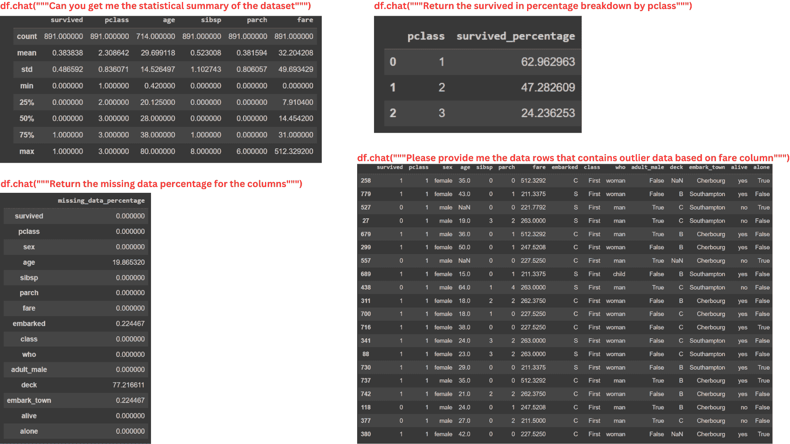
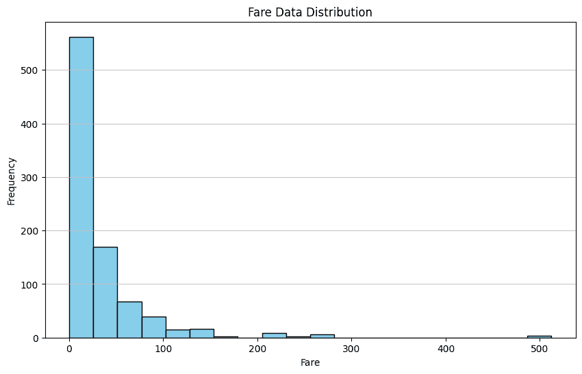
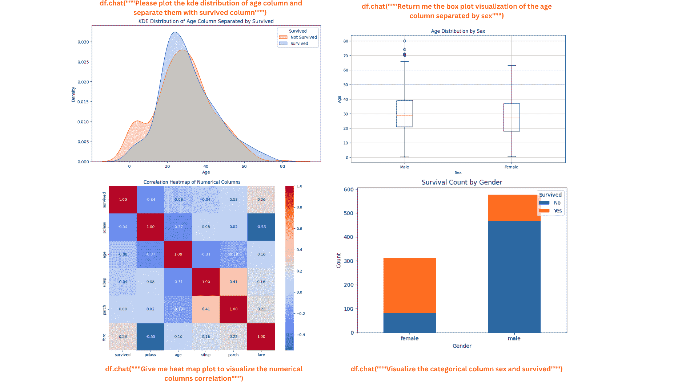

# 利用 Pandas AI 进行数据分析

> 原文：[`www.kdnuggets.com/utilizing-pandas-ai-for-data-analysis`](https://www.kdnuggets.com/utilizing-pandas-ai-for-data-analysis)

你在使用 Python 的数据领域中是否很熟练？如果是的话，我敢打赌你们大多数人都使用 Pandas 进行数据处理。

如果你不知道，[Pandas](https://pandas.pydata.org/)是一个专门为数据分析和处理开发的开源 Python 软件包。它是使用最广泛的软件包之一，也是你在开始 Python 数据科学之旅时通常会学习的一个。

* * *

## 我们的前三个课程推荐

 1\. [Google 网络安全证书](https://www.kdnuggets.com/google-cybersecurity) - 快速入门网络安全职业。

 2\. [Google 数据分析专业证书](https://www.kdnuggets.com/google-data-analytics) - 提升你的数据分析技能

 3\. [Google IT 支持专业证书](https://www.kdnuggets.com/google-itsupport) - 支持你在 IT 方面的组织

* * *

那么，Pandas AI 是什么？我想你读这篇文章是因为你想了解它。

好吧，正如你所知，我们正处在一个生成 AI 无处不在的时代。想象一下，如果你可以使用生成 AI 对你的数据进行数据分析，那将会容易很多。

这就是 Pandas AI 带来的效果。通过简单的提示，我们可以快速分析和处理数据集，而无需将数据发送到其他地方。

本文将探讨如何利用 Pandas AI 进行数据分析任务。在文章中，我们将学习以下内容：

+   Pandas AI 设置

+   使用 Pandas AI 进行数据探索

+   使用 Pandas AI 进行数据可视化

+   Pandas AI 高级用法

如果你准备好了，就让我们开始吧！

# Pandas AI 设置

[Pandas AI](https://github.com/Sinaptik-AI/pandas-ai)是一个 Python 软件包，它将大型语言模型（LLM）功能实现到 Pandas API 中。我们可以使用标准的 Pandas API 和生成 AI 增强功能，使 Pandas 成为一个对话工具。

我们主要想使用 Pandas AI 是因为该软件包提供的简单过程。该软件包可以使用简单的提示自动分析数据，而无需复杂的代码。

介绍够了，让我们动手实践吧。

首先，我们需要在其他任何事情之前安装这个软件包。

```py
pip install pandasai
```

接下来，我们必须设置我们想用于 Pandas AI 的 LLM。有几种选择，例如 OpenAI GPT 和 HuggingFace。然而，本教程中我们将使用 OpenAI GPT。

将 OpenAI 模型设置到 Pandas AI 中是直接的，但你需要 OpenAI API 密钥。如果你没有，可以在他们的[网站](https://platform.openai.com/api-keys)上获取。

如果一切准备就绪，让我们使用下面的代码设置 Pandas AI LLM。

```py
from pandasai.llm import OpenAI

llm = OpenAI(api_token="Your OpenAI API Key")
```

你现在准备好使用 Pandas AI 进行数据分析了。

## 使用 Pandas AI 进行数据探索

让我们从一个示例数据集开始，尝试使用 Pandas AI 进行数据探索。我将在这个示例中使用 Seaborn 包中的 Titanic 数据。

```py
import seaborn as sns
from pandasai import SmartDataframe

data = sns.load_dataset('titanic')
df = SmartDataframe(data, config = {'llm': llm})
```

我们需要将它们传递到 Pandas AI 智能数据框对象中以启动 Pandas AI。之后，我们可以在我们的 DataFrame 上执行对话活动。

让我们尝试一个简单的问题。

```py
response = df.chat("""Return the survived class in percentage""")

response
```

*乘客幸存的百分比是：38.38%*

根据提示，Pandas AI 可以提出解决方案并回答我们的问题。

我们可以向 Pandas AI 提问，它会在 DataFrame 对象中提供答案。例如，这里有几个用于分析数据的提示。

```py
#Data Summary
summary = df.chat("""Can you get me the statistical summary of the dataset""")

#Class percentage
surv_pclass_perc = df.chat("""Return the survived in percentage breakdown by pclass""")

#Missing Data
missing_data_perc = df.chat("""Return the missing data percentage for the columns""")

#Outlier Data
outlier_fare_data = response = df.chat("""Please provide me the data rows that
contains outlier data based on fare column""")
```



图片由作者提供

从上面的图片可以看出，即使提示相当复杂，Pandas AI 也可以提供 DataFrame 对象的信息。

然而，Pandas AI 无法处理过于复杂的计算，因为这些包的功能受限于我们传递给 SmartDataFrame 对象的 LLM。未来，我相信 Pandas AI 能够处理更详细的分析，因为 LLM 能力在不断发展。

## 使用 Pandas AI 进行数据可视化

Pandas AI 对于数据探索非常有用，可以执行数据可视化。只要我们指定提示，Pandas AI 就会给出可视化输出。

让我们尝试一个简单的例子。

```py
response = df.chat('Please provide me the fare data distribution visualization')

response
```



图片由作者提供

在上面的示例中，我们要求 Pandas AI 可视化 Fare 列的分布。输出是数据集的柱状图分布。

就像数据探索一样，你可以进行任何类型的数据可视化。然而，Pandas AI 仍然无法处理更复杂的可视化过程。

这里有一些使用 Pandas AI 进行数据可视化的其他示例。

```py
kde_plot = df.chat("""Please plot the kde distribution of age column and separate them with survived column""")

box_plot = df.chat("""Return me the box plot visualization of the age column separated by sex""")

heat_map = df.chat("""Give me heat map plot to visualize the numerical columns correlation""")

count_plot = df.chat("""Visualize the categorical column sex and survived""")
```



图片由作者提供

图表看起来很美观整洁。如果有必要，你可以继续向 Pandas AI 询问更多细节。

## Pandas AI 高级使用

我们可以使用 Pandas AI 的几个内置 API 来改善 Pandas AI 的体验。

### 缓存清理

默认情况下，Pandas AI 对象中的所有提示和结果都存储在本地目录中，以减少处理时间并缩短 Pandas AI 调用模型所需的时间。

然而，这个缓存有时可能会使 Pandas AI 的结果无关紧要，因为它们会考虑过去的结果。因此，清除缓存是一个好习惯。你可以使用以下代码来清除缓存。

```py
import pandasai as pai
pai.clear_cache()
```

你还可以在开始时关闭缓存。

```py
df = SmartDataframe(data, {"enable_cache": False})
```

通过这种方式，从一开始就没有提示或结果被存储。

### 自定义标题

可以将一个示例 DataFrame 传递给 Pandas AI。如果你不想与 LLM 共享一些私人数据或只是想向 Pandas AI 提供一个示例，这将非常有帮助。

要做到这一点，你可以使用以下代码。

```py
from pandasai import SmartDataframe
import pandas as pd

# head df
head_df = data.sample(5)

df = SmartDataframe(data, config={
    "custom_head": head_df,
    'llm': llm
})
```

### Pandas AI 技能与代理

Pandas AI 允许用户传递示例函数，并通过 Agent 决策执行它。例如，下面的函数将两个不同的 DataFrame 合并，我们传递一个样本绘图函数给 Pandas AI 代理执行。

```py
import pandas as pd
from pandasai import Agent
from pandasai.skills import skill

employees_data = {
    "EmployeeID": [1, 2, 3, 4, 5],
    "Name": ["John", "Emma", "Liam", "Olivia", "William"],
    "Department": ["HR", "Sales", "IT", "Marketing", "Finance"],
}

salaries_data = {
    "EmployeeID": [1, 2, 3, 4, 5],
    "Salary": [5000, 6000, 4500, 7000, 5500],
}

employees_df = pd.DataFrame(employees_data)
salaries_df = pd.DataFrame(salaries_data)

# Function doc string to give more context to the model for use of this skill
@skill
def plot_salaries(names: list[str], salaries: list[int]):
    """
    Displays the bar chart  having name on x-axis and salaries on y-axis
    Args:
        names (list[str]): Employees' names
        salaries (list[int]): Salaries
    """
    # plot bars
    import matplotlib.pyplot as plt

    plt.bar(names, salaries)
    plt.xlabel("Employee Name")
    plt.ylabel("Salary")
    plt.title("Employee Salaries")
    plt.xticks(rotation=45)

    # Adding count above for each bar
    for i, salary in enumerate(salaries):
        plt.text(i, salary + 1000, str(salary), ha='center', va='bottom')
    plt.show()

agent = Agent([employees_df, salaries_df], config = {'llm': llm})
agent.add_skills(plot_salaries)

response = agent.chat("Plot the employee salaries against names")
```

Agent 会决定是否使用我们分配给 Pandas AI 的函数。

结合技能和 Agent 可以为你的 DataFrame 分析提供更可控的结果。

# 结论

我们已经了解到使用 Pandas AI 来帮助数据分析工作是多么简单。利用 LLM 的力量，我们可以将数据分析工作中的编码部分限制到最小，而专注于关键工作。

在这篇文章中，我们了解了如何设置 Pandas AI，如何使用 Pandas AI 进行数据探索和可视化，以及进阶用法。你可以用这个包做更多的事情，访问他们的[文档](https://docs.pandas-ai.com/en/latest/)以获取更多信息。

**[](https://www.linkedin.com/in/cornellius-yudha-wijaya/)**[Cornellius Yudha Wijaya](https://www.linkedin.com/in/cornellius-yudha-wijaya/)**** 是一名数据科学助理经理和数据撰稿人。在全职工作于 Allianz Indonesia 期间，他喜欢通过社交媒体和写作媒体分享 Python 和数据技巧。Cornellius 涉猎了各种 AI 和机器学习主题。

### 更多相关话题

+   [解锁数据洞察：有效分析的关键 Pandas 函数](https://www.kdnuggets.com/unlocking-data-insights-key-pandas-functions-for-effective-analysis)

+   [NumPy 与 Pandas 结合进行更高效的数据分析](https://www.kdnuggets.com/numpy-with-pandas-for-more-efficient-data-analysis)

+   [Pandas 与 Polars：Python 数据框库的比较分析](https://www.kdnuggets.com/pandas-vs-polars-a-comparative-analysis-of-python-dataframe-libraries)

+   [10 个 Pandas 一行代码实现数据访问、操作和管理](https://www.kdnuggets.com/2023/01/pandas-one-liners-data-access-manipulation-management.html)

+   [使用 Pandas fillna()输入缺失数据的最佳方法](https://www.kdnuggets.com/2023/02/optimal-way-input-missing-data-pandas-fillna.html)

+   [Pandas：如何对数据进行 One-Hot 编码](https://www.kdnuggets.com/2023/07/pandas-onehot-encode-data.html)
