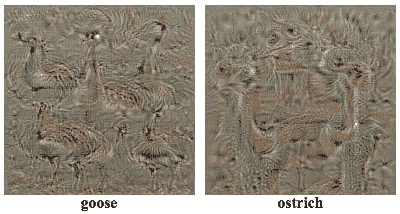
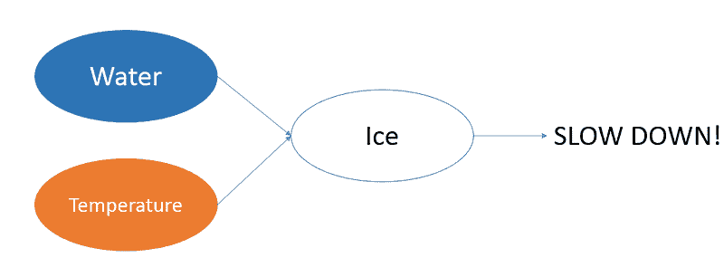
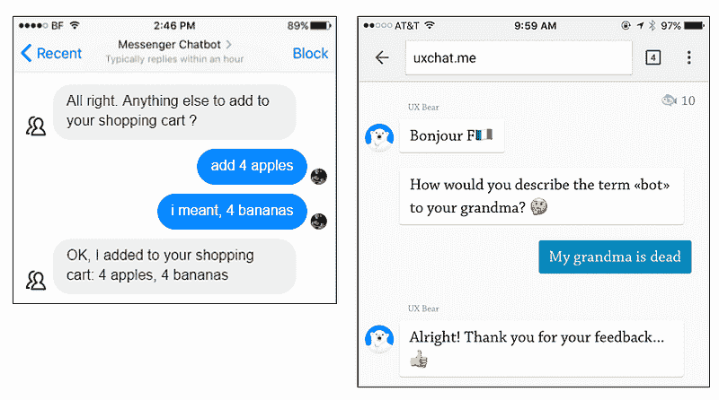
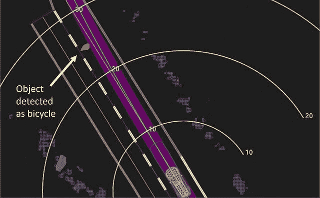

# 数据科学家和人工智能产品的 UX 设计指南

> 原文：[`www.kdnuggets.com/2018/08/ux-design-guide-data-scientists-ai-products.html`](https://www.kdnuggets.com/2018/08/ux-design-guide-data-scientists-ai-products.html)

 评论

**由 [Syed Sadat Nazrul](https://www.linkedin.com/in/snazrul1/), 分析科学家**

* * *

## 我们的前三大课程推荐

 1\. [谷歌网络安全证书](https://www.kdnuggets.com/google-cybersecurity) - 快速进入网络安全领域的职业生涯。

 2\. [谷歌数据分析专业证书](https://www.kdnuggets.com/google-data-analytics) - 提升你的数据分析能力

 3\. [谷歌 IT 支持专业证书](https://www.kdnuggets.com/google-itsupport) - 支持你的组织在 IT 领域

* * *

在寻找针对人工智能产品的 UX 设计策略时，我发现几乎没有相关材料。在我找到的少数资料中，大多数要么过于领域特定，要么完全集中于网页用户界面的视觉设计。我遇到的最好文章是 [Vladimir Shapiro](https://medium.com/@vshapiro24) 的 “[人工智能的 UX：信任作为设计挑战](https://medium.com/sap-design/ux-for-ai-trust-as-a-design-challenge-62044e22c4ec)” 和 [Dávid Pásztor](https://uxstudioteam.com/ux-blog/author/pasztord/) 的 “[AI UX：设计优秀 AI 产品的 7 个原则](https://uxstudioteam.com/ux-blog/ai-ux/)”。意识到 UX 设计师和数据科学家之间存在一个真正的知识差距，我决定尝试从数据科学家的角度来解决这些需求。因此，我的假设是读者对数据科学有一定的基础理解。对于**数据科学背景很少或没有的 UX 设计师**，我避免使用复杂的数学和编程（虽然我鼓励阅读 [Michael Galarnyk](https://towardsdatascience.com/@GalarnykMichael) 的 “[如何建立数据科学作品集](https://towardsdatascience.com/how-to-build-a-data-science-portfolio-5f566517c79c)” 和我的 “[数据科学面试指南](https://towardsdatascience.com/data-science-interview-guide-4ee9f5dc778)”）。

人工智能正在占据我们日常生活的几乎每一个方面。这将改变我们的行为方式以及我们对这些产品的期望。作为设计师，我们的目标是创建有用且易于理解的产品，以便为这个模糊的新世界带来清晰度。最重要的是，我们希望利用人工智能的力量使人们的生活变得更加轻松和愉悦。

### 识别关键目标

即使在我们尝试设计产品之前，我们也需要了解我们产品试图解决的整体商业模式。一些常见的问题包括：

+   这个模型试图解决什么业务问题？是分类问题还是回归问题？

+   最终用户是谁？他们是技术人员还是非技术人员？他们期望从这个产品中获得什么价值？

+   数据是静态的还是动态的？模型是基于状态的还是无状态的？收集的数据的粒度和质量如何？我们如何最好地呈现这些信息？是否有像 [PCI](https://www.pcisecuritystandards.org/)、[HIPAA](https://www.hhs.gov/hipaa/index.html) 或 [GDPR](https://gdpr-info.eu/) 这样的数据使用监管限制？

+   这个模型的更大影响是什么？市场有多大？这个市场中的其他参与者是谁？他们是补充你的产品还是直接竞争对手？转换成本是多少？需要考虑哪些关键的监管、文化、社会经济和技术趋势？

更好地理解最终产品将使我们能够更有效地满足需求。我推荐的一些相关书籍包括 [Bernard Marr](https://www.bernardmarr.com/default.asp?contentID=645) 的《[智能公司：证据管理的五个成功步骤](https://www.amazon.com/Intelligent-Company-Success-Evidence-Based-Management-ebook/dp/B003NX731U/ref=sr_1_1?s=digital-text&ie=UTF8&qid=1533839599&sr=1-1&keywords=intelligent+company)》和 [Alexander Osterwalder](http://alexosterwalder.com/) 的《[商业模式生成：愿景者、游戏改变者和挑战者的手册](https://www.amazon.com/dp/B06X426D4F/ref=dp-kindle-redirect?_encoding=UTF8&btkr=1)》。

### 构建可解释的模型

虽然大多数人都追求准确的模型，但常常忽略了理解模型为什么会这样做。模型的优点和缺点是什么？为什么它会对给定的输入特征提供这样的预测？虽然这个问题看似简单，但许多行业需要将其作为产品价值主张的一部分来提供答案。

在 Credit Karma、Netflix 和 Amazon 上的模型解释

下面是一些实际使用案例，在这些案例中，最终用户需要对模型进行解释：

+   为什么你的信用评分没有比现在更高？

+   为什么 Amazon 会推荐我购买某些产品？

+   为什么自动驾驶汽车在识别行人之后仍然发生了碰撞？

大多数机器学习模型，如决策树和逻辑回归，天生是可解释的。我们可以分析权重系数，可视化树形结构或计算熵，以预测对最终预测的主要贡献（详细信息[请见这里](https://towardsdatascience.com/study-of-decision-trees-and-ensembles-on-scikit-learn-e713a8e532b8)）。虽然过去大多数商业问题依赖于简单的可解释模型，但“黑箱”模型，如神经网络，已经开始变得非常流行。这是因为神经网络在处理复杂决策边界的问题（例如图像和语音识别）时提供了更高的准确性和更低的成本。然而，相比于大多数传统模型，神经网络的解释难度要大得多。对于技术水平较低的团队来说，分析神经网络是一项复杂的任务。

一些神经网络模型比其他模型更容易解释，例如下面的图像识别模型。

可视化图像分类模型的卷积神经网络（来源：[Simonyan et al. 2013](https://arxiv.org/abs/1312.6034)）

有时，我们可以根据预测和输入推断出工程特征。例如，模型可能没有针对道路上冰的特征。然而，如果模型接受到的输入包括道路上的水和道路表面温度，我们可以直观地认为冰的存在可以通过隐藏层中的特征工程来推导出来。[特斯拉自动驾驶导致致命事故](https://www.wired.com/story/tesla-autopilot-self-driving-crash-california/)就是需要在自动驾驶领域中使用可解释 AI 的一个例子。

神经网络如何在隐藏层中创建更高阶特征的示例，应用于自动驾驶车辆

欲了解更多关于可解释模型的信息，请查看[Lars Hulstaer](https://towardsdatascience.com/@lars.hulstaert)的“[解释机器学习模型](https://towardsdatascience.com/interpretability-in-machine-learning-70c30694a05f)”。

模型解释不一定需要是数学的。定性地观察输入及其对应的输出通常可以提供有价值的见解。下面是一个[智能安全摄像头](https://www.youtube.com/watch?v=20H-7QOaPFs)错误地将窃贼识别为自拍者，仅仅因为他拿着杆子像自拍杆一样。

来源：[Mark West — 使用 Raspberry Pi Zero、Node.js 和云构建智能安全摄像头](https://www.youtube.com/watch?v=20H-7QOaPFs)

### 处理边缘情况

AI 可以生成内容并采取以前无人想到的行动。对于这些不可预测的情况，我们必须花费更多时间测试产品，寻找奇怪、有趣甚至令人不安的边界情况。一个例子是下面聊天机器人的误解。

聊天机器人对意外用户命令的失败

在实际环境中进行广泛测试可以帮助最小化这些错误。收集生产模型的清晰日志可以帮助调试出现的意外问题。有关测试和 DevOps 相关主题的更多信息，请阅读我的“[数据科学家的 DevOps: 驯服独角兽](https://towardsdatascience.com/devops-for-data-scientists-taming-the-unicorn-6410843990de)”。

从终端用户的角度来看，关于产品功能的清晰沟通可以帮助他们理解这些意外情况。例如，在许多情况下，模型必须在精确度和召回率之间做出权衡。

+   *优化召回率* 意味着机器学习产品将使用它找到的所有正确答案，即使它会显示一些错误的答案。假设我们构建一个可以识别猫图片的 AI。如果我们优化召回率，算法会列出所有的猫，但狗也会出现在结果中。

+   *优化精确度* 意味着机器学习算法只会使用明显正确的答案，但可能会遗漏一些边界正面案例（比如看起来像狗的猫？）。它只会显示猫，但会遗漏一些猫。它不会找到所有正确的答案，只会找到明显的情况。

在我们从事 AI 用户体验（AI UX）工作时，我们帮助开发者决定优化的方向。提供关于人类反应和人类优先事项的有意义见解，可能是 AI 项目中设计师最重要的工作。

### 管理期望

虽然相信一个模型可以解决世界上任何情境是很诱人的，但理解其局限性并在与终端用户沟通这些局限性时保持透明是很重要的。在她的演讲“[我们对信任的误解](https://www.ted.com/talks/onora_o_neill_what_we_don_t_understand_about_trust)”中，英国哲学家 [Onora O’Neil](https://en.wikipedia.org/wiki/Onora_O%27Neill) 指出了信任的三个组成部分：*能力*、*诚实* 和 *可靠性*。保持透明可以向客户展示我们有足够的能力、诚实和可靠性来维持成功商业所需的长期关系。否则，当产品无法交付时，满足过高的期望并失去信任将更加困难。

金融产品是很好的例子。根据政府规定，您的信用评分可能只考虑价值超过 $2000 的资产。因此，任何低于 $2000 的资产在计算您的信用评分时不会被模型考虑。网络安全产品也有类似的情况。如果模型以每天或每周的频率收集数据，您不能期望模型监控 DDoS 攻击。

在碰撞前 1.3 秒，Uber 的汽车决定需要紧急制动——但没有能力自行完成这项操作。黄色带显示了米数，紫色则表示了汽车的行驶路径。（来源：[国家运输安全委员会](https://www.ntsb.gov/Pages/default.aspx)）

这种情况在最近的 [Uber 无人驾驶汽车事故](https://www.wired.com/story/uber-self-driving-crash-arizona-ntsb-report/) 中尤为明显：

> 报告中提到，碰撞前约 1 秒，“自驾系统判断需要紧急制动以减轻碰撞。”然而，Uber 并不允许其系统自行执行紧急制动操作。为了避免“车辆行为不稳定”——比如猛踩刹车或避开塑料袋——Uber 依赖其人工操作员观察道路并在出现问题时接管控制。

自然反应是摄像头没有捕捉到自行车。然而，摄像头确实识别了行人，但系统选择不停车。这是因为模型并未设计为完全替代司机。

### 提供反馈的机会

优秀的用户体验设计的目标是交付一个令最终用户满意的产品。为了确保用户获得他们想要的东西，提供他们反馈 AI 内容的机会是必要的。这可以包括电影的评分系统或让银行知道他们的信用卡交易是否存在欺诈行为。以下是来自 Google Now 的一个示例。

Google Now 请求对推荐系统的预测提供反馈

记住，用户反馈也可以作为你模型的训练数据。如果我们将更多数据输入到机器学习算法中，AI 产品的用户体验将变得越来越好。

### 最终总结

到头来，AI 的设计目的是解决问题并让生活更轻松。人本设计必须始终贯穿于成功产品的开发过程中。不满足客户需求是主要行业破产和被更好服务提供商取代的原因。理解客户需求是前进的关键。

如果你有想法或评论，随时订阅我的博客并在 [Twitter](https://twitter.com/ssnazrul1) 上关注我。

感谢 [Wendy Wong](https://medium.com/@wendy_wong7?source=post_page)。

**个人简介：[Syed Sadat Nazrul](https://www.linkedin.com/in/snazrul1/)** 白天利用机器学习追踪网络和金融犯罪分子，晚上则撰写有趣的博客。

[原文](https://towardsdatascience.com/ux-design-guide-for-data-scientists-and-ai-products-465d32d939b0)。经许可转载。

**相关内容：**

+   数据科学家的 DevOps：驯服独角兽

+   来自 Google Assistant 的视角：我们是否变得依赖 AI？

+   AI 和数据科学中的十大角色

### 更多相关话题

+   [下一阶段的 AI 编程：提示设计与 AI 产品构建](https://www.kdnuggets.com/2023/03/corise-prompt-design-building-ai-products.html)

+   [挖掘 2023 年数据产品的潜力](https://www.kdnuggets.com/2023/01/tapping-potential-data-products-2023.html)

+   [使用 Python 为亚马逊产品构建推荐系统](https://www.kdnuggets.com/2023/02/building-recommender-system-amazon-products-python.html)

+   [使用 OpenAI 构建 AI 产品：CoRise 的免费课程](https://www.kdnuggets.com/2023/07/corise-building-ai-products-openai-free-course-corise.html)

+   [超级提升你的 AI 之旅！加入 Uplimit 的免费 AI 建设课程…](https://www.kdnuggets.com/2024/01/uplimit-supercharge-your-ai-journey-openai-course)

+   [利用 AI 设计公平和公正的电动汽车充电网络](https://www.kdnuggets.com/leveraging-ai-to-design-fair-and-equitable-ev-charging-grids)
