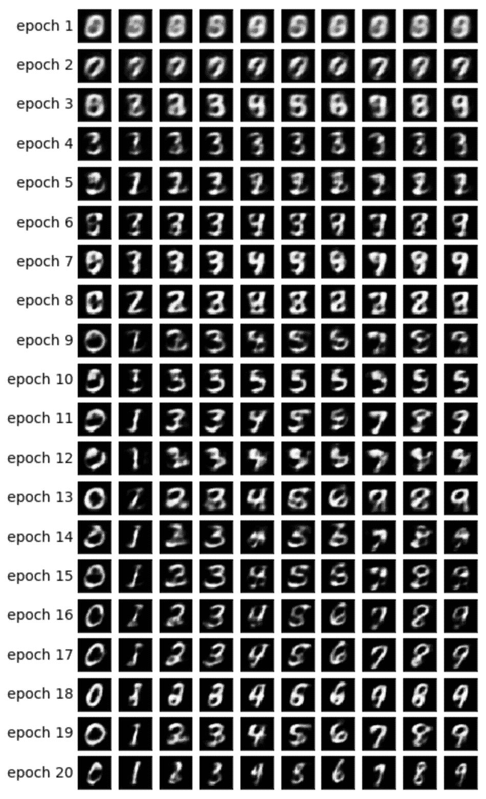

# 变分自编码器详细解析

> 原文：[`www.kdnuggets.com/2018/11/variational-autoencoders-explained.html`](https://www.kdnuggets.com/2018/11/variational-autoencoders-explained.html)

 评论

在这系列的 [上一篇文章](http://anotherdatum.com/vae.html)中，我介绍了变分自编码器（VAE）框架，并解释了其背后的理论。

在这篇文章中，我将更详细地解释 VAE，换句话说——我将提供一些代码 :)

阅读本文后，你将理解实现 VAE 所需的技术细节。

作为一个额外的点，我将向你展示如何通过对一些潜在向量维度施加特殊角色，模型可以生成基于数字类型的图像。

该模型将使用 [MNIST](https://en.wikipedia.org/wiki/MNIST_database) 进行训练——手写数字数据集。输入是 ℝ[28∙28] 中的图像。

接下来，我们将定义我们要使用的超参数。

随意尝试不同的值，以感受模型如何受到影响。笔记本可以在 [这里](https://github.com/yoel-zeldes/yoel-zeldes.github.io/blob/source/content/vae2/vae2.ipynb)找到。

### 该模型

该模型由三个子网络组成：

1.  给定 *x*（图像），将其编码为潜在空间上的分布——在上一篇文章中称之为 *Q*(*z*|*x*)。

1.  给定 *z* 在潜在空间中（图像的代码表示），将其解码为它所表示的图像——在上一篇文章中称之为 *f*(*z*)。

1.  给定 *x*，通过将其映射到大小为 10 的层来分类其数字，其中第 i 个值包含第 i 个数字的概率。

前两个子网络是基本的 VAE 框架。

第三个子网络用作 [辅助任务](http://ruder.io/multi-task/index.html)，它将强制某些潜在维度编码图像中的数字。让我解释一下动机：在上一篇文章中我解释过，我们不在乎潜在空间的每个维度持有什么信息。模型可以学习编码它认为对任务有价值的任何信息。由于我们对数据集非常熟悉，我们知道数字类型应该很重要。我们希望通过提供这些信息来帮助模型。此外，我们将使用这些信息生成基于数字类型的图像，稍后我会解释。

给定数字类型，我们将其使用 one hot 编码，即大小为 10 的向量。这 10 个数字将被连接到潜在向量中，因此在将该向量解码成图像时，模型将利用数字信息。

有两种方法可以为模型提供 one hot 编码向量：

1.  将其作为输入添加到模型中。

1.  将其作为标签添加，这样模型将必须自行预测：我们将添加另一个子网络来预测大小为 10 的向量，其中损失是与期望的 one hot 向量的交叉熵。

我们将选择第二个选项。为什么？嗯，在测试时我们可以以两种方式使用模型：

1.  提供一张图像作为输入，并推断出一个潜在向量。

1.  提供一个潜在向量作为输入，并生成一张图像。

由于我们也想支持第一个选项，因此我们不能向模型提供数字作为输入，因为在测试时我们将不知道它。因此，模型必须学习预测它。

现在我们理解了组成模型的所有子网络，我们可以对其进行编码。编码器和解码器背后的数学细节可以在上一篇文章中找到。

### 训练

我们将训练模型来优化两个损失——VAE 损失和分类损失——使用 [SGD](https://en.wikipedia.org/wiki/Stochastic_gradient_descent)。

在每个纪元结束时，我们将采样潜在向量并将其解码成图像，以便我们可以可视化模型的生成能力如何随着纪元的推移而改善。采样方法如下：

1.  根据我们想要生成图像的数字，确定用于数字分类的维度。如果我们想生成数字 2 的图像，这些维度将设置为 [0010000000]。

1.  随机采样其他维度，根据先验——多变量高斯分布。我们将使用这些采样值来生成给定纪元中的所有不同数字。通过这种方式，我们可以感受到其他维度中编码了什么，例如笔画风格。

步骤 1 的直觉是，在收敛之后，模型应该能够使用这些维度来分类输入图像中的数字。另一方面，这些维度也用于解码步骤以生成图像。这意味着解码器子网络学会了当这些维度具有与数字 2 相对应的值时，它应该生成该数字的图像。因此，如果我们手动设置这些维度以包含数字 2 的信息，我们将得到该数字的生成图像。

让我们验证两个损失是否看起来不错，即——是否在减少：

此外，让我们绘制生成的图像，看看模型是否确实能够生成数字的图像：

### 最终想法

很高兴看到使用简单的前馈网络（没有花哨的卷积）我们能够在仅仅 20 个纪元后生成漂亮的图像。模型学会了相当快地使用特殊的数字维度——在第 9 纪元时，我们已经看到了我们尝试生成的数字序列。

每个纪元使用不同的随机值来处理其他维度，因此我们可以看到风格在不同纪元之间的差异，并且在每个纪元内部是相似的——至少在一些纪元中是这样。例如，在第 18 纪元中，所有数字都比第 20 纪元更粗体。

我邀请你打开 [这个笔记本](https://github.com/yoel-zeldes/yoel-zeldes.github.io/blob/source/content/vae2/vae2.ipynb) 并玩一玩 VAE。例如，超参数的值对生成的图像有很大的影响。玩得开心 :)

**简介**： [Yoel Zeldes](https://medium.com/@yoelzeldes) 是 Taboola 的算法工程师，也是一位对深度学习特别感兴趣的机器学习爱好者。

[原文](https://towardsdatascience.com/variational-autoencoders-explained-in-detail-d585327c660a)。经许可转载。

**资源：**

+   [在线和基于网络的：分析、数据挖掘、数据科学、机器学习教育](https://www.kdnuggets.com/education/online.html)

+   [用于分析、数据科学、数据挖掘和机器学习的软件](https://www.kdnuggets.com/software/index.html)

**相关：**

+   [深度学习性能备忘单](https://www.kdnuggets.com/2018/11/deep-learning-performance-cheat-sheet.html)

+   [如何解决模型运行缓慢的问题](https://www.kdnuggets.com/2018/11/engineer-slow-models.html)

+   [深度学习备忘单](https://www.kdnuggets.com/2018/11/deep-learning-cheat-sheets.html)

* * *

## 我们的前三大课程推荐

 1\. [谷歌网络安全证书](https://www.kdnuggets.com/google-cybersecurity) - 快速进入网络安全职业生涯。

 2\. [谷歌数据分析专业证书](https://www.kdnuggets.com/google-data-analytics) - 提升你的数据分析技能

 3\. [谷歌 IT 支持专业证书](https://www.kdnuggets.com/google-itsupport) - 支持你的组织的 IT 工作

* * *

### 更多相关话题

+   [数据库关键术语解释](https://www.kdnuggets.com/2016/07/database-key-terms-explained.html)

+   [描述性统计关键术语解释](https://www.kdnuggets.com/2017/05/descriptive-statistics-key-terms-explained.html)

+   [决策树算法解释](https://www.kdnuggets.com/2020/01/decision-tree-algorithm-explained.html)

+   [键值数据库解释](https://www.kdnuggets.com/2021/04/nosql-explained-understanding-key-value-databases.html)

+   [F1 分数的微观、宏观和加权平均值，清晰解释](https://www.kdnuggets.com/2023/01/micro-macro-weighted-averages-f1-score-clearly-explained.html)

+   [高斯朴素贝叶斯解释](https://www.kdnuggets.com/2023/03/gaussian-naive-bayes-explained.html)
