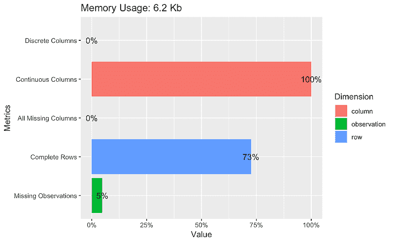
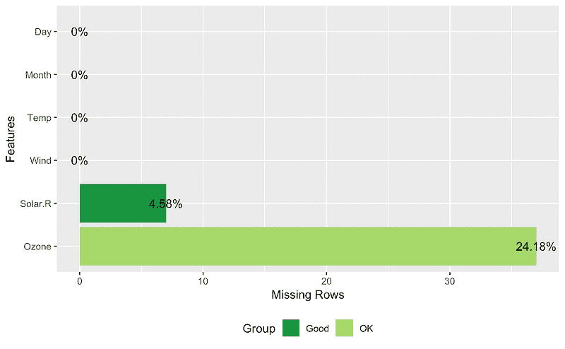
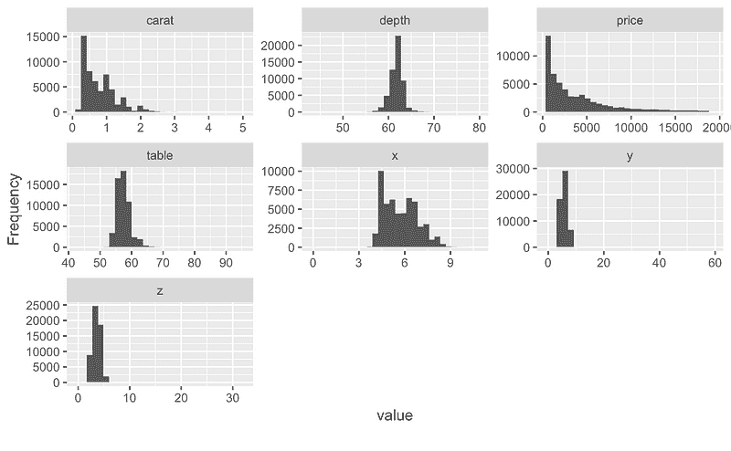
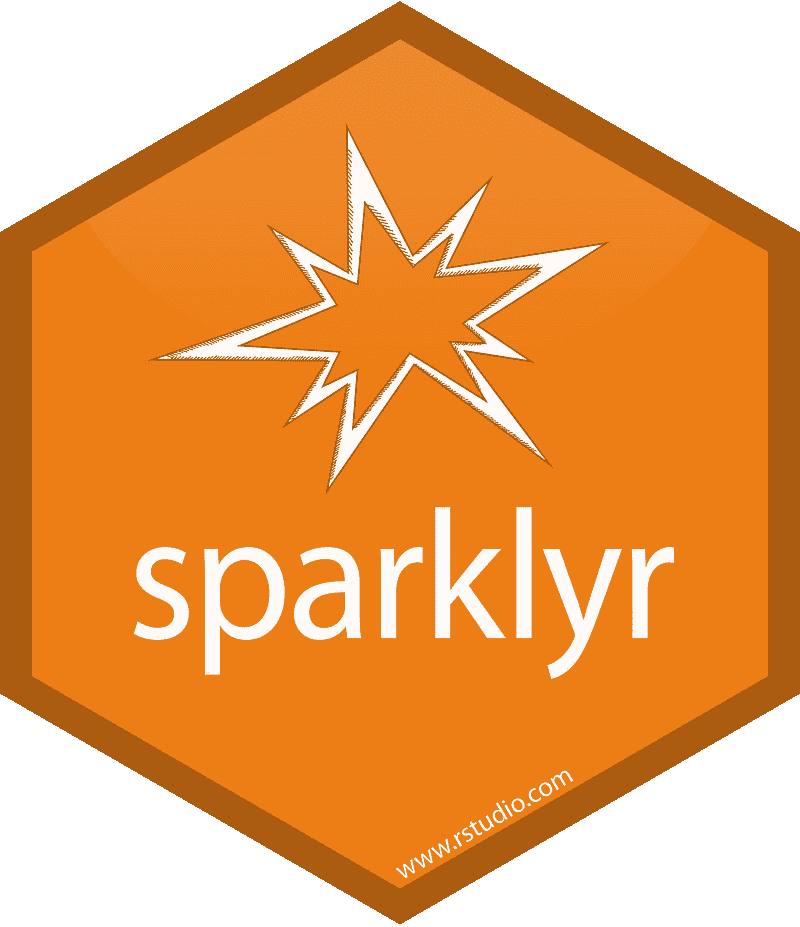
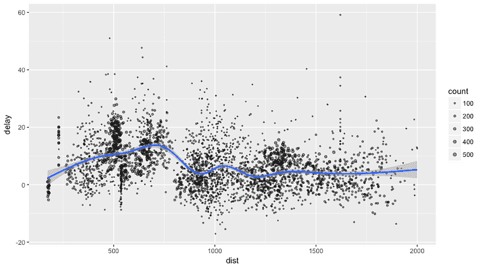
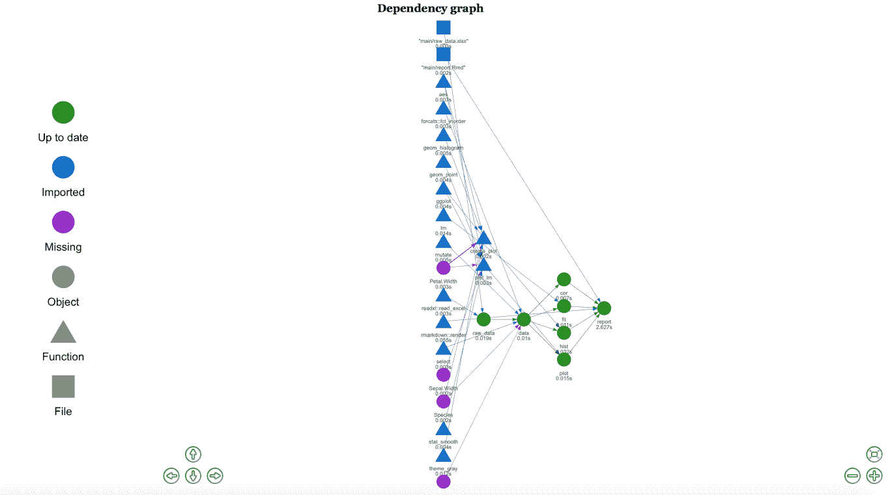
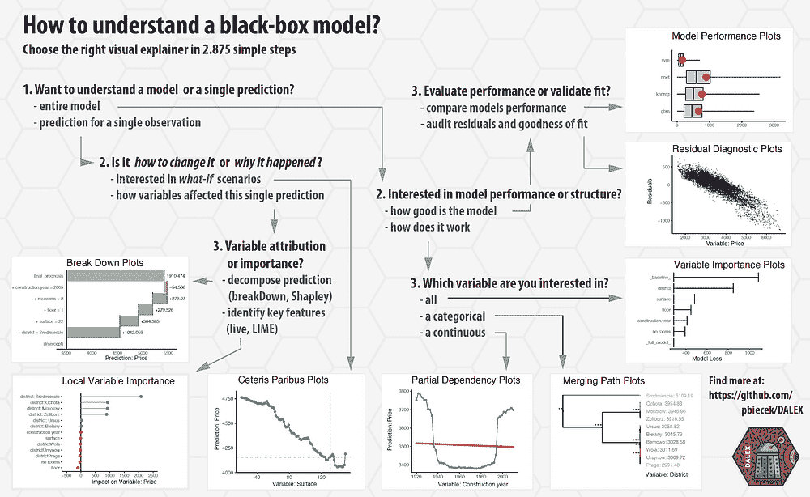
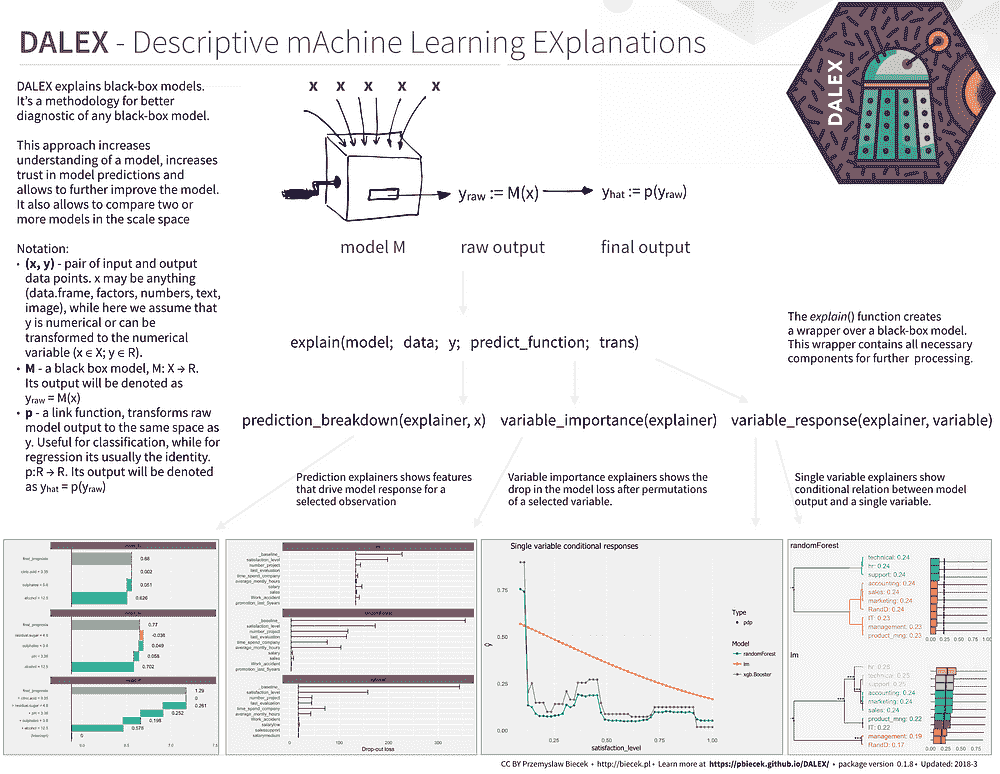

# 2018 年数据科学和人工智能的 7 大 R 包

> 原文：[`www.kdnuggets.com/2019/01/vazquez-2018-top-7-r-packages.html/2`](https://www.kdnuggets.com/2019/01/vazquez-2018-top-7-r-packages.html/2)

 评论

### **4\. DataExplorer — 自动化数据探索和处理**


[`github.com/boxuancui/DataExplorer`](https://github.com/boxuancui/DataExplorer)

[探索性数据分析 (EDA)](https://en.wikipedia.org/wiki/Exploratory_data_analysis) 是数据分析/预测建模的初步和重要阶段。在此过程中，分析师/建模者将首先查看数据，从而生成相关假设并决定下一步。然而，EDA 过程有时可能会很麻烦。这个 [R](https://cran.r-project.org/) 包旨在自动化大多数数据处理和可视化工作，以便用户可以专注于研究数据并提取洞见。

* * *

## 我们的前三名课程推荐

 1\. [Google 网络安全证书](https://www.kdnuggets.com/google-cybersecurity) - 快速进入网络安全职业生涯。

 2\. [Google 数据分析专业证书](https://www.kdnuggets.com/google-data-analytics) - 提升你的数据分析能力

 3\. [Google IT 支持专业证书](https://www.kdnuggets.com/google-itsupport) - 支持你的组织的 IT

* * *

**安装**

该包可以直接从 CRAN 安装。

```py
install.packages("DataExplorer")
```

**使用方法**

使用该包你可以创建如下报告、图表和表格：

```py
## Plot basic description for airquality data
plot_intro(airquality)
```



```py
## View missing value distribution for airquality data
plot_missing(airquality)
```



```py
## Left: frequency distribution of all discrete variables
plot_bar(diamonds)
## Right: `price` distribution of all discrete variables
plot_bar(diamonds, with = "price")
```


```py
## View histogram of all continuous variables
plot_histogram(diamonds)
```



你可以在该包的官方网站上找到更多类似的内容：

[**自动化数据探索和处理**

*自动化数据探索过程用于分析任务和预测建模，以便用户可以专注于…*boxuancui.github.io](https://boxuancui.github.io/DataExplorer/)

在这个小册子中：

[**DataExplorer 介绍**

*本文件介绍了 DataExplorer 包，并展示了它如何帮助你完成不同的任务…*boxuancui.github.io](https://boxuancui.github.io/DataExplorer/articles/dataexplorer-intro.html)

### **3\. Sparklyr — Apache Spark 的 R 接口**



[`github.com/rstudio/sparklyr`](https://github.com/rstudio/sparklyr)

Sparklyr 使你能够：

+   从 R 连接到 [Spark](http://spark.apache.org/)。sparklyr 包提供了一个

    完成 [dplyr](https://github.com/hadley/dplyr) 后端。

+   过滤和聚合 Spark 数据集，然后将其带入 R 进行

    分析和可视化。

+   使用 Spark 的分布式[machine learning](http://spark.apache.org/docs/latest/mllib-guide.html)库从 R 中访问。

+   创建[扩展](http://spark.rstudio.com/extensions.html)来调用完整的 Spark API 并提供

    与 Spark 包的接口。

**安装**

你可以按照以下方式从 CRAN 安装 Sparklyr 包：

```py
install.packages("sparklyr")
```

你还应该安装一个本地版本的 Spark 以便于开发：

```py
library(sparklyr)
spark_install(version = "2.3.1")
```

**使用**

使用 Spark 的第一步始终是创建上下文并连接到本地或远程集群。

在这里，我们将通过[spark_connect](http://spark.rstudio.com/reference/sparklyr/latest/spark_connect.html)函数连接到 Spark 的本地实例：

```py
library(sparklyr)
sc <- spark_connect(master = "local")
```

**将 sparklyr 与 dplyr 和 ggplot2 结合使用**

我们将通过将一些数据集从 R 复制到 Spark 集群开始（请注意，您可能需要安装 nycflights13 和 Lahman 包以执行此代码）：

```py
install.packages(c("nycflights13", "Lahman"))

library(dplyr)
iris_tbl <- copy_to(sc, iris)
flights_tbl <- copy_to(sc, nycflights13::flights, "flights")
batting_tbl <- copy_to(sc, Lahman::Batting, "batting")
src_tbls(sc)

## [1] "batting" "flights" "iris"
```

首先，这里有一个简单的过滤示例：

```py
# filter by departure delay and print the first few records
flights_tbl %>% filter(dep_delay == 2)

## # Source:   lazy query [?? x 19]
## # Database: spark_connection
##     year month   day dep_time sched_dep_time dep_delay arr_time
##    <int> <int> <int>    <int>          <int>     <dbl>    <int>
##  1  2013     1     1      517            515         2      830
##  2  2013     1     1      542            540         2      923
##  3  2013     1     1      702            700         2     1058
##  4  2013     1     1      715            713         2      911
##  5  2013     1     1      752            750         2     1025
##  6  2013     1     1      917            915         2     1206
##  7  2013     1     1      932            930         2     1219
##  8  2013     1     1     1028           1026         2     1350
##  9  2013     1     1     1042           1040         2     1325
## 10  2013     1     1     1231           1229         2     1523
## # ... with more rows, and 12 more variables: sched_arr_time <int>,
## #   arr_delay <dbl>, carrier <chr>, flight <int>, tailnum <chr>,
## #   origin <chr>, dest <chr>, air_time <dbl>, distance <dbl>, hour <dbl>,
## #   minute <dbl>, time_hour <dttm>
```

让我们绘制飞行延迟的数据：

```py
delay <- flights_tbl %>% 
  group_by(tailnum) %>%
  summarise(count = n(), dist = mean(distance), delay = mean(arr_delay)) %>%
  filter(count > 20, dist < 2000, !is.na(delay)) %>%
  collect

# plot delays
library(ggplot2)
ggplot(delay, aes(dist, delay)) +
  geom_point(aes(size = count), alpha = 1/2) +
  geom_smooth() +
  scale_size_area(max_size = 2)

## `geom_smooth()` using method = 'gam'
```



**使用 Sparklyr 进行机器学习**

你可以通过 Sparklyr 中的[machine learning](http://spark.apache.org/docs/latest/mllib-guide.html)函数在 Spark 集群中编排机器学习算法。这些函数连接到建立在 DataFrames 之上的高层 API，帮助你创建和调整机器学习工作流程。

这里是一个示例，我们使用[ml_linear_regression](http://spark.rstudio.com/reference/sparklyr/latest/ml_linear_regression.html)来拟合一个线性回归模型。我们将使用内置的`mtcars`数据集来查看是否可以根据汽车的重量(`wt`)和引擎的气缸数(`cyl`)预测汽车的燃油消耗(`mpg`)。我们将假设`mpg`与每个特征之间的关系是线性的。

```py
*# copy mtcars into spark*
mtcars_tbl <- copy_to(sc, mtcars)

*# transform our data set, and then partition into 'training', 'test'*
partitions <- mtcars_tbl %>%
  filter(hp >= 100) %>%
  mutate(cyl8 = cyl == 8) %>%
  sdf_partition(training = 0.5, test = 0.5, seed = 1099)

*# fit a linear model to the training dataset*
fit <- partitions$training %>%
  ml_linear_regression(response = "mpg", features = c("wt", "cyl"))
fit

## Call: ml_linear_regression.tbl_spark(., response = "mpg", features = c("wt", "cyl"))  
## 
## Formula: mpg ~ wt + cyl
## 
## Coefficients:
## (Intercept)          wt         cyl 
##   33.499452   -2.818463   -0.923187
```

对于 Spark 生成的线性回归模型，我们可以使用`summary()`来了解我们的拟合质量以及每个预测变量的统计显著性。

```py
summary(fit)

## Call: ml_linear_regression.tbl_spark(., response = "mpg", features = c("wt", "cyl"))  
## 
## Deviance Residuals:
##    Min     1Q Median     3Q    Max 
## -1.752 -1.134 -0.499  1.296  2.282 
## 
## Coefficients:
## (Intercept)          wt         cyl 
##   33.499452   -2.818463   -0.923187 
## 
## R-Squared: 0.8274
## Root Mean Squared Error: 1.422
```

Spark 机器学习支持广泛的算法和特征变换，如上所示，使用 dplyr 管道轻松地将这些函数串联在一起。

在这里了解更多关于使用 sparklyr 进行机器学习的信息：

[**sparklyr**

*一个 R 接口到 Spark*spark.rstudio.com](http://spark.rstudio.com/mlib/)

更多关于该包和示例的信息请查看这里：

[**sparklyr**

*一个 R 接口到 Spark*spark.rstudio.com](http://spark.rstudio.com/)

### **2. Drake — 一个专注于 R 的可重复性和高性能计算的管道工具包**


Drake 编程

不，开玩笑的。其实这个包的名字是`drake`！


[`github.com/ropensci/drake`](https://github.com/ropensci/drake)

这是一个非常棒的包。我会创建一个单独的帖子来详细介绍它，所以敬请期待！


`Drake` 是一个作为通用工作流管理器的包，用于数据驱动的任务。当其依赖项发生变化时，它会重新构建中间数据对象，并在结果已经最新时跳过工作。

此外，并非每次运行都从头开始，已完成的工作流有可触及的可重复性证据。

可重复性、良好的管理和实验跟踪对于轻松测试他人的工作和分析都是必要的。这在数据科学中非常重要，你可以在这里阅读更多内容：

来自 [Zach Scott](https://medium.com/@zbohannan):

[**数据科学的可重复性危机**

*什么是数据科学中的可重复性，为什么我们应该关心它？*towardsdatascience.com](https://towardsdatascience.com/data-sciences-reproducibility-crisis-b87792d88513)

[**迈向可重复性：平衡隐私与公开**

*在数据安全与研究公开之间，是否可能存在一个恰到好处的选项？*towardsdatascience.com](https://towardsdatascience.com/toward-reproducibility-balancing-privacy-and-publication-77fee2366eee)

以及我写的一篇文章 :)

[**用 MLflow 管理你的机器学习生命周期——第一部分。**

*可重复性、良好的管理和实验跟踪对于轻松测试他人的工作以及…*towardsdatascience.com](https://towardsdatascience.com/manage-your-machine-learning-lifecycle-with-mlflow-part-1-a7252c859f72)

使用 `drake`，你可以自动

1.  启动自上次以来发生变化的部分。

1.  跳过其余部分。

**安装**

```py
*# Install the latest stable release from CRAN.*
install.packages("drake")

*# Alternatively, install the development version from GitHub.*
install.packages("devtools")
library(devtools)
install_github("ropensci/drake")
```

安装自 CRAN 时存在一些已知错误。有关这些错误的更多信息，请访问：

[***drake R 包用户手册***](https://ropenscilabs.github.io/drake-manual/index.html#installation)

我遇到了一些错误，因此建议您现在从 GitHub 安装该包。

好的，让我们用一个小变化来重现一个简单的示例：

我在 `drake` 的主要示例中添加了一个简单的图形来查看线性模型。使用这段代码，你正在为执行整个项目创建一个计划。

首先，我们读取数据。然后我们为分析做好准备，创建一个简单的直方图，计算相关性，拟合模型，绘制线性模型，最后创建一个 `rmarkdown` 报告。

我用于最终报告的代码在这里：

如果我们更改了一些函数或分析，当我们执行计划时， `drake` 会知道发生了什么变化，并且只会运行这些变化。它会创建一个图形，以便你可以看到发生了什么：



分析图

在 Rstudio 中，这个图形是交互式的，你可以将其保存为 HTML 以便后续分析。

还有更多了不起的功能，你可以用 `drake` 做到，我会在未来的帖子中展示 :)

### **1\. DALEX——描述性机器学习解释**


[`github.com/pbiecek/DALEX`](https://github.com/pbiecek/DALEX)

解释机器学习模型并不总是容易的。然而，对于各种商业应用来说，这一点非常重要。幸运的是，有一些很棒的库可以帮助我们完成这项任务。例如：

[**thomasp85/lime**]

*lime——局部可解释的模型无关解释（原始 Python 包的 R 版）*github.com](https://github.com/thomasp85/lime)

(顺便说一下，有时候一个简单的 `ggplot` 可视化可以帮助你解释模型。有关更多信息，请查看下面由 [Matthew Mayo](https://medium.com/@mattmayo13) 撰写的精彩文章)

[**机器学习模型解释：概述**]

*关于机器学习解释的文章出现在 O’Reilly 的博客上，时间在三月，由 Patrick Hall、Wen…*www.kdnuggets.com](/2017/11/interpreting-machine-learning-models-overview.html)

在许多应用中，我们需要知道、理解或证明输入变量如何在模型中使用，以及它们如何影响最终的模型预测。`DALEX` 是一组工具，帮助解释复杂模型的工作原理。

从 CRAN 安装，只需运行：

```py
install.packages("DALEX")
```

他们有关于如何与不同的 ML 包一起使用 DALEX 的精彩文档：

+   [如何与 caret 一起使用 DALEX](https://rawgithub.com/pbiecek/DALEX_docs/master/vignettes/DALEX_caret.html)

+   [如何与 mlr 一起使用 DALEX](https://rawgithub.com/pbiecek/DALEX_docs/master/vignettes/DALEX_mlr.html)

+   [如何与 H2O 一起使用 DALEX](https://rawgit.com/pbiecek/DALEX_docs/master/vignettes/DALEX_h2o.html)

+   [如何与 xgboost 包一起使用 DALEX](https://rawgithub.com/pbiecek/DALEX_docs/master/vignettes/DALEX_and_xgboost.html)

+   [如何用于教学的 DALEX。第一部分](https://rawgithub.com/pbiecek/DALEX_docs/master/vignettes/DALEX_teaching.html)

+   [如何用于教学的 DALEX。第二部分](https://rawgit.com/pbiecek/DALEX_docs/master/examples/What%20they%20have%20learned%20-%20part%202.html)

+   [breakDown 与 lime 与 shapleyR](https://rawgit.com/pbiecek/DALEX_docs/master/vignettes/Comparison_between_breakdown%2C_lime%2C_shapley.html)

极好的备忘单：



[`github.com/pbiecek/DALEX`](https://github.com/pbiecek/DALEX)

[`github.com/pbiecek/DALEX`](https://github.com/pbiecek/DALEX)

这里有一个互动笔记本，你可以在其中了解更多关于这个包的信息：

[**Binder（测试版）**]

*编辑描述*mybinder.org](https://mybinder.org/v2/gh/pbiecek/DALEX_docs/master?filepath=jupyter-notebooks%2FDALEX.ipynb)

最后，一些书籍风格的 `DALEX`、机器学习和解释性文档：

[**DALEX：描述性机器学习解释**]

*不要相信黑箱模型。除非它能自我解释。*pbiecek.github.io](https://pbiecek.github.io/DALEX_docs/)

在原始仓库中查看：

[**pbiecek/DALEX**]

*DALEX——描述性机器学习解释*github.com](https://github.com/pbiecek/DALEX)

并记得给它加星星 :)

感谢[Ciencia y Datos](http://www.cienciaydatos.org/)团队的出色帮助，提供了这些摘要。

也感谢你阅读这篇文章。我希望你在这里找到了一些有趣的内容 :）。如果这些文章对你有帮助，请与朋友分享！

如果你有问题，可以在 Twitter 上关注我：

[**法维奥·瓦斯克斯 (@FavioVaz) | Twitter**](https://twitter.com/faviovaz)

*Favio Vázquez（@FavioVaz）的最新推文。数据科学家。物理学家和计算工程师。我有一个……* [twitter.com](https://twitter.com/faviovaz)

以及 LinkedIn：

[**法维奥·瓦斯克斯 — 创始人 — Ciencia y Datos | LinkedIn**](https://www.linkedin.com/in/faviovazquez/)

*查看法维奥·瓦斯克斯在 LinkedIn 上的资料，世界上最大的专业社区。法维奥在他们的……* [www.linkedin.com](https://www.linkedin.com/in/faviovazquez/)

希望在那里见到你 :)

**简历：[法维奥·瓦斯克斯](https://www.linkedin.com/in/faviovazquez/)** 是一名物理学家和计算机工程师，致力于数据科学和计算宇宙学。他对科学、哲学、编程和音乐充满热情。他是 Ciencia y Datos 的创始人，这是一个西班牙语的数据科学出版物。他热衷于迎接新挑战，与优秀的团队合作，并解决有趣的问题。他参与了 Apache Spark 的合作，帮助开发 MLlib、Core 和文档。他喜欢将自己的知识和专业技能应用于科学、数据分析、可视化和自动学习，以帮助世界变得更美好。

[原文](https://heartbeat.fritz.ai/top-7-libraries-and-packages-of-the-year-for-data-science-and-ai-python-r-6b7cca2bf000)。经许可转载。

**相关：**

+   2018 年数据科学和 AI 的 7 个顶级 Python 库

+   2018 年数据科学的 20 个顶级 R 库

+   我们最喜欢的 5 个免费可视化工具

### 更多相关内容

+   [2023 年必须了解的顶级数据 Python 包](https://www.kdnuggets.com/2023/01/top-data-python-packages-know-2023.html)

+   [3 个用于数据可视化的 Julia 包](https://www.kdnuggets.com/2023/02/3-julia-packages-data-visualization.html)

+   [5 个用于地理空间数据分析的 Python 包](https://www.kdnuggets.com/2023/08/5-python-packages-geospatial-data-analysis.html)

+   [2022 年及以后顶级 AI 和数据科学工具与技术](https://www.kdnuggets.com/2022/03/nvidia-0317-top-ai-data-science-tools-techniques-2022-beyond.html)

+   [KDnuggets™ 新闻 22:n03, 1 月 19 日: 深入了解 13 个数据……](https://www.kdnuggets.com/2022/n03.html)

+   [KDnuggets 新闻，12 月 7 日：揭开数据科学的十大误区 • 4……](https://www.kdnuggets.com/2022/n47.html)
