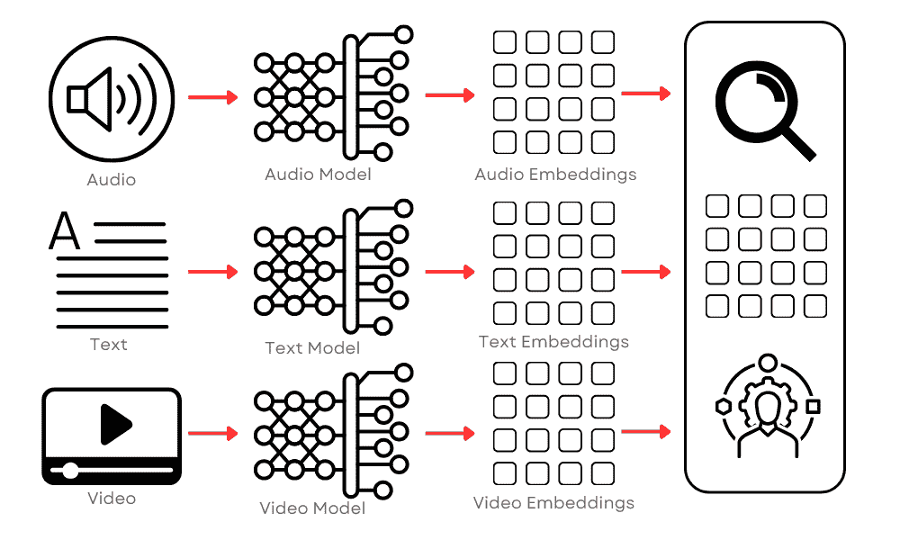
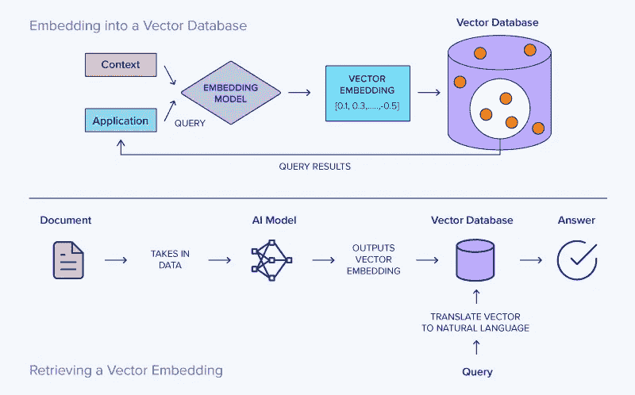
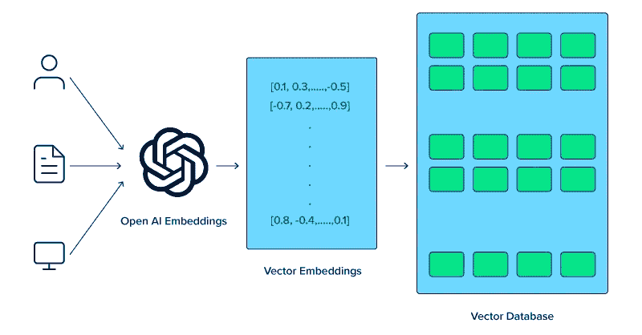
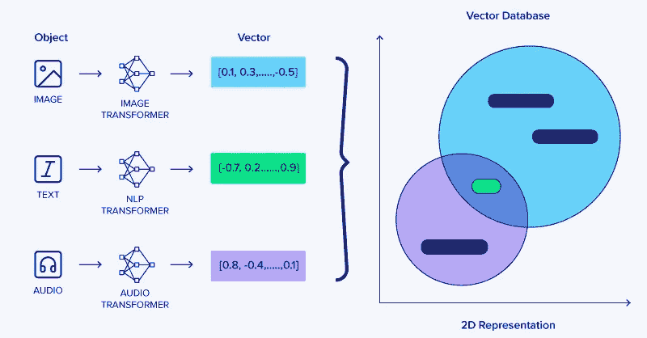

# 向量数据库用于 LLMs、生成式 AI 和深度学习

> 原文：[`www.kdnuggets.com/vector-database-for-llms-generative-ai-and-deep-learning`](https://www.kdnuggets.com/vector-database-for-llms-generative-ai-and-deep-learning)

图片来源：编辑

# 理解向量数据库

* * *

## 我们的前三大课程推荐

 1\. [谷歌网络安全证书](https://www.kdnuggets.com/google-cybersecurity) - 快速进入网络安全职业轨道。

 2\. [谷歌数据分析专业证书](https://www.kdnuggets.com/google-data-analytics) - 提升你的数据分析能力

 3\. [谷歌 IT 支持专业证书](https://www.kdnuggets.com/google-itsupport) - 支持你组织的 IT 需求

* * *

向量数据库是一种专门设计用于存储和管理向量数据的数据库，通过任意但相关的坐标来关联数据。与处理标量数据（如数字、字符串或日期）的传统数据库不同，向量数据库经过优化以处理高维数据点。但首先我们必须谈谈向量嵌入。

向量嵌入是一种在自然语言处理（NLP）中使用的方法，将单词表示为低维空间中的向量。这种技术简化了模型如 Word2Vec、GloVe 或 BERT 处理的复杂数据。这些现实世界的嵌入非常复杂，通常具有数百维，捕捉单词的细微属性。

那么我们如何在 AI 和深度学习等领域受益于向量呢？向量数据库通过提供高效和可扩展的解决方案来存储、搜索和检索高维数据，为机器学习和 AI 领域带来了显著的好处。

数据库使用数学运算，如距离度量，来高效地搜索、检索和操作向量。这种组织方式使得数据库能够通过比较向量中的数值，快速找到和分析相似或相关的数据点。因此，向量数据库非常适合用于类似性搜索等应用，目标是识别和检索与给定查询向量紧密相关的数据点。这在图像识别、自然语言处理和推荐系统等应用中尤为有用。

最初，这个过程涉及将一些文本存储在指定的向量数据库中。接收到的文本会使用选择的 AI 模型转换为向量形式。接下来，创建的向量将被存储在向量数据库中。

当发出搜索提示时，它也会被转换为向量以进行比较。系统然后识别出相似度最高的向量并返回它们。最后，这些向量会被翻译回自然语言并呈现给用户作为搜索结果。

# 向量数据库与大型语言模型（LLMs）

向量数据库与如 GPT-4 这样的大型语言模型（LLMs）的集成彻底改变了 AI 系统理解和生成自然语言的方式。LLMs 能够进行深度上下文分析的能力是这些模型在广泛数据集上进行训练的结果，使它们能够掌握语言的细微差别，包括习语表达、复杂的句子结构，甚至文化细微差别。

这些模型可以通过将词语、句子和更大的文本段落转换为高维向量嵌入来实现这一点，这些向量表示的不仅仅是文本，还封装了文本中的上下文和语义关系，从而使 LLMs 能够更好地理解更复杂的思想和情况。

向量数据库在管理这些复杂向量方面起着关键作用。它们存储和索引高维数据，使得大型语言模型（LLMs）能够高效地检索和处理信息。这一能力对于语义搜索应用尤为重要，在这些应用中，目标是理解和回应自然语言查询，提供基于属性相似度的结果，而不仅仅是关键词匹配。

大型语言模型（LLMs）使用这些向量来关联词语和思想，反映了人类对语言的理解。例如，LLMs 可以识别同义词、隐喻，甚至文化参考，这些语言关系被表示为数据库中的向量。这些向量在数据库中的相对位置可以指示它们所代表的思想或词语的接近程度，使模型能够进行智能关联和推断。这些数据库中存储的向量不仅表示字面文本，还表示相关的思想、概念和上下文关系。这种安排允许对语言进行更细致和复杂的理解。

此外，用户可以将冗长的文档分割成多个向量，并使用一种称为检索增强生成（Retrieval Augmented Generation, RAG）的技术自动将它们存储在向量数据库中。检索增强生成（RAG）是一种自然语言处理和人工智能领域的技术，通过引入外部知识检索步骤来增强文本生成过程。这种方法对于创建产生更具信息性、准确性和上下文相关性的响应的 AI 模型特别有用。

这种方法在解决传统 LLMs 的一个关键局限性方面至关重要——它们依赖于在初始训练阶段获得的固定数据集，这些数据集随着时间的推移可能会变得过时或缺乏具体细节。

# 向量数据库在生成型 AI 中的作用

继续讨论，生成型 AI 是 LLMs 和向量数据库的重要应用。生成型 AI 涵盖了如图像生成、音乐创作和文本生成等技术，这些技术的显著进步部分得益于向量数据库的有效使用。

向量数据库在提高生成型 AI 系统能力方面也起着关键作用，通过高效管理其所需和产生的复杂数据。专用的变换器对于将图像、音频和文本等各种对象转换为其对应的综合向量表示至关重要。

在类似 LLMs 的生成型 AI 应用中，高效分类和检索内容的能力至关重要。例如，在图像生成中，向量数据库可以存储图像的特征向量。这些向量表示图像的关键特征，如颜色、纹理或风格。当生成模型需要创建新图像时，它可以参考这些向量，以找到并使用类似的现有图像作为灵感或背景。这个过程有助于创建更准确和具有上下文相关性的生成内容。

向量数据库与 LLMs 的集成促进了更多创新的应用，例如跨模态 AI 任务。在这些任务中，将两个不同的向量实体匹配在一起进行 AI 任务。这包括将文本描述转换为图像或反之的任务，其中理解和转换不同类型的向量表示是关键。

向量数据库在处理生成型 AI 系统中的用户交互数据方面也发挥了重要作用。通过将用户的偏好、行为或响应编码为向量，这些数据库使生成模型能够根据每个用户量身定制其输出。

在音乐推荐系统中，例如，用户交互如播放的歌曲、跳过的曲目以及每首歌的播放时间被转换为向量。这些向量随后告知 AI 用户的音乐品味，使其能够推荐更可能引起用户共鸣的歌曲。随着用户偏好的变化，向量数据库不断更新向量表示，使 AI 能够保持与这些变化同步。这种动态适应是保持个性化 AI 应用相关性和有效性的关键。

# 结论

向量数据库代表了数据管理技术的一次重大飞跃，特别是在其对 AI 和机器学习的应用中。通过高效处理高维向量，这些数据库已成为先进 AI 系统操作和开发中的重要组成部分，包括 LLMs、生成型 AI 和深度学习。

它们存储、管理和快速检索复杂数据结构的能力不仅提升了这些系统的性能，还在 AI 应用中开辟了新可能。从 LLMs 中的语义搜索到深度学习中的特征提取，向量数据库是现代 AI 最激动人心的进展的核心。随着 AI 继续在复杂性和能力上增长，向量数据库的重要性只会增加，巩固了它们作为 AI 和机器学习未来关键组成部分的地位。

[原文](https://www.exxactcorp.com/blog/deep-learning/vector-database-for-llms-generative-ai-and-deep-learning)。已获得许可转载。

**[Kevin Vu](https://blog.exxactcorp.com/)** 管理着 [Exxact Corp 博客](https://blog.exxactcorp.com/)，并与许多才华横溢的作者合作，他们撰写关于深度学习不同方面的内容。

### 更多相关内容

+   [Python 向量数据库和向量索引：LLM 应用架构](https://www.kdnuggets.com/2023/08/python-vector-databases-vector-indexes-architecting-llm-apps.html)

+   [什么是向量数据库，它们为何对 LLMs 至关重要？](https://www.kdnuggets.com/2023/06/vector-databases-important-llms.html)

+   [生成式 AI 实验室：与 Camel-5b 和 Open LLaMA 3B 一起探索 LLMs…](https://www.kdnuggets.com/2024/02/intel-generative-ai-playground-llms-with-camel-5b-and-open-llama-3b)

+   [KDnuggets 新闻，9 月 21 日：7 个机器学习投资组合项目…](https://www.kdnuggets.com/2022/n37.html)

+   [AI 和 LLM 使用案例中的向量数据库](https://www.kdnuggets.com/vector-databases-in-ai-and-llm-use-cases)

+   [使用 NumPy Linalg Norm 的向量和矩阵范数](https://www.kdnuggets.com/2023/05/vector-matrix-norms-numpy-linalg-norm.html)
