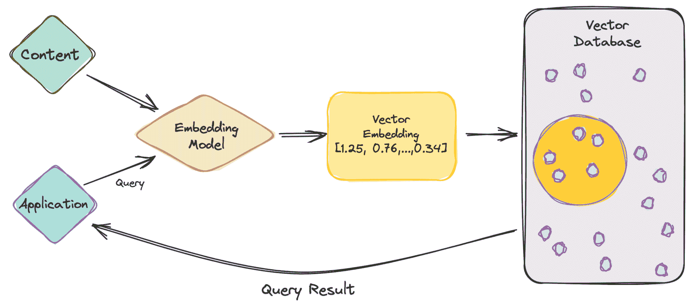
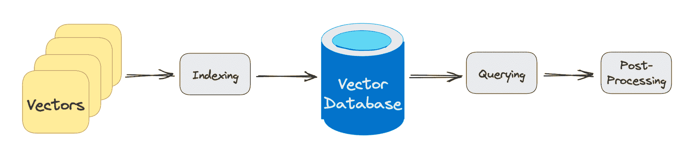

# 什么是向量数据库，它们为什么对大语言模型重要？

> 原文：[`www.kdnuggets.com/2023/06/vector-databases-important-llms.html`](https://www.kdnuggets.com/2023/06/vector-databases-important-llms.html)

图片由编辑提供

当你在 Twitter、LinkedIn 或新闻源上浏览时间线时 - 你可能会看到关于聊天机器人、大语言模型和 GPT 的一些内容。很多人都在谈论大语言模型，因为每周都有新的模型发布。

* * *

## 我们的前三大课程推荐

 1\. [谷歌网络安全证书](https://www.kdnuggets.com/google-cybersecurity) - 快速开启网络安全职业生涯

 2\. [谷歌数据分析专业证书](https://www.kdnuggets.com/google-data-analytics) - 提升你的数据分析技能

 3\. [谷歌 IT 支持专业证书](https://www.kdnuggets.com/google-itsupport) - 支持你所在的组织的 IT

* * *

由于我们目前生活在 AI 革命中，重要的是要理解许多新应用依赖于向量嵌入。因此，让我们深入了解向量数据库以及它们为什么对大语言模型如此重要。

# 什么是向量数据库？

首先定义一下向量嵌入。**向量嵌入**是一种数据表示方式，它携带语义信息，帮助人工智能系统更好地理解数据，同时能够保持长期记忆。无论你在尝试学习什么新的内容，重要的元素就是理解主题并记住它。

**嵌入**是由 AI 模型生成的，例如包含大量特征的 LLM，这使得它们的表示难以管理。嵌入表示数据的不同维度，帮助 AI 模型理解不同的关系、模式和隐藏结构。

使用传统标量数据库进行向量嵌入是一项挑战，因为它无法处理或跟上数据的规模和复杂性。考虑到向量嵌入的复杂性，你可以想象它需要的专用数据库。这就是向量数据库发挥作用的地方。

**向量数据库**为向量嵌入的独特结构提供了优化的存储和查询能力。它们通过比较值和找到彼此之间的相似性，提供了便捷的搜索、高性能、可扩展性和数据检索。

听起来很不错，对吧？确实有解决向量嵌入复杂结构的方法。是的，但也不完全是。向量数据库的实施非常困难。

直到现在，向量数据库仅被那些不仅能够开发它们而且还能管理它们的科技巨头使用。向量数据库成本高，因此确保它们得到正确校准以提供高性能是非常重要的。

## 向量数据库是如何工作的？

现在我们对向量嵌入和数据库有了一些了解，让我们深入了解它是如何工作的。

作者提供的图片

让我们从一个简单的例子开始，涉及像 ChatGPT 这样的 LLM。该模型具有大量的数据和内容，并为我们提供了 ChatGPT 应用程序。

那么，让我们逐步了解一下。

1.  作为用户，你会将查询输入到应用程序中。

1.  你的查询随后被插入到嵌入模型中，该模型根据我们想要索引的内容创建向量嵌入。

1.  然后，向量嵌入会根据嵌入所基于的内容移动到向量数据库中。

1.  向量数据库生成输出并将其作为查询结果发送回用户。

当用户继续进行查询时，它会经过相同的嵌入模型，以创建嵌入来查询该数据库以获取类似的向量嵌入。向量嵌入之间的相似性基于创建嵌入的原始内容。

想了解更多关于它在向量数据库中如何工作的内容吗？让我们进一步学习。

作者提供的图片

传统数据库通过在行和列中存储字符串、数字等进行工作。当从传统数据库中查询时，我们是查询与我们的查询匹配的行。然而，向量数据库处理的是向量而非字符串等。向量数据库还应用了相似性度量，用于帮助找到与查询最相似的向量。

向量数据库由不同的算法组成，这些算法都有助于近似最近邻（ANN）搜索。这通过哈希、基于图的搜索或量化实现，这些算法被组装成一个管道，以检索查询向量的邻居。

结果基于查询的接近程度或近似程度，因此主要考虑的元素是准确性和速度。如果查询输出较慢，则结果的准确性越高。

向量数据库查询经过的三个主要阶段是：

**1\. 索引**

如上述示例所解释，一旦向量嵌入移动到向量数据库，它将使用各种算法将向量嵌入映射到数据结构中，以便更快地进行搜索。

**2\. 查询**

在完成搜索后，向量数据库将查询的向量与索引中的向量进行比较，应用相似性度量以找到最近的邻居。

**3\. 后处理**

根据你使用的向量数据库，该数据库将对最终的最近邻进行后处理，以生成对查询的最终输出。也可能会对最近邻进行重新排序，以便将来参考。

# 总结

随着人工智能的不断发展和每周发布的新系统，向量数据库的增长发挥了重要作用。向量数据库使公司能够通过准确的相似性搜索更有效地互动，为用户提供更好、更快的输出。

所以，下次你在 ChatGPT 或 Google Bard 中输入查询时，想想它处理查询以输出结果的过程。

**[尼莎·阿里亚](https://www.linkedin.com/in/nisha-arya-ahmed/)** 是一名数据科学家、自由技术作家及 KDnuggets 的社区经理。她特别感兴趣于提供数据科学职业建议或教程及数据科学的理论知识。她还希望探索人工智能如何有助于人类寿命的延续。作为一个热心学习者，她寻求拓宽自己的技术知识和写作技能，同时帮助指导他人。

### 更多相关话题

+   [Python 向量数据库和向量索引：构建 LLM 应用](https://www.kdnuggets.com/2023/08/python-vector-databases-vector-indexes-architecting-llm-apps.html)

+   [你的特征重要吗？这并不意味着它们是好的](https://www.kdnuggets.com/your-features-are-important-it-doesnt-mean-they-are-good)

+   [AI 和 LLM 用例中的向量数据库](https://www.kdnuggets.com/vector-databases-in-ai-and-llm-use-cases)

+   [Pinecone 向量数据库的全面指南](https://www.kdnuggets.com/a-comprehensive-guide-to-pinecone-vector-databases)

+   [开源向量数据库的诚实比较](https://www.kdnuggets.com/an-honest-comparison-of-open-source-vector-databases)

+   [利用向量数据库的语义搜索](https://www.kdnuggets.com/semantic-search-with-vector-databases)
