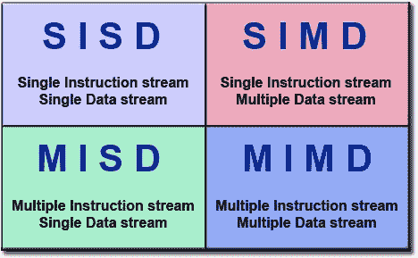

# 矢量化的随机数生成器真的有用吗？

> 原文：[`www.kdnuggets.com/2018/08/vectorized-random-number-generators-actually-useful.html`](https://www.kdnuggets.com/2018/08/vectorized-random-number-generators-actually-useful.html)

 评论

**作者：丹尼尔·勒梅尔，魁北克大学**



我们的处理器受益于“SIMD”指令。这些指令可以同时操作多个值，从而大大加速某些算法。早些时候，我报告过，你可以通过使用 SIMD 指令将常见（快速）随机数生成器如 PCG 和 xorshift128+ 的速度提高三到四倍。

一位读者挑战我：这在实际中真的有用吗？

在一些问题中，随机数生成对性能至关重要。例如，许多模拟场景就属于这种情况。最简单且最为人知的可能就是数组的随机打乱。标准算法相当简单：

```py
for (i = size; i > 1; i--) {
  var j = random_number(i);
  switch_values(array, i, j);
}

```

[如果你感兴趣，O’Neill 写了一整篇关于这个特定问题的博客文章](http://www.pcg-random.org/posts/bounded-rands.html)。

那么我能否使用 SIMD 指令加速数组的打乱？

因此，我快速组合了一个矢量化打乱算法和一个常规（标量）打乱算法，它们都使用了 O’Neill 的 PCG32。最终结果？当数组在缓存中时，我使用 SIMD 指令几乎将速度翻倍：

| SIMD 打乱 | 每个条目 3.5 个周期 |
| --- | --- |
| 标量打乱 | 每个条目 6.6 个周期 |

[我的代码可以在这里找到](https://github.com/lemire/Code-used-on-Daniel-Lemire-s-blog/tree/master/2018/07/23)。我并没有做任何复杂的操作，所以我预计可以做得更好。我的唯一目标是演示 SIMD 随机数生成器的实际应用性。

**个人简介： [丹尼尔·勒梅尔](http://lemire.me/blog/)** 是魁北克大学的计算机科学教授。他的研究集中在软件性能和索引方面。他是一个技术乐观主义者。

[原文](https://lemire.me/blog/2018/07/23/are-vectorized-random-number-generators-actually-useful/)。经许可转载。

**相关：**

+   随机性的惊人复杂性

+   2026 年人工智能中的常识…

+   深度学习是万能钥匙吗？

* * *

## 我们的三大课程推荐

 1\. [Google 网络安全证书](https://www.kdnuggets.com/google-cybersecurity) - 快速进入网络安全职业生涯。

 2\. [Google 数据分析专业证书](https://www.kdnuggets.com/google-data-analytics) - 提升你的数据分析技能

 3\. [Google IT 支持专业证书](https://www.kdnuggets.com/google-itsupport) - 支持组织的信息技术需求

* * *

### 了解更多相关主题

+   [Python 生成器入门](https://www.kdnuggets.com/2023/02/getting-started-python-generators.html)

+   [初级机器学习工程师实际需要了解什么才能获得聘用？](https://www.kdnuggets.com/what-junior-ml-engineers-actually-need-to-know-to-get-hired)

+   [真正免费的课程：人工智能与机器学习版](https://www.kdnuggets.com/free-courses-that-are-actually-free-ai-ml-edition)

+   [随机森林与决策树：主要区别](https://www.kdnuggets.com/2022/02/random-forest-decision-tree-key-differences.html)

+   [随机森林算法是否需要标准化？](https://www.kdnuggets.com/2022/07/random-forest-algorithm-need-normalization.html)

+   [决策树与随机森林解析](https://www.kdnuggets.com/2022/08/decision-trees-random-forests-explained.html)
