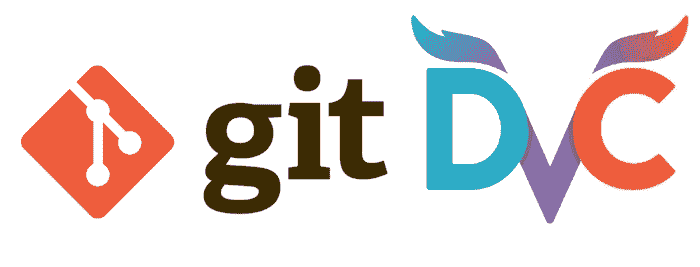
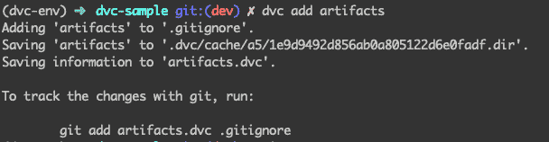
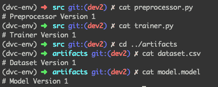
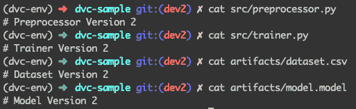
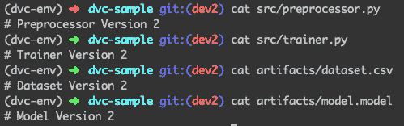
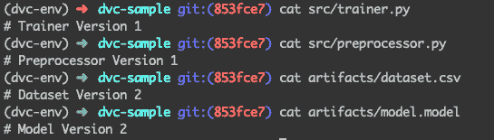
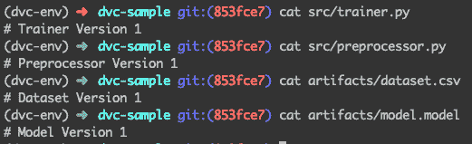

# 数据科学的版本控制：跟踪机器学习模型和数据集

> 原文：[`www.kdnuggets.com/2019/09/version-control-data-science-tracking-machine-learning-models-datasets.html`](https://www.kdnuggets.com/2019/09/version-control-data-science-tracking-machine-learning-models-datasets.html)

评论

**由 [Vipul Jain](https://www.linkedin.com/in/jnvipul/)，应用数据科学家**


* * *

## 我们的前三大课程推荐

 1\. [Google 网络安全证书](https://www.kdnuggets.com/google-cybersecurity) - 快速进入网络安全职业生涯。

 2\. [Google 数据分析专业证书](https://www.kdnuggets.com/google-data-analytics) - 提升你的数据分析能力

 3\. [Google IT 支持专业证书](https://www.kdnuggets.com/google-itsupport) - 支持你所在组织的 IT 需求

* * *

毋庸置疑，GIT 是版本控制系统的圣杯！Git 在版本控制源代码方面表现出色。但与软件工程不同，数据科学项目还有额外的大型文件，如数据集、训练模型文件、标签编码等，这些文件的大小很容易达到几 GB，因此无法使用 GIT 进行跟踪。

### 告诉我解决方案？

令人惊叹的一群人来自 [`dvc.org/`](https://dvc.org/) 创建了这个名为 `DVC` 的工具。DVC 帮助我们对大型数据文件进行版本控制，类似于我们使用 `git` 对源代码文件进行版本控制。同时，`DVC` 可以在 `GIT` 之上完美运行，使其更加出色！



> 大多数时候，数据科学工作流中忽略了数据集和模型的跟踪。现在有了 DVC，我们可以跟踪所有的工件——这将使数据科学家更高效，因为我们不必手动记录为了达到状态而做了什么，同时也不必在处理数据和构建模型以重现相同状态时浪费时间。


### DVC 的好处

+   轻松处理大型文件——使得重用和可重复性变得非常简单

+   与 Git 兼容——在 git 之上工作

+   存储无关——支持 GCS/S3/Azure 以及更多存储数据

### 让我们开始吧！

### 安装

安装非常简单，使用以下命令：

```py
pip install dvc
```

要验证安装，请在终端中输入 `dvc`，如果你看到一堆 DVC 命令选项，那么你就走在正确的道路上了。

在演示中，我将使用 [dvc-sample](https://github.com/jnvipul/dvc-sample) 仓库，项目结构如下：

```py
dvc-sample
├── artifacts
│ ├── dataset.csv
│ └── model.model
└── src
 ├── preprocessor.py
 └── trainer.py
```

该仓库具有简单的结构；有一个 `src` 文件夹，其中包含 Python 脚本（由 git 版本控制），以及一个 `artifacts` 文件夹，其中包含所有数据集、模型文件和其他较大的 artifacts（需要由 `dvc` 进行控制）。

### 初始化 dvc

我们首先需要在项目根目录中初始化 `dvc`。我们使用下面的命令完成：

```py
dvc init
```

（这与 `git init` 非常相似，我们只需在设置项目时做一次）

此时，我们已经将 dvc 支持添加到项目中。但我们仍然需要指定我们想用 `dvc` 进行版本控制的文件夹。在这个例子中，我们将对 `artifacts` 文件夹进行版本控制。我们使用下面的命令来完成：

```py
dvc add artifacts
```

上述声明做了两件事 -：

1.  使用 `dvc` 指定我们要跟踪的文件夹

    （创建一个元文件 `artifacts.dvc`）

1.  将相同的文件夹添加到 `.gitignore`

    （因为我们不再希望使用 git 跟踪该文件夹）

执行上述命令后，`dvc` 会告诉我们将上述两个文件添加到 `git`



现在我们使用下面的命令将这些文件添加到 git 中：

```py
git add .
git commit -m 'Added dvc files'
```

**注意**：这里需要注意的是：`artifacts` 文件夹的元文件由 `git` 跟踪，而实际的 artifacts 文件由 `dvc` 跟踪。在这种情况下，`artifacts.dvc` 由 git 跟踪，而 `artifacts` 文件夹中的内容由 dvc 跟踪。

如果现在这不太清楚也没关系，我们稍后会详细查看。

> 此时，我们已经将 `*dvc*` 添加到我们的项目中，并且还添加了我们想要用 dvc 跟踪的文件夹。

现在让我们看一下典型的机器学习工作流（简化版）：

1.  我们有一个数据集

1.  我们使用 Python 脚本对上述数据集进行一些预处理

1.  我们使用 Python 脚本训练一个模型

1.  我们有一个模型文件，这是步骤 #3 的输出

> 上述是一个重复的过程；由于我们使用多个数据集和不同的预处理管道来构建和测试各种机器学习模型，因此我们希望对其进行版本控制，以便在需要时轻松重现之前的版本。

对于上述场景，我们使用 `git` 跟踪 #2 和 #3，因为这些是较小的代码文件。而使用 `dvc` 跟踪 #1 和 #4，因为这些文件可能非常大（最多几 GB）

再次查看目录结构以获得更多清晰度：

```py
dvc-sample
├── artifacts
│ ├── dataset.csv     #1
│ └── model.model     #4   
└── src
 ├── preprocessor.py #2
 └── trainer.py       #3
```

> 为了简化起见，在任何给定时刻——上述 4 个文件中的每一个都将是它们所属的版本。

假设我们已经编写了第一个版本的预处理器和训练脚本，这些脚本用于在数据集上构建模型。现在这 4 个文件看起来是这样的：



版本 1 中文件的状态

### 跟踪大文件

现在我们需要提交我们的代码和 artifacts（数据集和模型文件），我们分三步完成：

1\. 我们使用 `dvc` 跟踪 `artifacts` 中的更改

```py
dvc add artifacts/
```

（这会跟踪工件文件夹内的最新版本文件，并修改`artifacts.dvc`元文件）

2\. 使用`git`跟踪代码脚本的更改和更新的元文件（artifacts.dvc）

```py
git add .
git commit -m 'Version 1: scripts and dvc files'
```

3\. 使用`git`将这个项目状态标记为`experiment01`

（这将帮助我们以后回滚到某个版本）

```py
git tag -a experiment01 -m 'experiment01'
```

我们已经成功使用`git`和`dvc`分别保存了版本 1 的脚本和工件。

现在假设我们正在进行一个新实验，其中包含不同的数据集和修改过的脚本。这 4 个文件现在看起来是这样的：



版本 2 时的文件状态

现在我们重复相同的 3 个步骤来跟踪版本 2。

1\. 使用`dvc`跟踪`artifacts`的更改

```py
dvc add artifacts/
```

2\. 使用`git`跟踪代码脚本的更改和更新的元文件（artifacts.dvc）

```py
git add .
git commit -m 'Version 2: scripts and dvc files'
```

3\. 使用`git`将这个项目状态标记为`experiment02`

```py
git tag -a experiment02 -m 'experiment02'
```

在这个阶段，我们已经跟踪了版本 2 的脚本和工件。

### 切换版本——重现代码和工件

现在真正的考验来了，是时候看看我们是否可以轻松跳转到两个文件夹中的任何一个版本了。首先——让我们看看项目的当前状态：



当前状态：版本 2

从文件内容可以看出，我们现在处于版本 2。

（我们查看内容以获得更好的直觉，在实际操作中，我们可以查看 git 提交消息或标签）

现在假设我们意识到版本 1 更好，我们想要回滚（脚本以及数据集和模型）到版本 1。让我们看看如何用几个简单的命令做到这一点：

1\. 我们签出到`experiment01`标签

```py
git checkout experiment01
```

执行以下命令后，项目状态看起来是这样的：



> 你注意到了什么吗？


参考：[`www.shutterstock.com`](https://www.shutterstock.com/)

你可以看到脚本已更改为版本 1。太好了！

但工件仍然是版本 2。没错！这是因为，到目前为止，我们使用了`git`进行回滚——这回滚了代码脚本和`artifacts.dvc`元文件的版本。现在，由于元文件已经回滚到我们想要的版本，我们只需要使用`dvc`进行签出

```py
dvc checkout
```

这将根据当前版本（v1）的`artifacts.dvc`文件更改`artifacts`文件夹中的文件。

再次查看文件：



所有文件回滚到版本 1

万岁！我们成功地将版本 2 回滚到版本 1——无论是脚本还是大型数据集和模型文件。


简单来说，我们仅仅看了如何在两个版本之间切换和工作。上述过程同样适用于几百个实验——使我们能够快速迭代而无需手动记录或担心在需要时重新生成早期实验的状态。

### 结论

DVC 是一个很好的工具，用于版本控制大型文件，如数据集和训练模型文件，正如我们使用 git 对源代码进行版本控制一样。它帮助我们实现不同 ML 实验的工件可重复性，节省了处理数据和构建模型的时间。

### 其他阅读

+   [Python 基础——类和对象](https://medium.com/@jnvipul/python-basics-classes-and-objects-e40cf4e77668)

+   [Python 基础——数据结构](https://blog.usejournal.com/python-basics-data-structures-d378d854df1b?source=post_page---------------------------)

+   [Python 基础——处理异常](https://blog.usejournal.com/road-to-become-a-python-ninja-handling-exceptions-afd600a762ec?source=post_page---------------------------)

+   [循环学习率——神经网络学习率设置的终极指南](https://towardsdatascience.com/cyclical-learning-rates-the-ultimate-guide-for-setting-learning-rates-for-neural-networks-3104e906f0ae)

+   [精确度、召回率和混淆矩阵的傻瓜指南](https://medium.com/swlh/idiots-guide-to-precision-recall-and-confusion-matrix-b32d36463556?source=post_page---------------------------)

+   [图像识别与物体检测——区别](https://medium.com/swlh/micro-learnings-image-classification-vs-object-detection-the-difference-77110b592343)

**简介： [Vipul Jain](https://www.linkedin.com/in/jnvipul/)** 是一名数据科学家，专注于机器学习，拥有从构思到生产的端到端数据产品构建经验。拥有在生产环境中构建 A/B 测试实验框架的经验。能够将技术概念有效地呈现给非技术利益相关者。

[原文](https://towardsdatascience.com/version-control-for-data-science-tracking-your-machine-learning-models-and-datasets-aaa61f20bb45)。经许可转载。

**相关：**

+   如何利用机器学习自动化 GitHub 上的任务以获取乐趣和利润

+   处理机器学习中数据不足的 5 种方法

+   处理小数据的 7 个技巧

### 更多相关内容

+   [机器学习实验版本管理与跟踪](https://www.kdnuggets.com/2021/12/versioning-machine-learning-experiments-tracking.html)

+   [机器学习实验跟踪的 7 个最佳工具](https://www.kdnuggets.com/2023/02/7-best-tools-machine-learning-experiment-tracking.html)

+   [制定分析跟踪的开放标准](https://www.kdnuggets.com/2022/07/developing-open-standard-analytics-tracking.html)

+   [Python 基础：语法、数据类型和控制结构](https://www.kdnuggets.com/python-basics-syntax-data-types-and-control-structures)

+   [Python 控制流备忘单](https://www.kdnuggets.com/2022/11/python-control-flow-cheatsheet.html)

+   [Nota AI 发布了 NetPresso 模型搜索的测试版，它的…](https://www.kdnuggets.com/2022/04/nota-ai-releases-beta-version-netpresso-model-search-hardwareaware-automl-tool.html)
