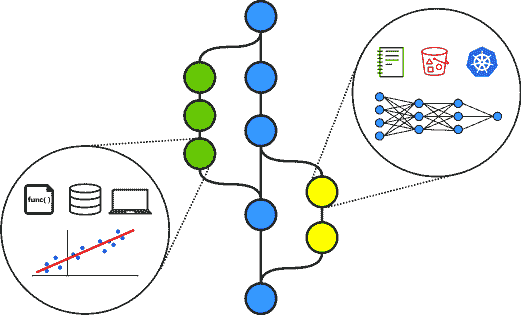
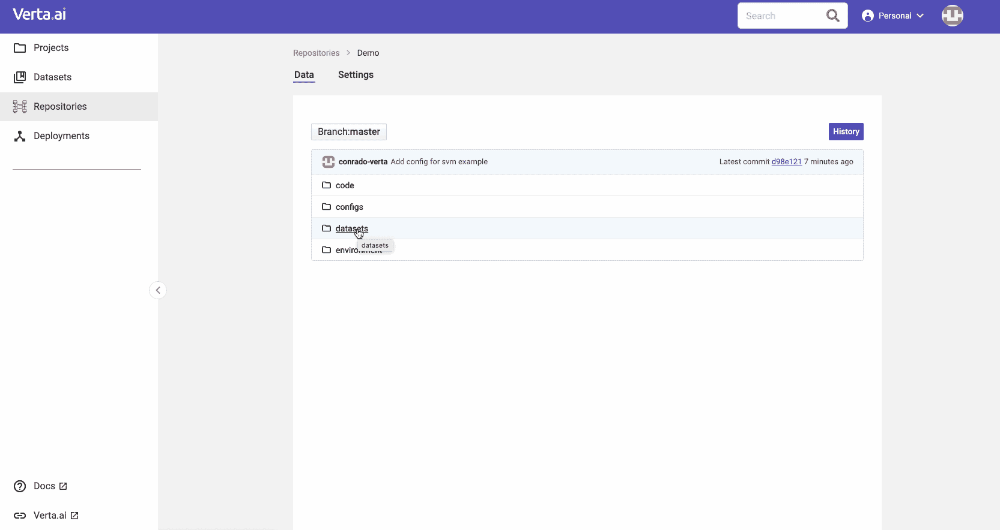
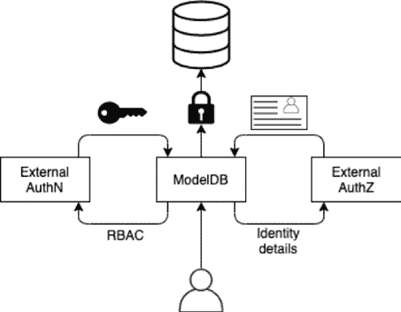
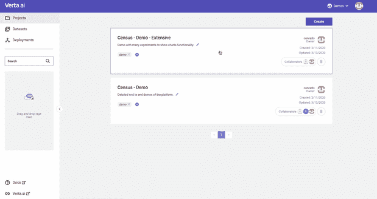
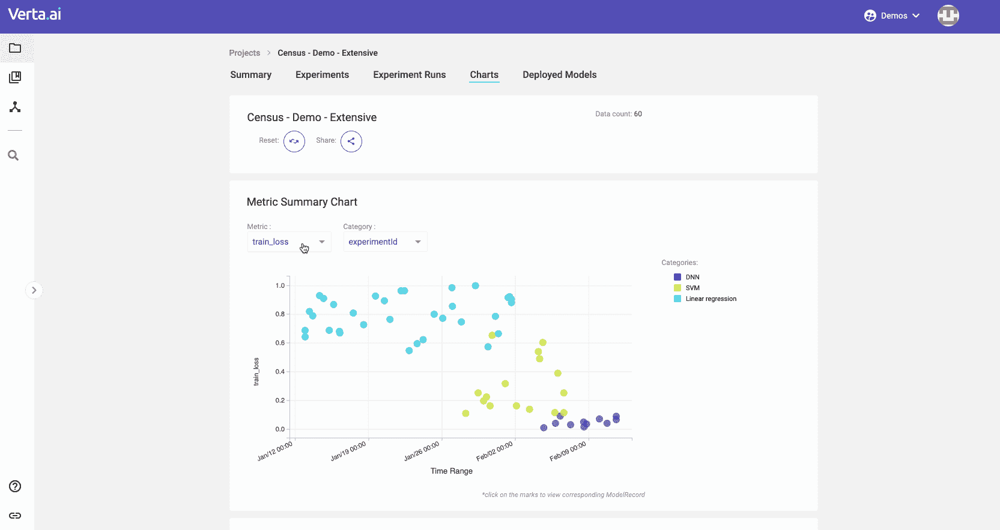

# ModelDB 2.0 已经到来！

> 原文：[`www.kdnuggets.com/2020/03/verta-modeldb-20.html`](https://www.kdnuggets.com/2020/03/verta-modeldb-20.html)

赞助帖子。

自从我们编写 ModelDB 1.0 这一开创性的模型版本管理系统以来，我们学到了很多，并且适应不断发展的生态系统成为一项挑战。因此，我们决定从头开始重建，以支持一个量身定制的模型版本管理系统，使机器学习的开发和部署变得可靠、安全和可重复。

我们很高兴地宣布 ModelDB 2.0 [现已发布](https://github.com/VertaAI/modeldb)! 感谢所有启发并帮助设计、测试和验证此次发布的合作伙伴。

在详细介绍此重大版本之前，让我们快速查看 ModelDB 2.0 的新特性：

+   **基于 API 的分层客户端**，允许轻松扩展功能并与框架集成

+   **与流行的机器学习框架集成**，如 pytorch、scikit-learn、tensorflow 等

+   **工件管理** 以可靠地跟踪训练过程的结果

+   **基于 Git 的版本控制** 用于模型的所有组件

+   **为公司模型开发提供单一视图**

+   **用户管理支持** 用于身份验证、RBAC 授权和工作区隔离

### 模型版本管理

当我们最初创建 ModelDB 1.0 时，我们仅追踪有关模型的元数据。然而，与许多组织（包括受监管行业及其他领域）合作，将其模型投入实际使用后，我们发现这还不够。尽管元数据非常详尽，但它不能让你回到模型的特定状态。比如，仅靠元数据，你无法回到三个月前模型创建时的确切状态。因此，我们基于 Git 的灵感，构建了新的模型版本管理解决方案，以管理创建模型的所有要素：**数据集、代码、环境和配置**。

通过新的版本管理功能，你可以：

+   **对模型的所有组件进行版本控制**，如 Python 或 Docker 环境、S3 数据集、笔记本代码和超参数集合。机器学习具有多样性，没有单一工具能解决所有问题。你还可以使用标准企业工具（Java 和数据库）轻松扩展现有类型以满足你的需求。

+   **集成不同的版本管理解决方案**，如 Git、数据库、对象存储、容器库以及许多其他隔离源。使用适合管理每个模型要素的工具，我们将帮助你跟踪所有这些要素的变化。我们还为那些没有原生版本管理系统的提供版本管理系统。

+   **像 Git 一样或像 API 一样使用**，这允许与 GitOps 和笔记本生态系统之间的任何东西集成。你可以使用我们的客户端来操作你关心的对象，而不必担心基于磁盘系统的限制。但你也可以在 ModelDB 和你的本地 Git 之间进行同步。

+   **提交、回滚、分支、比较和合并** 仓库中的任何更改，就像你对 Git 一样。专门的工具可以操作模型的组成部分，通过嵌入应用知识而不是仅仅假设所有内容都是文本，从而使体验更加顺畅。享受 GitOps 的所有好处，而无需直接操作 Git，获得真正的 MLOps 体验！

我们将发布一系列关于版本创建幕后工作的博客文章。 [订阅](https://www.verta.ai/newsletter)我们的新闻通讯，以便不错过它们！

### 安全实验管理

ModelDB 1.0 能够存储模型信息，但不支持身份验证和授权。这些都是确保数据安全的关键功能，尤其是对于企业。因此，在 ModelDB 2.0 中，我们现在终于添加了必要的接口，使你可以准确知道谁做了什么以及何时做的，确保只有授权用户可以访问。这也将使用户能够为不同团队隔离实验集。

新版本使你能够：

+   **通过 RBAC 控制访问** 实验，定义谁可以执行操作。API 是公开的，任何人都可以根据自己的使用案例实现它们。ModelDB 将根据其知道的资源管理角色的创建，并检查每个用户操作的权限。你还可以利用我们的企业版提供的完全集成的解决方案！我们有团队和组织的用户管理，还可以与不同的身份验证系统集成。

+   **使用工作区** 来进行隔离，为环境之间提供完全的隔离。你可以用它来区分开发和生产模型，甚至可以在团队之间进行隔离。

+   **识别** 模型、版本更改及任何其他组件的作者。了解团队中谁可以协助解决问题，或者谁是联系模型的最佳人选。时刻了解组织中的人员情况。

我们还将分享我们 RBAC 系统背后的设计原则，这些原则通过分析最佳实践得出解决方案。 [订阅](https://www.verta.ai/newsletter)我们的新闻通讯，以便在它们发布时收到通知！

### 集中化仪表盘

ModelDB 中一个用户最喜欢的功能是网页体验，它允许他们全面查看他们所做的实验。在这个新版本中，我们更加注重通过我们的用户界面构建出色的用户体验，以帮助我们的用户更轻松地浏览他们的模型。

使用 ModelDB 2.0，你可以：

+   **组织你的工作**，利用项目、实验、运行、标签、描述以及任何你需要的东西来导航多个开发前沿，确保不会丢失任何内容。

+   **搜索和筛选** 模型以找到你需要的。我们可以根据运行的任何特征进行筛选，包括指标和超参数。你可以使用我们的用户界面或客户端对找到的模型进行迭代。

+   **管理输入和输出** 模型过程中的数据，将输入保存到我们的版本控制中。我们提供专门的输出类型用于指标、观察和一些类型的工件。你也可以将任何二进制文件作为工件保存，我们将为你在对象或文件存储系统中管理存储。

+   **分析图表** 以了解所有模型的表现。我们提供最先进的分析工具，帮助你和你的团队理解最佳的努力方向。

+   **比较不同版本** 的模型，以了解哪些发生了变化以及如何影响质量。只需存储开发过程中所有的信息，并了解项目在多个迭代中的演变。

如果你想更好地利用你和你的团队所做的所有建模工作，报名参加我们的 [即将到来的网络研讨会](https://info.verta.ai/modeldb-v2-walkthrough?__hstc=53819695.6c42b0f6aa1ebe7e32e83908771f1ec2.1584576927510.1584576927510.1584576927510.1&__hssc=53819695.1.1584576927511&__hsfp=2979428226)。我们将展示如何通过让你专注于建模来提高建模速度！

### 立即开始

我们提供了 [ModelDB 2.0](https://github.com/VertaAI/modeldb) 的多种格式：

+   Docker 容器

+   Helm 模板

+   AMIs

+   随你所想 :)

我们希望确保每个人都能迈出通向敏捷和稳健建模的第一步！查看我们的 [Git 仓库](https://github.com/VertaAI/modeldb) 或注册我们的 [SaaS 服务](https://verta.ai/)。我们很期待听到你的反馈，欢迎加入我们的 [Slack](http://bit.ly/modeldb-mlops)，讨论如何继续改进 ML 版本控制。

附言：我们正在招聘。如果这个领域让你兴奋，请告诉我们！

### 关于 Verta：

[Verta.ai](https://verta.ai/) 构建了一个完整的机器学习模型生命周期的软件，涵盖了从模型版本控制到模型部署和监控，并通过协作功能将所有环节紧密联系在一起，让你的 AI 和 ML 团队能够快速推进而不出错。我们是 MIT CSAIL 的一个衍生公司，开发了 [ModelDB](https://github.com/mitdbg/modeldb)，这是第一个开源模型管理系统之一。

* * *

## 我们的三大课程推荐

 1\. [Google 网络安全证书](https://www.kdnuggets.com/google-cybersecurity) - 加速你的网络安全职业生涯。

 2\. [Google 数据分析专业证书](https://www.kdnuggets.com/google-data-analytics) - 提升你的数据分析能力

 3\. [Google IT 支持专业证书](https://www.kdnuggets.com/google-itsupport) - 支持你所在组织的 IT 需求

* * *

### 了解更多相关话题

+   [这些是我用来每月赚取$10,000 的 AI 工具和技能](https://www.kdnuggets.com/2023/07/ai-tools-along-skills-make-10000-monthly-bs.html)

+   [无法找到数据科学工作？这就是原因](https://www.kdnuggets.com/2022/01/unable-land-data-science-job.html)

+   [KDnuggets™ 新闻 22:n05, 2 月 2 日: 精通机器学习的 7 个步骤…](https://www.kdnuggets.com/2022/n05.html)

+   [数据科学被高估了，这就是原因](https://www.kdnuggets.com/2022/06/data-science-overrated.html)

+   [人工智能不是来取代我们的](https://www.kdnuggets.com/2023/02/ai-replace-us.html)

+   [我每天使用 ChatGPT 5 个月。这些是一些隐藏的宝石…](https://www.kdnuggets.com/2023/07/used-chatgpt-every-day-5-months-hidden-gems-change-life.html)
