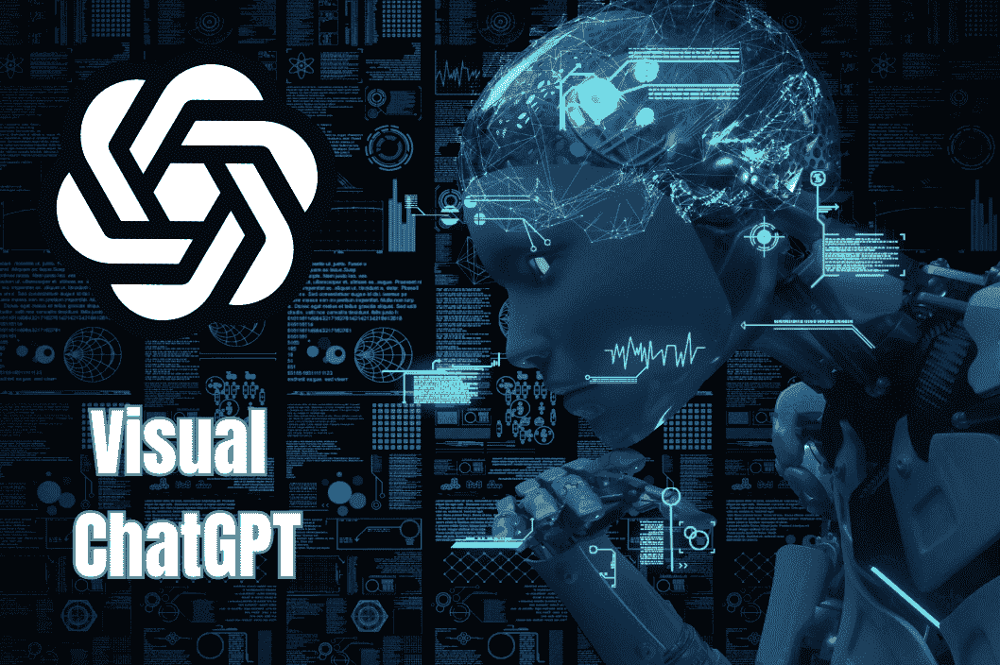
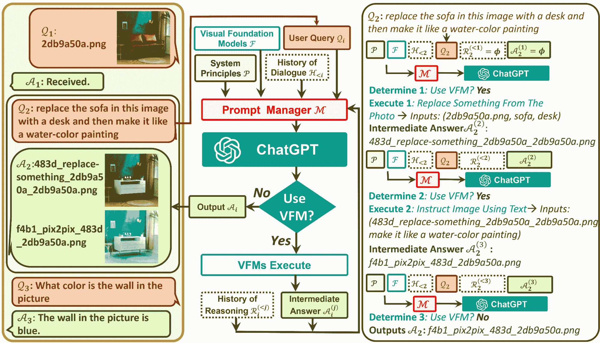
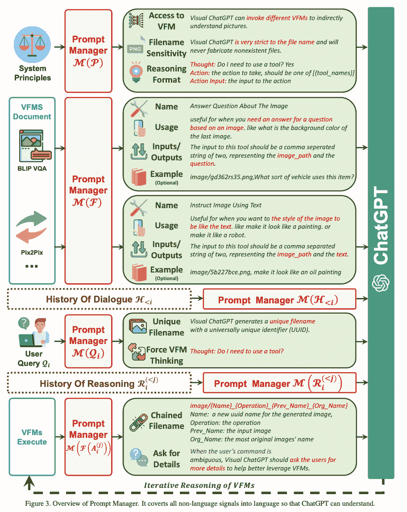

# Visual ChatGPT：微软结合 ChatGPT 和 VFM

> 原文：[`www.kdnuggets.com/2023/03/visual-chatgpt-microsoft-combine-chatgpt-vfms.html`](https://www.kdnuggets.com/2023/03/visual-chatgpt-microsoft-combine-chatgpt-vfms.html)



图片由作者提供

当我们以为已经消化了足够多的大型语言模型（LLMs）新闻时，微软亚洲研究院团队带来了 Visual ChatGPT。Visual ChatGPT 克服了 ChatGPT 无法处理视觉信息的现有限制，因为它只训练了一种语言模式。

* * *

## 我们的前三大课程推荐

 1\. [谷歌网络安全证书](https://www.kdnuggets.com/google-cybersecurity) - 快速进入网络安全职业道路。

 2\. [谷歌数据分析专业证书](https://www.kdnuggets.com/google-data-analytics) - 提升你的数据分析技能

 3\. [谷歌 IT 支持专业证书](https://www.kdnuggets.com/google-itsupport) - 支持你的组织在 IT 领域

* * *

# 什么是 Visual ChatGPT？

Visual ChatGPT 是一个结合了 Visual Foundation Models（VFM）的系统，帮助 ChatGPT 更好地理解、生成和编辑视觉信息。VFM 能够指定输入输出格式，将视觉信息转换为语言格式，并处理 VFM 的历史记录、优先级和冲突。

因此，Visual ChatGPT 是一个 AI 模型，它在 ChatGPT 的限制与允许用户通过聊天沟通并生成视觉内容之间架起了桥梁。

## ChatGPT 的限制

ChatGPT 在过去几周和几个月里成为了大多数人的谈话话题。然而，由于其语言训练能力，它不允许处理和生成图像。

你有像 Visual Transformers 和 Steady Diffusion 这样的视觉基础模型，它们具有惊人的视觉能力。这就是语言和图像模型结合创造了 Visual ChatGPT 的地方。

## 什么是 Visual Foundation Models？

Visual Foundation Models 用于汇集计算机视觉中使用的基本算法。它们将标准计算机视觉技能转移到 AI 应用程序上，以处理更复杂的任务。

Visual ChatGPT 中的 Prompt Manager 包含 22 个 VFM，包括 Text-to-Image、ControlNet、Edge-To-Image 等。这帮助 ChatGPT 将图像的所有视觉信号转换为语言，以便 ChatGPT 更好地理解。那么 Visual ChatGPT 是如何工作的呢？

# Visual ChatGPT 是如何工作的？

Visual ChatGPT 由不同的组件组成，帮助大型语言模型 ChatGPT 理解视觉信息。

## Visual ChatGPT 的架构组件

+   **用户查询**：这是用户提交查询的地方

+   **提示管理器**：这将用户的视觉查询转换为语言格式，以便 ChatGPT 模型可以理解。

+   **视觉基础模型**：这结合了各种 VFMs，如 BLIP（Bootstrapping Language-Image Pre-training）、稳定扩散、ControlNet、Pix2Pix 等。

+   **系统原则**：这提供了 Visual ChatGPT 的基本规则和要求。

+   **对话历史**：这是系统与用户的第一次交互和对话。

+   **推理历史**：这使用不同 VFMs 过去的推理来解决复杂的查询。

+   **中级回答**：利用 VFMs，模型将尝试输出几个具有逻辑理解的中级答案。



图片来自于 [微软 GitHub](https://github.com/microsoft/visual-chatgpt)

## 更多关于提示管理器的信息

你们中的一些人可能认为这是一种强制性的解决方法，用于让 ChatGPT 处理视觉内容，因为它仍然将图像的所有视觉信号转换为语言。当上传图像时，提示管理器会合成一个内部聊天记录，其中包含文件名等信息，以便 ChatGPT 更好地理解查询内容。

例如，用户输入图像的名称将作为操作历史记录，然后提示管理器将协助模型通过‘推理格式’来确定需要对图像进行的操作。你可以将其视为模型在 ChatGPT 选择正确的 VFM 操作之前的内部思考。

在下图中，你可以看到提示管理器如何为 Visual ChatGPT 启动规则：



图片来自于 [Visual ChatGPT：用视觉基础模型进行对话、绘图和编辑](https://arxiv.org/pdf/2303.04671.pdf)

# 开始使用 Visual ChatGPT

要开始你的 Visual ChatGPT 之旅，你需要先运行 Visual ChatGPT 演示：

```py
# create a new environment
conda create -n visgpt python=3.8

# activate the new environment
conda activate visgpt

#  prepare the basic environments
pip install -r requirement.txt

# download the visual foundation models
bash download.sh

# prepare your private openAI private key
export OPENAI_API_KEY={Your_Private_Openai_Key}

# create a folder to save images
mkdir ./image

# Start Visual ChatGPT !
python visual_chatgpt.py
```

你还可以在 [微软的 Visual ChatGPT GitHub](https://github.com/microsoft/visual-chatgpt) 上了解更多信息。确保查看他们对每个视觉基础模型的 GPU 内存使用情况。

# Visual ChatGPT 的应用案例

那么 Visual ChatGPT 能做什么呢？

## 图像生成

你可以要求 Visual ChatGPT 从零开始创建图像，提供描述。你的图像将在几秒钟内生成，具体取决于可用的计算能力。其基于稳定扩散的合成图像生成使用文本数据。

## 更改图像背景

再次使用稳定扩散，Visual ChatGPT 可以更改你输入图像的背景。用户可以提供任何背景更改的描述，稳定扩散模型将对图像的背景进行修复。

## 更改颜色图像及其他效果

你还可以根据提供给应用程序的描述来更改图像的颜色和应用效果。Visual ChatGPT 将使用各种预训练模型和 [OpenCV](https://opencv.org/about/)，来改变图像颜色、突出图像边缘等。

## 修改图像

Visual ChatGPT 允许你通过编辑和修改图像中的对象来删除或替换图像的某些方面，方法是向应用程序提供有针对性的文本描述。然而，值得注意的是，这一功能需要更多的计算能力。

# Visual ChatGPT 的局限性

众所周知，组织总会有一些不完美之处，需要不断改进以提升服务。

## 计算机视觉与大型语言模型的结合

Visual ChatGPT 在很大程度上依赖于 ChatGPT 和 VFMs，因此，这些单独方面的准确性和可靠性会影响 Visual ChatGPT 的性能。使用大型语言模型和计算机视觉的结合需要大量的提示工程，并且可能难以实现高效的性能。

## 隐私与安全

Visual ChatGPT 能够轻松地插拔 VFMs，这可能会让一些用户担心安全和隐私问题。微软需要进一步研究如何确保敏感数据不被泄露。

## 自我纠错模块

Visual ChatGPT 研究人员遇到的一个限制是由于 VFMs 的失败和提示的多样性导致生成结果不一致。因此，他们得出结论，需要开发一个自我纠错模块，以确保生成的输出与用户请求的内容一致，并能够进行必要的修正。

## 高量 GPU 需求

为了充分利用 Visual ChatGPT 并使用 22 个 VFMs，你需要大量的 GPU RAM，例如 A100\。根据任务的不同，确保你了解完成任务所需的 GPU 量。

# 总结

尽管 Visual ChatGPT 仍有其局限性，但这是在同时使用大型语言模型和计算机视觉方面的一项重大突破。如果你想了解更多关于 Visual ChatGPT 的信息，可以阅读这篇论文：[Visual ChatGPT: Talking, Drawing and Editing with Visual Foundation Models](https://arxiv.org/pdf/2303.04671.pdf)

Visual ChatGPT 是否类似于 ChatGPT4？如果你尝试过这两者，你的意见是什么？请在下面留言！

**[Nisha Arya](https://www.linkedin.com/in/nisha-arya-ahmed/)** 是一名数据科学家、自由技术写作者以及 KDnuggets 的社区经理。她特别感兴趣于提供数据科学职业建议或教程以及数据科学的理论知识。她还希望探索人工智能在延长人类生命方面的不同方式。她是一个渴望学习的人，寻求拓宽技术知识和写作技能，同时帮助指导他人。

### 更多相关话题

+   [SQL 中的 Group By 和 Partition By 场景：何时以及如何结合…](https://www.kdnuggets.com/sql-group-by-and-partition-by-scenarios-when-and-how-to-combine-data-in-data-science)

+   [数据科学中的基本数学：奇异值分解的可视化介绍](https://www.kdnuggets.com/2022/06/essential-math-data-science-visual-introduction-singular-value-decomposition.html)

+   [构建视觉搜索引擎 - 第一部分：数据探索](https://www.kdnuggets.com/2022/02/building-visual-search-engine-part-1.html)

+   [人工智能：大型语言和视觉模型](https://www.kdnuggets.com/2023/06/ai-large-language-visual-models.html)

+   [构建视觉搜索引擎 - 第二部分：搜索引擎](https://www.kdnuggets.com/2022/02/building-visual-search-engine-part-2.html)

+   [认识 Gorilla：UC Berkeley 和微软的 API 增强 LLM…](https://www.kdnuggets.com/2023/06/meet-gorilla-uc-berkeley-microsoft-apiaugmented-llm-outperforms-gpt4-chatgpt-claude.html)
