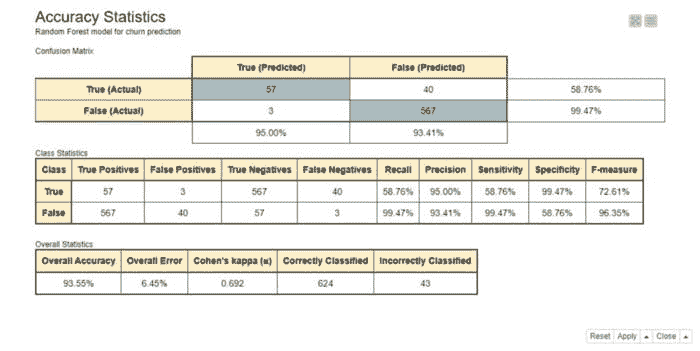
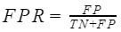
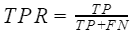
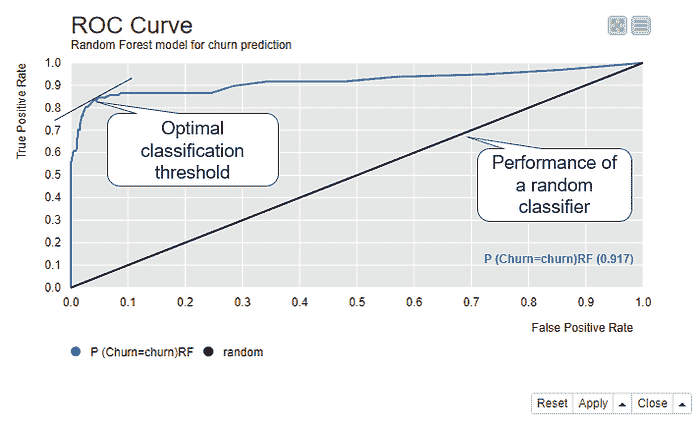
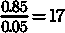
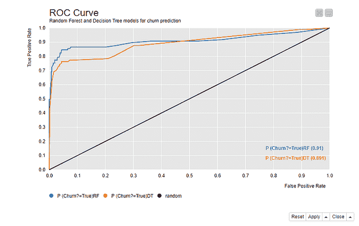
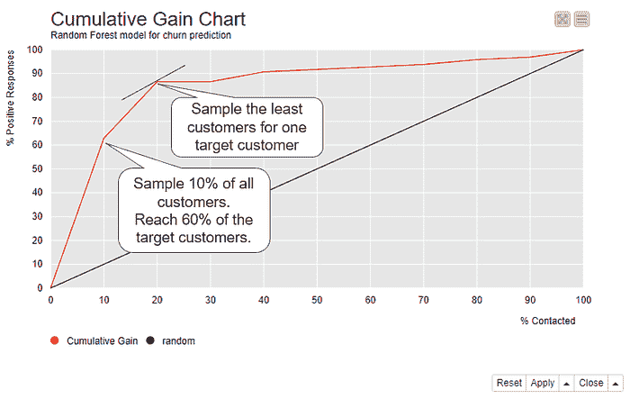
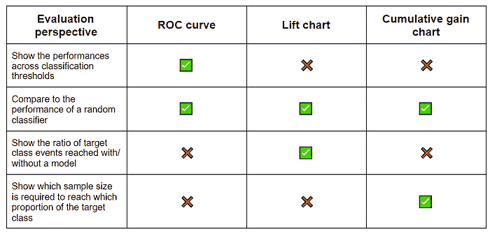
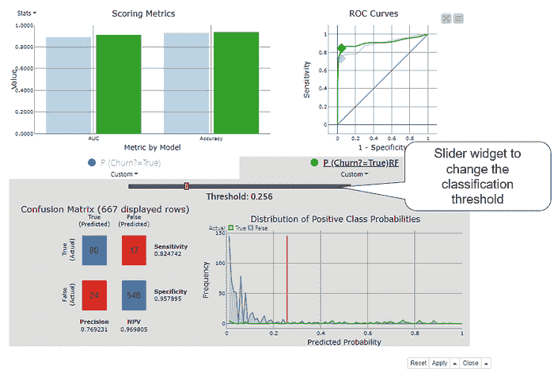
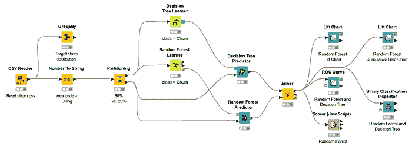

# 分类模型的可视化评分技术

> 原文：[`www.kdnuggets.com/2021/11/visual-scoring-techniques-classification-models.html`](https://www.kdnuggets.com/2021/11/visual-scoring-techniques-classification-models.html)

评论

**由 [Maarit Widmann](https://www.linkedin.com/in/maarit-widmann-02641a170/?originalSubdomain=de)，数据科学家，KNIME**

99%的准确性对于流失预测模型来说好吗？如果实际情况是 1%的客户流失，99%的客户未流失，那么模型的表现与随机猜测相当。如果 10%的客户流失，90%的客户未流失，那么模型的表现则优于随机猜测。

准确性统计信息，如总体准确性，量化了机器学习模型在新数据上的预期表现，没有任何基线，例如随机猜测或现有模型。

这就是为什么我们还需要**可视化模型评估**——或评分——技术，这些技术显示模型在更广泛背景下的表现：对于不同的分类阈值，相对于其他模型，以及从资源使用的角度。在本文中，我们解释了如何通过 ROC 曲线、提升图和累计增益图来评估分类模型，并提供了在 KNIME 工作流中实际实施的链接，“[分类模型的可视化评分技术](https://kni.me/w/jYRUKhGL_ScaKGhV)”。

## 用例：流失预测模型

我们将通过一个用于流失预测的随机森林模型（100 棵树）展示可视化模型评估技术的实用性。

我们使用的数据集包含 3333 个电信客户的数据，包括他们的合同数据和电话使用情况，数据可在[GitHub](https://github.com/albayraktaroglu/Datasets/blob/master/churn.csv)上获得。目标列“Churn?”显示客户是否流失（*True*）或未流失（*False*）。483 名客户（14%）流失，2850 名客户（86%）未流失。

模型的准确性统计信息如图 1 所示。

+   **总体准确性**大约为 94%，这意味着在测试数据中的每 100 个客户中，有 94 个获得了正确的类别预测，无论是流失 = *True* 还是流失 = *False*。

+   **敏感性**值在*True*类别大约为 59%。这意味着在每 10 个流失的客户（Churn=*True*）中，大约 6 个被正确预测为流失，而剩余的 4 个被错误预测为未流失。

+   **特异性**值在*True*类别大约为 99%，这表明几乎所有未流失的客户（Churn=*False*）都被正确分类。

图 1\. 混淆矩阵、类别统计信息以及随机森林模型在流失预测中的总体准确性统计信息。

## 比较不同分类阈值下的性能

准确率统计是基于实际和预测的目标类计算的。预测的类别，这里是*True*和*False*，是基于模型预测的类别概率（或得分），范围在 0 到 1 之间。在二分类问题中，模型输出两个概率，每个类一个。默认情况下，具有最高概率的类别决定了预测类别，在二分类问题中，这意味着概率超过 0.5 的类别被预测。然而，有时不同的分类阈值可能会导致更好的性能。如果是这种情况，我们可以在 ROC 曲线中发现它。

## ROC 曲线

一个[ROC 曲线](https://en.wikipedia.org/wiki/Receiver_operating_characteristic)（接收操作特征曲线）绘制了模型在不同分类阈值下的性能，使用两个指标：x 轴上的假阳性率和 y 轴上的真正率。

在二分类任务中，其中一个目标类被任意假定为正类，而另一个类成为负类。在我们的流失预测问题中，我们选择了*True*作为正类，*False*作为负类。

真阳性（TP）、假阴性（FN）、假阳性（FP）和真阴性（TN）的数量，如图 1 所示，用于计算假阳性率和真正率*。

+   **假阳性率**

衡量的是未流失的客户比例，但这些客户被错误地预测为流失。这等于*1-specificity*。

+   **真正率**

衡量的是流失客户的比例，以及这些客户被正确预测为流失。这等于*sensitivity*。

ROC 曲线底部左角的第一个点表示使用**最大阈值 1.0**获得的假阳性率（FPR）和真正率（TPR）。使用这个阈值，所有*P(Churn=True) > 1.0*的客户将被预测为流失，即没有客户被预测为流失，无论是正确还是错误，因此 FPR 和 TPR 都是 0.0。

ROC 曲线中的第二个点是通过降低阈值绘制的，例如降低 0.1。现在所有*P(Churn=True) > 0.9*的客户将被预测为流失。阈值仍然较高，但现在有可能一些客户会被预测为流失，因此产生小的非零 TPR 或 FPR 值。所以，这个点将在 ROC 曲线中接近上一个点的位置。

第三点是通过进一步降低阈值绘制的，依此类推，直到我们到达为**最小分类阈值 0.0**绘制的曲线的最后一点。使用这个阈值，**所有**客户都被分配到正类*True*，无论是否正确，因此 TPR 和 FPR 都是 1.0。

完美模型会产生 TPR=1.0 和 FPR=0.0\. 相反，随机分类器总是对正类做出相等数量的正确和错误预测，这对应于 FPR=TPR 的黑色对角线。每个 ROC 曲线中都报告了这条线，作为无用模型的参考。

请注意，模型的表现当然可能比随机猜测更差，但这可能是数据科学家的错误，而不是模型的错误！只需采用模型决策的相反方向即可实现表现更好的解决方案。

图 2 显示了一个 ROC 曲线，为随机森林模型绘制，用于流失预测。注意与随机猜测对应的黑色线。

图 2\. ROC 曲线显示了所有可能分类阈值从 0 到 1 的假阳性率（x 轴）和真实阳性率（y 轴）。

模型的最佳分类阈值应尽可能接近左上角——具有 TPR=1.0 和 FPR=0.0——这是完美模型占据的位置。这个最佳点与（0.0, 1.0）的切线最接近。使用这个最佳分类阈值，我们每个真实阳性的假阳性最少。我们的示例模型平均预测

当我们使用最佳分类阈值时，每个假阳性的真实阳性，如图 2 所示。

如果我们将这些数字与图 1 中的类别统计数据进行比较，我们可以看到，在优化分类阈值后，灵敏度从 59%显著提高到 85%，而特异性仅稍微降低，从 99%降到 1–0.05= 95%。

## 比较多个模型

ROC 曲线对于比较模型也很有用。让我们为相同的流失预测任务训练另一个模型——决策树，并将其表现与随机森林模型进行比较。

图 3 显示了同一视图中的两个 ROC 曲线。蓝色曲线是随机森林模型的，橙色曲线是决策树的。在这种情况下，更接近左上角的曲线，即随机森林模型的蓝色曲线，意味着表现更好。视图还显示了右下角两个模型的曲线下面积（AuC）统计数据。这测量了每个 ROC 曲线下的面积，并允许对性能进行更精细的比较。

图 3\. 两个模型的 ROC 曲线——一个随机森林模型和一个决策树模型——用于流失预测。离左上角更近且 AuC 统计量更大的模型表现更好。

## 使用模型节省资源

除了获得准确预测外，我们还可以通过模型节省资源。在我们的流失预测示例中，预测之后会有某种行动，而这些行动需要资源，例如减少收入或增加时间投入。模型可以帮助我们更高效地利用资源：接触更少的客户，但仍能触达更多可能流失的客户。

[提升和累计增益图](http://www2.cs.uregina.ca/~dbd/cs831/notes/lift_chart/lift_chart.html)对比了资源使用情况与正确预测的效果。

## 提升图

提升图比较了在根据模型预测提取的样本中达到的目标客户数量——这里是流失的客户——与随机样本中的目标客户数量。

图 4 显示了随机森林模型的提升图。x 轴展示了按照预测的正类概率从高到低排序的每个十分位的数据。例如，如果我们有 100 位客户，第一个十分位包含 10 位具有最高预测正类概率的客户，也就是最有可能流失的 10 位客户。在第二个十分位，我们有另外 10 位客户，其概率低于前 10 位客户，但高于剩下的 80 位客户。第十个十分位包含了概率最低的 10 位客户，即最不可能流失的 10 位客户。

图 4\. 提升图显示了基于模型预测的样本中达到目标客户的比例与随机样本中的比例的对比。

累积提升线（蓝线）所示的提升是从按照 x 轴展示的有序数据中抽取的样本中达到目标客户的比例与在随机样本中的比例。第一个十分位的提升大约为 6。由于原始数据中有 14% 的客户流失，随机样本中达到目标客户的概率为 14%。如果我们从 100 位客户中随机抽取 10 位客户，我们期望能接触到 0.14*10=1.4 位目标客户。如果我们从有序数据中抽取前 10 位客户，我们期望能接触到 6 倍，即 6*1.4=8.4 位目标客户。

如果我们将样本量再增加 10%，累计提升约为 4。现在我们将在 20 位客户的随机样本中达到 0.14*20=2.8 位目标客户，而在有序数据的样本中达到 4*2.8=11.2 位目标客户。我们采样的数据越多，即使是随机采样，也会有更多的目标客户被接触到。这解释了为什么累计提升与基线（绿色线）的差异在第十个十分位时减少。

提升线（红色线条）展示了每个分位的提升情况。前两个分位的提升值高于基准线，从第三个分位开始则低于基准线。这意味着，如果我们从 100 个客户中抽取第一个分位样本，我们预计会有 6*1.4 = 8.4 个目标客户。如果我们抽取第二个分位而不抽取第一个分位，我们预计会有 2*1.4 = 2.8 个目标客户。如果我们抽取第 3 到第 10 个分位中的任何一个，我们预计最多会有 0.25*1.4=0.35 个目标客户，因为在这 80%的数据中，提升值保持在 0 到 0.25 之间的非常低水平。

## 累积增益图

累积增益图展示了在不同样本量下可以达到的目标客户比例。类似于提升图，累积增益图在 x 轴上展示了按照正类概率排序的数据。在 y 轴上展示了达到的目标客户比例。

图 5 展示了随机森林模型的累积增益图。如果我们跟随曲线，可以看到如果我们仅抽取 10%的客户，即那些概率最高的客户，我们预计能覆盖到大约 60%的流失客户（y 轴）。如果我们抽取 20%的客户，依然是那些概率最高的客户，我们预计能覆盖到超过 80%的流失客户。这个点还与左上角的切线距离最近。在这个样本量下，达到一个目标客户所需的平均样本量是最低的。

图 5\. 累积增益图展示了当我们联系按照其正类概率排序的 10%、20%、……、100%客户时，我们能达到的目标客户比例。

## 视觉模型评估技术 — 总结

表 1 收集了上述描述的技术，并总结了它们关于模型性能的报告。这些视觉技术通过展示最佳分类阈值、将性能与随机猜测进行比较、在一个视图中比较多个模型以及指示最佳样本量和质量来补充准确性统计数据。

ROC 曲线展示了不同分类阈值下的性能，比对了模型与随机猜测的表现，并且也比较了多个模型的性能。提升图和累积增益图则显示了模型是否能使我们投入更少的资源仍能达到期望的结果。

这些视觉技术补充但不替代准确性统计数据。为了全面评估模型，查看这两者都是很好的做法。

表 1\. 分类模型视觉评估技术的总结。

## 小贴士与技巧

[KNIME Analytics Platform](https://www.knime.com/software-overview) 提供了一个 [Binary Classification Inspector](https://kni.me/n/3-JGPq9anCe8LGG6) 节点，可以用来比较多个模型的准确性统计数据和 ROC 曲线，并找到最佳分类阈值。其交互视图（图 6）显示：

+   整体准确性和类别统计数据的条形图

+   ROC 曲线

+   混淆矩阵

+   正类概率的分布

+   一个用于分类阈值的滑块小部件

图 6\. Binary Classification Inspector 节点的交互视图显示了一个用于准确性统计、ROC 曲线、混淆矩阵和正类概率分布的条形图。在调整分类阈值时，所有视图都会更新。

Binary Classification Inspector 节点视图的顶部部分显示准确性统计数据的条形图和 ROC 曲线。每个模型用不同的颜色显示，这里绿色代表随机森林模型，蓝色代表决策树。我们可以通过点击彩色条选择一个模型进行更详细的检查。我们在图 6 中选择了随机森林模型。视图的底部部分被激活，显示所选模型的混淆矩阵和正类概率的分布。橙色垂直线表示当前分类阈值。

默认情况下，分类阈值为 0.5。使用阈值滑块小部件，我们可以改变这个值：向左调整至接近零，或向右调整至接近 1。当我们这样做时，视图中的所有其他图表和图形会根据新的分类阈值自动调整。例如，当我们向左移动阈值时，ROC 曲线中的点会向右移动。当点到达最佳阈值位置时，我们停止移动阈值，在这种情况下，图 6 显示最佳阈值为 0.256。这是随机森林模型的最佳分类阈值。与默认的 0.5 相差很大！

文章中介绍的 Binary Classification Inspector 视图和视觉模型评估技术已在 “[分类模型的视觉评分技术](https://kni.me/w/jYRUKhGL_ScaKGhV)” 工作流（图 7）中实现。你可以从 KNIME Hub 免费检查和下载。

图 7\. 一个 KNIME 工作流，用于构建流失预测模型并使用视觉技术进行评估。

**简历：[Maarit Widmann](https://www.linkedin.com/in/maarit-widmann-02641a170/?originalSubdomain=de)** 是 KNIME 宣传团队中的数据科学家；KNIME 自学课程的作者，以及 KNIME 讲师主导课程的教师。

首次发布于 [高级数据科学的低代码](https://medium.com/low-code-for-advanced-data-science)。

[原文](https://medium.com/low-code-for-advanced-data-science/visual-scoring-techniques-for-classification-models-24f1c713385d)。经许可转载。

**相关：**

+   指标重要性，第一部分：评估分类模型

+   我希望在构建第一个模型时就了解的 4 个机器学习概念

+   ROC 曲线解释

* * *

## 我们的前 3 个课程推荐

 1\. [谷歌网络安全证书](https://www.kdnuggets.com/google-cybersecurity) - 快速进入网络安全职业生涯。

 2\. [谷歌数据分析专业证书](https://www.kdnuggets.com/google-data-analytics) - 提升你的数据分析技能

 3\. [谷歌 IT 支持专业证书](https://www.kdnuggets.com/google-itsupport) - 支持你的组织的 IT

* * *

### 更多相关主题

+   [AI：大型语言和视觉模型](https://www.kdnuggets.com/2023/06/ai-large-language-visual-models.html)

+   [数据科学的基本数学：奇异值分解的视觉介绍](https://www.kdnuggets.com/2022/06/essential-math-data-science-visual-introduction-singular-value-decomposition.html)

+   [构建视觉搜索引擎 - 第一部分：数据探索](https://www.kdnuggets.com/2022/02/building-visual-search-engine-part-1.html)

+   [Visual ChatGPT：微软结合 ChatGPT 和 VFMs](https://www.kdnuggets.com/2023/03/visual-chatgpt-microsoft-combine-chatgpt-vfms.html)

+   [构建视觉搜索引擎 - 第二部分：搜索引擎](https://www.kdnuggets.com/2022/02/building-visual-search-engine-part-2.html)

+   [机器学习模型的高级特征选择技术](https://www.kdnuggets.com/2023/06/advanced-feature-selection-techniques-machine-learning-models.html)
