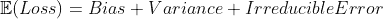
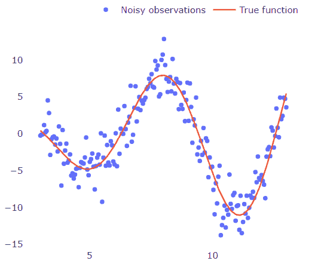
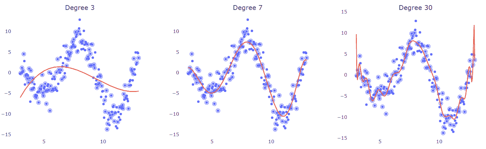
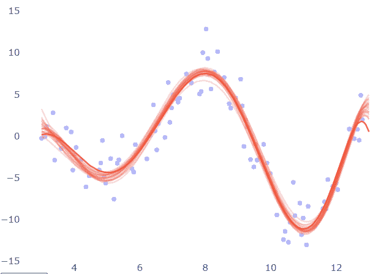
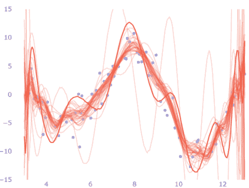
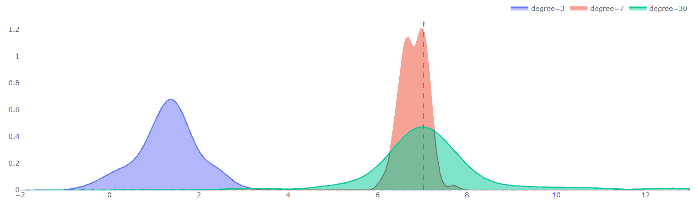

# 可视化偏差-方差

> 原文：[`www.kdnuggets.com/2021/08/visualizing-bias-variance.html`](https://www.kdnuggets.com/2021/08/visualizing-bias-variance.html)

评论

**作者：[西奥多·齐茨密斯](https://www.linkedin.com/in/tsitsimis/)，机器学习科学家**

偏差-方差权衡是机器学习的一个基本概念。这里我们将通过可视化的帮助来探讨这种权衡的不同视角。

## 现实生活中的偏差-方差

我们的很多决策都受到他人的影响，当我们观察他们的行为并通过某些社会相似度度量来比较自己时。同时，我们保持自己通过经验和推理学到的一套规则。在这种情况下：

+   **偏差**是当我们有非常简单的规则而无法真正解释现实情况时。例如，认为通过观看 YouTube 视频就能成为医生。

+   **方差**是当我们通过倾听不同的群体并模仿他们的行为而不断改变自己的想法时。例如，当你看到某人在健身房里形体很好，运动后吃蛋白棒，你也认为蛋白棒是你需要的。然后你听到有人说他们买了一些健身器材，帮助他们增长了肌肉，你便去购买了同样的机器。

## 权衡视角

偏差-方差通常被称为权衡。当谈到权衡时，我们通常指的是有两个（或更多）竞争量的情况，其中加强一个量会导致另一个量减少，反之亦然。一个著名的例子是强化学习中的探索-利用权衡，其中增加探索因素（如ε-贪婪）会使代理减少对已估计高价值状态的利用。

另一方面，偏差-方差是一种分解。研究表明，回归模型的期望测试误差（均方误差）可以分解为三个部分：方差、偏差和不可减少的误差（由于噪声和内在变异性）。

然而，与探索-利用权衡直接控制两个竞争量不同，偏差和方差不是可以直接调整来控制误差的杠杆。它只是另一种表达测试误差的方式，偏差和方差由这种分解产生。

那么，为什么它被称为权衡呢？灵活的模型往往具有低偏差和高方差，而更为刚性的模型则往往具有高偏差和低方差。模型的灵活性是你可以控制的（正则化、参数数量等），因此可以间接控制偏差和方差。

## 偏差-方差的简单术语

我们在 Bishop 的《模式识别与机器学习》中读到，偏差-方差分解是通过对来自相同分布的多个数据集运行学习算法来尝试建模预测不确定性得到的结果。并得出结论：

+   偏差项表示在所有数据集上的平均预测值与期望回归函数之间的差异程度

+   方差项测量了各个数据集的解在其平均值周围变化的程度，因此，这测量了学习函数对特定数据集选择的敏感程度。

## 通过“目测”拟合

让我们在这里放一些背景（和图表）。考虑下面这个 1D 数据集，它是由函数###生成的，并且被一些高斯噪声扰动了。

如果我们想要在这些点上拟合一个多项式怎么办？

我们可以查看图形，稍微退后一步，眯起眼睛仔细观察，勾画出一条大致通过所有点的线（如图中的红线）。然后我们观察到，y 值在高 x 值和低 x 值时趋向于增加到+∞（如果你眯眼看得够仔细），这给了我们一个提示：这应该是一个偶数次的多项式。我们进一步看到这些点在 x 轴上交叉了 4 次（4 个实根），这意味着它应该至少是 4 次多项式。最后，我们观察到图形有 3 个转折点（从增加到减少或反之），这再次表明我们有一个 4 次多项式。

通过“眯眼看”，我们基本上进行了一种噪声平滑，以便看到“全局图景”，而不是数据集的微小和无关的变化。

然而，我们如何能确定这确实是正确的选择？

## 直接抛出一个 1000 次多项式，看看会发生什么

由于我们不能确定哪个多项式的度数最能最佳近似潜在的过程，或者我们只是太无聊了而不愿估计它，我们可以使用我们能想象的最“复杂”的模型来拟合这些点。为了验证这个观点，我们拟合了多个逐渐增加度数的多项式，看看它们的表现：

每种情况下一半的点（圈出的）用于训练。显然，低次模型（左侧）不能弯曲到足以拟合数据。7 次多项式似乎优雅地通过了这些点，好像它可以忽略（平滑掉）噪声。更有趣的是，高次多项式（右侧）试图通过这些点进行插值，并在某种程度上达到了这一点。但这就是我们想要的吗？如果给定一组不同的训练点会发生什么？预测和回归曲线的形状会改变吗？

下面，对不同数据子集重复了相同的拟合，并将结果曲线叠加以检查它们的变异性。在 7 阶多项式的情况下，结果似乎相当一致。

该模型对训练集的变化具有鲁棒性，只要这些变化是从输入空间中均匀采样的。

现在是 30 阶多项式的相同图示：

预测似乎在不同训练集上上下波动。其主要影响是我们不能信任这种模型的预测，因为如果偶然得到一个稍微不同的数据集，同样的输入样本的预测可能会改变。

为了更好地说明这一点，下图展示了在单个测试点（在这种情况下为 x=7）上评估的 3 个模型的预测分布：

虚线是 x=7 时函数的真实值。

## 这就是随机森林®的作用

上图中高阶模型的绿色分布显示，预测在不同数据集上变化很大。这不是模型的一个好特性，因为它对小的数据集扰动不够鲁棒。但请注意，分布的平均值对实际目标的预测非常好，甚至比 7 阶模型（红色分布）的平均值更好。对数据集的多个实现进行平均（bagging）是一个有益的过程，可以克服过拟合和方差。这实际上就是随机森林®的工作方式，并且大多数时候能够在没有太多调优的情况下给出相当好的结果。

希望这些可视化能帮助更清楚地了解偏差-方差如何影响模型性能，以及为什么平均多个模型可以得到更好的预测。

**简介: [西奥多·齐茨米斯](https://www.linkedin.com/in/tsitsimis/)** 是一名机器学习科学家。他目前在一家咨询公司工作，利用数据和机器学习解决各种行业的业务问题。他拥有来自雅典国立技术大学电气与计算机工程学院的学士和硕士学位，在那里他进行了机器人研究。

**相关:**

+   如何创建无偏机器学习模型

+   三个边缘情况罪魁祸首：偏差、方差和不可预测性

+   初学者的数据科学核心概念 20 条

* * *

## 我们的前三课程推荐

 1\. [Google 网络安全证书](https://www.kdnuggets.com/google-cybersecurity) - 快速进入网络安全职业生涯。

 2\. [谷歌数据分析专业证书](https://www.kdnuggets.com/google-data-analytics) - 提升你的数据分析技能

 3\. [谷歌 IT 支持专业证书](https://www.kdnuggets.com/google-itsupport) - 支持你的组织在 IT 方面

* * *

### 相关主题

+   [在 Scikit-learn 中可视化你的混淆矩阵](https://www.kdnuggets.com/2022/09/visualizing-confusion-matrix-scikitlearn.html)

+   [数据可视化：Statology 入门指南](https://www.kdnuggets.com/visualizing-data-statology-primer)
