# 交叉验证代码可视化

> 原文：[`www.kdnuggets.com/2017/09/visualizing-cross-validation-code.html`](https://www.kdnuggets.com/2017/09/visualizing-cross-validation-code.html)

**由 Sagar Sharma 提供，机器学习与编程爱好者。**

让我们**可视化**以提高预测精度...

* * *

## 我们的前三个课程推荐

 1\. [Google 网络安全证书](https://www.kdnuggets.com/google-cybersecurity) - 快速入门网络安全职业。

 2\. [Google 数据分析专业证书](https://www.kdnuggets.com/google-data-analytics) - 提升您的数据分析能力

 3\. [Google IT 支持专业证书](https://www.kdnuggets.com/google-itsupport) - 支持您的组织 IT

* * *

假设你正在编写一个干净整洁的机器学习代码（例如线性回归）。你的代码没问题，首先你将数据集分为两个部分，“训练集和测试集”，像往常一样使用 *train_test_split* 函数和一些 *随机因子*。你的预测可能会稍微欠拟合或过拟合，如下图所示。

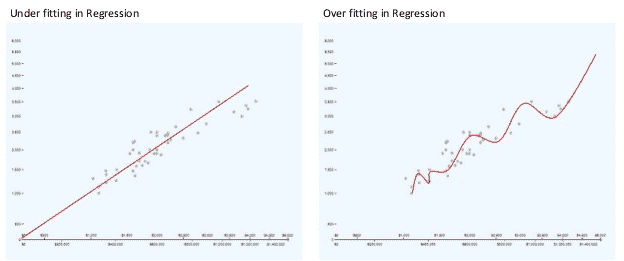

图：欠拟合和过拟合预测

并且结果没有变化。那么我们可以做什么呢？

正如名称所示，交叉验证是学习 *线性回归* 后的下一个有趣的环节，因为它利用 ***K-Fold*** 策略来提高预测精度。你问什么是 K-Fold？所有内容都在下面用 **代码** 解释了。

完整代码 :)

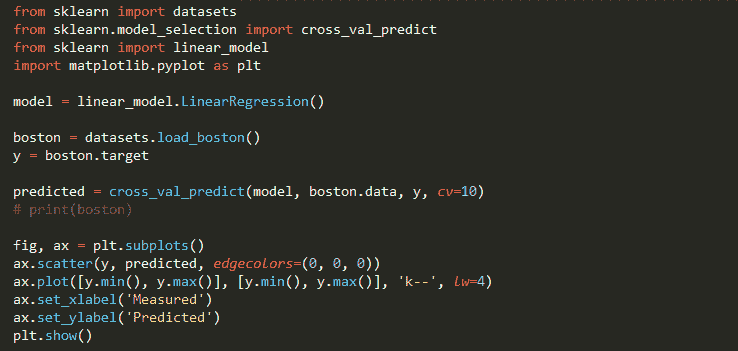

图：- 带可视化的交叉验证

代码洞察：

上面的代码分为 4 步...

**1\. 加载** 和 **划分目标** 数据集。

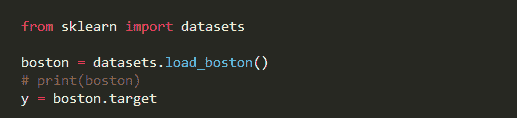

图：- 加载数据集

我们将目标复制到数据集的 *y* 变量中。*要查看数据集，请取消注释 *print* 行。

**2. 模型选择**

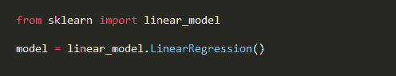

图：- 模型选择 (LinearRegression())

为了简化问题，我们将使用线性回归。要了解更多信息，请点击 “[线性回归：更简单的方法](https://medium.com/@sagarsharma4244/linear-regression-the-easier-way-6f941aa471ea)” 帖子。

****3\. 交叉验证 :)****

图：- sklearn 中的交叉验证

这是一个过程，同时也是 sklearn 中的一个函数

***cross_val_predict(model, data, target, cv)***

其中，

+   ***model*** 是我们选择的要进行交叉验证的模型

+   ***data*** 是数据。

+   ***target*** 是相对于数据的目标值。

+   ***cv*** (可选) 是折叠的总数（即 *K-Fold*）。

在这个过程中，我们不会像平常那样将数据分为两个集合（训练集和测试集），如下所示。

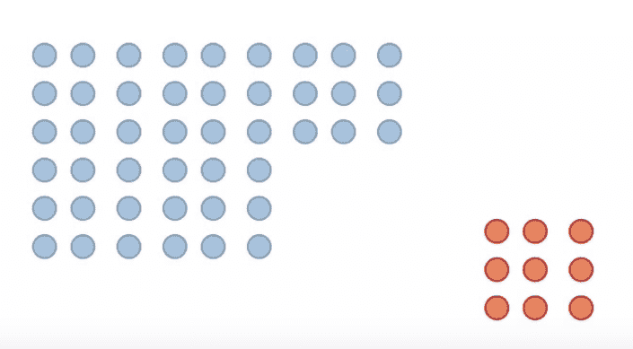

图：- 训练集（蓝色）和测试集（红色）

我们将数据集分成相等的*K*部分（*K-Folds*或****cv***）。**为了改进预测并更好地泛化。**然后在更大的数据集上训练模型，在较小的数据集上测试。假设***cv***为**6**。

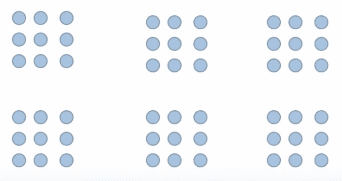

图：- 6 个相等的折叠或部分

现在，模型分割的第一次迭代看起来是这样的，其中红色是测试数据，蓝色是训练数据。

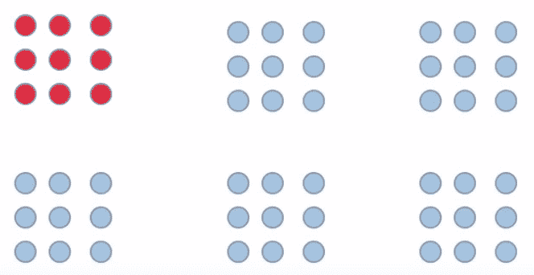

图：- cross_val 第一次迭代

第二次迭代将如下图所示。

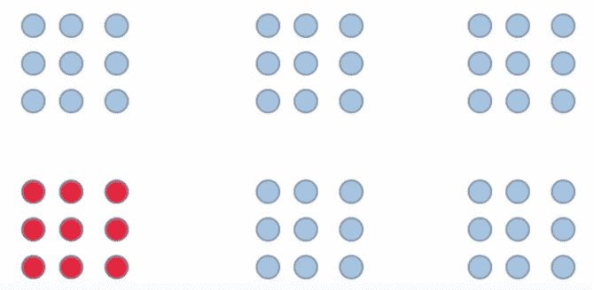

图：- cross_val 第二次迭代

如此继续到最后一次或第六次迭代，结果如下图所示。

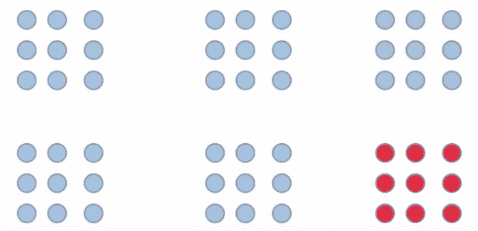

图：- cross_val 第六次迭代

**4. 可视化数据使用**Matplotlib****

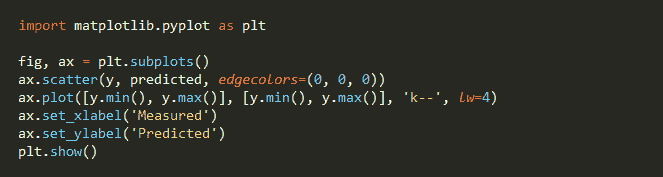

图：- 使用 Matplotlib 可视化

为了可视化，我们导入了***matplotlib***库，然后创建一个***subplot***。

创建***scatter***点，边界为黑色（即（0,0,0）），或*edgecolors*。

使用***ax.plot***为两个轴提供最小值和最大值，其中'***k--***'表示线条类型，线宽为***lw******= 4***。

接下来，为 x 和 y 轴添加标签。

***plt.show()*** 用于显示图表。

**结果**

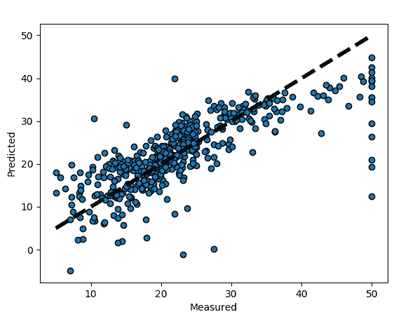

图：- 预测

该图表示波士顿数据集的 k-折交叉验证，使用线性回归模型。

我相信有许多类型的交叉验证，但 K 折交叉验证是一种很好的、易于入门的类型。

获取完整代码，请访问此 GitHub 链接：[Github](https://github.com/Sagarsharma4244/Cross-Validation)

关注我在[Medium](https://medium.com/@sagarsharma4244)获取类似的文章。

我每周发布 2 篇文章，所以不要错过代码教程。

联系我：[Facebook](https://www.facebook.com/profile.php?id=100003188718299)、[Twitter](https://twitter.com/SagarSharma4244)、[Linkedin](https://www.linkedin.com/in/sagar-sharma-232a06148/)、[Google+](https://plus.google.com/+SAGARSHARMA4244)。

任何评论或问题，请在评论中写下。

点赞！分享！关注我！

很高兴能帮到你。赞美...

**个人简介：[Sagar Sharma](https://medium.com/@sagarsharma4244)**（[@SagarSharma244](https://twitter.com/SagarSharma4244)）对编程（Python, C++）、Arduino 和机器学习感兴趣。 他也喜欢写东西。

[原文](https://medium.com/towards-data-science/cross-validation-code-visualization-kind-of-fun-b9741baea1f8)。已获许可转载。

**相关：**

+   了解偏差-方差权衡：概述

+   使预测模型鲁棒：保留法与交叉验证

+   理解过拟合：机器学习中的一个不准确的误解

### 更多相关话题

+   [在 Scikit-learn 中可视化你的混淆矩阵](https://www.kdnuggets.com/2022/09/visualizing-confusion-matrix-scikitlearn.html)

+   [数据可视化：Statology 入门](https://www.kdnuggets.com/visualizing-data-statology-primer)

+   [《带代码的论文简要介绍》](https://www.kdnuggets.com/2022/04/brief-introduction-papers-code.html)

+   [KDnuggets 新闻，4 月 27 日：带代码的论文简要介绍；…](https://www.kdnuggets.com/2022/n17.html)

+   [你不知道的 7 种低代码工具使用方法](https://www.kdnuggets.com/2022/09/7-things-didnt-know-could-low-code-tool.html)

+   [加速 Python 代码的 3 种简单方法](https://www.kdnuggets.com/2022/10/3-simple-ways-speed-python-code.html)
