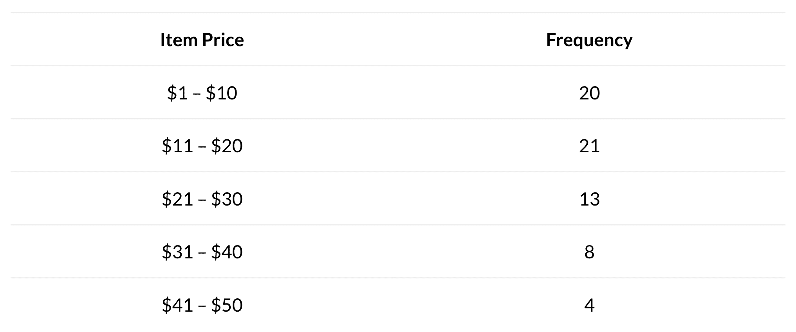

# 数据可视化：Statology 入门

> 原文：[`www.kdnuggets.com/visualizing-data-statology-primer`](https://www.kdnuggets.com/visualizing-data-statology-primer)

图片来源 | Midjourney & Canva

KDnuggets 的姊妹网站，[**Statology**](https://www.statology.org/)，拥有广泛的统计相关内容，由专家撰写，这些内容在短短几年内积累起来。我们决定通过整理和分享一些精彩的教程来帮助读者了解这个出色的统计、数学、数据科学和编程资源，将其推荐给 KDnuggets 社区。

* * *

## 我们的前三个课程推荐

 1\. [谷歌网络安全证书](https://www.kdnuggets.com/google-cybersecurity) - 快速进入网络安全职业轨道。

 2\. [谷歌数据分析专业证书](https://www.kdnuggets.com/google-data-analytics) - 提升你的数据分析技能

 3\. [谷歌 IT 支持专业证书](https://www.kdnuggets.com/google-itsupport) - 支持你的组织的 IT 需求

* * *

> 学习统计学可能很困难。它可能令人沮丧。最重要的是，它可能令人困惑。这就是为什么[**Statology**](https://www.statology.org/)在这里提供帮助的原因。

本系列最新教程专注于数据可视化。没有数据可视化，数据或统计分析是不完整的。存在各种工具可以帮助我们通过可视化更好地理解数据，这些教程将帮助实现这一点。学习这些不同的技术，然后继续阅读 Statology 的档案以获取更多宝贵的内容。

#### [**箱线图**](https://www.statology.org/boxplots/)

箱线图（有时称为箱须图）是显示数据集五数概括的图表。

五数概括包括：

+   最小值

+   第一四分位数

+   中位数

+   第三四分位数

+   最大值

箱线图使我们能够通过一个简单的图表轻松可视化数据集中值的分布。

#### [**茎叶图：定义与示例**](https://www.statology.org/stem-and-leaf-plots/)

茎叶图通过将数据集中的每个值分成一个“茎”和一个“叶”来显示数据。

本教程解释了如何创建和解读茎叶图。

#### [**散点图**](https://www.statology.org/scatterplots/)

散点图用于显示两个变量之间的关系。

假设我们有以下数据集，显示了篮球队球员的体重和身高：

这个数据集中的两个变量是身高和体重。

为了制作散点图，我们将身高放在 x 轴上，体重放在 y 轴上。每个玩家则被表示为散点图上的一个点：

散点图帮助我们看到两个变量之间的关系。在这种情况下，我们可以看到身高和体重有正相关关系。身高增加时，体重也趋向增加。

#### [**相对频率直方图：定义 + 示例**](https://www.statology.org/relative-frequency-histogram/)

在统计学中，你经常会遇到显示频率信息的表格。频率只是告诉我们某事件发生了多少次。

例如，以下表格展示了某商店在一周内根据商品价格销售的商品数量：

这种表格被称为频率表。一列是“类别”，另一列是类别的频率。

我们通常使用频率直方图来可视化频率表中的值，因为当我们能直观地看到数字时，更容易理解数据。

#### [**什么是密度曲线？（解释与示例）**](https://www.statology.org/density-curves/)

密度曲线是在图表上表示数据集值分布的曲线。它有三个主要用途：

1.  密度曲线让我们对分布的“形状”有一个很好的了解，包括分布是否有一个或多个经常出现的“峰值”，以及分布是否偏向左侧或右侧。

1.  密度曲线让我们直观地看到分布的均值和中位数所在的位置。

1.  密度曲线让我们直观地看到数据集中有多少观察值落在不同的值之间。

欲获取更多类似内容，请继续关注 Statology，并订阅他们的每周新闻通讯，以确保不会错过任何信息。

****[Matthew Mayo](https://www.kdnuggets.com/wp-content/uploads/./profile-pic.jpg)**** ([**@mattmayo13**](https://twitter.com/mattmayo13)) 拥有计算机科学硕士学位和数据挖掘研究生文凭。作为[KDnuggets](https://www.kdnuggets.com/)和[Statology](https://www.statology.org/)的总编辑，以及[Machine Learning Mastery](https://machinelearningmastery.com/)的贡献编辑，Matthew 旨在使复杂的数据科学概念变得易于理解。他的职业兴趣包括自然语言处理、语言模型、机器学习算法和探索新兴的人工智能。他致力于使数据科学社区的知识普及化。Matthew 从 6 岁起便开始编程。

### 更多相关主题

+   [描述数据：Statology 入门](https://www.kdnuggets.com/describing-data-statology-primer)

+   [统计学入门：Statology 入门指南](https://www.kdnuggets.com/introduction-to-statistics-statology-primer)

+   [概率论：Statology 入门指南](https://www.kdnuggets.com/probability-statology-primer)

+   [在 Scikit-learn 中可视化你的混淆矩阵](https://www.kdnuggets.com/2022/09/visualizing-confusion-matrix-scikitlearn.html)

+   [数据科学职位标题导航：数据分析师 vs. 数据科学家…](https://www.kdnuggets.com/navigating-data-science-job-titles-data-analyst-vs-data-scientist-vs-data-engineer)

+   [数据科学家、数据工程师及其他数据职业解析](https://www.kdnuggets.com/2021/05/data-scientist-data-engineer-data-careers-explained.html)
