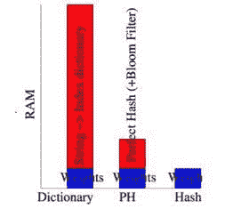

# Vowpal Wabbit：在大数据上的快速学习

> 原文：[`www.kdnuggets.com/2014/05/vowpal-wabbit-fast-learning-on-big-data.html`](https://www.kdnuggets.com/2014/05/vowpal-wabbit-fast-learning-on-big-data.html)

 评论作者：Ran Bi，2014 年 5 月 26 日。

Vowpal Wabbit（VW）是一个起源于 Yahoo! Research 的项目，目前由 Microsoft Research 赞助。由 John Langford 启动并领导，VW 专注于通过构建一个本质上快速的学习算法来实现快速学习。John 在 NYU 大数据课程中为我们讲授了两次关于 AllReduce 和 Bandits 的客座讲座。从我看来，他是一位著名的研究人员，对在线学习算法充满热情。

Vowpal Wabbit 这个名字发音奇特且陌生。Langford 解释说，Vowpal Wabbit 是 Elmer Fudd 发音“Vorpal Rabbit”的方式。至于“Vorpal”，如果你谷歌一下，你会发现“Vorpal Bunny”，它在一个流行的计算机游戏中也被称为“杀手兔”。也许这正是他希望 VW 成为的样子——可爱但又强大且快速。

VW 支持多种机器学习问题、重要性加权、损失函数和优化算法的选择，如 SGD（随机梯度下降）、BFGS（一个常用的参数估计算法）、共轭梯度等。它已经被用于在 1000 个节点上学习一个稀疏**terafeature**（即 10¹²个稀疏特征）数据集，所需时间为一小时，这超过了所有现有的机器线性学习算法。根据 John Langford 在 GitHub 上的教程，VW 在 RCV1 示例上比[svmsgd](https://github.com/tpeng/svmsgd)快约 3 倍，RCV1 是一个文本分类的集合。

VW 的默认模式是一个具有平方损失函数的 SGD 在线学习器。要运行 VW，数据预计需要采用特定格式，即

“label [weight]| Namespace Feature1:Value1|Namespace Feature2:Value2 …”。

这种格式对于稀疏表示也很理想，因为不需要指定特征值为零。如果你不确定数据是否符合正确格式，你可以将数据行粘贴到[数据格式验证](http://hunch.net/~vw/validate.html)中。VW 高效且非常可扩展。为了向量化特征，它使用了哈希技巧，这几乎不占用内存，并且由于不维护内部哈希表，它的速度比以前快 10 倍。

十几家公司正在使用 VW。其中之一是 eHarmony，它帮助人们找到真爱。正如 John 在 NIPS 2011 上所说，它是他最喜欢的应用。VW 也被用于解决几个 Kaggle 竞赛。更多信息可以在

+   [VW 的网站](http://hunch.net/~vw/)

+   [GitHub 网站](https://github.com/JohnLangford/vowpal_wabbit/wiki)

+   [Slideshare：Terascale 学习算法](http://www.slideshare.net/pauldix/terascale-learning)

注：Vowpal Wabbit 与深度学习不同 - 见此处 在哪里学习深度学习 – 课程、教程、软件。

**相关：**

+   MLTK：Java 中的机器学习工具包 - 免费下载

+   观看：机器学习基础

+   机器学习的数据工作流程

**来自 Dan Rice 在 LinkedIn 的评论：**

Vowpal 的有趣之处在于它的速度，因为它采用了抽样技术，这是一个基于串行处理的方法。这种抽样并不是通过传统的观测抽样完成的，而是在梯度下降中一次抽样一个特征，即随机梯度下降。因此，批评抽样的机器学习社区的人也需要意识到，他们自己快速的方法如 Vowpal 也明显使用了抽样。

Vowpal 的结果有时可能与传统的梯度下降方法在标准逻辑回归中的准确性相当，但通常准确性要低得多。实际上，通过使用标准逻辑回归并简单地抽样观测数据，可能能够在大量观测下匹配 Vowpal 的速度和准确性表现。如下面提到的，Vowpal 的发明者 Langford 最近在发布混合方法的研究，这些方法将 Vowpal 的随机梯度下降方法与传统的梯度下降方法结合，以提高准确性。但这些方法现在部分采用了并行处理。随着今天并行处理技术的发展，速度的问题已经不如几年前那么重要，但其他问题如可靠性、准确性、稳定性和偏差的缺失仍然更为重要。如果进行抽样，关键是要确保它不会像 Vowpal 的情况那样影响准确性，这也是其发明者转向更准确的新方法的原因。

[一个可靠有效的大规模线性学习系统](http://arxiv.org/pdf/1110.4198.pdf)，由 Alekh Agarwal、Olivier Chapelle、Miroslav Dudik 和 John Langford 提供。

* * *

## 我们的前 3 个课程推荐

 1\. [Google 网络安全证书](https://www.kdnuggets.com/google-cybersecurity) - 快速进入网络安全职业生涯。

 2\. [Google 数据分析专业证书](https://www.kdnuggets.com/google-data-analytics) - 提升你的数据分析能力

 3\. [Google IT 支持专业证书](https://www.kdnuggets.com/google-itsupport) - 支持你的组织的 IT 需求

* * *

### 更多相关主题

+   [简单快速的数据流处理用于机器学习项目](https://www.kdnuggets.com/2022/11/simple-fast-data-streaming-machine-learning-projects.html)

+   [通过快速克里金（FKR）加速机器学习](https://www.kdnuggets.com/2022/06/vmc-speed-machine-learning-fast-kriging.html)

+   [实用深度学习课程来自 fast.ai 重磅回归！](https://www.kdnuggets.com/2022/07/practical-deep-learning-fastai-2022.html)

+   [通过《数据科学的快速 Python》提升你的 Python 技能！](https://www.kdnuggets.com/2022/06/manning-step-python-game-fast-python-data-science.html)

+   [通过数据技能快车道提升你的下一步职业发展](https://www.kdnuggets.com/2023/01/datacamp-fast-track-next-move-indemand-data-skills.html)

+   [BERT 在稀疏性下能有多快？](https://www.kdnuggets.com/2022/04/fast-bert-go-sparsity.html)
