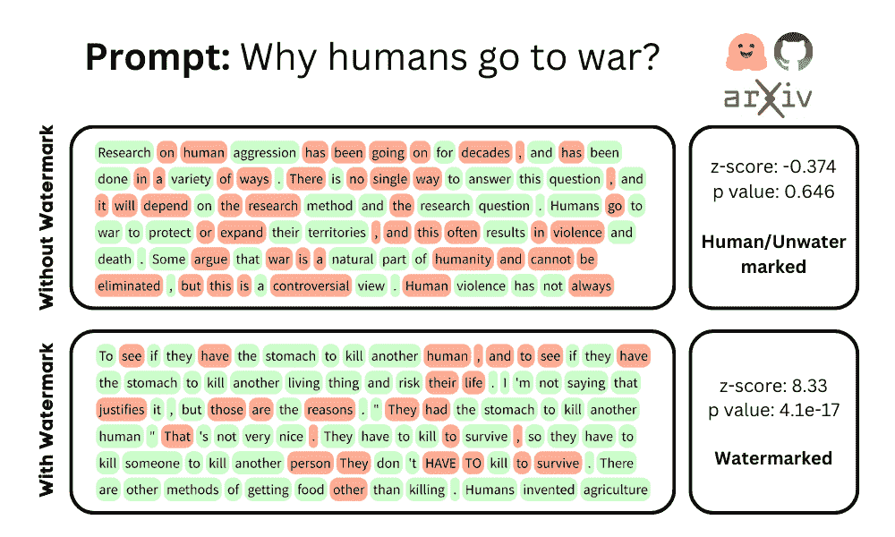
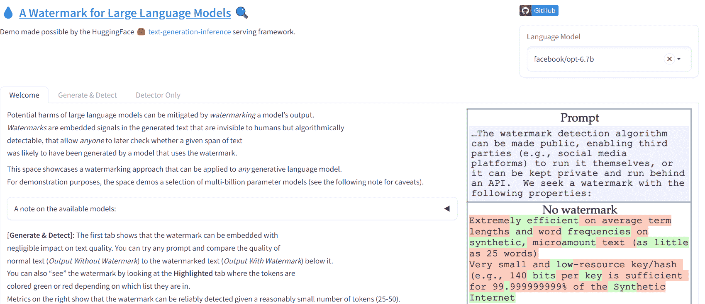

# 水印技术如何帮助缓解大型语言模型的潜在风险？

> 原文：[`www.kdnuggets.com/2023/03/watermarking-help-mitigate-potential-risks-llms.html`](https://www.kdnuggets.com/2023/03/watermarking-help-mitigate-potential-risks-llms.html)

图片由作者提供

# 为什么我们需要为大型语言模型添加水印？

* * *

## 我们的前三大课程推荐

 1\. [Google 网络安全证书](https://www.kdnuggets.com/google-cybersecurity) - 快速进入网络安全职业道路。

 2\. [Google 数据分析专业证书](https://www.kdnuggets.com/google-data-analytics) - 提升你的数据分析技能

 3\. [Google IT 支持专业证书](https://www.kdnuggets.com/google-itsupport) - 支持你的组织的 IT 需求

* * *

像 ChatGPT、GPT-4 和 Bard 这样的巨大语言模型正在革新我们的工作方式。我们现在有工具可以帮助我们编写整个程序或撰写新产品发布的博客文章。由 GPT-3.5 驱动的应用程序正在生成多种主题的真实而多样化的文本。就像所有新技术一样，它们也带来了盗取知识产权、剽窃、虚假信息和在线滥用的潜在风险。

我们如何确保大型语言模型的输出是可信和负责任的？目前没有可靠的解决方案。虽然有一些工具可以检测生成的文本，但它们的准确率较低。

在马里兰大学的论文中：[大型语言模型的水印](https://arxiv.org/pdf/2301.10226.pdf)，作者提出了一种针对专有 LLM 的水印框架。它通过不可见的信号水印生成的文本输出，这些信号可以被算法检测到，但对人类不可见。

水印技术是一种有效的手段，可以用来证明对象的所有权、真实性或完整性。

**例如：**

+   它可以帮助保护 LLM 开发者、科学家和公司的知识产权（模型）。

+   它可以防止剽窃或误归属。

+   它可以帮助检测社交媒体上的虚假信息活动。

+   水印技术最重要的用途是帮助监控和审计 LLMs 的使用及其影响，防止滥用或误用。

# 水印技术如何在大语言模型（LLMs）中发挥作用？

水印[框架](https://arxiv.org/pdf/2301.10226.pdf)由两个组成部分构成：嵌入和检测。

## 嵌入

这是将水印插入 LLMs 输出的过程。为了实现这一点，LLM 开发者需要稍微修改模型参数以嵌入水印。

嵌入工作原理是，在生成每个单词之前选择一组随机的“绿色”标记，然后在采样过程中轻微地促进绿色标记的使用。绿色标记的选择方式不会影响文本的上下文和质量。嵌入还确保每个范围内有足够的标记，以使决策过程成为可能。

## 检测

这是从给定的文本范围中提取“绿色”标记的过程。不需要模型参数或 API。检测是通过计算范围内每个标记的曲率来完成的。曲率是对标记的概率分布对模型参数小变化的敏感程度的测量。

作者解释说，绿色标记的曲率高于正常标记，从而在文本中形成可检测的模式。

在执行水印检测后，算法会进行统计测试以确定结果的置信度。

你可以通过阅读 [arxiv.org](https://arxiv.org/pdf/2301.10226.pdf) 上的论文了解更多信息。

# Hugging Face 演示

你可以尝试使用 [Hugging Space Gradio Demo](https://huggingface.co/spaces/tomg-group-umd/lm-watermarking) 来生成带水印的文本，或者查看 GitHub 仓库：[jwkirchenbauer/lm-watermarking](https://github.com/jwkirchenbauer/lm-watermarking) 以在个人计算机上运行 Python 脚本。

来自 Hugging Face 的图片 | [LLMs 的水印](https://huggingface.co/spaces/tomg-group-umd/lm-watermarking)

# 水印对大型语言模型（LLMs）有多有效？

我们将回顾论文中提到的在总结、翻译和对话生成等各种任务上的结果。

论文报告称，他们的框架在不同任务中实现了高嵌入率 **> 90%** 和高检测率 **> 99%**，同时保持低误报率 **< 1%** 和高文本质量分数。作者还证明该框架对各种攻击（如释义、混合或截断水印文本）具有鲁棒性。

+   **嵌入率**：绿色标记在输出中使用的频率。

+   **检测率**：水印被正确检测的频率。

+   **误报率**：非水印文本被错误检测为水印文本的频率。

+   **文本质量**：自然流畅程度。

# 限制和挑战

这是一个起点，水印框架存在一些限制和挑战，例如：

+   你必须在嵌入过程中修改模型参数，在某些情况下（API、边缘设备）这不可能实现。

+   它依赖于基于采样的生成方法，与其他方法（如束搜索或核采样）不兼容。

+   水印在不同任务中均匀嵌入，对于某些任务，其中某些标记比其他标记具有更大的语义重要性，可能效果不佳。

还有其他实施挑战和公平使用政策，这些都是算法广泛应用的关键。

# 结论

在这篇博客中，我们讨论了水印技术在大型语言模型中的重要性、框架的工作原理、结果以及局限性。这是一个提出用于专有大型语言模型的水印框架的论文的总结。

这是一个开始，我们需要像水印这样的框架来让人工智能对每个人更安全。我希望你尝试一下 Hugging Face 的[演示](https://huggingface.co/spaces/tomg-group-umd/lm-watermarking)亲自体验其卓越之处。如果你对理论和算法的内部工作感兴趣，可以阅读[论文](https://arxiv.org/pdf/2301.10226.pdf)和[源代码](https://github.com/jwkirchenbauer/lm-watermarking)。

**[Abid Ali Awan](https://www.polywork.com/kingabzpro)** ([@1abidaliawan](https://twitter.com/1abidaliawan)) 是一名认证数据科学专业人士，喜欢构建机器学习模型。目前，他专注于内容创作和撰写有关机器学习和数据科学技术的技术博客。Abid 拥有技术管理硕士学位和电信工程学士学位。他的愿景是利用图神经网络为受心理疾病困扰的学生构建一个人工智能产品。

### 更多相关主题

+   [级别系统如何帮助预测 AI 成本](https://www.kdnuggets.com/2022/03/level-system-help-forecast-ai-costs.html)

+   [可以帮助解决实际问题的数据科学项目](https://www.kdnuggets.com/2022/11/data-science-projects-help-solve-real-world-problems.html)

+   [大多数公司数据访问严重不足，71%的人认为…](https://www.kdnuggets.com/2023/07/mostly-data-access-severely-lacking-synthetic-data-help.html)

+   [SAS 如何帮助推动从业者的职业发展](https://www.kdnuggets.com/2023/07/sas-help-catapult-practitioners-careers.html)

+   [5 种稀有的数据科学技能，能帮助你找到工作](https://www.kdnuggets.com/5-rare-data-science-skills-that-can-help-you-get-employed)

+   [生成性人工智能如何帮助你改善数据可视化图表](https://www.kdnuggets.com/how-generative-ai-can-help-you-improve-your-data-visualization-charts)
