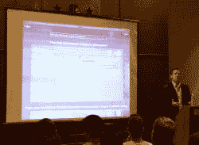
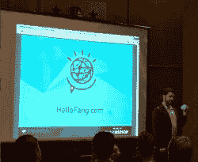
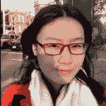

# 当 Watson 遇见机器学习

> 原文：[`www.kdnuggets.com/2014/07/watson-meets-machine-learning.html`](https://www.kdnuggets.com/2014/07/watson-meets-machine-learning.html)

**作者：Ran Bi，2014 年 7 月。**

你还记得**Watson**在 2011 年击败两位《危险边缘》的最伟大冠军吗？它是第一个使用自然语言处理和机器学习来改变人们与计算系统互动方式的认知系统。现在，它已经被更广泛地应用。

***医疗保健*** 是 Watson 首个带来显著改善的行业。Watson 被训练帮助医生识别癌症患者的治疗方案，为护理人员提供批准建议，并从病人的医疗记录中挖掘关键信息。

例如，[Modernizing Medicine](https://www.modmed.com) 设计了由 IBM Watson 提供支持的电子医疗助理，以提高医生的工作效率。医生不仅可以查看过去的诊断和病人档案，还可以提出像“甲氨蝶呤与环孢素相比如何”的问题，如左侧截图所示。最棒的是，EMA 会学习每位医生独特的实践风格。虽然我不知道它的效果如何，但这一步更接近未来医疗。

> 机器学习将使认知系统以更加自然和个性化的方式学习、推理和与我们互动。这些系统将通过与数据、设备和人们的互动变得更智能、更定制化。

现在公司可以与 IBM 合作，通过“[Watson 生态系统](http://www.ibm.com/smarterplanet/us/en/ibmwatson/ecosystem.html)”开发他们的应用程序。机器学习将如何改变我们的生活？

这里有几个方面可能会引起你的兴趣。

***教育。*** 未来的教室会是什么样的？我相信个性化教科书、量身定制的课程和机器人导师可能会成为学生们生活的一部分。Majestyk Apps 的首席执行官，获得 [IBM Watson 移动开发者挑战赛](http://www.ibm.com/smarterplanet/us/en/ibmwatson/challenge.html) 的获胜者，展示了他们的认知玩具 Fang。

孩子们可以像和最好的朋友一样与它交谈。这个小玩具可以回答孩子们无尽的问题，满足他们对未知世界的好奇心。想象认知智能教科书、报纸或书桌并不难。

***购物。*** 期待通过大数据获得更个性化的购物体验已经变得很普遍。想象一下一个应用程序，它可以在不同的场合推荐衣服，帮助我们决定买哪件衣服，并且让我们在不脱衣服的情况下试穿衣物。（我迫不及待想要安装它。）另一个想法是在线和离线购物的结合。这样，我们既能享受令人兴奋的购物体验，又能享受快速结账的便利。

IBM 所做的是投资了一家数字购物公司，[Fluid](http://www.fluid.com)，并将 Watson 的认知能力应用于电子商务。这样，人们就可以提出具体的问题，而不是搜索关键词。听起来你每天都有一个销售代表。

***在线安全。*** 通过了解我们是谁，数字监护人可以对我们的活动做出推断，并在出现异常情况时发出警报。例如，如果监护人检测到购买了汽油，它会“认为”这笔购买非常可疑，因为你的车刚刚加油或你在办公室时发生了这种情况。

***未来城市。*** 如果你居住的城市可以分析当地新闻并学习预测你的需求，会怎样？每个人都可以通过移动应用程序分享像是坏掉的街灯、交通堵塞等信息，系统将根据所有信息生成最适合你请求的解决方案。此外，情感分析将帮助城市管理者进行城市规划。更多与城市生活相关的机器学习应用可以被开发，比如犯罪预测、公交路线、街道清扫、自动空调等。

…

公司可以通过在 Watson Developer Cloud 上使用 API 和工具来嵌入 Watson 的认知能力。要访问这些功能，公司需要 [提交请求](http://www.ibm.com/smarterplanet/us/en/ibmwatson/form_ecosystem.html?cmp=usbrb&cm=s&csr=watson.site_20140319&cr=deveco&ct=usbrb301&cn=sec3partnerapp)。

也许这是一个开始的选择。如果你有任何让我们手机更智能的想法，尝试永远不会太晚。

**Ran Bi** 是纽约大学数据科学项目的硕士生。在她在 NYU 学习期间，她完成了多个机器学习、深度学习和大数据分析的项目。由于本科时的金融工程背景，她也对商业分析感兴趣。

**相关：**

+   漫画：Watson 和人工智能与自然智能的对比

+   KDnuggets 独家采访：IBM 大数据产品副总裁 Anjul Bhambhri

+   深度学习是否存在深层缺陷？

+   《Fast Company》十大大数据最具创新公司

* * *

## 我们的三大课程推荐

 1\. [Google 网络安全证书](https://www.kdnuggets.com/google-cybersecurity) - 快速进入网络安全职业生涯。

 2\. [Google 数据分析专业证书](https://www.kdnuggets.com/google-data-analytics) - 提升你的数据分析水平

 3\. [Google IT 支持专业证书](https://www.kdnuggets.com/google-itsupport) - 支持你的组织进行 IT 管理

* * *

### 更多相关主题

+   [特征选择：科学与艺术的交汇点](https://www.kdnuggets.com/2021/12/feature-selection-science-meets-art.html)

+   [检索增强生成：信息检索与文本生成的交汇点](https://www.kdnuggets.com/retrieval-augmented-generation-where-information-retrieval-meets-text-generation)

+   [每个机器学习工程师应具备的 5 项机器学习技能](https://www.kdnuggets.com/2023/03/5-machine-learning-skills-every-machine-learning-engineer-know-2023.html)

+   [KDnuggets 新闻，12 月 14 日：3 门免费的机器学习课程](https://www.kdnuggets.com/2022/n48.html)

+   [学习数据科学、机器学习和深度学习的全面计划](https://www.kdnuggets.com/2023/01/mwiti-solid-plan-learning-data-science-machine-learning-deep-learning.html)

+   [人工智能、分析、机器学习、数据科学、深度学习……](https://www.kdnuggets.com/2021/12/developments-predictions-ai-machine-learning-data-science-research.html)
