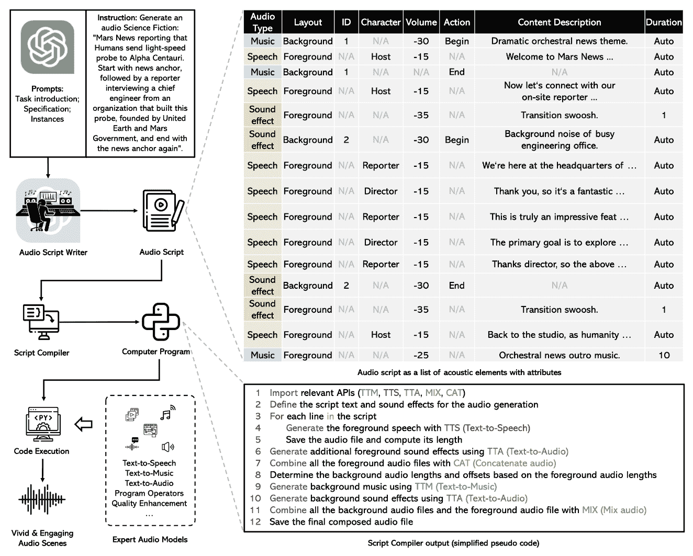
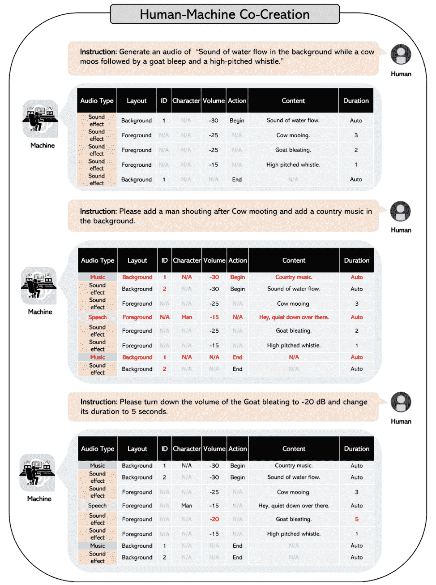

# WavJourney: 探索音频故事生成的世界

> 原文：[`www.kdnuggets.com/wavjourney-a-journey-into-the-world-of-audio-storyline-generation`](https://www.kdnuggets.com/wavjourney-a-journey-into-the-world-of-audio-storyline-generation)

# 介绍

* * *

## 我们的前三大课程推荐

 1\. [谷歌网络安全证书](https://www.kdnuggets.com/google-cybersecurity) - 快速进入网络安全职业生涯的捷径。

 2\. [谷歌数据分析专业证书](https://www.kdnuggets.com/google-data-analytics) - 提升您的数据分析技能

 3\. [谷歌 IT 支持专业证书](https://www.kdnuggets.com/google-itsupport) - 支持您组织的 IT 工作

* * *

大型语言模型的近期出现引起了全球轰动。现在，想象力就是唯一的限制。今天，WavJourney 可以自动化讲故事的艺术。只需一个简单的提示，WavJourney 便利用 LLM 的强大功能生成引人入胜的音频剧本，包含准确的故事情节、逼真的人声和引人入胜的背景音乐。

为了正确地了解音频生成的能力，可以考虑以下场景。我们只需提供一个简单的指令，描述一个场景和背景设置，模型便生成一个引人入胜的音频剧本，突显与原始指令的极致情境相关性。

**指令：** 生成一个科幻主题的音频：火星新闻报道人类向比邻星发送了一个光速探测器。开始时是新闻主播，接着是记者采访一个由联合地球和火星政府建立的组织的首席工程师，最后再回到新闻主播。

**生成的音频**: [`audio-agi.github.io/WavJourney_demopage/sci-fi/sci-fi%20news.mp4`](https://audio-agi.github.io/WavJourney_demopage/sci-fi/sci-fi%20news.mp4)

要真正理解这个奇迹的内部工作机制，让我们深入探讨生成过程的方法和实施细节。

# 生成过程

下图总结了完整的过程，用一个简单的流程图表示。

图片来源：[论文](https://audio-agi.github.io/WavJourney_demopage/WavJourney_arXiv.pdf)

端到端的音频生成过程由多个子模块组成，这些子模块按顺序执行以完成一个完整的文本到音频模型。

## 音频剧本生成

WavJourney 利用 GPT-4 模型和预定义的提示模板生成脚本。提示模板将输出限制为简单的 JSON 格式，计算机程序可以轻松解析。每个脚本有 3 种不同的音频类型，如上图所示：**语音**、**音效** 和 **音乐**。每种音频类型可以作为前景音频运行，也可以作为背景音效叠加到其他音频上。其他属性如内容描述、长度和角色是正式定义脚本生成音频设置的足够属性。

## 脚本解析

输出脚本随后会通过计算机程序处理，从预定义的 JSON 脚本格式中解析相关信息。它将每个描述和角色与预设的语音音频关联。这一过程有助于将音频生成过程分解为不同的步骤，包括文本转语音、音乐和音效添加。

## 音频生成

解析后的脚本作为 Python 程序执行。首先生成前景语音，然后叠加背景音乐和音效。在语音生成方面，模型使用了预训练的 [Bark](https://github.com/suno-ai/bark) 模型和 [VoiceFixer](https://github.com/haoheliu/voicefixer) 修复模型，以提高音频质量。[AudioLDM](https://audioldm.github.io/) 和 [MusicGen](https://ai.honu.io/papers/musicgen/) 模型用于音效和音乐的叠加。所有三个模型的输出结果被合并以生成最终的音频输出。

# 人机共创

该过程保持生成脚本的上下文，并且可以类似于 GPT 模型进行提示。你可以使用人类反馈和 GPT 模型的聊天功能轻松修改生成的脚本。

添加特定细节和音效变得比以往任何时候都更简单。下面的流程图展示了添加或修改生成脚本特定细节的简单性。

图片来自 [论文](https://audio-agi.github.io/WavJourney_demopage/WavJourney_arXiv.pdf)

# 结论

音频生成模型可能会成为娱乐行业的颠覆者。该过程能够生成引人入胜的叙述和故事，这些故事可以用于教育和娱乐目的，自动化繁琐的配音和视频生成过程。

要详细了解，请查看 [论文](https://audio-agi.github.io/WavJourney_demopage/WavJourney_arXiv.pdf)。代码很快会在 [GitHub](https://github.com/Audio-AGI/WavJourney) 上发布。

**[穆罕默德·阿赫马德](https://www.linkedin.com/in/muhammad-arham-a5b1b1237/)** 是一名从事计算机视觉和自然语言处理的深度学习工程师。他曾参与多个生成式 AI 应用的部署和优化，这些应用在 Vyro.AI 的全球排行榜上名列前茅。他对构建和优化智能系统的机器学习模型充满兴趣，并相信持续改进。

### 更多相关主题

+   [Bark: 终极音频生成模型](https://www.kdnuggets.com/2023/05/bark-ultimate-audio-generation-model.html)

+   [检索增强生成：信息检索与文本生成的交汇点](https://www.kdnuggets.com/retrieval-augmented-generation-where-information-retrieval-meets-text-generation)

+   [使用 Python 创建一个从音频中提取主题的 Web 应用程序](https://www.kdnuggets.com/2023/01/creating-web-application-extract-topics-audio-python.html)

+   [如何通过 ML 模型可解释性加速 AI 采纳之旅](https://www.kdnuggets.com/2022/07/ml-model-explainability-accelerates-ai-adoption-journey-financial-services.html)

+   [规划你向 SAS 认证迈进的旅程](https://www.kdnuggets.com/2022/11/sas-map-journey-towards-sas-certification.html)

+   [在数据科学之旅中取得飞跃](https://www.kdnuggets.com/2023/02/make-quantum-leaps-data-science-journey.html)
