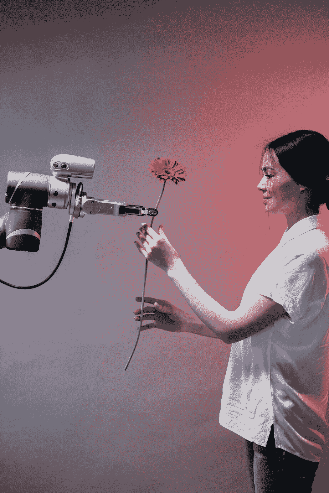

# 是否存在弥合 MLOps 工具差距的方法？

> 原文：[`www.kdnuggets.com/2022/08/way-bridge-mlops-tools-gap.html`](https://www.kdnuggets.com/2022/08/way-bridge-mlops-tools-gap.html)

图片来源：[Pavel Danilyuk](https://www.pexels.com/photo/a-robot-holding-a-flower-8438979/)

交互式笔记本，如 [Jupyter](https://jupyter.org)，对于人工智能/机器学习（AI/ML）开发至关重要，但不适合生产环境。因此，将笔记本转换为设计良好的软件系统是每个 ML 项目中的强制步骤。但在这种转换过程中，除了基本的 [nbconvert](https://nbconvert.readthedocs.io/en/latest/) 实用工具外，显著缺乏辅助开发者的工具。

# 笔记本是数据科学的首选集成开发环境（IDE）

即使在 Jupyter 开发之前，数学家、研究人员和分析师也使用交互式“笔记本风格”的开发环境（例如 [Mathematica](https://www.wolfram.com/mathematica/)）。对于数据探索和统计分析，即时反馈和可视化对于了解特定工作流程是否会导致有效模型至关重要。

数据科学家在尝试将模型转变为生产就绪的 ML 原型时常遇到三个问题：

1.  在常规的定时间隔内运行 ML 代码（[cron 服务](https://en.wikipedia.org/wiki/Cron)）或一个具有弹性和可扩展性的网络服务；

1.  在笔记本中将代码应用于无法在单一计算节点上容纳的大数据集（分布式计算）；并且

1.  寻找适合开发大型代码库的 IDE 便利功能。Jupyter 自身缺乏许多现代开发友好 IDE 的“舒适功能”。

最近出现了一大波工具来解决这些问题——从强大的 Jupyter 替代笔记本，如 [Deepnote](https://deepnote.com) 和 [Hex](https://hex.tech)；到 cron 调度器，如 [PaperMill](https://papermill.readthedocs.io/en/latest/)；以及全功能的云服务设置，如 Databricks。然而，这些工具有一个共同点：它们围绕笔记本构建，并协助*在生产环境中使用*笔记本。当使用这些工具时，你会遇到两个问题：1.) 笔记本中的代码结构相同（通常是维护困难的“意大利面条代码”），2.) 笔记本被安排运行的环境是笔记本内核（编程语言解释器，优化了开发者的互动而非运行时效率）。

# 但将笔记本投入生产环境是否是一个好主意？

虽然交互式代码解释器在探索性数据分析（EDA）和报告中极为有用，但由于几个原因，它们不适合质量生产代码：

1.  没有测试工具；

1.  笔记本不利于模块化，鼓励意大利面条式脚本；

> 注意：*虽然技术上你可以* *在一个单元格中导入 everything_else* *并在* *everything_else.py** 中开发，但这 a) 在实践中很少做到，b) 使得迭代回到原始笔记本中包含适合 EDA 的图表和表格变得更加困难。*

1.  容错性：如果笔记本的某一部分（例如：一个函数）失败或计算机重启，数据科学家需要能够从上次停止的点继续工作，而不是从头开始。像 Airflow/Luigi 这样的工具存在的原因就是为了这个目的；

1.  处理更多的传入请求（水平扩展不同于 Spark 提供的可扩展性）；以及

> 注意：*可以围绕一个笔记本（例如：[*https://www.qwak.ai*](https://www.qwak.ai/)）构建一个可扩展的网络服务，但实际上，数据科学家通常会要求工程师来帮助执行。*

1.  笔记本的代码审查和版本控制存在问题。IDE 支持越来越好，但仍不如“普通”代码。

但也许最大的挑战是数据科学与企业其他技术栈之间日益扩大的差距。例如，一个典型的营销技术栈将由其自己的工程团队维护，这使得数据科学成为最薄弱的环节。

## 我们需要减少工作流程瓶颈，并帮助数据科学充分发挥数据的潜力。

我们需要明确区分数据科学开发环境和生产环境，以充分解决各自关注的问题。现有的试图同时满足这两个环境的工具已经证明只能妥协这两个环境。要求数据科学家在开发过程中更多地关注工程问题会大大降低工作流程的生产力。而根本上改变数据科学的运作方式并不现实。那么问题是：是否有可能通过单一工具弥合这一差距？

[LineaPy](https://lineapy.org/) 也是最近出现的新工具之一，但它正是针对这一工具缺口而构建的。它让数据科学家能够像现在一样工作，同时也享受生产栈带来的良好工程‘东西’的好处。LineaPy 并不试图改变数据科学或生产栈环境，而是尝试充当一个急需的桥梁（可以在 Jupyter Notebook/Lab 或 IPython 等交互式计算环境中使用）。

LineaPy 这样的工具的存在表明，在尊重关注点分离的同时，仍然可以缩小开发和生产之间的差距。一般来说，我们应该避免将现有的、服务于明确目的的工具临时拼凑成其他用途。当我们这样做时，我们会创造比解决的问题更多的挫折。

**[Mike Arov](https://www.linkedin.com/in/mikearov/)** 是 PostClick 的首席机器学习工程师，该公司是数字广告转化领域的领先解决方案。

* * *

## 我们的前三大课程推荐

 1\. [Google 网络安全证书](https://www.kdnuggets.com/google-cybersecurity) - 快速进入网络安全职业生涯。

 2\. [Google 数据分析专业证书](https://www.kdnuggets.com/google-data-analytics) - 提升你的数据分析技能

 3\. [Google IT 支持专业证书](https://www.kdnuggets.com/google-itsupport) - 支持你的组织 IT 工作

* * *

### 更多相关话题

+   [深度学习与人类认知能力之间的差距](https://www.kdnuggets.com/2022/10/gap-deep-learning-human-cognitive-abilities.html)

+   [人工智能教育差距及其解决方法](https://www.kdnuggets.com/2022/11/ai-education-gap-close.html)

+   [弥合人类理解与机器学习之间的差距：…](https://www.kdnuggets.com/2023/06/closing-gap-human-understanding-machine-learning-explainable-ai-solution.html)

+   [回到过去……一个 RAPIDS 的故事](https://www.kdnuggets.com/2023/06/back-again-rapids-tale.html)

+   [优化和管理机器学习生命周期的十大 MLOps 工具](https://www.kdnuggets.com/2022/10/top-10-mlops-tools-optimize-manage-machine-learning-lifecycle.html)

+   [5 个最佳端到端开源 MLOps 工具](https://www.kdnuggets.com/5-best-end-to-end-open-source-mlops-tools)
