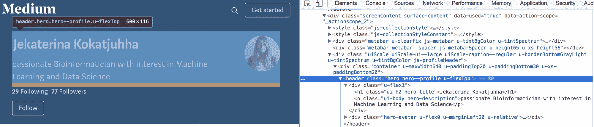
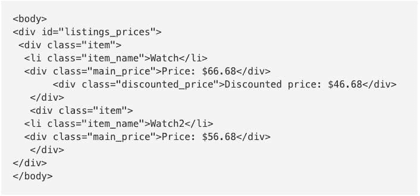
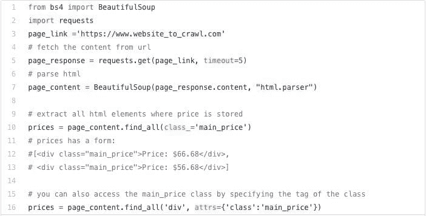

# 使用 Python 进行网页抓取教程：技巧和窍门

> 原文：[`www.kdnuggets.com/2018/02/web-scraping-tutorial-python.html`](https://www.kdnuggets.com/2018/02/web-scraping-tutorial-python.html)

 评论

**由[Jekaterina Kokatjuhha](https://hackernoon.com/@k.kokatjuhha)提供**

我在寻找机票时注意到票价在一天内会波动。我试图找出买票的最佳时间，但在网上找不到有用的信息。我编写了一个小程序来自动收集网页数据——一个所谓的抓取器。它提取了我指定日期和航班目的地的信息，并在价格降低时通知我。

> 网页抓取是一种通过自动化过程从网站提取数据的技术。

我从这次网页抓取的经历中学到了很多东西，并且我想分享一下。

本文旨在介绍与网页抓取相关的常见设计模式、陷阱和规则。文章呈现了几个**用例**和一系列典型的**问题**，例如如何**避免被检测**、**注意事项**和**禁忌事项**，以及如何**加速（并行化）**你的抓取器。

一切都将配有 Python 代码片段，以便你可以立即开始。本文档还将介绍几个有用的 Python 包。

**用例**

有很多原因和用例说明为什么你可能想要抓取数据。让我列举一些：

+   抓取电子零售商的页面，以查看你想购买的某些衣物是否有折扣

+   通过抓取页面比较多个服装品牌的价格

+   机票价格在一天内可能会有所变化。可以爬取旅行网站，并在价格降低时收到警报。

+   分析拍卖网站以回答启动竞标价应该低还是高，以吸引更多竞标者，或更长的拍卖是否与更高的最终竞标价相关

**教程**

教程结构：

1.  可用的包

1.  基本代码

1.  陷阱

1.  注意事项

1.  加速——并行化

在我们开始之前：**对服务器要友好；你不想让网站崩溃。**

**1\. 可用的包和工具**

因为每个网站上的数据存储方式通常是特定于该站点的，所以没有一种通用的网页抓取解决方案。事实上，如果你想抓取数据，你需要了解网站的结构，并自行构建解决方案或使用高度可定制的解决方案。

但是，你不需要重新发明轮子：有许多包可以为你完成大部分工作。根据你的编程技能和预期用途，你可能会发现不同的包有不同的适用性。

**1.1 检查选项**

大多数时候，你会发现自己在检查网站的 [HTML](https://www.w3schools.com/html/html_intro.asp)。你可以通过浏览器的“检查” [选项](https://www.lifewire.com/get-inspect-element-tool-for-browser-756549) 来轻松做到这一点。



网站上包含我的名字、头像和描述的部分被称为 `hero hero--profile u-flexTOP`（有趣的是 Medium 称其作者为‘英雄’ :))。包含我名字的 <h1> 类被称为 `ui-h2 hero-title`，而描述则包含在 <p> 类 `ui-body hero-description` 中。

你可以在 [这里](https://www.w3schools.com/tags/) 阅读更多关于 [HTML 标签](https://www.w3schools.com/tags/)，以及 [类](https://www.w3schools.com/html/html_classes.asp) 和 [id](https://www.w3schools.com/tags/att_global_id.asp) 之间的区别。

**1.2 Scrapy**

有一个独立的即用型数据提取框架叫做 [**Scrapy**](https://scrapy.org/)。除了提取 HTML 外，该包还提供了许多功能，如数据导出格式、日志记录等。它也高度可定制：在不同进程上运行不同的蜘蛛，禁用 cookies¹ 和设置下载延迟²。它也可以用于通过 API 提取数据。然而，对新程序员来说，学习曲线并不平滑：你需要阅读教程和示例才能入门。

¹ 一些网站使用 cookies 来识别机器人。

² 网站可能因为大量的爬虫请求而过载。

*对我来说，这“开箱即用”的程度太高了：我只想从所有页面提取链接，访问每个链接并提取信息。*

**1.3 BeautifulSoup 与 Requests**

**BeautifulSoup** 是一个可以以优美的方式解析 HTML 源代码的库。你还需要一个 **Request** 库来获取 URL 的内容。然而，你需要处理其他所有事务，比如错误处理、数据导出、如何并行化网络爬虫等。

*我选择了 BeautifulSoup，因为它迫使我去弄清楚很多 Scrapy 自行处理的事情，并且希望通过错误学习得更快。*

**2\. 基本代码**

开始抓取网站是非常直接的。大多数时候，你会发现自己在检查 [HTML](https://www.w3schools.com/html/html_intro.asp) 以访问所需的类和 ID。假设我们有以下 HTML 结构，我们想要提取 `main_price` 元素。注意：`discounted_price` 元素是可选的。



基本代码是导入库，进行请求，解析 HTML，然后找到 `class main_price`。



`class main_price`可能出现在网站的其他部分。为了避免从网页的其他部分提取不必要的`class main_price`，我们可以先处理`id listings_prices`，然后再找到所有具有`class main_price`的元素。

**3\. 陷阱**

**3.1 检查 robots.txt**

网站的抓取规则可以在[robots.txt](https://www.robotstxt.org/robotstxt.html)文件中找到。你可以通过在主域名后面添加 robots.txt 来找到它，例如[www.website_to_scrape.com/robots.txt](https://www.website_to_scrap.com/robots.txt)。这些规则标识了哪些网站部分不允许被自动提取或一个机器人请求页面的频率。大多数人对此不太在意，但即使你不打算遵守规则，也要尊重并至少查看一下这些规则。

**3.2 HTML 可能是恶意的**

HTML 标签可以包含`id`、`class`或两者。HTML id 指定一个*唯一*的 id，而 HTML class 是非唯一的。类名或元素的更改可能会破坏你的代码或导致错误的结果。

有两种方法可以避免或者至少对其有所警觉：

+   使用特定的`id`而不是`class`，因为`id`更不容易更改

+   检查元素是否返回`None`

```py
price = page_content.find(id='listings_prices')
# check if the element with such id exists or not
if price is None:
    # NOTIFY! LOG IT, COUNT IT
else:
    # do something

```

然而，由于某些字段可能是可选的（如我们 HTML 示例中的`discounted_price`），相应的元素可能不会出现在每个列表中。在这种情况下，你可以计算这个特定元素返回 None 的次数占总列表的百分比。如果是 100%，你可能需要检查元素名称是否被更改了。

**3.3 用户代理伪装**

每次你访问一个网站时，它会通过[用户代理](https://en.wikipedia.org/wiki/User_agent)获取你的[浏览器信息](https://www.whoishostingthis.com/tools/user-agent/)。有些网站不会显示任何内容，除非你提供一个用户代理。此外，一些网站会向不同的浏览器提供不同的内容。网站不想封锁真实用户，但如果你使用相同的用户代理每秒发送 200 个请求，你会显得很可疑。一种解决办法是生成（几乎）随机的用户代理，或者自己设置一个。

```py
# library to generate user agent
from user_agent import generate_user_agent
# generate a user agent
headers = {'User-Agent': generate_user_agent(device_type="desktop", os=('mac', 'linux'))}
#headers = {'User-Agent': 'Mozilla/5.0 (X11; Linux i686 on x86_64) AppleWebKit/537.36 (KHTML, like Gecko) Chrome/49.0.2623.63 Safari/537.36'}
page_response = requests.get(page_link, timeout=5, headers=headers)

```

**3.4 超时请求**

[默认情况下，Request](https://docs.python-requests.org/en/master/user/quickstart/#timeouts)将无限期等待响应。因此，建议设置超时参数。

```py
# timeout is set to 5 seconds
page_response = requests.get(page_link, timeout=5, headers=headers)

```

**3.5 我被封锁了吗？**

频繁出现[状态码](https://en.wikipedia.org/wiki/List_of_HTTP_status_codes)如 404（未找到）、403（禁止访问）、408（请求超时）可能表明你被封锁了。你可能需要检查这些错误代码并相应地采取行动。此外，要准备好处理请求中的异常。

```py
try:
    page_response = requests.get(page_link, timeout=5)
    if page_response.status_code == 200:
        # extract
    else:
        print(page_response.status_code)
        # notify, try again
except requests.Timeout as e:
    print("It is time to timeout")
    print(str(e))
except # other exception

```

**3.6 IP 轮换**

即使你随机化了用户代理，你的所有请求仍将来自同一个 IP 地址。这并不显得异常，因为图书馆、大学以及公司只有少数几个 IP 地址。然而，如果单个 IP 地址有异常多的请求，服务器可能会检测到。

使用共享[代理、VPN 或 TOR](https://www.privateinternetaccess.com/pages/tor-vpn-proxy)可以帮助你成为隐形人；)。

```py
proxies = {'http' : 'http://10.10.0.0:0000',  
          'https': 'http://120.10.0.0:0000'}
page_response = requests.get(page_link, proxies=proxies, timeout=5)  

```

通过使用共享代理，网站将看到代理服务器的 IP 地址，而不是你的 IP 地址。VPN 将你连接到另一个网络，VPN 提供商的 IP 地址将发送给网站。

**3.7 蜜罐**

蜜罐是用来检测爬虫或抓取器的手段。

这些可能是“隐藏的”链接，用户无法看到，但可以被爬虫/蜘蛛提取。这些链接的 CSS 样式可能设置为 `display:none`，它们可能与背景颜色融合在一起，或者甚至被移到页面的不可见区域。一旦你的爬虫访问了这样的链接，你的 IP 地址可能会被标记以便进一步调查，甚至可能会立即被封锁。

另一种识别爬虫的方法是添加具有无限深度目录树的链接。这样需要限制检索的页面数量或限制遍历深度。

**4. 应做与不应做的事项**

+   在抓取之前，检查是否有公开 API 可用。公开 API 提供比网页抓取更简单、更快捷（且合法）的数据检索。查看[Twitter API](https://developer.twitter.com/en/docs)，它提供了用于不同目的的 API。

+   如果你抓取了大量数据，你可能需要考虑使用数据库，以便能够快速分析或检索数据。查看[这个教程](https://zetcode.com/db/sqlitepythontutorial/)了解如何使用 Python 创建本地数据库。

+   要礼貌。如[这个答案](https://webmasters.stackexchange.com/questions/6205/what-user-agent-should-i-set)所建议，建议让人们知道你正在抓取他们的网站，以便他们可以更好地应对你的爬虫可能引发的问题。

再次提醒，不要通过每秒发送数百个请求来过载网站。

**5. 加速——并行化**

如果你决定将程序并行化，要小心你的实现，以免对服务器造成冲击。并确保阅读**应做与不应做的事项**部分。查看[这里](https://stackoverflow.com/questions/3044580/multiprocessing-vs-threading-python)和[这里](https://code.tutsplus.com/articles/introduction-to-parallel-and-concurrent-programming-in-python--cms-28612)了解并行化与并发、处理器和线程的定义。

如果你从页面上提取了大量信息并在抓取时进行了数据预处理，你发送到页面的每秒请求数可能会相对较低。

*对于我另一个项目，即抓取公寓租赁价格时，我在抓取过程中进行了大量的数据预处理，这导致每秒发出 1 个请求。为了抓取 4K 条广告，我的程序大约运行了一个小时。*

为了并行发送请求，你可能需要使用 [multiprocessing](https://docs.python.org/2/library/multiprocessing.html) 包。

假设我们有 100 页内容，我们希望将每个处理器分配相等数量的页面。如果 `n` 是 CPU 的数量，你可以将所有页面均匀分块成 `n` 个区域，并将每个区域分配给一个处理器。每个进程将拥有自己的名称、目标函数和处理的参数。进程的名称可以用于后续的数据写入特定文件。

*我将每 1K 页分配给 4 个 CPU，这样得到了每秒 4 个请求，并将抓取时间减少到约 17 分钟。*

```py
import numpy as np
import multiprocessing as multi

def chunks(n, page_list):
    """Splits the list into n chunks"""
    return np.array_split(page_list,n)

cpus = multi.cpu_count()
workers = []
page_list = ['www.website.com/page1.html', 'www.website.com/page2.html'
             'www.website.com/page3.html', 'www.website.com/page4.html']

page_bins = chunks(cpus, page_list)

for cpu in range(cpus):
    sys.stdout.write("CPU " + str(cpu) + "\n")
    # Process that will send corresponding list of pages 
    # to the function perform_extraction
    worker = multi.Process(name=str(cpu), 
                           target=perform_extraction, 
                           args=(page_bins[cpu],))
    worker.start()
    workers.append(worker)

for worker in workers:
    worker.join()

def perform_extraction(page_ranges):
    """Extracts data, does preprocessing, writes the data"""
    # do requests and BeautifulSoup
    # preprocess the data
    file_name = multi.current_process().name+'.txt'
    # write into current process file

```

祝抓取愉快！

简介：[耶卡特琳娜·科卡特朱哈](https://medium.com/@k.kokatjuhha) 是一位热衷于生物信息学的研究员，对机器学习和数据科学充满兴趣。

[原文](https://medium.com/@k.kokatjuhha/web-scraping-tutorial-with-python-tips-and-tricks-db070e70e071)。经许可转载。

**相关内容**

+   [**使用 AutoML 生成 TPOT 的机器学习管道**](https://www.kdnuggets.com/2018/01/managing-machine-learning-workflows-scikit-learn-pipelines-part-4.html)

+   [**R 中的网页抓取入门**](https://www.kdnuggets.com/2018/01/primer-web-scraping-r.html)

+   [**使用 Python 进行数据科学的网页抓取**](https://www.kdnuggets.com/2017/12/baesens-web-scraping-data-science-python.html)

* * *

## 我们的前 3 个课程推荐

 1\. [谷歌网络安全证书](https://www.kdnuggets.com/google-cybersecurity) - 快速进入网络安全职业生涯。

 2\. [谷歌数据分析专业证书](https://www.kdnuggets.com/google-data-analytics) - 提升你的数据分析技能

 3\. [谷歌 IT 支持专业证书](https://www.kdnuggets.com/google-itsupport) - 支持你的组织的 IT 部门

* * *

### 更多相关内容

+   [成为优秀数据科学家所需的 5 个关键技能](https://www.kdnuggets.com/2021/12/5-key-skills-needed-become-great-data-scientist.html)

+   [每个初学者数据科学家都应该掌握的 6 个预测模型](https://www.kdnuggets.com/2021/12/6-predictive-models-every-beginner-data-scientist-master.html)

+   [2021 年最佳 ETL 工具](https://www.kdnuggets.com/2021/12/mozart-best-etl-tools-2021.html)

+   [逐步指南：使用 Python 和 Beautiful Soup 进行网页抓取](https://www.kdnuggets.com/2023/04/stepbystep-guide-web-scraping-python-beautiful-soup.html)

+   [初学者的 Python 网页抓取指南](https://www.kdnuggets.com/2022/10/beginner-guide-web-scraping-python.html)

+   [使用管道编写干净的 Python 代码](https://www.kdnuggets.com/2021/12/write-clean-python-code-pipes.html)
