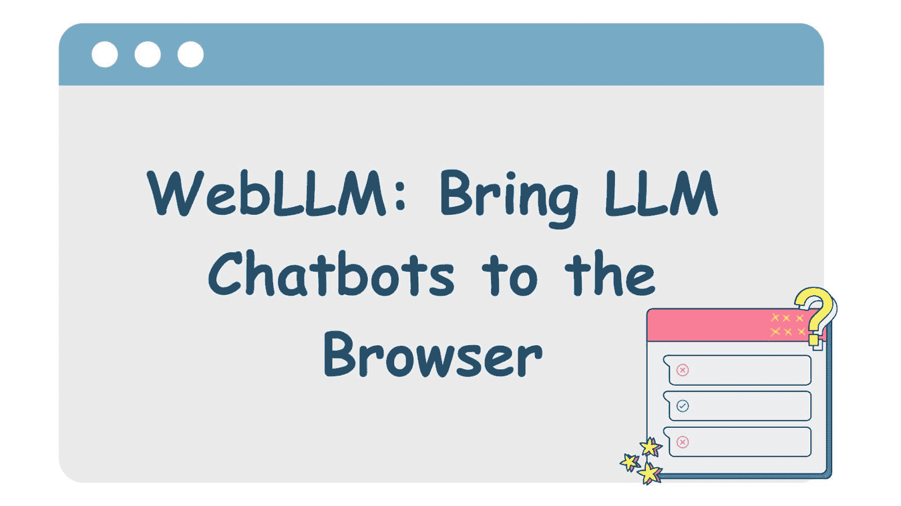
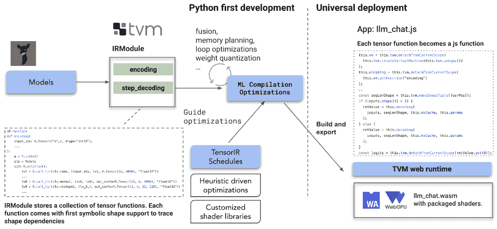
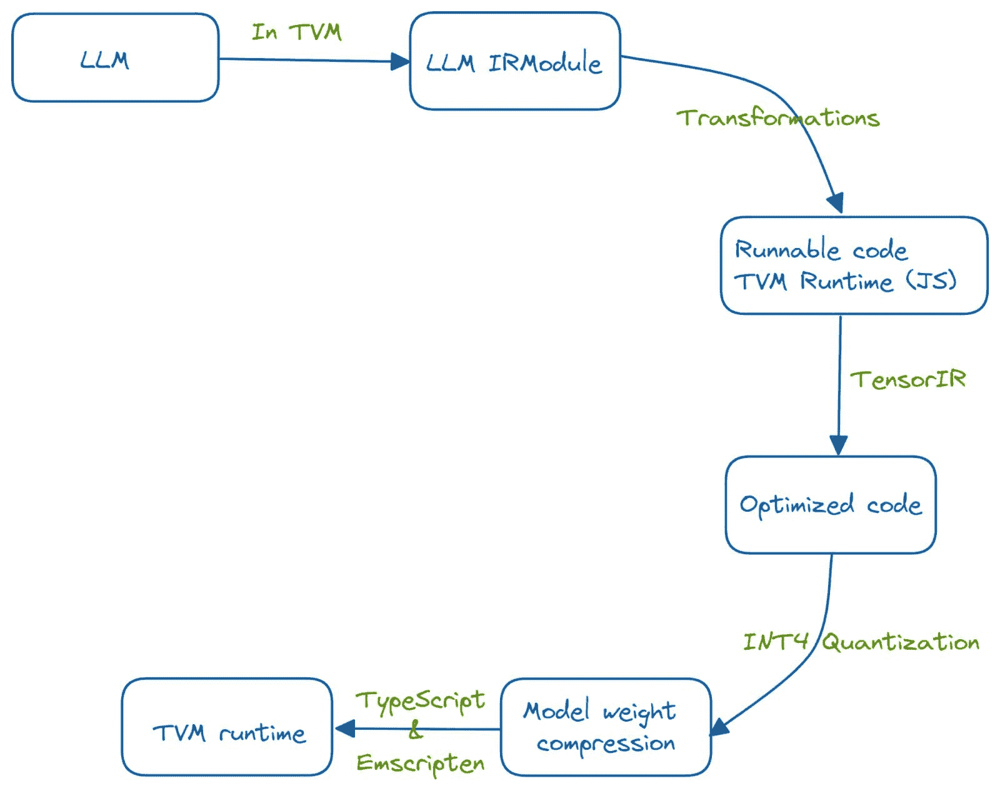
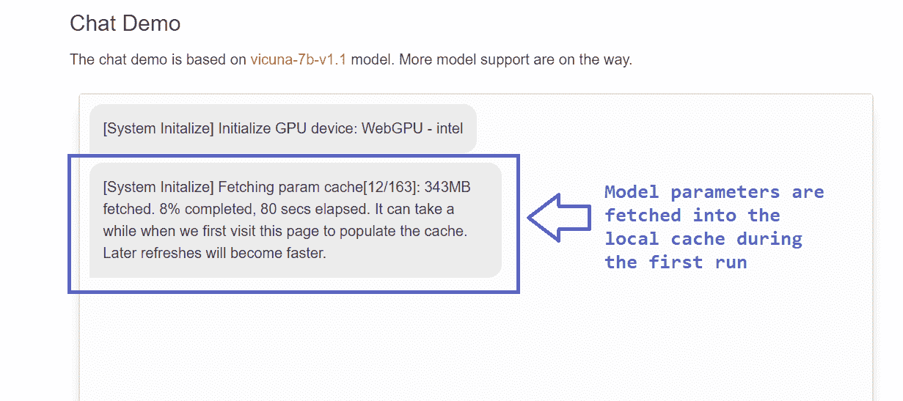

# Web LLM：将 LLM 聊天机器人带到浏览器

> 原文：[`www.kdnuggets.com/2023/05/webllm-bring-llm-chatbots-browser.html`](https://www.kdnuggets.com/2023/05/webllm-bring-llm-chatbots-browser.html)

图片由作者提供

基于 LLM 的聊天机器人通过前端访问，并涉及大量昂贵的 API 调用到服务器端。但是，如果我们能让 LLM 完全在浏览器中运行——利用底层系统的计算能力，那将会怎样呢？

* * *

## 我们的前三大课程推荐

 1\. [Google 网络安全证书](https://www.kdnuggets.com/google-cybersecurity) - 快速进入网络安全职业。

 2\. [Google 数据分析专业证书](https://www.kdnuggets.com/google-data-analytics) - 提升你的数据分析技能

 3\. [Google IT 支持专业证书](https://www.kdnuggets.com/google-itsupport) - 支持你的组织的 IT

* * *

这样，LLM 的全部功能都可以在客户端实现——无需担心服务器的可用性、基础设施等问题。Web LLM 是一个旨在实现这一目标的项目。

让我们进一步了解 Web LLM 的驱动因素以及构建这样一个项目的挑战。我们还将查看 Web LLM 的优点和局限性。

# 什么是 Web LLM？

Web LLM 是一个使用 WebGPU 和 WebAssembly 等技术，使 LLM 和 LLM 应用程序能够完全在浏览器中运行的项目。通过 Web LLM，你可以利用 WebGPU 通过底层系统的 GPU 在浏览器中运行 LLM 聊天机器人。

它使用 Apache TVM 项目的编译器栈，并使用最近发布的 [WebGPU](https://developer.mozilla.org/en-US/docs/Web/API/WebGPU_API)。除了 3D 图形渲染等功能，WebGPU API 还支持通用 GPU 计算（GPGPU 计算）。

## 构建 Web LLM 的挑战

由于 Web LLM 完全在客户端运行，没有任何推理服务器，因此项目面临以下挑战：

+   大型语言模型使用 Python 框架进行深度学习，这些框架原生支持利用 GPU 进行张量操作。

+   在构建 Web LLM 以便完全在浏览器中运行时，我们将无法使用相同的 Python 框架。因此，必须探索其他技术栈，这些技术栈能够在网页上运行 LLM，同时仍使用 Python 进行开发。

+   运行 LLM 应用程序通常需要大型推理服务器，但当一切都在客户端——即浏览器中运行时，我们将无法再使用大型推理服务器。

+   需要对模型权重进行智能压缩，以使其适合可用的内存。

# Web LLM 如何工作？

Web LLM 项目利用底层系统的 GPU 和硬件能力在浏览器中运行大型语言模型。**机器学习编译** 的过程通过利用 [TVM Unity](https://discuss.tvm.apache.org/t/establish-tvm-unity-connection-a-technical-strategy/13344) 和一系列优化，将 LLM 的功能集成到浏览器端。

Web LLM 的工作原理 | [图片来源](https://github.com/mlc-ai/web-llm)

系统使用 Python 开发，并通过 TVM 运行时在网页上运行。这一移植到网页浏览器的过程是通过一系列优化实现的。

LLM 的功能首先被集成到 TVM 中的 IRModule 中。在 IRModule 中对函数进行多个转换，以获取优化后的可运行代码。[TensorIR](https://arxiv.org/abs/2207.04296) 是一种用于优化张量计算程序的编译器抽象。此外，INT-4 量化用于压缩模型的权重。TVM 运行时则通过 TypeScript 和 [emscripten](https://emscripten.org/) 实现，后者是一个将 C 和 C++ 代码转换为 WebAssembly 的 LLVM 编译器。

作者提供的图片

你需要最新版本的 Chrome 或 [Chrome Canary](https://www.google.com/intl/en_in/chrome/canary/) 才能尝试 Web LLM。撰写本文时，Web LLM 支持 Vicuna 和 LLaMa LLM。

第一次运行模型时需要一些时间来加载模型。因为第一次运行后缓存完成，后续运行速度会明显加快，并且开销最小。

# Web LLM 的优缺点

让我们通过列举 Web LLM 的优点和限制来总结我们的讨论。

## 优点

除了探索 Python、WebAssembly 和其他技术栈的协同效应外，Web LLM 还具有以下优点：

+   在浏览器中运行 LLM 的主要优势是 **隐私**。因为这种隐私优先的设计完全消除了服务器端，我们不再需要担心数据的使用。由于 Web LLM 利用底层系统的 GPU 计算能力，我们也无需担心数据被恶意实体获取。

+   我们可以为日常活动构建个人 AI 助手。因此，Web LLM 项目提供了高度的 **个性化**。

+   Web LLM 的另一个优点是 **成本降低**。我们不再需要昂贵的 API 调用和推理服务器，Web LLM 使用底层系统的 GPU 和处理能力。因此，运行 Web LLM 的成本大大降低。

## 限制

以下是 Web LLM 的一些限制：

+   尽管 Web LLM 减轻了输入敏感信息的担忧，但它仍然容易受到浏览器攻击。

+   通过增加对多种语言模型和浏览器的支持，还有进一步改进的空间。目前，此功能仅在 Chrome Canary 和最新版本的 Chrome 中可用。扩展到更多支持的浏览器将非常有帮助。

+   由于浏览器运行的稳健性检查，使用 WebGPU 的 Web LLM 不具备 GPU 运行时的本地性能。您可以选择禁用运行稳健性检查的标志以提高性能。

# 结论

我们尝试了解 Web LLM 的工作原理。您可以尝试在浏览器中运行它，甚至可以 [在本地部署](https://github.com/mlc-ai/web-llm#instructions-for-local-deployment)。考虑在浏览器中尝试该模型，并检查它在您日常工作流程中的集成效果。如果您感兴趣，还可以查看 [MLC-LLM 项目](https://mlc.ai/mlc-llm/)，它允许您在包括笔记本电脑和 iPhone 在内的任何设备上原生运行 LLM。

# 参考文献和进一步阅读

[1] [WebGPU API](https://developer.mozilla.org/en-US/docs/Web/API/WebGPU_API)，MDN Web Docs

[2] [TensorIR：自动张量化程序优化的抽象](https://arxiv.org/abs/2207.04296)

[3] [MLC-LLM](https://mlc.ai/mlc-llm/)

**[Bala Priya C](https://www.linkedin.com/in/bala-priya/)** 是来自印度的开发者和技术作家。她喜欢在数学、编程、数据科学和内容创作的交汇点工作。她的兴趣和专长包括 DevOps、数据科学和自然语言处理。她喜欢阅读、写作、编程和喝咖啡！目前，她正在通过撰写教程、操作指南、观点文章等，学习并与开发者社区分享她的知识。

### 了解更多相关内容

+   [AgentGPT：浏览器中的自主 AI 代理](https://www.kdnuggets.com/2023/06/agentgpt-autonomous-ai-agents-browser.html)

+   [介绍 OpenChat：一个免费且简单的平台，用于构建…](https://www.kdnuggets.com/2023/06/introducing-openchat-free-simple-platform-building-custom-chatbots-minutes.html)

+   [在 5 分钟内构建一个机器学习 Web 应用程序](https://www.kdnuggets.com/2022/03/build-machine-learning-web-app-5-minutes.html)

+   [使用 Python 创建一个从音频中提取主题的 Web 应用程序](https://www.kdnuggets.com/2023/01/creating-web-application-extract-topics-audio-python.html)

+   [用 Python 在 5 分钟内构建一个网页抓取器](https://www.kdnuggets.com/2022/02/build-web-scraper-python-5-minutes.html)

+   [逐步指南：使用 Python 和 Beautiful Soup 进行网页抓取](https://www.kdnuggets.com/2023/04/stepbystep-guide-web-scraping-python-beautiful-soup.html)
