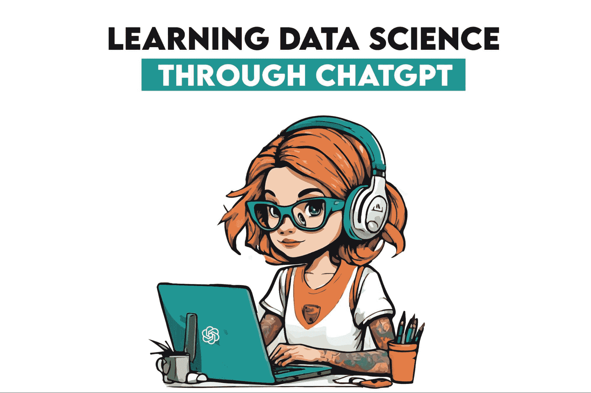
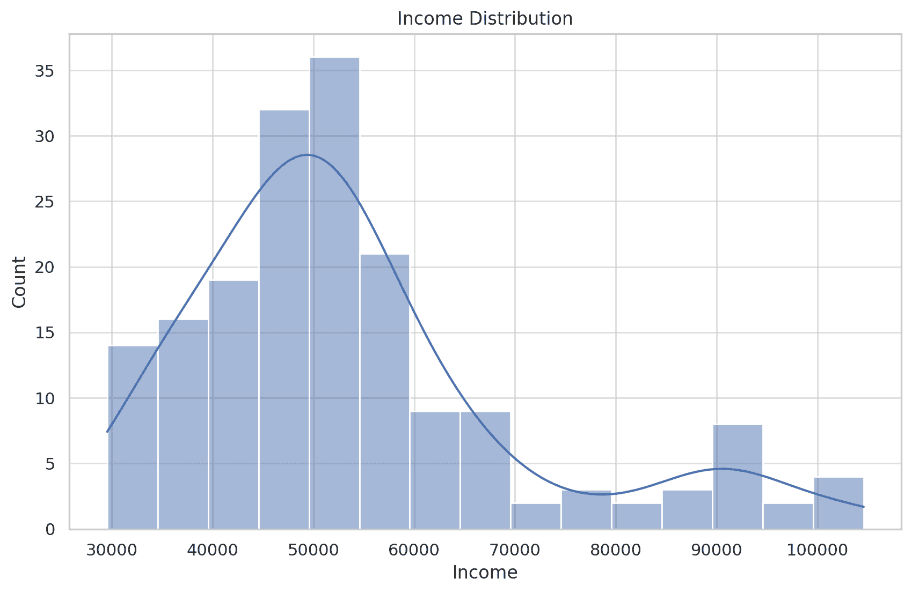
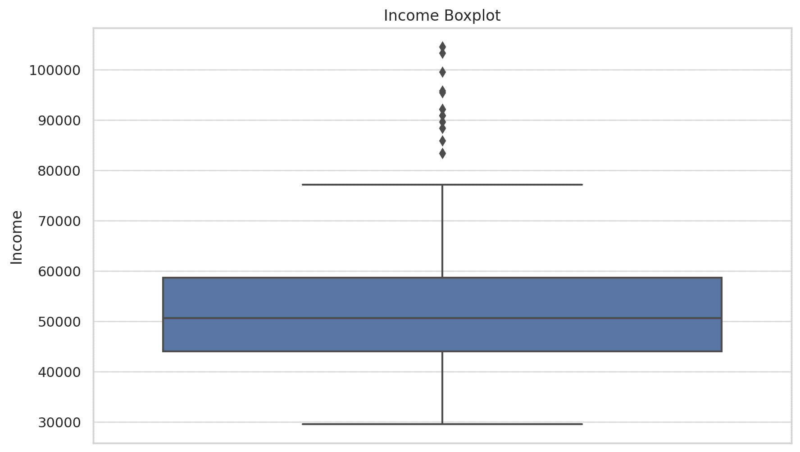
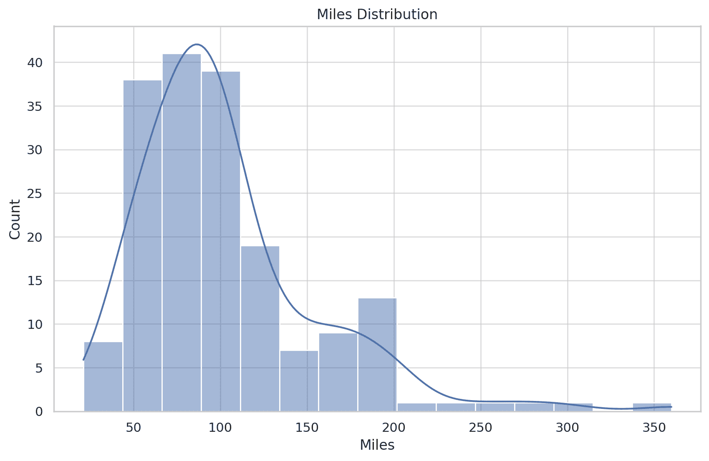
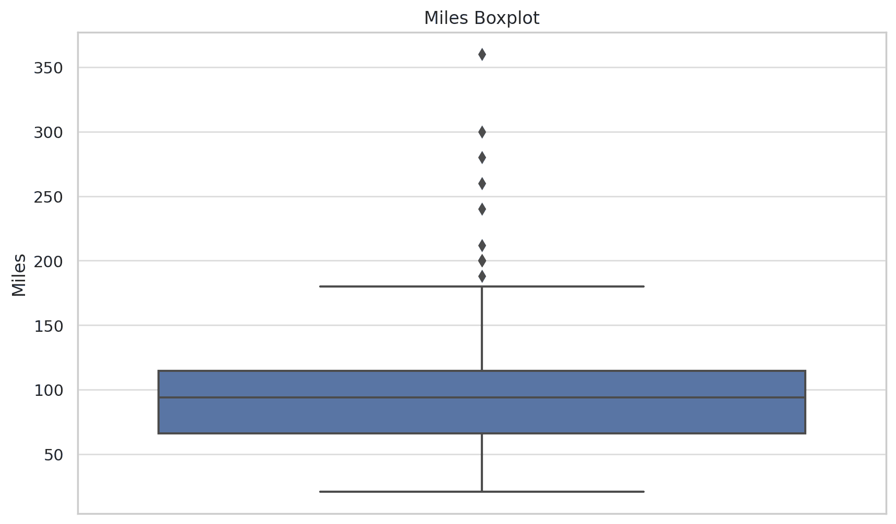
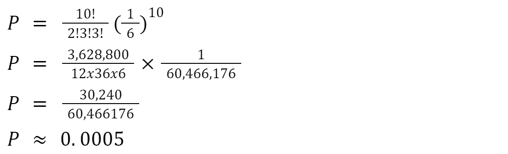

# 我从使用 ChatGPT 进行数据科学中学到的

> 原文：[`www.kdnuggets.com/what-i-learned-from-using-chatgpt-for-data-science`](https://www.kdnuggets.com/what-i-learned-from-using-chatgpt-for-data-science)



图片由作者提供

我从使用 ChatGPT 中学到的唯一一课是，它在数据科学中非常有帮助，但你必须仔细审查它输出的所有内容。它在某些任务中表现得非常出色，可以快速准确地完成这些任务。而在其他一些任务中，它表现得足够好，但你需要多次提示。而我发现 ChatGPT 对某些任务确实很糟糕。

* * *

## 我们的前 3 名课程推荐

 1\. [Google 网络安全证书](https://www.kdnuggets.com/google-cybersecurity) - 快速进入网络安全职业生涯。

 2\. [Google 数据分析专业证书](https://www.kdnuggets.com/google-data-analytics) - 提升你的数据分析技能

 3\. [Google IT 支持专业证书](https://www.kdnuggets.com/google-itsupport) - 支持你的 IT 组织

* * *

# 很棒：自动化数据探索

你可以将数据集附加到 ChatGPT 消息中，通过给出几个简单的指令，ChatGPT 可以为你探索数据。

例如，我可以从 [这个数据项目](https://platform.stratascratch.com/data-projects/treadmill-buyer-profile) 获取数据集。我给出的指令是：

“使用附加数据进行描述性统计分析。包括以下内容：

+   总结基本统计数据（均值、中位数、标准差等）。

+   识别缺失值并建议处理策略。”

它返回的总结看起来是这样的。它对每个变量进行相同的计算。

**年龄：**

+   平均值：28.79 年

+   标准差：6.94 年

+   范围：18 到 50 年

它还识别出了数据集中没有缺失值。

如果你还需要这些计算的 Python 代码，你可以提示它编写这些代码。

要加载数据集，使用这段代码。

```py
aerofit_data = pd.read_csv(file_path)
```

对于基本统计数据，它提供了这个。

```py
basic_stats = aerofit_data.describe()
```

你可以用这段代码检查缺失值。

```py
missing_values = aerofit_data.isnull().sum()
```

# 很棒：创建可视化

此外，我可以要求 ChatGPT 可视化关键变量的分布，并检测潜在的异常值和异常情况。

它为关键变量创建了直方图和箱线图：年龄、收入和里程。它检测到收入和里程分布中的潜在异常值。



创建者：作者/ChatGPT



创建者：作者/ChatGPT

它还解释了这些可视化。因此，它注意到收入分布是右偏的，这表明大多数客户的收入处于较低的范围，而较少的客户收入显著较高。箱形图显示高端有一些离群值。



由作者/ChatGPT 创建



由作者/ChatGPT 创建

相同的解释适用于 Miles 分布：右偏和高端的离群值。

考虑到数据的性质，它建议这些离群值不一定是错误的，而是代表了特定的客户群体。对于偏斜的分布，它建议使用变换（例如，对数变换）来规范化数据。

当然，你也可以让它为这些可视化创建 Python 代码。

# 很好：验证数据是否适用于特定的统计测试

我可以使用相同的数据，并询问 ChatGPT 它是否适用于[逻辑回归](https://scikit-learn.org/stable/modules/generated/sklearn.linear_model.LogisticRegression.html)。如果不适用，我该如何转换它以使其合适？

它回复说我的数据主要适用于连续数据的描述性和推断性分析。

这些是对数据进行转换以适应逻辑回归的建议方法。

**创建二元结果：** 通过根据“使用”变量的中位数将客户分类为“高使用”或“低使用”来创建二元结果。此外，二元结果还可以是“跑步机购买”与“未购买跑步机”。

**检查多重共线性：** 使用[相关矩阵](https://www.questionpro.com/blog/correlation-matrix/)或[方差膨胀因子（VIF）](https://www.investopedia.com/terms/v/variance-inflation-factor.asp#:~:text=A%20variance%20inflation%20factor%20(VIF)%20is%20a%20measure%20of%20the,in%20a%20multiple%20regression%20model.)检查多重共线性。如果存在多重共线性，可以删除或合并相关变量。

**特征缩放：** 尽管逻辑回归模型拟合不需要特征缩放，但对于[收敛](https://en.wikipedia.org/wiki/Convergence_of_random_variables)来说，特征缩放可能是有益的。这尤其适用于具有显著不同尺度的特征。

**解决非线性问题：** 对于不符合线性假设的变量，可以使用变换，如[对数](https://medium.com/@kyawsawhtoon/log-transformation-purpose-and-interpretation-9444b4b049c9)或[平方根](https://quantifyinghealth.com/square-root-transformation/)。

**样本大小：** 数据集必须足够大，以匹配预测变量的数量。

**数据预处理：** 处理离群值和分类变量（通过 [独热编码或标签编码](https://towardsdatascience.com/categorical-encoding-using-label-encoding-and-one-hot-encoder-911ef77fb5bd)）是建议的。此外，还建议处理缺失值，但这对我的数据不适用，因为没有缺失值。

# 好：自动化部分或整个数据科学项目

ChatGPT 实际上在数据科学项目的每个阶段都可以提供帮助。你可以提示它编写网页抓取代码。你可以指示它探索和准备数据，以便用于机器学习算法。它还可以为选择合适的算法、数据集拆分、A/B 测试和性能提升算法提供代码。最后，你还可以让 ChatGPT 为模型部署编写代码。

尽管 ChatGPT 可以做到这些，但你可能不会立即得到一个完全符合你需求的代码。所以，你必须理解你想要实现什么，并检查代码。可能需要提示 ChatGPT 进行代码修正，并提供更多更改说明。

# 好：代码转换和学习

ChatGPT 可以帮助那些仍在学习新编程语言的用户。假设你是一个 SQL 高手，解决 [这个面试问题](https://platform.stratascratch.com/coding/10354-most-profitable-companies?code_type=2) 对你来说没问题。然而，你希望将 Python 添加到你的技能中。ChatGPT 可以帮助你。你可以复制 SQL 代码并要求 ChatGPT 将其转换为 Python。

所以，SQL 代码是这样的。

```py
SELECT 
  company, 
  profit 
FROM 
  (
    SELECT 
      *, 
      rank() OVER (
        ORDER BY 
          profit DESC
      ) as rank 
    FROM 
      (
        SELECT 
          company, 
          sum(profits) AS profit 
        FROM 
          forbes_global_2010_2014 
        GROUP BY 
          company
      ) sq
  ) sq2 
WHERE 
  rank <= 3;
```

ChatGPT 根据上述 SQL 代码编写了 Python 代码，但它运行不正确。所以我对 ChatGPT 编写错误的代码进行批评。我要求它重试，因为输出与 SQL 代码不一样。它重试后返回了正确的结果。

```py
import pandas as pd

# Assuming 'forbes_global_2010_2014' is a pandas DataFrame with columns 'company' and 'profits'
# Since we don't have the actual data, this code assumes that the DataFrame is already loaded

# Step 1: Group by company and sum the profits
company_profits_sum = forbes_global_2010_2014.groupby('company')['profits'].sum().reset_index()

# Step 2: Rank the companies by profit in descending order
company_profits_sum['rank'] = company_profits_sum['profits'].rank(ascending=False, method='max')

# Step 3: Filter the top 3 companies
top_companies = company_profits_sum[company_profits_sum['rank'] <= 3]

# Final selection of columns
result = top_companies[['company', 'profits']].sort_values('profits', ascending=False)

result  # This will display the top 3 companies by profit
```

如你所见，你得到了一段带有每个代码块注释的漂亮代码。为了提高你的学习，你可以要求它解释这些代码。这样，你将更深入地了解每行代码的作用及其原理。

# 糟糕：统计和数学计算

当我说糟糕时，我是指真的很糟糕！它到了那种使用正确的公式并插入正确的值但却搞砸了不那么复杂的计算的程度。

看这个。我让它解决这个问题：“假设你掷一个公平的六面骰子 10 次。掷出两个 1、三个 2、一个 3、零个 4、三个 5 和一个 6 的概率是多少？”

它以这种方式计算概率。



它在计算阶乘时搞砸了。而且它很有风格地搞砸了！完全错误地说 2! = 12。其实不对，2! = 2。怎么会搞砸这样一个简单的计算，例如 2x1 = 2？这真的很可笑！

更搞笑的是，有一次 3! = 36，而第二次 3! = 6。值得称赞的是，它至少有一次是正确的。

当我要求它纠正计算而不做进一步解释时，它重新计算并得出了 0.0001389 的概率。我简直不敢相信自己的眼睛！它可以使用完全相同的公式和数值，却得出一个不同的且仍然错误的结果！

我再次要求它纠正计算，最终返回了正确的结果：0.0008336。三次是幸运的！

不可否认，这些错误是 ChatGPT 3.5 造成的。我问了 ChatGPT 4 同样的问题，它第一次尝试时就给出了正确的计算结果。你也可以使用一些数学插件以确保安全。

# 结论

从这一切中得到的主要教训是，ChatGPT 是一个糟糕的主宰但非常好的仆人。它在编写代码、调试、分析和可视化数据方面很有帮助。然而，永远不要完全信任它，也不要不加审查地采纳它写的内容。

检查它写的代码，检查计算。毕竟你是数据科学家，而 ChatGPT 不是！你可能第一次尝试时无法获得理想的结果。但给它更精确的指示并尝试几次，可能会让你达到预期的结果。

[](https://twitter.com/StrataScratch)****[内特·罗西迪](https://twitter.com/StrataScratch)**** 是一名数据科学家及产品策略专家。他还是一名兼职教授，教授分析学，并且是 StrataScratch 的创始人，该平台帮助数据科学家通过顶级公司的真实面试问题为面试做准备。内特撰写有关职业市场最新趋势的文章，提供面试建议，分享数据科学项目，并涵盖所有 SQL 内容。

### 了解更多相关话题

+   [视觉 ChatGPT：微软结合 ChatGPT 和 VFMs](https://www.kdnuggets.com/2023/03/visual-chatgpt-microsoft-combine-chatgpt-vfms.html)

+   [ChatGPT CLI：将你的命令行界面转换为 ChatGPT](https://www.kdnuggets.com/2023/07/chatgpt-cli-transform-commandline-interface-chatgpt.html)

+   [使用 ChatGPT 帮助获得数据科学职位](https://www.kdnuggets.com/using-chatgpt-to-help-land-a-data-science-job)

+   [使用 ChatGPT 生成被动收入的 4 种方法](https://www.kdnuggets.com/2023/03/4-ways-generate-passive-income-chatgpt.html)

+   [使用 ChatGPT 学习 SQL](https://www.kdnuggets.com/2023/04/chatgpt-learn-sql.html)

+   [使用 Llama 和 ChatGPT 构建多聊天后端的微服务](https://www.kdnuggets.com/building-microservice-for-multichat-backends-using-llama-and-chatgpt)
