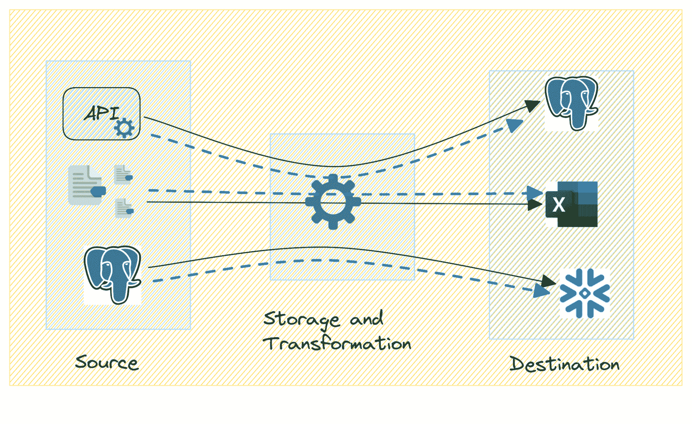

# 什么是数据血统，为什么重要？

> 原文：[`www.kdnuggets.com/what-is-data-lineage-and-why-does-it-matter`](https://www.kdnuggets.com/what-is-data-lineage-and-why-does-it-matter)

图片由 [storyset](https://www.freepik.com/free-vector/data-points-concept-illustration_8497396.htm#query=data%20lineage&position=0&from_view=search&track=ais&uuid=e1ab7fd5-a404-43db-8d0b-553ccb834e10) 提供，来自 Freepik

在任何数据管道中，从源头获取的数据通常会经历多次转化，以至于从目的地获得的数据与实际从源头获取的数据差异很大。数据血统提供了一种全面的方法来绘制数据在系统中的流动路径——从源头到目的地——以及其在过程中经历的转化。

* * *

## 我们的前三大课程推荐

 1\. [谷歌网络安全证书](https://www.kdnuggets.com/google-cybersecurity) - 快速进入网络安全职业生涯。

 2\. [谷歌数据分析专业证书](https://www.kdnuggets.com/google-data-analytics) - 提升您的数据分析技能

 3\. [谷歌 IT 支持专业证书](https://www.kdnuggets.com/google-itsupport) - 支持您的组织的 IT

* * *

在这篇文章中，我们将了解数据血统及其重要性。我们还将看到数据血统如何促进更好的数据管理，并介绍一些您可以用来处理数据血统的工具和平台。

让我们开始吧！

# 什么是数据血统？

数据血统是指跟踪和可视化数据在数据管道或系统中经过各个阶段的流动和转化。它提供了对数据在组织数据管道中起源、移动和转化的详细理解，使数据专业人员能够追踪数据从源头到目的地的路径。

对数据生命周期的这种全面理解对于那些旨在提升数据质量、确保合规性等的组织非常有帮助。

## 数据血统的关键组成部分

现在让我们探讨数据血统中需要考虑的关键组成部分：

图片由作者提供

+   **源系统**：该组件关注数据的初始来源，如数据库、日志文件、传感器、应用程序和其他外部来源。

+   **元数据**：捕捉与数据相关的元数据非常重要，因为它包括数据类型、格式以及对数据应用的任何业务规则或约束的详细信息。

+   **数据移动和转换**：跟踪 ETL 过程有助于理解数据如何从源系统提取、经历多样的转换并加载到目标系统。

+   **目的地**：数据血缘还应跟踪数据的各种中间和最终目的地，包括数据库、数据仓库、数据湖等。它还包括参与信息处理和存储的其他存储系统。最终目的地通常是存储处理数据以供分析或报告的地方。

本质上，**数据血缘提供了数据流的清晰全面视图，帮助组织理解依赖关系和联系**。因为数据血缘不仅仅提供数据流的快照，它还使组织能够对数据管理和利用做出明智的决策。

# 数据血缘的重要性

现在我们知道了数据血缘是什么，让我们继续学习它的重要性和原因。

## 数据质量和完整性

数据血缘通过提供数据旅程的透明视图，有助于保持数据质量。这种透明度确保数据保持准确、可信，并与业务目标一致。

此外，数据血缘还通过血缘追踪来帮助缓解数据质量问题。通过跟踪数据（及其相关元数据）的流动，组织可以快速识别并解决数据质量问题。

## 监管合规

数据血缘通过提供数据移动、转换和存储的全面记录，帮助组织满足监管要求。清晰地了解数据从源头到目的地的整个旅程及其转换过程，数据血缘作为确保遵守法律和行业特定规定的强有力机制。

## 故障排除和调试

数据血缘还帮助高效识别和解决数据问题。它通过提供识别故障点或不一致性的指南，简化了故障排除过程。这加速了数据相关问题的解决，减少了停机时间和操作中断。

# 数据血缘的应用

数据血缘还便于更容易的治理和提高整体效率等其他优势。

## 影响分析

数据血缘通过提供对数据源、结构或流程变更如何影响整个系统的清晰视图，有助于影响分析。这种理解在实施任何修改之前非常有帮助，以避免意外后果。

数据血缘还在做出明智决策和管理风险方面发挥作用：对数据如何被转换和使用有全面了解，决策者可以对变更、更新或实施做出明智的选择。这也确保潜在风险在对组织产生不利影响之前被识别和缓解。

## 审计和治理

数据治理依赖于透明度和问责制。数据血缘作为实施治理政策的基础工具，确保数据按照既定标准、安全协议和合规要求进行处理。

在审计过程中，监管者和内部审计员常常寻求对数据处理实践的洞察。数据血缘提供了数据移动、变换和存储的详细记录，促进了顺利审计，并证明了遵守监管要求。

## 更高效的运营

通过可视化数据流，组织可以识别数据工作流程中的冗余过程、瓶颈或低效之处。因此，数据血缘有助于消除不必要的步骤，优化数据管理的整体效率。

因为数据血缘提供了对数据流的全面而更好的理解：从数据提取到消费，它还指导工作流程优化，以减少处理时间，优化资源利用等。

总之，数据血缘的应用超越了其作为跟踪机制的角色。它作为组织评估变化影响、维持治理标准和优化运营效率的战略工具。

# 数据血缘工具和平台

正如你可能猜到的，数据血缘可以从一定程度的自动化中受益。由于自动化工具可以持续监控数据流动和变换，提供数据血缘的实时更新，它确保信息始终是最新的，并反映最新的变化。

数据血缘领域的一些显著工具包括：

+   [Collibra](https://www.collibra.com/us/en/products/data-lineage)：包括强大的数据血缘功能，用于可视化和理解数据的端到端旅程。

+   [Informatica Axon](https://www.informatica.com/in/products/data-quality/axon-data-governance.html)：作为 Informatica 平台的一部分，Axon 提供数据治理和元数据管理。

+   [IBM InfoSphere Information Governance Catalog](https://www.ibm.com/products/information-governance-catalog)：一个管理元数据并在复杂企业环境中提供端到端数据血缘跟踪的工具。

+   [Apache Atlas](https://atlas.apache.org)：一个开源工具，提供全面的元数据管理和数据血缘能力，常用于大数据生态系统中。

+   [Erwin Data Intelligence (DI)](https://www.erwin.com/products/erwin-data-intelligence/)：提供对数据资产的全面视图，包括数据血缘，以支持数据治理和合规工作。

# 总结

在这篇文章中，我们回顾了数据血缘及其在确保数据质量、合规要求等方面的重要性。此外，我们讨论了追踪数据血缘如何帮助进行影响分析和优化系统效率。

最后，我们介绍了一些可以用来跟踪数据血缘的工具。希望你觉得这篇文章对你有帮助！

****[Bala Priya C](https://www.kdnuggets.com/wp-content/uploads/bala-priya-author-image-update-230821.jpg)**** 是一位来自印度的开发者和技术作家。她喜欢在数学、编程、数据科学和内容创作的交汇点上工作。她的兴趣和专长包括 DevOps、数据科学和自然语言处理。她喜欢阅读、写作、编码和喝咖啡！目前，她正在学习并与开发者社区分享她的知识，通过撰写教程、操作指南、观点文章等方式。Bala 还制作了引人入胜的资源概述和编码教程。

### 更多相关主题

+   [从新手到高手：为什么你的 Python 技能在数据科学中很重要](https://www.kdnuggets.com/novice-to-ninja-why-your-python-skills-matter-in-data-science)

+   [ChatGPT 在做什么，它为什么有效？](https://www.kdnuggets.com/2023/04/chatgpt-work.html)

+   [机器学习未能为我的业务创造价值。为什么？](https://www.kdnuggets.com/2021/12/machine-learning-produce-value-business.html)

+   [KDnuggets 新闻，11 月 30 日：什么是切比雪夫定理以及如何…](https://www.kdnuggets.com/2022/n46.html)

+   [什么是切比雪夫定理，它如何应用于数据科学？](https://www.kdnuggets.com/2022/11/chebychev-theorem-apply-data-science.html)

+   [什么是 K-Means 聚类及其算法如何工作？](https://www.kdnuggets.com/2023/05/kmeans-clustering-algorithm-work.html)
