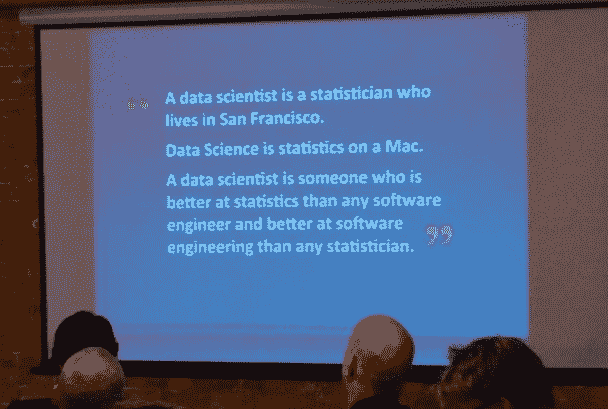
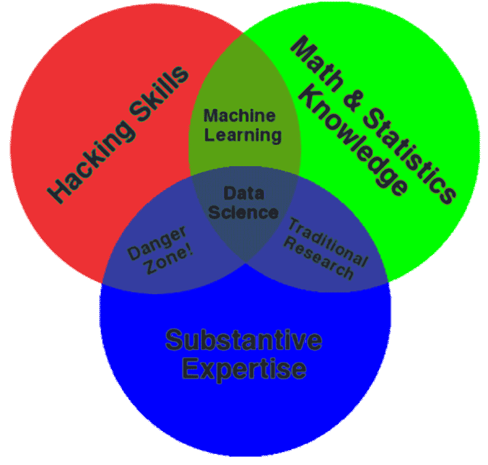
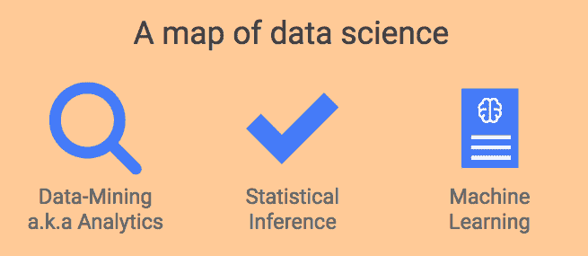
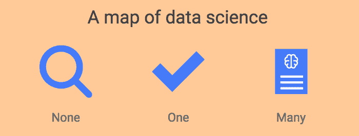
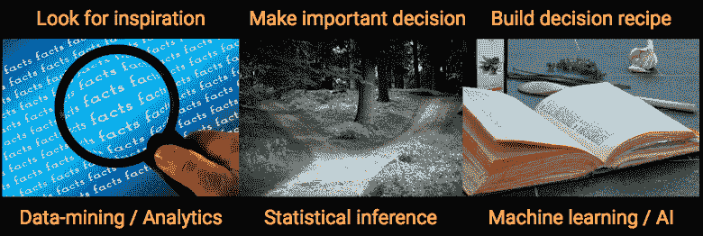

# 数据科学到底是什么？

> 原文：[`www.kdnuggets.com/2018/09/what-is-data-science.html`](https://www.kdnuggets.com/2018/09/what-is-data-science.html)

 评论

请看我最简洁的尝试：

> * * *
> 
> ## 我们的前三大课程推荐
> ## 
>  1\. [Google 网络安全证书](https://www.kdnuggets.com/google-cybersecurity) - 快速进入网络安全职业生涯。
> 
>  2\. [Google 数据分析专业证书](https://www.kdnuggets.com/google-data-analytics) - 提升你的数据分析水平
> 
>  3\. [Google IT 支持专业证书](https://www.kdnuggets.com/google-itsupport) - 支持您组织的 IT 需求
> 
> * * *
> 
> **数据科学是使数据变得有用的学科**。

随时可以离开，或者留下来了解它的三个子领域。

+   [统计学](https://towardsdatascience.com/statistics-for-people-in-a-hurry-a9613c0ed0b)

+   [机器学习](https://hackernoon.com/the-simplest-explanation-of-machine-learning-youll-ever-read-bebc0700047c)

+   [数据挖掘 / 分析](https://hackernoon.com/top-10-roles-for-your-data-science-team-e7f05d90d961)

### 这个术语没有人真正定义

如果你探索一下**数据科学**这一术语的早期[历史](https://www.forbes.com/sites/gilpress/2013/05/28/a-very-short-history-of-data-science/#6b64132f55cf)，你会发现两个主题正在汇聚。让我为你稍作改述，供你娱乐：

+   大数据（更大的数据）意味着更多的计算机调整。

+   [统计学家](https://towardsdatascience.com/statistics-for-people-in-a-hurry-a9613c0ed0b) 无法从纸袋中脱身。

就这样，数据科学诞生了。我第一次听到的工作定义是“**数据科学家**是一个**统计学家**，但能编码。”对此我有很多看法，[稍后](https://medium.com/@kozyrkov/is-data-science-a-bubble-c70ceac0f264)会详细讲述，但首先，我们不妨看看数据科学本身？

[Twitter 定义](https://twitter.com/cdixon/status/428914681911070720) 约 2014 年。

我喜欢 2003 年[*数据科学杂志*](http://www.jds-online.com/)的发布方式，它直接聚焦于最狭窄的范围：*“我们所说的‘数据科学’几乎指的是与数据有关的****所有****事物。”* 所以……一切都包括在内？很难想到什么是不涉及信息的。（我应该停止思考这个问题，以免我的脑袋爆炸。）

从那时起，我们见证了无数的意见，从康威广为流传的维恩图（*见下*）到梅森和威金斯的[经典帖子](http://www.dataists.com/2010/09/a-taxonomy-of-data-science/)。

[Drew Conway](http://drewconway.com/) 对数据科学的定义。我的个人喜好更倾向于 [Wikipedia](https://en.wikipedia.org/wiki/Data_science) 上的定义。

**Wikipedia** 有一个非常接近我教给学生的定义：

*数据科学是一个‘统一统计学、数据分析、机器学习及其相关方法’的概念，目的是‘通过数据理解和分析实际现象’。*

这有点复杂，所以让我看看是否可以简短明了：

> *“数据科学是使数据有用的学科。”*

你现在可能在想，*“不错的尝试，Cassie。很可爱，但这是一种极其有损的简化。‘有用’这个词如何能涵盖所有那些行话呢？”*

好吧，我们用图片来争论一下吧。

这是为你准备的数据科学地图，完全忠于 [Wikipedia](https://en.wikipedia.org/wiki/Data_science) 的定义。

这些东西是什么，你如何知道自己在地图上的位置？

如果你打算按 **标准工具包** 来划分，慢点。统计学家和机器学习工程师之间的区别并不是一个使用 R 另一个使用 Python。SQL 与 R 与 Python 的分类方法是有诸多不便之处的，其中之一就是软件会不断进化。（最近，你甚至可以在 [SQL 中进行 ML](https://cloud.google.com/bigquery/docs/bigqueryml-intro)）。你难道不希望有一个能持续有效的分类吗？事实上，干脆不看这一整段话。

也许更糟糕的是初学者最喜欢的空间划分方式。没错，你猜对了：按 **算法** 划分（惊讶吧！这就是大学课程的结构方式）。拜托，不要通过直方图与 t 检验与神经网络来进行分类。坦率地说，如果你聪明并且有一个观点，你可以用相同的算法处理数据科学的任何部分。它可能看起来像弗兰肯斯坦的怪物，但我向你保证，它可以被迫按你的要求行事。

剧情发展够多了！这是我提出的分类法：

### 无-一-多

这到底是什么？当然是决策！（在 *不完全信息* 下。当所有你需要的事实都对你可见时，你可以使用描述性分析来做出尽可能多的决策。只需查看事实，你就完成了。）

> *正是通过我们的行动——我们的决策——我们影响了周围的世界。*

我曾承诺过我们将讨论如何使数据有用。对我来说，有用的概念与影响现实世界的行动紧密相关。如果我相信圣诞老人，这并不特别重要，除非它可能以某种方式影响我的行为。然后，根据这种行为的潜在后果，它可能会变得非常重要。正是通过我们的行动——我们的决策——我们影响了周围的世界（并邀请它反过来影响我们）。

所以这是为你准备的新决策导向图，包含了三种主要的方法来使你的数据有用。

### 数据挖掘

如果你还不知道你想做出什么决策，你能做的最好事情就是去寻找灵感。这被称为数据挖掘、分析、描述性分析、探索性数据分析（EDA）或知识发现（KD），具体取决于你在易受影响的时期与哪个圈子交往。

> *分析的黄金法则：只对你能看到的内容得出结论。*

除非你知道如何框定你的决策，否则从这里开始。好消息是，这个比较简单。把你的数据集看作是在暗房里找到的一堆底片。数据挖掘就是快速操作设备，尽可能快地显现所有图像，以便查看是否有任何启发性的内容。就像处理照片一样，记住不要过于认真地对待你所看到的东西。你没有拍这些照片，所以你不了解屏幕外的内容。数据挖掘的黄金法则是：**坚持在这里存在的内容。** 只对你能看到的内容得出结论，绝不要对你看不到的内容得出结论（对于那你需要统计学和更多专业知识）。

除此之外，你没有做错的余地。速度是关键，所以开始练习吧。

> *数据挖掘的专业性取决于你检查数据的速度。保持警觉，不要错过有趣的细节。*

暗房起初可能会让人感到害怕，但其实没那么复杂。只需学会操作设备即可。这里有一个[R](https://www.datacamp.com/community/tutorials/tidyverse-tutorial-r)教程，另一个在[Python](https://www.datacamp.com/community/tutorials/kaggle-machine-learning-eda)中可以帮助你入门。你可以在开始享受乐趣时称自己为数据分析师，当你能够以闪电般的速度揭示照片（以及其他类型的数据集）时，你可以称自己为专家分析师。

### 统计推断

灵感便宜，但严谨却昂贵。如果你想超越数据，你需要专业的培训。作为一个拥有本科和研究生统计学专业背景的人，我可能有些偏见，但在我看来，统计推断（简称统计学）是三大领域中最困难且充满哲学性的。掌握它需要花费最多的时间。

> *灵感便宜，但严谨却昂贵。*

如果你打算做出高质量、风险控制的重大决策，这些决策依赖于对超出你可用数据的世界的结论，你将需要将统计技能带入你的团队。一个很好的例子是，当你的手指悬停在 AI 系统的启动按钮上时，你突然想到需要在发布之前检查它是否有效（始终是个好主意，认真说）。离开按钮，叫上统计学家。

> *统计学是改变你思维的科学（在不确定性中）。*

如果你想了解更多，我写了[这篇 8 分钟的统计学超级总结](https://towardsdatascience.com/statistics-for-people-in-a-hurry-a9613c0ed0b)供你欣赏。

### 机器学习

机器学习本质上是[使用示例而不是说明制作事物标记的配方。](https://hackernoon.com/the-simplest-explanation-of-machine-learning-youll-ever-read-bebc0700047c) 我写了一些相关文章，包括它是否[不同于 AI](https://medium.com/@kozyrkov/are-you-using-the-term-ai-incorrectly-911ac23ab4f5)，如何[入门](https://hackernoon.com/imagine-a-drunk-island-advice-for-finding-ai-use-cases-8d47495d4c3f)，[企业为何在此失败](https://hackernoon.com/why-businesses-fail-at-machine-learning-fbff41c4d5db)，以及一系列通俗语言解析术语细节的前几篇文章（[从这里开始](https://towardsdatascience.com/explaining-supervised-learning-to-a-kid-c2236f423e0f)）。哦，如果你想与不懂英语的朋友分享，其中一些文章已经翻译[在这里](https://medium.com/@kozyr_91350/)。

### **数据工程**

那么关于[**数据工程**](https://www.dataquest.io/blog/what-is-a-data-engineer/)，即将数据提供给数据科学团队的工作呢？由于这是一个复杂的领域，我更愿意将其从数据科学的霸权野心中保护起来。此外，它与软件工程的关系更密切，而非统计学。

> *数据工程和数据科学之间的差异是前后之分。*

你可以把**数据工程与数据科学**的区别视为**前后之分**。大多数技术工作（在数据诞生之前）可以舒适地称为“数据工程”，而一旦数据到达后（之后）我们所做的一切就是“数据科学”。

#### 决策智能

[决策智能完全围绕决策](https://www.youtube.com/watch?v=x1k37Na1iLc)，包括使用数据进行大规模决策，这使得它成为一种工程学科。它通过引入社会科学和管理科学的观点来增强数据科学的应用方面。

> *决策智能添加了来自社会和管理科学的组件。*

换句话说，它是数据科学中不涉及创建通用方法论等研究性内容的一个超集。

还想要更多？[这是数据科学项目中的角色分析](https://hackernoon.com/top-10-roles-for-your-data-science-team-e7f05d90d961)，可以在我继续敲击键盘的时候娱乐一下。

[原文](https://hackernoon.com/what-on-earth-is-data-science-eb1237d8cb37)。已获转载许可。

**相关：**

+   [数据挖掘书籍 – 章节下载](https://www.kdnuggets.com/2018/08/jmp-data-mining-techniques-free-chapter.html)

+   [数据科学家和 AI 产品的 UX 设计指南](https://www.kdnuggets.com/2018/08/ux-design-guide-data-scientists-ai-products.html)

+   [R 中的控制结构：使用 If-Else 语句和循环](https://www.kdnuggets.com/2018/02/control-structures-r-using-if-else-statements-loops.html)

### 了解更多关于此主题的信息

+   [在 Python 中使用 Google Earth 构建地理空间应用程序…](https://www.kdnuggets.com/2022/03/building-geospatial-application-python-google-earth-engine-greppo.html)

+   [停止学习数据科学以寻找目标，并找到目标…](https://www.kdnuggets.com/2021/12/stop-learning-data-science-find-purpose.html)

+   [数据科学基础：入门所需了解的 10 项关键技能](https://www.kdnuggets.com/2020/10/data-science-minimum-10-essential-skills.html)

+   [KDnuggets™ 新闻 22:n06，2 月 9 日：数据科学编程…](https://www.kdnuggets.com/2022/n06.html)

+   [数据科学定义幽默：奇趣名言合集…](https://www.kdnuggets.com/2022/02/data-science-definition-humor.html)

+   [5 个数据科学项目来学习 5 种关键的数据科学技能](https://www.kdnuggets.com/2022/03/5-data-science-projects-learn-5-critical-data-science-skills.html)
