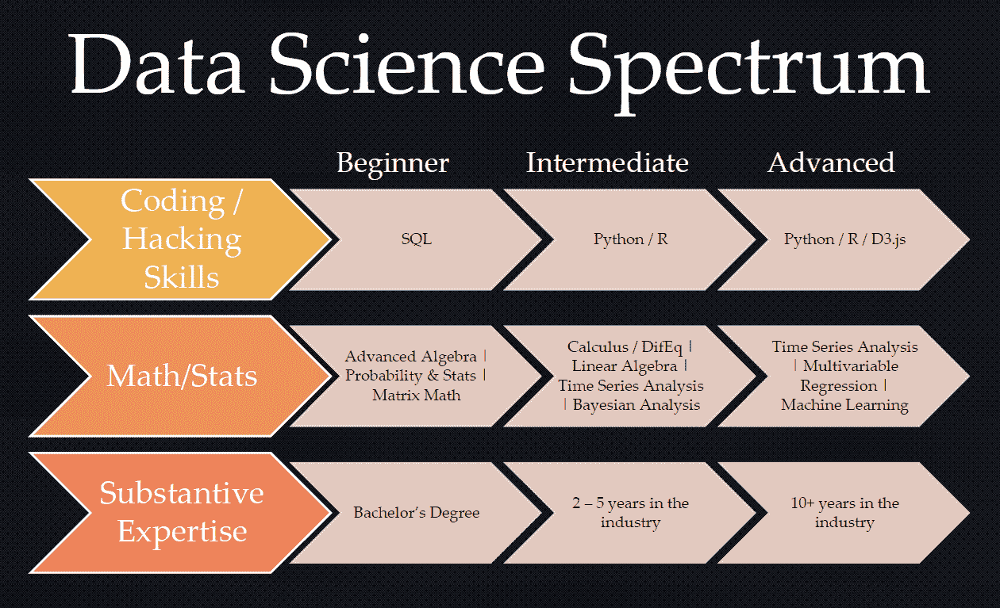
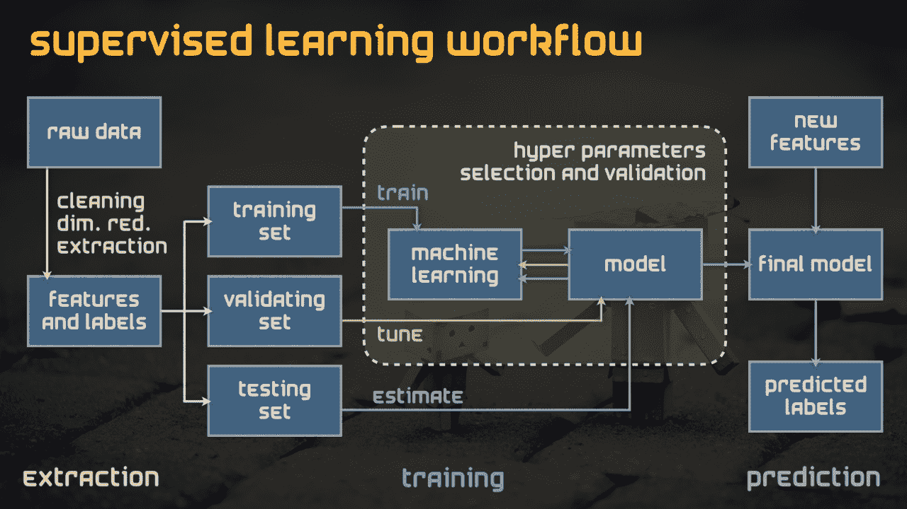

# 数据科学的方法有什么问题？

> 原文：[`www.kdnuggets.com/2019/07/whats-wrong-with-data-science.html`](https://www.kdnuggets.com/2019/07/whats-wrong-with-data-science.html)

 评论来源: https://www.data-mania.com/blog/real-vs-fake-data-scientists-what-you-really-need-to-know/

数据科学是将统计学、编程和领域知识应用于生成对需要解决的问题的洞察。《哈佛商业评论》称 [数据科学家是 21 世纪最性感的职业](https://hbr.org/2012/10/data-scientist-the-sexiest-job-of-the-21st-century)。**那篇文章被引用的频率有多高？**

* * *

## 我们的前三大课程推荐

 1\. [谷歌网络安全证书](https://www.kdnuggets.com/google-cybersecurity) - 快速进入网络安全职业生涯。

 2\. [谷歌数据分析专业证书](https://www.kdnuggets.com/google-data-analytics) - 提升你的数据分析技能

 3\. [谷歌 IT 支持专业证书](https://www.kdnuggets.com/google-itsupport) - 支持你的组织在 IT 方面

* * *

职业“数据科学家”已经存在了几十年，只是以前没有称为“数据科学家”。统计学家们已经使用机器学习技术，如逻辑回归和随机森林进行预测和洞察。那些统计学家也通常在线性代数和微积分方面非常有知识。统计学家们甚至为数据科学贡献了最伟大的礼物之一——[R](https://www.r-project.org/)。罗斯·伊哈卡和罗伯特·绅士是两位统计学家，他们为我们提供了 R 语言，使我们能够用几行代码进行复杂的分析。参见这篇论文：[R: A Language for Data Analysis and Graphics by Ross Ihaka and Robert Gentleman](https://www.stat.auckland.ac.nz/~ihaka/downloads/R-paper.pdf)。

近年来，分析师推测我们将在未来几年看到数百万数据科学家的短缺，大学正在推出新课程，潜在学生正在争相成为填补这一空缺的下一届数据科学家，获得[$100,000 的薪水和美国№1 的工作](https://www.marketwatch.com/story/the-most-sought-after-job-in-america-pays-110000-but-you-will-need-this-skill-2017-09-21)（这并不是现实，尤其是对于初学者，尽管可能会有例外）。虽然大学教育在大多数情况下是足够的，但许多人选择了 MOOC 来支持他们的数据科学职业道路。Coursera、edX、Data Camp 和 Data Quest 是一些人们转向并信任的著名 MOOC。问题在于，参加这些课程的人可能在统计学基础方面不够合格，无法理解所教授的内容。

有些人忘记了数据科学或任何名称的工作都基于多年的辛勤工作、学习和对工作的热情。过去的统计学家并不像今天的“数据科学家”那样受到追捧。这个职业面临被贬值的风险，可能变成一个人可以花不到$100 就能在线开始的工作。我支持更多的教育和在线学习机会，但这个职业不应被贬值。

### 数据科学家在机器学习项目中需要考虑哪些因素？

来源：http://blog.bidmotion.com/2016/06/23/good-morning-have-you-used-machine-learning/supervised-workflow-machine-learning/

这是一个人可以使用自动化技术构建模型的地方，但如果没有人类的直觉来指导，深入探讨问题的所在，模型仍然会失败。

**数据预处理**

处理异常值、缺失值、编码类别变量、分箱、类型转换、拼写错误、重复行、类别不平衡等，不能仅依靠自动化技术完成。根据媒体和当前数据科学家的说法，数据预处理占据了数据科学家工作量的 80%。虽然自动化可以在一定程度上提供帮助，但从探索性数据分析中得出的结论应该由具有行业知识或具备足够统计学知识的人做出。

**超参数调优**

机器学习包提供了具有默认超参数设置的模型用于训练和测试。可以简单地更改参数来调整模型。然而，仅仅更改参数而不探索这些更改的结果是浪费时间。更改超参数可能会导致模型过拟合、欠拟合、偏倚等。不同的模型也会有不同的探索方式。例如，在调整决策树时，最好绘制树形图以查看调整的结果，因为通过更改复杂性参数，你可能会修剪树到一个程度，以至于你的模型过拟合/欠拟合。

**不平衡数据**

这是所有现实世界数据面临的问题。类别不平衡并不是异常现象，而是需要在建模和评估阶段加以适应/考虑的东西。他们要么需要重新采样数据，要么改变每个类别的阈值概率（即，降低预测少数类别的阈值概率）。

### 结论

虽然有很多人成功完成了转型，但许多人并不如此积极地转型为医生、工程师或律师。数据科学的职业不应被稀释到我们说任何人都可以成为数据科学家的程度。每个人都应有机会选择任何职业，但说任何人都能做到这一点只会将这一职业稀释成不需要本科生、研究生或博士候选人所投入的工作量。

**相关：**

+   为什么你还不是一个具备就业准备的数据科学家

+   如果你是一名正在转型为数据科学家的开发者，这里是你最好的资源

+   学习数据科学硕士是否值得？

### 更多相关话题

+   [成为优秀数据科学家所需的 5 项关键技能](https://www.kdnuggets.com/2021/12/5-key-skills-needed-become-great-data-scientist.html)

+   [每个初学者数据科学家应掌握的 6 种预测模型](https://www.kdnuggets.com/2021/12/6-predictive-models-every-beginner-data-scientist-master.html)

+   [2021 年最佳 ETL 工具](https://www.kdnuggets.com/2021/12/mozart-best-etl-tools-2021.html)

+   [停止学习数据科学以寻找目标，并寻找目标去……](https://www.kdnuggets.com/2021/12/stop-learning-data-science-find-purpose.html)

+   [学习数据科学统计的顶级资源](https://www.kdnuggets.com/2021/12/springboard-top-resources-learn-data-science-statistics.html)

+   [建立一个稳固的数据团队](https://www.kdnuggets.com/2021/12/build-solid-data-team.html)
