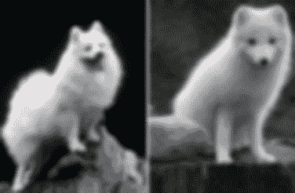
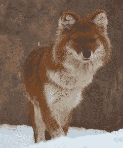
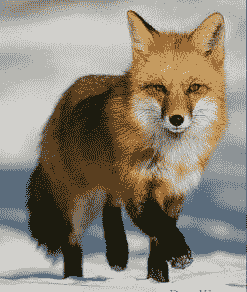
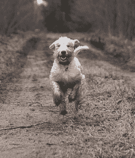
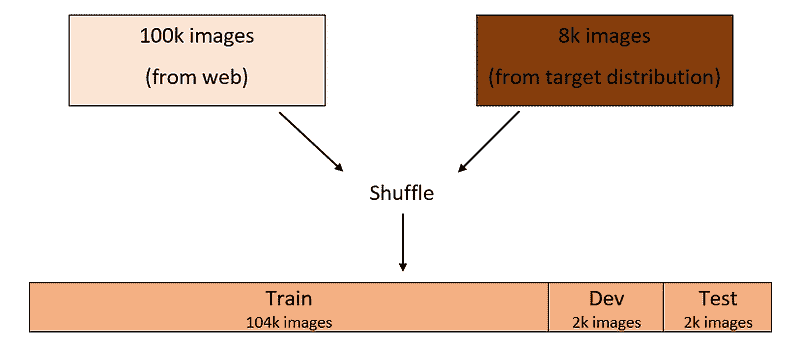
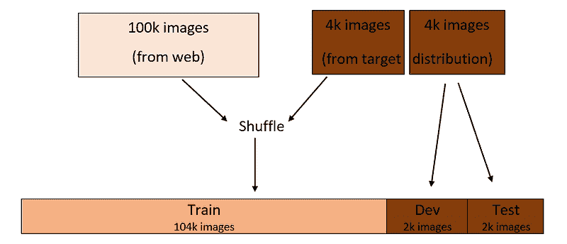
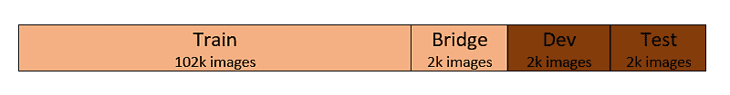
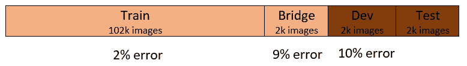
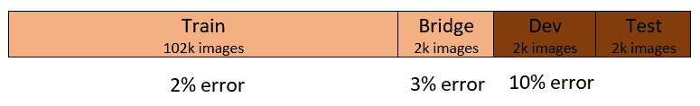
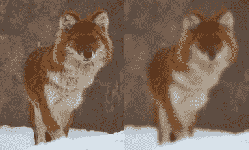

# 当你的训练数据和测试数据来自不同的分布时应该怎么办

> 原文：[`www.kdnuggets.com/2019/01/when-your-training-testing-data-different-distributions.html`](https://www.kdnuggets.com/2019/01/when-your-training-testing-data-different-distributions.html)

评论

**由[Nezar Assawiel](https://www.linkedin.com/in/assawiel/)，机器学习开发者，Clinical AI 创始人**

版权： [`www.chessbazaar.com/blog/game-chess-can-make-child-genius-smarter/`](https://www.chessbazaar.com/blog/game-chess-can-make-child-genius-smarter/)

* * *

## 我们的前三个课程推荐

 1\. [谷歌网络安全证书](https://www.kdnuggets.com/google-cybersecurity) - 快速进入网络安全职业。

 2\. [谷歌数据分析专业证书](https://www.kdnuggets.com/google-data-analytics) - 提升你的数据分析技能

 3\. [谷歌 IT 支持专业证书](https://www.kdnuggets.com/google-itsupport) - 支持你所在组织的 IT

* * *

要构建一个表现良好的机器学习（ML）模型，必须在来自相同目标分布的数据上训练和测试模型。

然而，有时候只能收集到有限数量的目标分布数据。这可能不足以构建所需的训练/开发/测试集。

然而，类似的数据可能会从其他数据分布中轻松获得。在这种情况下应该怎么办？让我们讨论一些想法吧！

### ****一些背景知识****

为了更好地跟上讨论，如果你对以下基本的机器学习（ML）概念不熟悉，可以阅读一下：

+   **训练、开发（开发）和测试集：** 请注意，开发集也被称为验证集或保留集。[这篇文章](https://towardsdatascience.com/train-validation-and-test-sets-72cb40cba9e7)是一个很好的简短介绍。

+   **偏差（欠拟合）和方差（过拟合）错误：** [这篇文章](https://www.quora.com/What-is-the-best-way-to-explain-the-bias-variance-trade-off-in-layman%E2%80%99s-terms)对这些错误提供了很好的简单解释。

+   **如何正确地划分训练/开发/测试集：** 你可以参考[这篇文章](https://medium.freecodecamp.org/how-to-strategically-accomplish-your-machine-learning-models-performance-goals-44dddc11697e) 以获得关于这一主题的简短背景介绍。

### 场景

假设你正在构建一个狗图像分类器应用程序，用于判断图像是否为狗。

该应用程序旨在为农村地区的用户提供服务，用户可以通过他们的移动设备拍摄动物照片，然后应用程序将对这些动物进行分类。

研究目标数据分布时——你发现这些图像大多模糊、分辨率低，并且类似于下图：

左：狗（意大利小型梗犬品种），右：北极狐。

你只能收集到 8,000 张这样的图像，这不足以构建训练/验证/测试集。假设你已经确定需要至少 100,000 张图像。

你想知道是否可以使用来自另一个数据集的图像——除了你收集的 8,000 张图像——来构建训练/验证/测试集。

你意识到你可以很容易地从网络上抓取数据，构建一个 100,000 张图像或更多的数据库，其图像中的狗和非狗的频率与所需的频率相似。

但是，很明显，这个网络数据集来自不同的分布，具有高分辨率和清晰的图像，如下所示：

      

狗的图像（左边和右边）和狐狸的图像（中间）。

你将如何构建训练/验证/测试集？

你不能仅仅使用你收集的 8,000 张原始图像来构建训练/验证/测试集，因为这些图像不足以构建一个表现良好的分类器。通常，计算机视觉和其他自然感知问题——语音识别或自然语言处理——需要大量的数据。

同样，你不能仅仅使用网络数据集。分类器在用户的模糊图像上的表现不好，而这些图像与用来训练模型的清晰、高分辨率的网络图像不同。

那么，你该怎么办？让我们考虑一些可能性。

### **一个可能的选择——打乱数据**

你可以做的是将这两个数据集合并并进行随机打乱。然后，将结果数据集划分为训练/验证/测试集。

假设你决定将数据划分为 96:2:2%的训练/验证/测试集，这个过程将会是这样的：

使用这种设置，训练/验证/测试集都来自相同的分布，如上图中的颜色所示，这样是理想的。

但是，这里有一个很大的缺陷！

如果你查看验证集，从 2,000 张图像中，平均只有 148 张来自目标分布。

这意味着在大多数情况下，你是在为网络图像分布（2,000 张图像中的 1,852 张）优化分类器——这**不是**你想要的！

对于测试集也是如此，当评估分类器的性能时也是如此。因此，这不是一种好的训练/验证/测试集划分方式。

### **更好的选择**

另一种选择是使验证/测试集来自目标分布的数据集，而训练集来自网络数据集。

假设你仍然使用 96:2:2%的划分比例用于训练/开发/测试集。开发/测试集将各包含 2,000 张图像——来自目标分布——其余部分将用于训练集，如下图所示：

使用这种划分，你将优化分类器以在目标分布上表现良好，这正是你关心的。这是因为开发集的图像完全来自目标分布。

然而，训练分布现在不同于开发/测试分布。这意味着大部分时间你是在对网络图像进行分类器训练。因此，优化模型将需要更长的时间和更多的努力。

更重要的是，你将无法轻易判断开发集上的分类器错误相对于训练集错误是方差错误、数据不匹配错误，还是两者的组合。

让我们更详细地考虑一下这个问题，看看我们可以做些什么。

### **方差与数据不匹配**

考虑上面第二种选项的训练/开发/测试划分。假设人为错误为零，以简化计算。

同样，假设你发现训练错误为 2%，开发错误为 10%。那么这 8%错误中有多少是由于这两个集之间的数据不匹配——考虑到它们来自不同的分布？有多少是由于模型的方差（过拟合）？我们无法得知。

让我们修改训练/开发/测试划分。拿出训练集的一小部分，称之为“桥接”集。桥接集将不用于训练分类器，而是作为独立集。现在的划分有四个集合，属于两个数据分布——如下所示：

### **方差错误**

假设你发现训练错误和开发错误分别为 2%和 10%。你发现桥接错误为 9%，如下所示：

那么，训练集和开发集之间的 8%错误中，有多少是方差错误，有多少是数据不匹配错误？

很简单！答案是 7%是方差错误，1%是数据不匹配错误。但为什么呢？

因为桥接集来自与训练集相同的分布，且它们之间的错误差异为 7%。这意味着分类器过度拟合了训练集。这告诉我们我们面临一个**高方差问题**。

### **数据不匹配错误**

现在，让我们假设你发现桥接集的错误率为 3%，其余的保持不变，如下所示：

训练集和开发集之间 8%的错误中有多少是方差错误，有多少是数据不匹配错误？

答案是 1%是方差错误，7%是数据不匹配错误。为什么？

这次，因为分类器在未见过的数据集上表现良好，如果它来自相同的分布，如桥接集。如果它来自不同的分布，如开发集，则表现较差。因此，我们遇到了**数据不匹配问题**。

减少方差错误是机器学习中的一个常见任务。例如，你可以使用正则化方法，或分配一个更大的训练集。

然而，减少数据不匹配错误是一个更有趣的问题。所以，让我们深入讨论一下。

### **减轻数据不匹配**

为了减少数据不匹配错误，你需要以某种方式将开发/测试数据集的特征——即目标分布——融入训练集中。

从目标分布中收集更多数据以添加到训练集中总是最好的选择。但如果这不可行（如我们在讨论开始时假设的那样），你可以尝试以下方法：

### **错误分析**

分析开发集上的错误以及这些错误与训练集上的错误的不同，可能会给你提供解决数据不匹配问题的思路。

例如，如果你发现开发集中的许多错误发生在动物图像的背景是岩石时，你可以通过将带有岩石背景的动物图像添加到训练集中来减少这些错误。

### **人工数据合成**

另一种将开发/测试集的特征融入训练集的方法是合成具有类似特征的数据。

例如，我们之前提到，开发/测试集中的图像通常是模糊的，而我们训练集中的大部分图像来自网络，通常是清晰的。你可以人为地将模糊度添加到训练集的图像中，使其更类似于开发/测试集，如下图所示：

图像展示了训练集在模糊前后的变化。

然而，这里有一个重要的点需要注意！

你可能会使分类器过拟合于你所制造的人工特征。

在我们的例子中，你通过某些数学函数人工制造的模糊度可能仅是目标分布图像中存在的模糊度的一小部分。

换句话说，目标分布中的模糊度可能由于多种原因，例如雾霾、低分辨率相机、主体运动等。 但你合成的模糊度可能并不能代表所有这些原因。

更一般来说，在为任何类型的问题（例如计算机视觉或语音识别）合成训练数据时，你可能会使模型过拟合到合成的数据集上。

这个数据集可能在肉眼看来足够代表目标分布。但实际上，它只是目标分布的一个小子集。因此，使用这个强大工具——数据合成时，务必要记住这一点。

### **总结**

在开发机器学习模型时，理想情况下，训练/开发/测试数据集都应来自同一数据分布——即模型在用户使用时将遇到的数据分布。

然而，有时从目标分布中收集足够的数据以构建训练/开发/测试集是不可能的，而来自其他分布的类似数据则很容易获得。

在这种情况下，开发/测试集应来自目标分布，而来自其他分布的数据可以用于构建（大部分）训练集。数据不匹配技术可以用来减轻训练集与开发/测试集之间的数据分布差异。

**简历: [Nezar Assawiel](https://www.linkedin.com/in/assawiel/)** 是一位机器学习开发者和 Clinical AI 的创始人。

[原文](https://medium.freecodecamp.org/what-to-do-when-your-training-and-testing-data-come-from-different-distributions-d89674c6ecd8)。已获许可转载。

**相关:**

+   我的训练数据和测试数据有多（不）相似？

+   什么是正态分布？

+   为什么数据科学家喜欢高斯分布

### 更多相关话题

+   [数据来自哪里？](https://www.kdnuggets.com/2022/08/data-come.html)

+   [假设检验和 A/B 测试](https://www.kdnuggets.com/hypothesis-testing-and-ab-testing)

+   [通过直方图探索数据分布](https://www.kdnuggets.com/2023/05/exploring-data-distributions-histograms.html)

+   [事情并不总是正态分布: 一些“其他”分布](https://www.kdnuggets.com/2023/01/things-arent-always-normal-distributions.html)

+   [机器学习中训练数据和测试数据的区别](https://www.kdnuggets.com/2022/08/difference-training-testing-data-machine-learning.html)

+   [在 Python 中加载数据的 5 种不同方法](https://www.kdnuggets.com/2020/08/5-different-ways-load-data-python.html)
