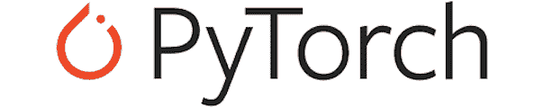
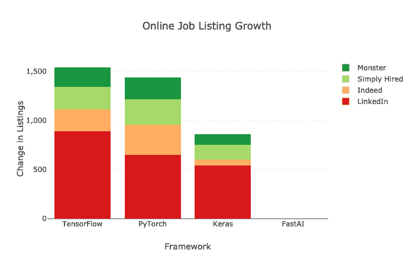
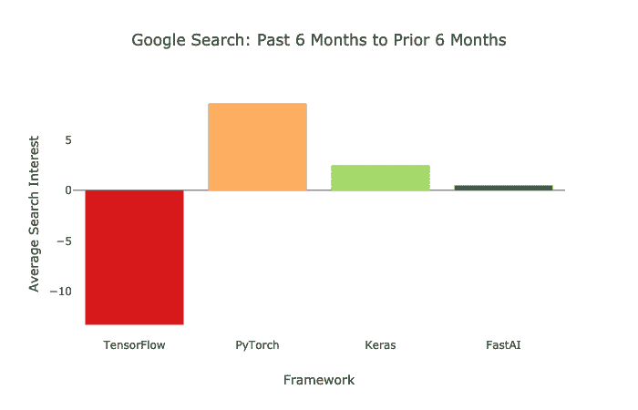
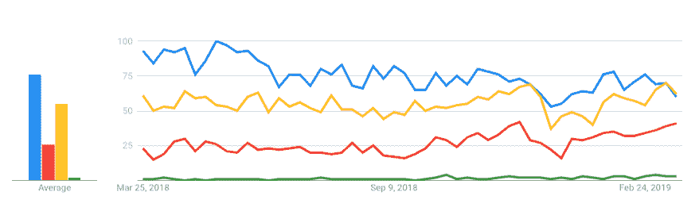
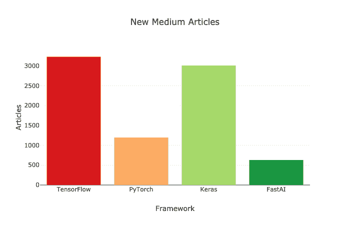
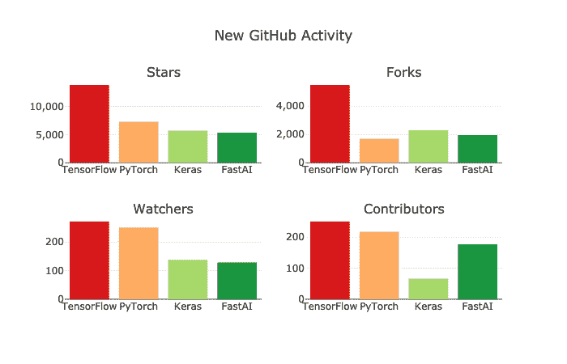
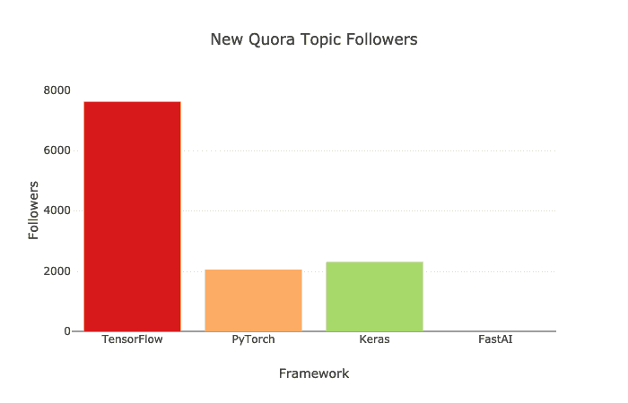
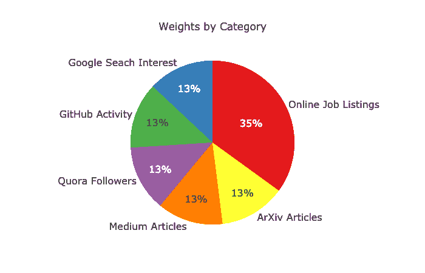
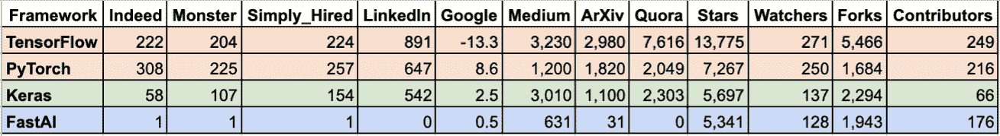
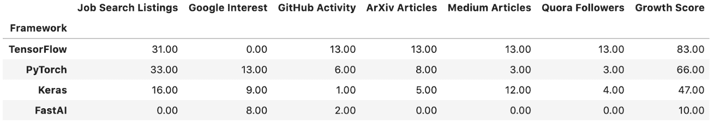

# 哪种深度学习框架增长最快？

> 原文：[`www.kdnuggets.com/2019/05/which-deep-learning-framework-growing-fastest.html`](https://www.kdnuggets.com/2019/05/which-deep-learning-framework-growing-fastest.html)

 评论

**作者：[Jeff Hale](https://www.linkedin.com/in/jeff-hale-99a7877/)，Data Science DC 的联合组织者**

在 2018 年 9 月，我在[这篇文章](https://towardsdatascience.com/deep-learning-framework-power-scores-2018-23607ddf297a)中比较了所有主要的深度学习框架，涉及需求、使用情况和受欢迎程度。TensorFlow 是深度学习框架中的无可争议的重量级冠军，而 PyTorch 则是充满话题的新秀。????

* * *

## 我们的三大课程推荐

 1\. [谷歌网络安全证书](https://www.kdnuggets.com/google-cybersecurity) - 快速进入网络安全职业生涯。

 2\. [谷歌数据分析专业证书](https://www.kdnuggets.com/google-data-analytics) - 提升您的数据分析技能

 3\. [谷歌 IT 支持专业证书](https://www.kdnuggets.com/google-itsupport) - 支持您的组织的 IT 需求

* * *

在过去六个月中，领先的深度学习框架的格局发生了什么变化？

为了回答这个问题，我查看了[Indeed](http://indeed.com)、[Monster](https://www.monster.com/)、[LinkedIn](https://linkedin.com)和[SimplyHired](https://www.simplyhired.com/)上的职位列表数量。我还评估了[Google 搜索量](https://trends.google.com/trends/explore?cat=1299&q=tensorflow,pytorch,keras,fastai)、[GitHub 活动](https://github.com/)、[Medium 文章](https://medium.com)、[ArXiv 文章](https://arxiv.org/)和[Quora 话题关注者](https://www.quora.com)的变化。总体而言，这些来源描绘了需求、使用和兴趣增长的全面图景。

### 集成与更新

我们最近看到 TensorFlow 和 PyTorch 框架中的几个重要进展。

PyTorch v1.0 于 2018 年 10 月预发布，同时 fastai v1.0 也发布了。这两个版本的发布标志着这两个框架成熟的重要里程碑。

TensorFlow 2.0 alpha 版于 2019 年 3 月 4 日发布。它新增了功能并改进了用户体验。它还更紧密地集成了 Keras 作为其高级 API。

### 方法论

在这篇文章中，我将 Keras 和 fastai 纳入了比较，因为它们与 TensorFlow 和 PyTorch 有着紧密的集成。它们也为评估 TensorFlow 和 PyTorch 提供了尺度。

我不会在本文中探讨其他深度学习框架。我预计会收到关于 Caffe、Theano、MXNET、CNTK、DeepLearning4J 或 Chainer 需要讨论的反馈。虽然这些框架各有优点，但似乎没有一个在增长轨迹上接近 TensorFlow 或 PyTorch，也没有与这两个框架紧密结合。

搜索在 2019 年 3 月 20-21 日进行。源数据在 [这个 Google 表格](https://docs.google.com/spreadsheets/d/1Q9rQkfi8ubKM8aX33In0Ki6ldUCfJhGqiH9ir6boexw/edit?usp=sharing)中。

我使用了 [plotly](https://plot.ly/) 数据可视化库来探索受欢迎程度。有关交互式 plotly 图表，请参见我的 Kaggle Kernel [这里](https://www.kaggle.com/discdiver/2019-deep-learning-framework-growth-scores)。

让我们来看看每个类别中的结果。

### 在线职位列表的变化

为了确定今天的就业市场上哪些深度学习库受到需求，我搜索了 Indeed、LinkedIn、Monster 和 SimplyHired 上的职位列表。

我使用了 *机器学习* 这个术语进行搜索，后面跟上库的名称。因此，TensorFlow 是用 *机器学习 TensorFlow* 进行评估的。这种方法用于历史比较。没有 *机器学习* 的搜索结果并没有显著不同。搜索区域为美国。

我从 2019 年 3 月的职位列表中减去了六个月前的职位列表数量。以下是我发现的：

TensorFlow 的职位列表增长略高于 PyTorch。Keras 的职位列表也有所增长——约为 TensorFlow 的一半。Fastai 仍然几乎没有出现在职位列表中。

注意，在除 LinkedIn 外的所有招聘网站上，PyTorch 的额外职位列表数量都多于 TensorFlow。同时，按绝对数字来看，TensorFlow 出现在的职位列表数量几乎是 PyTorch 或 Keras 的三倍。

### 平均 Google 搜索活动的变化

最大搜索引擎上的网页搜索是受欢迎程度的一个衡量指标。我查看了过去一年 Google Trends 的搜索历史。我搜索了 *机器学习和人工智能* 类别的全球兴趣。Google 不提供绝对搜索数字，但提供了相对数据。

我计算了过去六个月的平均兴趣评分，并与之前六个月的平均兴趣评分进行了比较。

在过去六个月中，TensorFlow 的相对搜索量有所下降，而 PyTorch 的相对搜索量有所增长。

下面的 Google 图表显示了过去一年中的搜索兴趣。

TensorFlow 用蓝色表示；Keras 用黄色表示，PyTorch 用红色表示，fastai 用绿色表示

### 新的 Medium 文章

Medium 是一个受欢迎的数据科学文章和教程的发布平台。希望你喜欢它！????

我使用了过去六个月对 Medium.com 的 Google 网站搜索，发现 TensorFlow 和 Keras 的文章数量相似。PyTorch 相对较少。

作为高级 API，Keras 和 fastai 受到新深度学习从业者的欢迎。Medium 上有许多教程展示如何使用这些框架。

### 新的 arXiv 文章

[arXiv](https://arxiv.org/) 是大多数学术深度学习文章发布的在线库。我使用 Google 网站搜索结果，搜索了过去六个月提到每个框架的新文章。

TensorFlow 的新文章出现次数领先，差距很大。

### 新的 GitHub 活动

最近的 GitHub 活动是框架受欢迎程度的另一个指标。我在下面的图表中分解了 stars、forks、watchers 和 contributors。

TensorFlow 在每个类别中都有最多的 GitHub 活动。然而，PyTorch 在观察者和贡献者的增长方面非常接近。同时，Fastai 也吸引了许多新的贡献者。

Keras 的一些贡献者无疑是在 TensorFlow 库中进行工作的。值得注意的是，TensorFlow 和 Keras 都是由谷歌员工领导的开源产品。

### 新的 Quora 关注者

我将新的 Quora 主题关注者数量也纳入了分析——这是我以前没有数据的新类别。

在过去六个月里，TensorFlow 增加了最多的新主题关注者。PyTorch 和 Keras 各自增加的数量远少于此。

一旦我拥有所有数据，我将其合并成一个指标。

### 增长得分程序

这是我创建增长得分的方法：

1.  将所有特征缩放到 0 和 1 之间。

1.  聚合了 *在线职位列表* 和 *GitHub 活动* 子类别。

1.  根据以下百分比加权类别。

1.  将加权得分乘以 100 以提高可读性

1.  将每个框架的类别得分汇总成一个增长得分。

职位列表占总得分的三分之一多一点。正如老话所说，金钱是最好的说明。这种分配似乎是各种类别的适当平衡。与我的 [2018 年强度评分分析](https://towardsdatascience.com/deep-learning-framework-power-scores-2018-23607ddf297a)不同，我没有包含 KDNuggets 使用调查（没有新数据）或书籍（六个月内出版的较少）。

### 结果

下面是以表格形式展示的变化。

Google 表格 [这里](https://docs.google.com/spreadsheets/d/1Q9rQkfi8ubKM8aX33In0Ki6ldUCfJhGqiH9ir6boexw/edit?usp=sharing)。

下面是类别和最终得分。

这是最终的增长得分。

TensorFlow 是需求最大且增长最快的框架。它不会在短期内消失。???? PyTorch 也在快速增长。其职位列表的大幅增加证明了它的使用和需求上升。Keras 在过去六个月中也有了很大增长。最后，fastai 从一个较低的基准开始增长。值得记住的是，它是这几个框架中最年轻的。

TensorFlow 和 PyTorch 都是值得学习的好框架。

### 学习建议

如果你想学习 TensorFlow，我建议你从 Keras 开始。我推荐 Chollet 的 [*《Python 深度学习》*](https://www.amazon.com/Deep-Learning-Python-Francois-Chollet/dp/1617294438) 和 Dan Becker 的 [DataCamp Keras 课程](https://www.datacamp.com/courses/deep-learning-in-python)。TensorFlow 2.0 使用 Keras 作为其通过 tf.keras 提供的高级 API。这里是 [Chollet](https://threader.app/thread/1105139360226140160) 对 TensorFlow 2.0 的快速入门介绍。

如果你想学习 PyTorch，我建议你从 fast.ai 的 MOOC [《编程人员的实用深度学习，第 3 版》](https://course.fast.ai/) 开始。你将学习深度学习基础、fastai 以及 PyTorch 基础知识。

TensorFlow 和 PyTorch 的未来会怎样？

### 未来发展方向

我一直听说，大家更喜欢使用 PyTorch 而不是 TensorFlow。PyTorch 更加符合 Python 的风格，并且拥有更一致的 API。它还具有本地 [ONNX](https://onnx.ai/supported-tools) 模型导出功能，可以加快推断速度。此外，PyTorch 共享了许多与 [numpy](https://github.com/wkentaro/pytorch-for-numpy-users) 相同的命令，这降低了学习的门槛。

然而，TensorFlow 2.0 完全关注于改进用户体验，正如 Google 的首席决策智能工程师 [Cassie Kozyrkov](https://medium.com/@kozyrkov) 在 [这里](https://hackernoon.com/tensorflow-is-dead-long-live-tensorflow-49d3e975cf04?sk=37e6842c552284444f12c71b871d3640) 解释的那样。TensorFlow 现在将拥有一个更简洁的 API、更流畅的 Keras 集成以及一个急切执行选项。这些变化，以及 TensorFlow 的广泛采用，应该会帮助这个框架在未来几年继续保持受欢迎。

TensorFlow 最近宣布了另一个令人兴奋的计划：开发 [Swift for TensorFlow](https://www.tensorflow.org/swift)。[Swift](https://swift.org/) 是 Apple 最初构建的一种编程语言。Swift 在执行和开发速度方面相对于 Python 有一些优势。Fast.ai 将在其高级 MOOC 部分使用 [Swift for TensorFlow](https://www.tensorflow.org/swift)——请参见 fast.ai 联合创始人 Jeremy Howard 的相关帖子 [这里](https://www.fast.ai/2019/03/06/fastai-swift/)。这门语言可能需要一两年的时间才能准备好，但它可能会比当前的深度学习框架有所改进。

语言和框架之间的协作和交叉传粉确实在发生。???? ????

另一个将影响深度学习框架的进展是 [量子计算](https://en.wikipedia.org/wiki/Quantum_computing)。可用的量子计算机可能还需要几年时间，但 [Google](https://ai.google/research/teams/applied-science/quantum-ai/)、[IBM](https://www.ibm.com/blogs/research/2019/03/machine-learning-quantum-advantage/)、微软以及其他公司正在考虑如何将量子计算与深度学习结合起来。框架需要适应这项新技术。

### 结束

你已经看到 TensorFlow 和 PyTorch 都在增长。现在它们都有很好的高层 API——tf.keras 和 fastai——降低了深度学习的入门门槛。你也听说了一些关于最新发展和未来方向的内容。

要互动地玩转本文中的图表或克隆 Jupyter Notebook，请前往我的 [Kaggle Kernel](https://www.kaggle.com/discdiver/2019-deep-learning-framework-growth-scores)。

我希望你觉得这个对比有帮助。如果有，请在你喜欢的社交媒体平台上分享，让更多人也能找到它。????

我撰写关于深度学习、DevOps、数据科学和其他技术话题的文章。如果你对其中的任何一个话题感兴趣，可以 [在这里](https://medium.com/@jeffhale) 查看并关注我。

**[为确保不错过精彩内容，加入我的邮件列表](https://dataawesome.us20.list-manage.com/subscribe?u=b694acf1df58e5bb039ce60a6&id=5da23b7424)**。

感谢阅读！

感谢 [Kathleen Hale](https://medium.com/@kathleenhale_?source=post_page) 和 [Ludovic Benistant](https://medium.com/@LudoBenistant?source=post_page)。

**个人简介： [Jeff Hale](https://www.linkedin.com/in/jeff-hale-99a7877/)** 是一位经验丰富的企业家，Data Science DC 的联合组织者，数据科学领域的思想领袖，他在人工智能和技术方面被评为 Medium 的顶尖作家。他的文章曾在 Experfy、Data Elixir、Kaggle Newsletter、Dataquest Download、Python Weekly、O'Reilly Data Newsletter 和 Data Science Weekly 等平台上刊登。

[原文](https://towardsdatascience.com/which-deep-learning-framework-is-growing-fastest-3f77f14aa318)。经许可转载。

**相关内容：**

+   深度学习工具集概述

+   AI: 武器竞赛 2.0

+   流行的深度学习 GitHub 仓库

### 更多相关话题

+   [解锁商业成功：对数据科学领袖的需求增长](https://www.kdnuggets.com/unlocking-business-success-the-growing-demand-for-data-science-leaders)

+   [AI/ML 模型的风险管理框架](https://www.kdnuggets.com/2022/03/risk-management-framework-aiml-models.html)

+   [Django 框架中的社交用户认证](https://www.kdnuggets.com/2023/01/social-user-authentication-django-framework.html)

+   [适用于所有场景的唯一提示框架](https://www.kdnuggets.com/the-only-prompting-framework-for-every-use)

+   [学位还是证书？雇主更看重哪种资质？](https://www.kdnuggets.com/degree-or-certificate-which-credential-do-employers-value-more)

+   [哪个更好：数据科学训练营、学位还是在线课程](https://www.kdnuggets.com/2022/09/best-data-science-bootcamp-degree-online-course.html)
