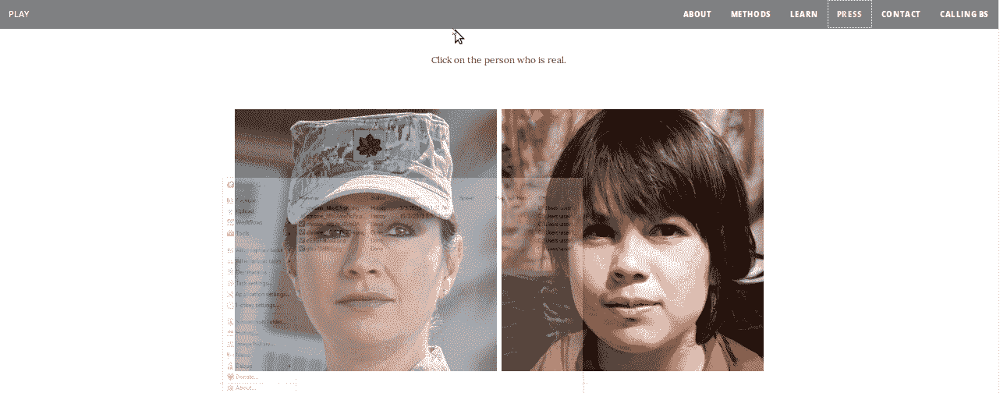
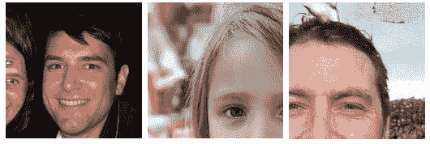
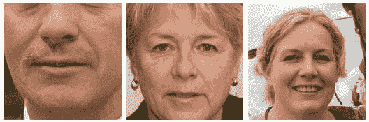
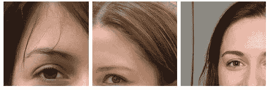
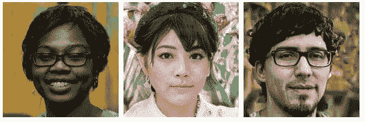
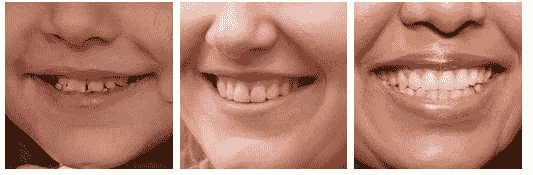
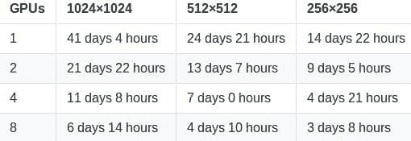
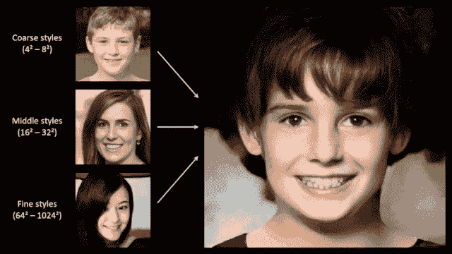
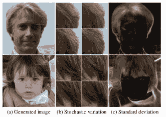

# 哪一张脸是真的？

> 原文：[`www.kdnuggets.com/2019/04/which-face-real-stylegan.html`](https://www.kdnuggets.com/2019/04/which-face-real-stylegan.html)

 评论  哪一张脸是真的？ ### 哪一张脸是真的？

[哪一张脸是真的？](https://www.whichfaceisreal.com/index.php) 是由 [杰文·韦斯特](https://www.jevinwest.org/) 和 [卡尔·伯格斯特罗姆](https://octavia.zoology.washington.edu/) 开发的，来自 [华盛顿大学](https://www.washington.edu/)，作为 [揭穿谎言项目](https://callingbullshit.org/) 的一部分。它充当一种游戏，任何人都可以参与。网站访问者可以选择两张图像，其中一张是真的，另一张是由 StyleGAN 生成的假图像。

该项目由杰文和卡尔实施，作为一门课程，旨在教导学生如何识别虚假信息。

> 本课程的目标是教你如何对构成社会和自然科学证据的数据和模型进行批判性思考。
> 
> 世界上充斥着胡言乱语。政治家不受事实约束。科学通过新闻稿进行。高等教育奖励胡说八道而非分析思维。初创文化将胡说八道提升为高雅艺术。广告商暗中挑衅，邀请我们一起看穿所有胡说八道——并利用我们放松警惕的机会向我们轰炸二级胡说八道。无论是私人企业还是公共领域，大多数行政活动似乎都只是复杂的胡说八道重组练习。
> 
> 我们对此感到厌倦。是时候采取行动了，作为教育者，我们知道的建设性方法之一就是教育人们。因此，本课程的目标是帮助学生在虚假信息充斥的现代环境中，通过识别虚假信息、看穿它，并通过有效的分析和论证来对抗它。

*- 卡尔·T·伯格斯特罗姆 和 杰文·韦斯特

西雅图，WA.*

### 如何区分？

**水斑**

+   算法生成的光滑斑点看起来有点像老旧照片上的水斑。这些斑点可能出现在图像的任何位置，但通常在头发和背景之间的界面处出现。

 水斑

**背景问题**

+   图像的背景可能会出现模糊或变形等奇怪状态。这是因为神经网络主要在面部进行训练，对图像背景的关注较少。

 背景问题

**对称性**

+   目前，生成器无法生成逼真的眼镜，这可能起初不明显。一个常见问题是对称性问题。查看框架结构；通常框架左边一种风格，右边另一种，或者一边有某种风格的装饰而另一边没有。其他时候，框架可能只是歪斜或锯齿状。此外，还可能存在面部胡须的非对称性，左右耳饰不同，以及左右侧领子或面料不同等情况。

不对称性

**头发**

+   头发的渲染对算法来说非常困难。常见问题包括断裂的发丝、过于笔直或过于条纹状。

头发

**荧光溢出**

+   荧光颜色有时会从背景溢出到头发或脸部，人们有时会将其误认为是染色的头发。

荧光溢出

**牙齿**

+   牙齿的渲染也很困难，可能呈现出奇形怪状、不对称的样子，或者对于能识别牙齿的人来说，有时图像中会出现 3 颗门牙。

牙齿

### 尝试算法

StyleGAN 的所有代码已经开源在 [stylegan](https://github.com/NVlabs/stylegan) 仓库中。它详细介绍了如何自己运行 styleGAN 算法。

**然而，也有一些障碍：**

+   系统要求

+   训练时间

### 系统要求

+   支持 Linux 和 Windows，但我们强烈推荐 Linux 以获得更好的性能和兼容性。

+   64 位 Python 3.6 安装。我们推荐使用 Anaconda3 和 numpy 1.14.3 或更新版本。

+   TensorFlow 1.10.0 或更新版本，需支持 GPU。

+   一台或多台高端 NVIDIA GPU，至少 11GB 的 DRAM。我们推荐使用 8 个 Tesla V100 GPU 的 NVIDIA DGX-1。

+   NVIDIA 驱动 391.35 或更新版本，CUDA 工具包 9.0 或更新版本，cuDNN 7.3.1 或更新版本。

这种计算和存储能力在个人中并不常见。

### 训练时间

以下是 NVIDIA 报告的在 Tesla V100 GPU 上使用默认配置运行 `train.py` 脚本（在 stylegan 仓库中提供）时的预期训练时间，用于 [FFHQ 数据集](https://github.com/NVlabs/ffhq-dataset)（在 stylegan 仓库中提供）。

训练此算法所需的时间远超普通人的耐性。

### 幕后花絮

这个应用的背后科学来自 NVIDIA 的团队和他们在生成对抗网络方面的工作。他们创造了 StyleGAN。为了更多了解这种惊人的技术，我在下面提供了一些资源和简洁的解释。

### 生成对抗网络

*对于那些想要回顾 GAN 的内容，这个由[Ahlad Kumar 提供的 GAN 教程播放列表](https://www.youtube.com/watch?v=RRTuumxm3CE&list=PLdxQ7SoCLQAMGgQAIAcyRevM8VvygTpCu)非常有帮助。*

生成对抗网络首次在 2014 年作为生成模型的扩展，通过对抗性过程同时训练两个模型：

+   捕获数据分布的生成模型（训练）

+   估计样本来源概率的判别模型

    训练数据而非生成模型。

GAN 的目标是生成与真实样本无法区分的人工/虚假样本。一个常见的例子是生成与真实人物照片无法区分的人工图像。人类视觉处理系统无法如此轻易地区分这些图像，因为这些图像乍看起来像真实的人。我们将稍后了解这如何发生，以及如何区分真实人物的照片和由算法生成的照片。

### StyleGAN

这个令人惊叹的应用背后的算法是**Tero Karras、Samuli Laine 和 Timo Aila**在 NVIDIA 的杰作，称为***StyleGAN***。该算法基于 Ian Goodfellow 及其同事在对抗性网络（GAN）的早期工作。NVIDIA 将其 StyleGAN 的代码开源，使用 GAN，其中两个神经网络，一个生成难以区分的人工图像，另一个尝试区分虚假和真实的照片。

> 尽管我们已经学会了更普遍地怀疑用户名和文本，但图片却不同。我们假设你不能凭空合成一张图片；一张图片必须属于某个人。当然，诈骗者可以窃取他人的照片，但在有谷歌反向搜索等工具的世界里，这是一种冒险的策略。因此，我们倾向于相信照片。一个带有照片的商业档案显然属于某人。一个约会网站上的匹配可能与拍摄照片时比实际重 10 磅或老 10 岁，但如果有照片，这个人显然是存在的。
> 
> 不再如此。新的对抗性机器学习算法使人们能够迅速生成从未存在过的合成“照片”。

*- Jevin West 和 Carl Bergstrom*

***生成模型存在一个限制，即难以控制从照片中提取的特征，如面部特征。NVIDIA 的 StyleGAN 解决了这一限制。该模型允许用户调整超参数，从而控制照片中的差异。***

StyleGAN 通过在每个卷积层中添加 *风格* 来解决照片的可变性。这些风格代表了人类照片的不同特征，如面部特征、背景颜色、头发、皱纹等。该算法从低分辨率（4x4）开始生成新图像，逐步提高到高分辨率（1024x1024）。模型生成两张图像 A 和 B，然后通过从 A 中提取低级特征和从 B 中提取其余特征来组合它们。在每个层级，使用不同的特征（风格）来生成图像：

+   粗糙风格（分辨率在 4 到 8 之间） - *姿势，头发，面部，形状*

+   中等风格（分辨率在 16 到 32 之间） - *面部特征，眼睛*

+   细致风格（分辨率在 64 到 1024 之间） - *色彩方案*

### 基于风格的生成器的特性

**风格混合**

+   生成器采用 *混合正则化*，在训练过程中，使用两个随机潜在代码而非一个生成一定百分比的图像。生成这样的图像时，用户只需在合成网络中随机选择的点上从一个潜在代码切换到另一个（即风格混合）。在下面的图像中，我们可以看到一个潜在代码（源）生成的风格如何覆盖另一个潜在代码（目标）的风格子集。

**随机变化**

+   照片的许多方面是随机的（即随机的），如皱纹、头发位置、胡茬、雀斑、痘痘。StyleGAN 的架构在每个卷积层之后添加每像素噪声，以便图像显示出这些如现实生活中看到的变化。如下面的图像所示，生成器添加的噪声仅影响图像的随机方面，而保持更高层次的风格不变。

**全局效果与随机性的分离**

+   图像风格的变化会对整体效果产生影响，例如改变姿势、性别、面部等，但噪声如雀斑、皱纹、头发位置只会影响随机变化。在 StyleGAN 中，姿势、光照或背景风格等全局效果可以一致地控制，而噪声是独立地添加到每个像素上，因此非常适合控制随机变化。

### 有用的资源

+   [StyleGAN](https://arxiv.org/pdf/1812.04948.pdf)

+   [如何识别伪造的 AI 生成图像](https://medium.com/@kcimc/how-to-recognize-fake-ai-generated-images-4d1f6f9a2842)

+   [NVIDIA 开源超真实面部生成器 StyleGAN](https://medium.com/syncedreview/nvidia-open-sources-hyper-realistic-face-generator-stylegan-f346e1a73826)

**相关：**

+   新的神经网络互联网即将到来

+   生成对抗网络概述

+   [观看 NVIDIA 深度学习实战[网络研讨会系列]](/2018/09/nvidia-deep-learning-webinar-series.html)

* * *

## 我们的前三大课程推荐

 1\. [谷歌网络安全证书](https://www.kdnuggets.com/google-cybersecurity) - 快速开启网络安全职业生涯

 2\. [谷歌数据分析专业证书](https://www.kdnuggets.com/google-data-analytics) - 提升你的数据分析技能

 3\. [谷歌 IT 支持专业证书](https://www.kdnuggets.com/google-itsupport) - 支持你的组织的 IT 需求

* * *

### 更多相关话题

+   [哪种最好：数据科学训练营、学位还是在线课程](https://www.kdnuggets.com/2022/09/best-data-science-bootcamp-degree-online-course.html)

+   [我应该使用哪种指标？准确率与 AUC](https://www.kdnuggets.com/2022/10/metric-accuracy-auc.html)

+   [ETL 与 ELT：哪一个适合你的数据管道？](https://www.kdnuggets.com/2023/03/etl-elt-one-right-data-pipeline.html)

+   [RAG 与微调：哪一个是提升你的 LLM 应用的最佳工具？](https://www.kdnuggets.com/rag-vs-finetuning-which-is-the-best-tool-to-boost-your-llm-application)

+   [学位还是证书？雇主更看重哪种资质？](https://www.kdnuggets.com/degree-or-certificate-which-credential-do-employers-value-more)

+   [利用 AI 进行实时翻译](https://www.kdnuggets.com/2022/07/realtime-translations-ai.html)
