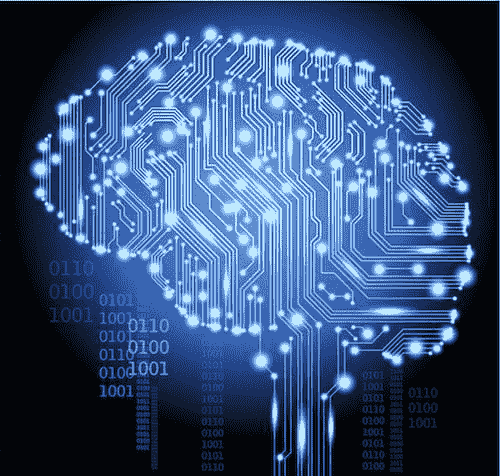

# 为什么每个公司都需要一个数字大脑

> 原文：[`www.kdnuggets.com/2017/07/why-every-company-needs-digital-brain.html`](https://www.kdnuggets.com/2017/07/why-every-company-needs-digital-brain.html)

评论

**作者：SriSatish Ambati，H2O.ai CEO 和联合创始人**

几乎每一家《财富》全球 500 强公司都在数字化转型的道路上，但每家公司的阶段不同，许多公司还需要清除最后的障碍才能真正释放其潜力。转型的过程无疑是艰难的，大型公司有时需要忍受高失败率才能推进。然而，仍然有希望。

公司在进行数字化转型时面临的主要问题之一是缺乏企业范围的智能和团队合作文化来协调他们的努力。简而言之，他们缺乏一个“数字大脑”，这是一个从所有业务单元、部门、产品线和服务的数据中进行持续自动学习的中心，赋予组织更高的认知能力。这就是为什么每个公司都需要一个数字大脑来使他们的数字化转型变得生动，否则他们面临着渐进、短视和肤浅的变化风险。

就像人类生命从一个单细胞开始，逐渐分裂产生出不同功能的新细胞一样，公司在进行数字化转型时也采用非常渐进或分步的方法。这是绝对必要的，因为变化从小处开始，并逐渐增长。任何数字大脑的创建都始于微服务的形成，其中公司的应用架构被组织为一个松散的服务集合，这些服务不断学习并致力于预测特定的结果。

Capital One 是微服务模型的典型例子。他们利用开源软件和云技术构建了优秀的数字产品和世界级的开发者体验。这些微服务开辟了新的收入来源和创新金融服务，因为他们对客户有 360 度的视角。

微服务模型和物联网的兴起迅速将智能推向边缘，在那里，小型传感器和轻量级设备的计算能力已接近智能手机。这种智能的去中心化通过开源软件运动得到了进一步放大，这种运动催生了创造者文化。它是参与式的，使公司能够成为软件的创造者，而不仅仅是软件的消费者。开源还推动了货币化——这在谷歌、亚马逊、苹果等公司中我们都可以看到。

然而，从企业整体的角度来看，存在于边缘的智能现象可能会给公司带来碎片化和盲点的风险。使谷歌和亚马逊如此成功的因素是它们能够连接各种微型业务，以利用协同效应。这是一个关键点，也往往是公司失败的地方。借助数字大脑，组织具备了更强的自我意识和跨学科思维，推动出全新的商业模式。

数字大脑的命脉是数据。如今，企业可能会陷入将数据视为静态资产或存在于业务各单位的“宝藏”的陷阱。企业需要转向思考如何利用持续流动的实时数据，这些数据在整个组织中流动，而不仅仅是孤立的单元。这意味着要考虑流数据的不同用例，构建正确的模型，并找到如何在完全不同的垂直领域中货币化它们的方法。

以薪资公司为例，基于实时数据和关于特定地理区域薪资的模型，这些数据可以用于房地产目的。实际上，凭借正确的数据和模型，薪资公司可以成为房地产公司、金融公司和保险公司。借助数字大脑，垂直公司可以转变为横向公司。

数据对数字大脑的健康至关重要，缺乏数据可能会抑制转型。因此，公司可能会选择与其他公司建立联盟，以共享数据和/或模型，最终目标是构建各自无法单独创建的创新应用程序。考虑一下薪资公司，它可以与保险公司合作，目的是构建预测个人何时能够购房并为其提供合适保险的应用程序。

今天的公司大多是因为害怕不进行数字化转型的后果而追求数字化转型。许多公司尚未明确转型的终极目标。数字大脑是这一转型的高潮，因为它赋予公司更高的目的和商业模式来实现货币化。构建大脑的过程始于微服务，在此过程中，业务重新定义为许多较小的业务单元，这些单元可以利用来自边缘的数据，这得益于物联网和云计算的兴起。但只有当这些单元得到协调时，系统范围的变化才能发生，这需要数据和模型——它们是跨垂直领域持续学习的命脉。

**简历：SriSatish Ambati** 是 [H2O.ai](http://www.h2o.ai/) 的首席执行官兼联合创始人，该平台是领先的开源机器学习平台，用于更智能的应用程序和数据产品。

**相关内容：**

+   用于物联网的深度学习与 H2O

+   人工智能、机器学习和深度学习是什么？

+   企业数据科学与机器学习平台

* * *

## 我们的三大课程推荐

 1\. [Google 网络安全证书](https://www.kdnuggets.com/google-cybersecurity) - 快速进入网络安全职业生涯

 2\. [Google 数据分析专业证书](https://www.kdnuggets.com/google-data-analytics) - 提升你的数据分析能力

 3\. [Google IT 支持专业证书](https://www.kdnuggets.com/google-itsupport) - 支持你的组织的 IT

* * *

### 更多相关主题

+   [为什么单独使用 LLMs 无法满足公司预测需求](https://www.kdnuggets.com/2024/01/pecan-llms-used-alone-cant-address-companys-predictive-needs)

+   [Python f-Strings 魔法：每个程序员需要知道的 5 个颠覆性技巧](https://www.kdnuggets.com/python-fstrings-magic-5-gamechanging-tricks-every-coder-needs-to-know)

+   [每位数据科学家必备的软技能](https://www.kdnuggets.com/soft-skills-every-data-scientist-needs)

+   [2024 年每位数据科学家必备的 5 种核心技能](https://www.kdnuggets.com/5-essential-skills-every-data-scientist-needs-in-2024)

+   [未来证明你的数据游戏：每位数据科学家在 2023 年必备的顶级技能](https://www.kdnuggets.com/futureproof-your-data-game-top-skills-every-data-scientist-needs-in-2023)

+   [2024 年每位数据科学家必备的 5 种工具](https://www.kdnuggets.com/5-tools-every-data-scientist-needs-in-their-toolbox-in-2024)
