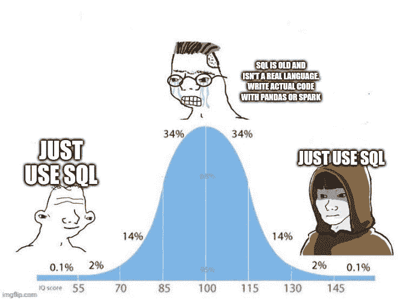
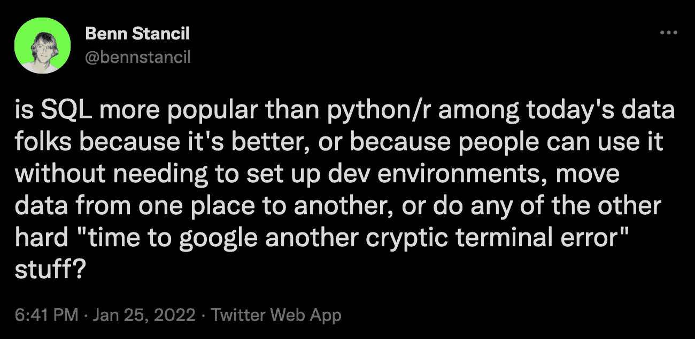
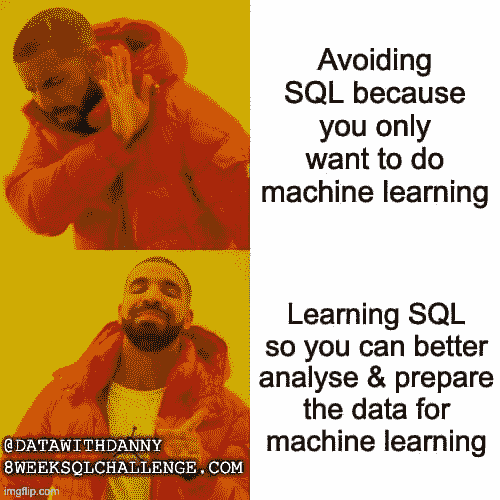

# 为什么 SQL 是数据科学中必须学习的语言

> 原文：[`www.kdnuggets.com/why-sql-is-the-language-to-learn-for-data-science`](https://www.kdnuggets.com/why-sql-is-the-language-to-learn-for-data-science)

“Python!”

“不，是 R。”

“傻瓜，这显然是 Rust。”

许多数据科学学习者和专家都热衷于确定最适合数据科学的语言。在我看来，大多数人是错误的。在寻找最新、最炫酷、最适合容器化的数据科学语言的过程中，人们正在寻找错误的东西。

* * *

## 我们的前三大课程推荐

 1\. [谷歌网络安全证书](https://www.kdnuggets.com/google-cybersecurity) - 快速入门网络安全职业。

 2\. [谷歌数据分析专业证书](https://www.kdnuggets.com/google-data-analytics) - 提升你的数据分析技能

 3\. [谷歌 IT 支持专业证书](https://www.kdnuggets.com/google-itsupport) - 支持你组织的 IT 工作

* * *

图片来自 [Reddit](https://www.reddit.com/r/datascience/comments/s0dn5b/2022_mood/)

很容易被忽视。甚至可以将其视为不重要的语言。但谦虚的结构化查询语言，或 SQL，是我推荐的数据科学学习语言。所有其他语言当然也有它们的作用，但 SQL 是我认为数据科学工作者的基础要求的唯一不可替代的语言。原因如下。

# 数据库的通用语言

看，数据库与数据科学息息相关。名字里就有。如果你在做数据科学工作，你就在处理数据库。如果你在处理数据库，你很可能在使用 SQL。

为什么？因为 SQL 是通用的数据库查询语言。没有其他语言可以替代。想象一下，如果有人告诉你，只要你学会了某种特定的语言，你就能与地球上每个人交流和理解他们，那将是多么有价值？SQL 就是数据科学中的那种语言，所有人都用来管理和访问数据库。

图片来自 [X](https://twitter.com/bennstancil/status/1486031369327292421?t=CNXJYLuoC1MUbCK3y4ADLg&s=19)

每个数据科学家都需要访问和检索数据，探索数据和建立假设，过滤、聚合和排序数据。因此，每个数据科学家都需要 SQL。只要你知道 [如何编写 SQL 查询](https://www.stratascratch.com/blog/best-practices-to-write-sql-queries-how-to-structure-your-code/?utm_source=blog&utm_medium=click&utm_campaign=kdn+sql+for+ds)，你将会走得很远。

现在，有人正在读这篇文章并谈论 NoSQL 运动。确实，现在有些数据更常被存储在非关系型数据库中，比如键值对或图数据。存储数据的这种方式确实有好处——你会获得更多的可扩展性和灵活性。但没有标准的 NoSQL 查询语言。你可能为一个工作学会一种，接着为新工作需要学习完全不同的语言。

此外，你很少会找到完全使用 NoSQL 数据库的公司，而许多公司并不需要非关系型数据库。

# 清理和处理

有个著名的（[已被揭穿](https://blog.ldodds.com/2020/01/31/do-data-scientists-spend-80-of-their-time-cleaning-data-turns-out-no/)）统计数据称数据科学家将 80%的时间花在清理数据上。虽然这不是真的，但我认为如果你问任何数据科学家他们花时间做什么，数据清理将排在前五位。这就是为什么这一部分是最长的。

你可以使用其他语言清理和处理数据，但特别是 SQL 在某些数据清理和处理方面提供了独特的优势。

SQL 的表达性查询语言允许数据科学家使用简洁的语句高效地过滤、排序和汇总数据。这种灵活性在处理大型数据集时尤其有用，因为手动数据操作会非常耗时且容易出错。相比之下，像 Python 这样的语言，完成类似的数据操作任务可能需要编写更多的代码，并处理循环、条件和外部库。虽然 Python 以其多功能性和丰富的数据科学库生态系统而闻名，但 SQL 的专注语法可以**加快例行的数据清理操作**，使数据科学家能够迅速准备数据进行分析。

此外，任何数据科学家都会抱怨他们存在的痛点：**缺失值**。SQL 处理缺失值的功能和能力——如使用[COALESCE](https://www.stratascratch.com/blog/sql-coalesce-function-a-guide-for-postgresql-users/?utm_source=blog&utm_medium=click&utm_campaign=kdn+sql+for+ds)、CASE 和 NULL 处理——提供了直接的方法来处理数据中的空白，而不需要复杂的编程逻辑。

数据科学家存在的另一个痛点是**重复数据**。幸运的是，SQL 提供了高效的方法来识别和消除数据集中的重复记录，如`DISTINCT`关键字和`[GROUP BY](https://www.stratascratch.com/blog/what-is-sql-group-by-and-how-to-use-it/?utm_source=blog&utm_medium=click&utm_campaign=kdn+sql+for+ds)`子句。

你可能听说过 ETL 管道。实际上，SQL 可以用于创建**数据转换管道**，这些管道将原始或半处理的数据转换为适合分析的格式。这对于自动化和标准化那些我们都知道且厌恶的重复数据清理过程尤其有益。

SQL 能够**连接**来自不同数据库或文件的表，这简化了数据合并的过程，对于涉及数据集成或来自多种来源的数据聚合的项目至关重要。对于数据科学家来说，这占据了大多数项目。

最后，我想提醒大家，数据科学并不是在真空中进行的。SQL 查询是自包含的，可以轻松与同事共享。这促进了**合作**，并确保其他人可以在没有手动干预的情况下重现数据清理步骤。

# 与其他人良好配合

现在，如果你*仅仅*知道 SQL，你在数据科学领域不会走得太远。不过幸运的是，SQL 与其他顶级数据科学语言如 R、Python、Julia 或 Rust 完美集成。你可以获得分析、数据可视化和机器学习的所有好处，同时仍保留 SQL 在数据处理方面的优势。

图片来自 [LinkedIn](https://www.linkedin.com/posts/datawithdanny_data-analytics-sql-activity-6798074219738624000-uGXM/)

这在你考虑到我之前提到的所有数据清理和处理时尤其强大。你可以使用 SQL 直接在数据库中预处理和清理数据，然后利用 Python、R、Julia 或 Rust 执行更高级的数据转换或特征工程，利用广泛的库。

许多组织依赖于 SQL——或者更准确地说，依赖于懂得如何使用 SQL 的数据科学家——来生成报告、仪表板和可视化，以支持决策制定。熟悉 SQL 能让数据科学家直接从数据库中生成有意义的报告。而且由于 SQL 的广泛应用，这些报告通常在几乎任何系统间都是兼容的。

由于 SQL 与报告工具和脚本语言如 Python、R 和 JavaScript 的高度兼容，数据科学家实际上可以自动化报告过程，将 SQL 的数据提取和处理能力与这些语言的可视化和报告功能无缝结合。结果是你可以在一个地方获得全面且富有洞察力的报告，有效地向利益相关者传达数据驱动的见解。

# 工作，工作，工作

你会在任何数据科学面试中被问到一堆 [SQL 面试问题](https://www.stratascratch.com/blog/sql-interview-questions-you-must-prepare-the-ultimate-guide/?utm_source=blog&utm_medium=click&utm_campaign=kdn+sql+for+ds)。几乎每个数据科学职位都要求至少具备基础的 SQL 知识。

[这是](https://g.co/kgs/jHNjvk)我所说的一个例子：职位列表上写着，“精通 SQL，以及用于数据分析和平台开发的 R 或 Python。”换句话说，SQL 是必须的。然后是 R 或 Python，但对于大多数雇主来说，两者没有太大区别。但由于 SQL 的主导地位，没有 SQL 的替代品。每一个数据科学职位都会要求你使用 SQL。

它真正酷的地方在于，它使 SQL 成为**终极**的可转移工具。一份工作可能偏爱 Python，而一家初创公司可能因个人偏好或遗留基础设施而要求 Rust。但无论你去哪里，做什么，都是 SQL 或无路可走。花时间学习它，你将永远能够满足工作要求。

**最终**，如果你找到一份不需要 SQL 的数据科学家职位，你可能不会做太多数据科学工作。

# 为什么 SQL 对数据科学如此必要？

归根结底，这要看数据库。数据科学需要存储、操作、检索和管理大量数据。这些数据存在某个地方。通常只能使用一种工具访问，那就是 SQL。SQL 是数据科学需要学习的语言，只要我们依赖数据库进行数据科学，它就会继续存在。

****[内特·罗西迪](https://twitter.com/StrataScratch)**** 是一名数据科学家，专注于产品策略。他还是一名兼职教授，教授分析课程，并且是 StrataScratch 的创始人，该平台帮助数据科学家通过来自顶级公司的真实面试问题来准备面试。内特撰写关于职业市场的最新趋势，提供面试建议，分享数据科学项目，并涵盖所有 SQL 内容。

### 相关话题

+   [为什么你需要学习多于一种编程语言！](https://www.kdnuggets.com/2022/06/need-learn-one-programming-language.html)

+   [为什么你应该在 2024 年学习 SQL](https://www.kdnuggets.com/why-you-should-learn-sql-in-2024)

+   [掌握 SQL、Python、数据科学、机器学习等的 25 本免费书籍](https://www.kdnuggets.com/25-free-books-to-master-sql-python-data-science-machine-learning-and-natural-language-processing)

+   [自然语言处理中的 N-gram 语言建模](https://www.kdnuggets.com/2022/06/ngram-language-modeling-natural-language-processing.html)

+   [利用 GPT 模型将自然语言转换为 SQL 查询](https://www.kdnuggets.com/leveraging-gpt-models-to-transform-natural-language-to-sql-queries)

+   [为什么 SQL 将仍然是数据科学家的最佳朋友](https://www.kdnuggets.com/2022/07/sql-remain-data-scientist-best-friend.html)
