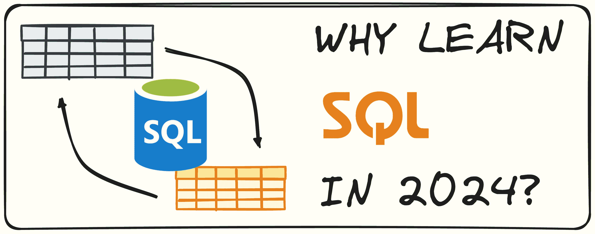
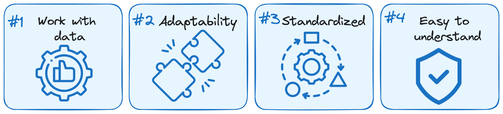

# 为什么你应该在 2024 年学习 SQL

> 原文：[`www.kdnuggets.com/why-you-should-learn-sql-in-2024`](https://www.kdnuggets.com/why-you-should-learn-sql-in-2024)



图片由作者提供

人类一直受到存储和共享信息能力的强烈影响。研究表明，人类与其他动物的关键区别在于我们能够创造、保存和继承知识和文化，代代相传。

* * *

## 我们的三大课程推荐

 1\. [Google 网络安全证书](https://www.kdnuggets.com/google-cybersecurity) - 加入网络安全领域的快速通道

 2\. [Google 数据分析专业证书](https://www.kdnuggets.com/google-data-analytics) - 提升你的数据分析能力

 3\. [Google IT 支持专业证书](https://www.kdnuggets.com/google-itsupport) - 支持你的组织 IT

* * *

今天，我们正经历着世界运作方式的重大转变：数据已成为 21 世纪的燃料。所有领域和部门都依赖于数据来做出决策。

有一点是确定的：对数据相关技能的需求只会持续增长。

如今，组织以空前的速度从内部和外部来源收集原始数据。通过分析这些数据，他们可以使用报告应用程序、仪表板和其他工具来回答问题并获得有价值的洞察。

那么正确的问题是如何管理所有这些数据？

SQL 仍然是数据专业人员中需求最旺盛的技能之一。让我们深入探讨为何如此，以及你如何加入这场数据革命。

## SQL，数据管理之星

SQL，全称结构化查询语言，是与使用 SQL 服务器的数据库交互的标准语言。它是为了操作数据集而创建的。它可以用于检索、更新、删除和创建数据库中的数据。

除了数据操作，SQL 还允许你修改数据库结构，如添加表、删除记录和设置访问权限。

自 1970 年代创立以来，SQL 已成为数据分析的标准语言。根据 Stack Overflow 2023 年的调查，[SQL 在专业程序员中排名第三的使用语言。](https://survey.stackoverflow.co/2023/#most-popular-technologies-language-prof)

由于大多数组织依赖数据来做决策和提高效率，SQL 是最大化数据价值的必备技能。

此外，SQL 是大多数现代商业工具集中核心工具之一，即使你不直接负责创建和管理数据库，这也是一项宝贵的技能。

学习 SQL 的好处包括：



图片由作者提供

### 处理大量数据

SQL 设计用于处理大数据，能够比电子表格或某些编程语言（如 Python）更快地处理复杂查询。学习 SQL 有助于你有效地管理和分析大数据。

在许多组织中，数据环境的核心通常是数据仓库，而 SQL 是主要的交互语言。

### 与其他工具互动

SQL 与其他数据科学工具和编程语言，如 Python 和 R，能够无缝集成。像 pandas（Python）和 dplyr（R）这样的库允许你在代码中直接运行 SQL 查询。

这种互操作性使得将 SQL 的数据处理能力与这些语言的高级分析、可视化和机器学习功能结合起来变得更容易。

### 标准化技能

要使用 SQL 查询或操作数据，你需要使用带有关键字如“SELECT”和“FROM”的语句。这个 SQL 语法由 ANSI 和 ISO 认证，确保了在支持 SQL 的数百种数据库和数据工具中保持一致性。

虽然一些数据库和工具可能会通过专门的操作符、命令或函数扩展语法，但 SQL 的基本原则始终保持一致。

一旦你掌握了 SQL 的基础知识，你可以在不同平台上普遍应用这些知识。

### 它易于理解

基本 SQL 语法高度可读，类似于自然语言。它概述了数据应如何被检索或操作。

请考虑以下示例查询：

```py
SELECT first_name, last_name, date_of_hire
FROM employees
WHERE date_of_hire > '2018-12-31'
ORDER BY date_of_hire, last_name; 
```

在这个查询中，SQL 关键字 SELECT、FROM、WHERE 和 ORDER BY 定义了要执行的操作，任何人都可以理解查询的主要目的。需要注意的是，虽然这些关键字不需要大写，但为了更好的可读性，通常建议使用大写。

## SQL 入门

既然我们知道 SQL 技能对于处理数据至关重要，你可能想知道如何开始。以下是一步步的指南，帮助你入门：

基本 SQL 语句：从基本的 SQL 语句开始，以检索数据和操作表格。

聚合函数：学习像 SUM 和 AVG 这样的聚合函数，以总结数据并对单个表进行初步分析。

JOIN 和子查询：接下来使用 JOIN 和子查询来结合来自多个表的数据。

一旦你掌握了基础知识，就重要开始进行自己的实践项目。在以下[链接](https://www.kdnuggets.com/2022/08/complete-collection-data-science-projects-part-1.html)中，你可以找到一些自己动手做的项目的想法。

执行这些项目将强化你的理解，并为实际的数据任务做好准备。

### SQL 方言之间的差异

SQL 方言是针对不同数据库系统量身定制的 SQL 语言变体，每种方言都影响兼容性和易用性。对于数据专业人士来说，学习像 MySQL、PostgreSQL 和 SQLite 这样的 SQL 方言之间的差异是非常有益的。

学习者通常从 SQLite 开始。掌握每种方言的独特特征可以提升代码性能，并促进不同平台之间的无缝集成。

虽然不必成为每种 SQL 方言的专家，但对语法差异有基本了解是极其有帮助的，尤其是在寻求使用不同方言的环境中的就业时。许多学习者从 SQLite 开始，但熟悉至少一种除了 SQLite 之外的 SQL 方言是有益的。这将使你更具多样性，更好地准备应对不同的数据环境。

## 简要说明

+   SQL 对高效处理和分析大型数据集至关重要。其重要性体现在它在 2023 年被评为第三大最常用编程语言。

+   SQL 无缝集成其他数据科学工具和编程语言，如 Python 和 R，增强了其在数据管理和分析中的实用性。

+   SQL 的语法是标准化的，使其在不同数据库系统中保持一致且易于学习。其可读性和类似自然语言的特点使其对初学者友好，同时对多种 SQL 方言的了解能提高在不同数据环境中的就业能力和灵活性。

**[](https://www.linkedin.com/in/josep-ferrer-sanchez/)**[Josep Ferrer](https://www.linkedin.com/in/josep-ferrer-sanchez)**** 是一位来自巴塞罗那的分析工程师。他毕业于物理工程专业，目前在应用于人类流动的数据科学领域工作。他还是一名兼职内容创作者，专注于数据科学和技术。Josep 撰写有关 AI 的所有内容，涵盖该领域持续爆炸性的应用。

### 更多相关主题

+   [2024 年你必须了解的 7 个现代 SQL 数据库](https://www.kdnuggets.com/7-modern-sql-database-you-must-know-in-2024)

+   [避免数据科学职业的前 5 个理由](https://www.kdnuggets.com/2022/04/top-5-reasons-avoid-data-science-career.html)

+   [在 Kaggle 上竞争的 4 个技巧以及你应该开始的原因](https://www.kdnuggets.com/2022/05/packt-top-4-tricks-competing-kaggle-start.html)

+   [为什么你不应该过度使用 Python 中的列表推导式](https://www.kdnuggets.com/why-you-should-not-overuse-list-comprehensions-in-python)

+   [你应该使用线性回归模型而不是…的 3 个理由](https://www.kdnuggets.com/2021/08/3-reasons-linear-regression-instead-neural-networks.html)

+   [你应该获得认证的 5 个理由](https://www.kdnuggets.com/2023/05/sas-5-reasons-get-certified.html)
