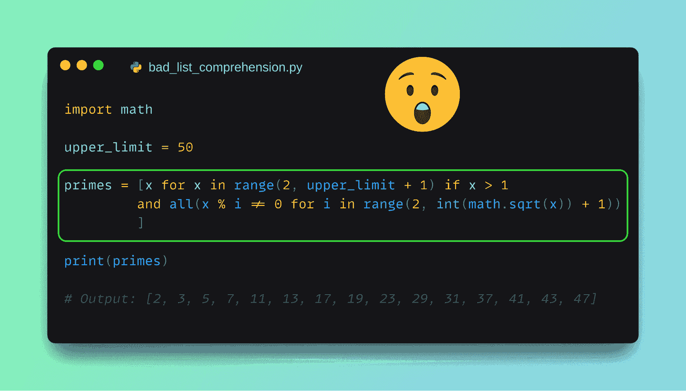
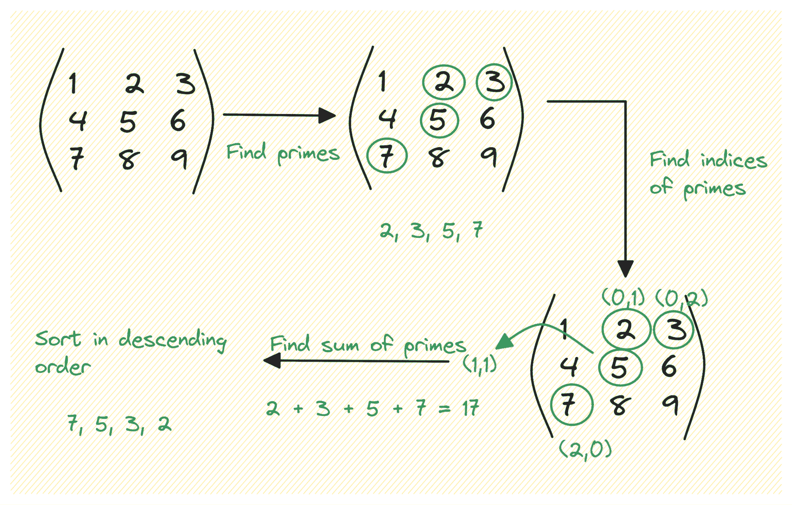

# 为什么你不应该过度使用 Python 列表推导式

> 原文：[`www.kdnuggets.com/why-you-should-not-overuse-list-comprehensions-in-python`](https://www.kdnuggets.com/why-you-should-not-overuse-list-comprehensions-in-python)



图片由作者提供

在 Python 中，列表推导式提供了一种简洁的语法来从现有列表和其他可迭代对象中创建新列表。然而，一旦你习惯了列表推导式，你可能会被诱惑在不应该使用它们的情况下也使用它们。

* * *

## 我们的三大课程推荐

 1\. [Google 网络安全证书](https://www.kdnuggets.com/google-cybersecurity) - 快速进入网络安全职业生涯。

 2\. [Google 数据分析专业证书](https://www.kdnuggets.com/google-data-analytics) - 提升你的数据分析技能

 3\. [Google IT 支持专业证书](https://www.kdnuggets.com/google-itsupport) - 支持你所在组织的 IT

* * *

记住，你的目标是编写简单且易于维护的代码，而不是复杂的代码。通常，回顾一下[Python 之禅](https://peps.python.org/pep-0020/)，即一组编写干净且优雅 Python 的箴言，会很有帮助，特别是以下几点：

+   优美胜于丑陋。

+   简单优于复杂。

+   可读性很重要。

在本教程中，我们将编写三个例子——每个例子都比前一个更复杂——其中列表推导式使代码变得非常难以维护。然后我们将尝试编写一个更易于维护的版本。

那么，让我们开始编码吧！

# Python 列表推导式：快速回顾

让我们从回顾 Python 中的列表推导式开始。假设你有一个现有的可迭代对象，如列表或字符串。你可以遍历该可迭代对象，处理每个项，并将结果附加到新列表中：

```py
new_list = []
for item in iterable:
    new_list.append(output)
```

但列表推导式提供了一种简洁的一行替代方案来完成相同的任务：

```py
new_list = [output for item in iterable]
```

此外，你还可以添加过滤条件。

以下代码片段：

```py
new_list = []
for item in iterable:
    if condition:
        new_list.append(output)
```

可以用此列表推导式替代：

```py
new_list = [output for item in iterable if condition]
```

所以列表推导式帮助你编写 Pythonic 代码——通过减少视觉噪声，使代码更清晰。

现在让我们通过三个例子来理解为什么你不应该在需要超复杂表达式的任务中使用列表推导式。因为在这种情况下，列表推导式不仅不会使你的代码优雅，反而会使代码难以阅读和维护。

# 示例 1：生成质数

**问题**：给定一个数字`upper_limit`，生成一个所有质数的列表直到该数字。

你可以将这个问题拆解成两个关键概念：

+   检查一个数字是否为质数

+   用所有质数填充列表

完成此任务的列表推导式如下所示：

```py
import math

upper_limit = 50  

primes = [x for x in range(2, upper_limit + 1) if  x > 1 and all(x % i != 0 for i in range(2, int(math.sqrt(x)) + 1))]

print(primes)
```

下面是输出结果：

```py
Output >>>
[2, 3, 5, 7, 11, 13, 17, 19, 23, 29, 31, 37, 41, 43, 47]
```

乍一看，很难理解发生了什么……让我们把它做得更好。

也许，更好？

```py
import math

upper_limit = 50  

primes = [
	x
	for x in range(2, upper_limit + 1)
	if x > 1 and all(x % i != 0 for i in range(2, int(math.sqrt(x)) + 1))
]

print(primes)
```

确实更容易阅读。现在让我们编写一个*真正*更好的版本。

## 更好的版本

虽然列表推导实际上是解决这个问题的一个好主意，但在列表推导中检查质数的逻辑使其显得冗杂。

所以让我们编写一个更易于维护的版本，将检查一个数字是否是质数的逻辑移到一个单独的函数 `is_prime()` 中。在列表推导表达式中调用 `is_prime()` 函数：

```py
import math

def is_prime(num):
    return num > 1 and all(num % i != 0 for i in range(2, int(math.sqrt(num)) + 1))

upper_limit = 50  

primes = [
	x
	for x in range(2, upper_limit + 1)
	if is_prime(x)
]

print(primes)
```

```py
Output >>>
[2, 3, 5, 7, 11, 13, 17, 19, 23, 29, 31, 37, 41, 43, 47]
```

**更好的版本是否足够好？** 这使得列表推导表达式更容易理解。现在很清楚，这个表达式收集了所有小于 `upper_limit` 的质数（其中 `is_prime()` 返回 True）。

# 示例 2：处理矩阵

**问题**：给定一个矩阵，找到以下内容：

+   所有的质数

+   质数的索引

+   质数之和

+   按降序排列的质数



图片来源：作者

为了展平矩阵并收集所有质数的列表，我们可以使用类似于前一个示例的逻辑。

然而，为了找到索引，我们有另一个复杂的列表推导表达式（我已经格式化了代码，使其易于阅读）。

你可以将质数检查和获取它们的索引结合在一个列表推导中。但这不会让事情变得更简单。

这里是代码：

```py
import math
from pprint import pprint

my_matrix = [[1, 2, 3], [4, 5, 6], [7, 8, 9]]

def is_prime(num):
    return num > 1 and all(num % i != 0 for i in range(2, int(math.sqrt(num)) + 1))

# Flatten the matrix and filter to contain only prime numbers
primes = [
	x
	for row in my_matrix
	for x in row
	if is_prime(x)
]

# Find indices of prime numbers in the original matrix
prime_indices = [
	(i, j)
	for i, row in enumerate(my_matrix)
	for j, x in enumerate(row)
	if x in primes
]

# Calculate the sum of prime numbers
sum_of_primes = sum(primes)

# Sort the prime numbers in descending order
sorted_primes = sorted(primes, reverse=True)

# Create a dictionary with the results
result = {
	"primes": primes,
	"prime_indices": prime_indices,
	"sum_of_primes": sum_of_primes,
	"sorted_primes": sorted_primes
}

pprint(result)
```

以及相应的输出：

```py
Output >>>

{'primes': [2, 3, 5, 7],
 'prime_indices': [(0, 1), (0, 2), (1, 1), (2, 0)],
 'sum_of_primes': 17,
 'sorted_primes': [7, 5, 3, 2]}
```

那么什么是更好的版本？

## 更好的版本

对于更好的版本，我们可以定义一系列函数以分离关注点。这样，如果出现问题，你知道哪个函数需要返回并修复逻辑。

```py
import math
from pprint import pprint

def is_prime(num):
    return num > 1 and all(n % i != 0 for i in range(2, int(math.sqrt(num)) + 1))

def flatten_matrix(matrix):
    flattened_matrix = []
    for row in matrix:
        for x in row:
            if is_prime(x):
                flattened_matrix.append(x)
    return flattened_matrix

def find_prime_indices(matrix, flattened_matrix):
    prime_indices = []
    for i, row in enumerate(matrix):
        for j, x in enumerate(row):
            if x in flattened_matrix:
                prime_indices.append((i, j))
    return prime_indices

def calculate_sum_of_primes(flattened_matrix):
    return sum(flattened_matrix)

def sort_primes(flattened_matrix):
    return sorted(flattened_matrix, reverse=True)

my_matrix = [[1, 2, 3], [4, 5, 6], [7, 8, 9]]

primes = flatten_matrix(my_matrix)
prime_indices = find_prime_indices(my_matrix, primes)
sum_of_primes = calculate_sum_of_primes(primes)
sorted_primes = sort_primes(primes)

result = {
	"primes": primes,
	"prime_indices": prime_indices,
	"sum_of_primes": sum_of_primes,
	"sorted_primes": sorted_primes
}

pprint(result)
```

这段代码也给出了与之前相同的输出。

```py
Output >>>

{'primes': [2, 3, 5, 7],
 'prime_indices': [(0, 1), (0, 2), (1, 1), (2, 0)],
 'sum_of_primes': 17,
 'sorted_primes': [7, 5, 3, 2]}
```

**更好的版本是否足够好？** 虽然这对像本示例中的小矩阵有效，但返回静态列表通常不推荐。对于更大的维度，可以使用 生成器。

# 示例 3：解析嵌套 JSON 字符串

**问题**：根据条件解析给定的嵌套 JSON 字符串，并获取所需值的列表。

解析嵌套的 JSON 字符串具有挑战性，因为你必须考虑不同的嵌套层级、JSON 响应的动态特性以及解析逻辑中的多种数据类型。

让我们以根据条件解析给定的 JSON 字符串来获取所有值的列表为例：

+   整数或整数列表

+   字符串或字符串列表

你可以使用内置的 [json 模块](https://docs.python.org/3/library/json.html) 中的 `loads` 函数将 JSON 字符串加载到 Python 字典中。因此，我们将有一个嵌套的字典，并在其上使用列表推导。

列表推导使用嵌套循环来遍历嵌套的字典。对于每个值，它根据以下条件构建一个列表：

+   如果值不是字典且键以 'inner_key' 开头，它使用 `[inner_item]`。

+   如果值是包含 'sub_key' 的字典，它使用 `[inner_item['sub_key']]`。

+   如果值是字符串或整数，它使用 `[inner_item]`。

+   如果值是字典，它使用 `list(inner_item.values())`。

请查看下面的代码片段：

```py
import json

json_string = '{"key1": {"inner_key1": [1, 2, 3], "inner_key2": {"sub_key": "value"}}, "key2": {"inner_key3": "text"}}'

# Parse the JSON string into a Python dictionary
data = json.loads(json_string)

flattened_data = [
	value
	if isinstance(value, (int, str))
	else value
	if isinstance(value, list)
	else list(value)
	for inner_dict in data.values()
	for key, inner_item in inner_dict.items()
	for value in (
    	[inner_item]
    	if not isinstance(inner_item, dict) and key.startswith("inner_key")
    	else [inner_item["sub_key"]]
    	if isinstance(inner_item, dict) and "sub_key" in inner_item
    	else [inner_item]
    	if isinstance(inner_item, (int, str))
    	else list(inner_item.values())
	)
]

print(f"Values: {flattened_data}")
```

这是输出结果：

```py
Output >>>
Values: [[1, 2, 3], 'value', 'text']
```

如所见，列表推导式非常难以理解。

*请对自己和团队中的其他人好一点，避免编写这样的代码。*

## 更好的版本

我认为以下使用嵌套 for 循环和 if-elif 阶梯结构的代码片段更好。因为它更容易理解发生了什么。

```py
flattened_data = []

for inner_dict in data.values():
    for key, inner_item in inner_dict.items():
        if not isinstance(inner_item, dict) and key.startswith("inner_key"):
            flattened_data.append(inner_item)
        elif isinstance(inner_item, dict) and "sub_key" in inner_item:
            flattened_data.append(inner_item["sub_key"])
        elif isinstance(inner_item, (int, str)):
            flattened_data.append(inner_item)
        elif isinstance(inner_item, list):
            flattened_data.extend(inner_item)
        elif isinstance(inner_item, dict):
            flattened_data.extend(inner_item.values())

print(f"Values: {flattened_data}")
```

这也给出了预期的输出：

```py
Output >>>
Values: [[1, 2, 3], 'value', 'text']
```

**更好的版本是否足够好？** 嗯，不太够。

因为 if-elif 阶梯结构通常被认为是一种代码异味。你可能会在分支中重复逻辑，添加更多条件只会使代码更难维护。

但对于这个例子来说，虽然 if-elif 阶梯结构和嵌套循环的版本比列表推导式更容易理解。

# 总结

到目前为止我们编写的示例应该能让你明白，过度使用 Pythonic 特性，比如列表推导式，往往会适得其反。这不仅仅适用于列表推导式（虽然它们是最常用的），也适用于字典和集合推导式。

你应该始终编写易于理解和维护的代码。因此，即使这意味着**不**使用一些 Pythonic 特性，也要尽量保持简单。继续编码！

**[](https://twitter.com/balawc27)**[Bala Priya C](https://www.kdnuggets.com/wp-content/uploads/bala-priya-author-image-update-230821.jpg)**** 是来自印度的开发者和技术作家。她喜欢在数学、编程、数据科学和内容创作的交汇点工作。她的兴趣和专长包括 DevOps、数据科学和自然语言处理。她喜欢阅读、写作、编程和喝咖啡！目前，她正在通过编写教程、操作指南、观点文章等与开发者社区分享她的知识。Bala 还创建了引人入胜的资源概述和编码教程。

### 更多相关主题

+   [为什么你应该使用线性回归模型而不是…](https://www.kdnuggets.com/2021/08/3-reasons-linear-regression-instead-neural-networks.html)

+   [避免数据科学职业的 5 个理由](https://www.kdnuggets.com/2022/04/top-5-reasons-avoid-data-science-career.html)

+   [在 Kaggle 竞赛中排名前 4 的技巧以及你为什么应该开始](https://www.kdnuggets.com/2022/05/packt-top-4-tricks-competing-kaggle-start.html)

+   [为什么你应该获得认证的 5 个理由](https://www.kdnuggets.com/2023/05/sas-5-reasons-get-certified.html)

+   [为什么你应该在 2024 年学习 SQL](https://www.kdnuggets.com/why-you-should-learn-sql-in-2024)

+   [机器学习为何没有为我的业务创造价值？](https://www.kdnuggets.com/2021/12/machine-learning-produce-value-business.html)
