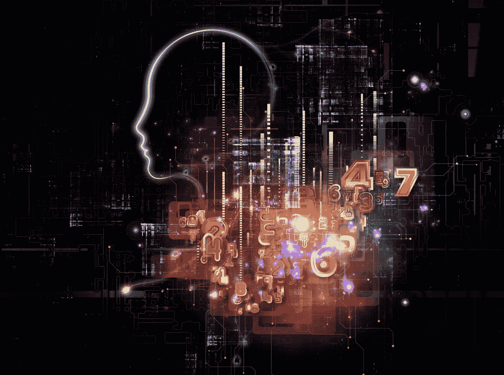
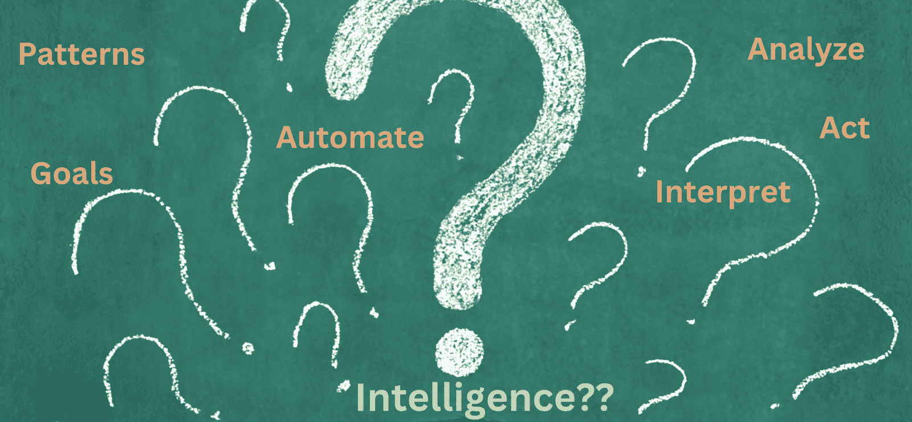
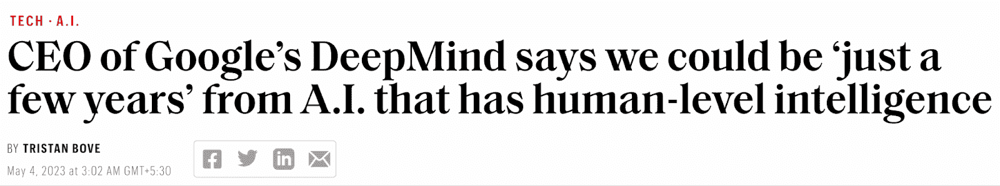
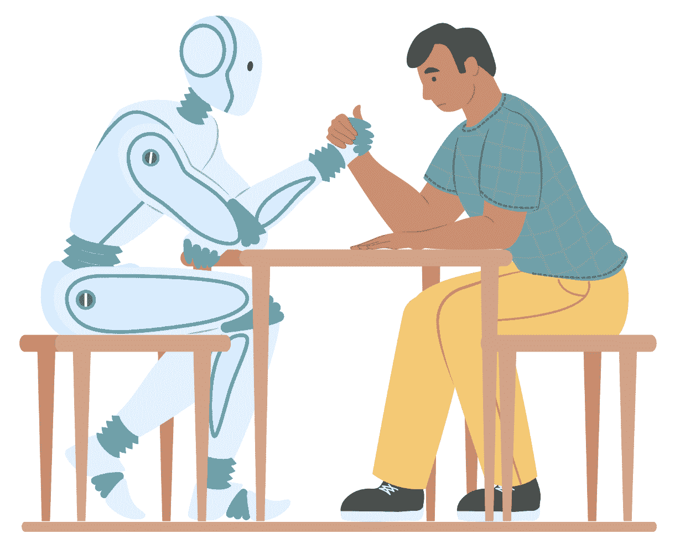

# 人工智能会取代人类吗？

> 原文：[`www.kdnuggets.com/will-ai-replace-humanity`](https://www.kdnuggets.com/will-ai-replace-humanity)

我们生活在一个概率的世界中。几年前，当我开始谈论人工智能及其影响时，最常见的问题是——人工智能是否会来袭？

尽管问题保持不变，但关于概率的回答已经发生了变化。在某些领域中，人工智能更有可能取代人类判断，因此这种概率随着时间的推移而增加。

当我们讨论复杂技术时，答案不会很简单。这取决于几个因素，比如什么才算智能，我们是否建议替代工作，预测人工通用智能（AGI）的时间表，或识别人工智能的能力和局限性。

来源：Canva

# 智能的定义

让我们首先理解智能的定义：

[斯坦福大学](https://hai.stanford.edu/sites/default/files/2020-09/AI-Definitions-HAI.pdf)将智能定义为“在一个不确定、不断变化的世界中，学习并采用适当的技术来解决问题和实现目标的能力。”

[Gartner](https://www.gartner.com/en/information-technology/glossary/artificial-intelligence)将其描述为分析、解读事件、支持和自动化决策及采取行动的能力。

人工智能擅长学习模式，但仅仅识别模式并不足以称之为智能。这只是更广泛的多维人类智能谱系中的一个方面。

来源：Canva

专家们[认为](https://www.theguardian.com/commentisfree/2023/mar/30/artificial-intelligence-chatgpt-human-mind)，“人工智能永远无法做到这一点，因为机器无法对过去、现在和未来的历史、伤害或怀旧产生感知（而不仅仅是知识）。没有这些，机器没有情感，缺乏了双重逻辑的一个组成部分。因此，机器仍然陷入单一形式逻辑中。这就是‘智能’的部分。”

# 清除测试 = 智能？

有些人可能会提到人工智能通过了来自著名机构的测试，最近还通过了图灵测试，作为其智能的证明。

*对于不了解的人来说，图灵测试是由著名计算机科学家艾伦·图灵设计的实验。根据这一测试，如果评估者无法区分机器和人类的回应，那么机器就具有人类般的智能。*

[对测试的综合概述](https://www.aiplusinfo.com/blog/has-any-ai-passed-the-turing-test/)强调，尽管生成式人工智能模型可以根据从大量训练数据中学习到的统计模式或关联生成自然语言，但它们没有人类般的意识。

即使是高级测试，如通用语言理解评估（GLUE）和斯坦福问答数据集（SQuAD），也与图灵测试的基本前提相同。

# 替代的意义是什么？

## 工作岗位的丧失

让我们从一个迅速成为现实的恐惧开始——人工智能是否会使我们的工作变得多余？虽然没有明确的“是或否”的答案，但随着生成性 AI 在自动化机会上的拓展，这一问题正迅速逼近。

[麦肯锡](https://www.mckinsey.com/mgi/our-research/generative-ai-and-the-future-of-work-in-america#/) 报告称：“到 2030 年，占美国经济目前工作时间的 30% 的活动可能会被自动化——这是生成性 AI 加速的趋势。”

像办公室支持、会计、银行、销售或客户支持这样的职位是首先会被自动化的对象。生成性 AI 在代码编写和测试工作流程中对软件开发人员的辅助已经影响了初级开发人员的工作角色。

其结果通常被认为是专家进一步提升输出的良好起点，例如制作营销文案、推广内容等。

一些叙述通过强调新工作岗位的可能性，使这一转变看起来很微妙，例如短期内的医疗、科学和技术领域；以及 AI 伦理学家、AI 管理、审计、AI 安全等，旨在使 AI 成为现实。然而，这些新工作岗位无法超越被替代的岗位数量，因此我们必须考虑新创造的净工作岗位，以了解最终影响。

## AGI

接下来是 AGI 的可能性，这与智能的多种定义类似，需要明确的含义。通常，AGI 指的是机器获得类似于人类的感知和世界意识的阶段。

然而，AGI 是一个值得单独讨论的话题，不在本文的范围之内。

目前，我们可以参考 DeepMind 首席执行官的日记，以了解其早期迹象。

来源：[财富](https://fortune.com/2023/05/03/google-deepmind-ceo-agi-artificial-intelligence/)

# 它能替代人类吗？

## 好助手

从更广泛的角度来看，它足够智能，可以帮助人类大规模识别模式并提高效率。

让我们通过一个例子来验证这一点，其中供应链规划师查看多个订单详情，并致力于确保那些可能出现短缺的订单。每个规划师在处理短缺交付时有不同的方法：

+   查看像手头上有多少库存这样的属性

+   在那个时间框架内，其他客户的预期需求是什么？

+   哪个客户或订单应优先于其他？

+   与其他工厂经理进行战情室讨论，以促进物品的供应。

+   致力于优化从特定配送中心的路线。

作为个人规划者，可能会受到其视角和处理此类情况的方法的限制，机器通过理解许多规划者的行动可以学习到最佳方法，并通过其发现模式的能力帮助他们自动化简单场景。

这就是机器在同时管理多个属性或因素方面相对于人类有限能力的优势所在。

## 机械的

然而，机器就是它们自己，即机械的。你不能指望它们像伟大的领导者那样合作、协作并与团队建立富有同情心的关系。

我经常参与较轻松的团队讨论，不是因为我必须，而是因为我更喜欢在一个与团队紧密相连的环境中工作，他们也很了解我。从一开始就只讨论工作或试图表现得很重要，这种方式太机械化了。

来源：Canva

## 缺乏同情心

另一个例子是，当机器分析患者的记录并根据其医疗诊断如实披露健康问题时，与医生如何细致处理这种情况相比，医生由于拥有情感并知道危机中的感觉，处理方式会更加周到。

大多数成功的医疗专业人士会超越他们的“职责”，与患者建立联系，帮助他们度过困难时期，而机器在这方面做得不好。

## 没有道德准则

机器在数据上进行训练，这些数据可以捕捉潜在现象，并创建最佳估计的模型。

在这种估算中，特定条件的细微差别会丢失。它们没有类似于法官在审视每个案件时的道德准则。

# 结束语

总结来说，机器可能会从数据中学习模式（以及随之而来的偏见），但没有智慧、动力或动机来进行根本性的改变，以解决困扰人类的问题。它们是以人类智慧为基础的，具有目标导向，但人类智慧则复杂得多。

这个 [短语](https://www.gartner.com/peer-community/post/ai-totally-replacehuman-beings) 很好地总结了我的想法——AI 可以取代人脑，但不能取代人类。

****[Vidhi Chugh](https://vidhi-chugh.medium.com/)** 是一位 AI 战略家和数字化转型领袖，在产品、科学和工程的交汇点上工作，致力于构建可扩展的机器学习系统。她是一位获奖的创新领袖、作者和国际演讲者。她的使命是普及机器学习，并打破术语，使每个人都能参与这场转型。

### 更多相关主题

+   [DeepMind 的 AlphaCode 会取代程序员吗？](https://www.kdnuggets.com/2022/04/deepmind-alphacode-replace-programmers.html)

+   [AI 不会取代我们](https://www.kdnuggets.com/2023/02/ai-replace-us.html)

+   [ChatGPT 会取代数据科学家吗？](https://www.kdnuggets.com/2023/06/chatgpt-replace-data-scientists.html)

+   [你应该用来替代 Google 的 8 款 AI 搜索引擎](https://www.kdnuggets.com/top-8-ai-search-engine-that-you-should-replace-with-google)
