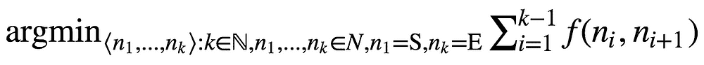
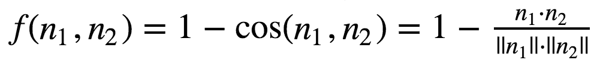
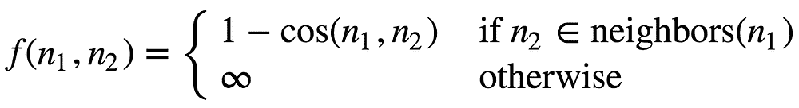
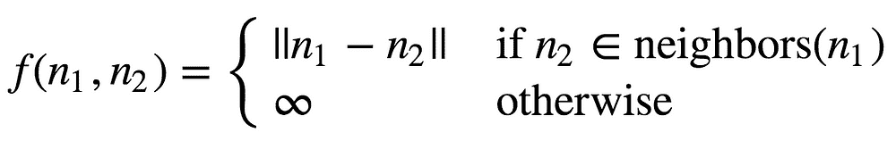

# Word Morphing – 一个原创想法

> 原文：[`www.kdnuggets.com/2018/11/word-morphing-original-idea.html`](https://www.kdnuggets.com/2018/11/word-morphing-original-idea.html)

 comments


**平滑的图像过渡（变形）从老虎到人类（图片来源：Google Images）**

为了进行词形变化，我们将定义一个图*G*，其中节点集合*N*表示单词，并且存在一个非负权重函数*f*:*N*×*N*→ℝ。给定一个起始单词*S*和一个结束单词*E*，我们的目标是找到图中的一条路径，该路径最小化由*f*引起的权重总和：



**图 1\. 由 f 引起的最小成本的最佳路径**

通常，当人们谈论词形变化时，他们指的是在*S*和*E*之间寻找一条路径，其中只有当通过改变一个字母可以从一个单词得到另一个单词时，才存在边，如[这里](http://wordmorph.sarangconsulting.com/faq.php#1.2)所示。在这种情况下，当存在这样的变化时，*f*(*n*₁,*n*₂)为 1，否则为∞。

在这篇文章中，我将展示如何在语义上相似的单词之间进行变形，即*f*将与语义相关。以下是一个示例，说明这两种方法之间的差异：给定*S*=*tooth*，*E*=*light*，一次只改变一个字符的方法[可能结果](http://wordmorph.sarangconsulting.com/?source=tooth&target=light&submit=MORPH+WORDS)为

```py

tooth, booth, boots, botts, bitts, bitos, bigos, bigot, bight, light

```

而本文将定义的语义方法会导致

```py

tooth, retina, X_ray, light

```

你可以在[这里](https://github.com/yoel-zeldes/yoel-zeldes.github.io/blob/source/content/word%20morph/word-morph.ipynb)找到完整的代码。

### 词汇语义

为了捕捉词汇语义，我们将使用预训练的 word2vec 嵌入[1]。对于那些不熟悉该算法的人，以下是来自[维基百科](https://en.wikipedia.org/wiki/Word2vec)的摘录：

> *Word2vec 以大规模文本语料库为输入，生成一个向量空间，通常为数百维，其中语料库中的每个唯一单词都分配了一个相应的向量。词向量在向量空间中被定位，使得在语料库中共享共同上下文的单词在空间中彼此接近。*

这意味着图中的每个节点都可以与高维空间中的某个向量关联（在我们的案例中为 300 维）。因此，我们可以自然地定义每两个节点之间的距离函数。我们将使用余弦相似度，因为这是通常用于语义比较词嵌入的度量。从现在开始，我将重载节点符号*n*为其相关单词的嵌入向量。

要使用 word2vec 嵌入，我们将从[这里](https://drive.google.com/uc?id=0B7XkCwpI5KDYNlNUTTlSS21pQmM&export=download)下载 Google 的预训练嵌入，并使用 gensim 包来访问它们。

### 选择权重函数

给定余弦相似度距离函数，我们可以将我们的 *f* 函数定义为



**公式 1\. 使用余弦相似度定义权重函数**

然而，使用这种方法我们会面临一个问题：最佳路径可能包括权重较高的边，这将导致相邻词语在语义上不相似。

为了解决这个问题，我们可以将 *f* 修改为



**公式 2\. 使用限制为最近邻的余弦相似度定义权重函数**

其中 *neighbors*(*n*₁) 表示图中与 *n*₁ 在余弦相似度方面最接近的节点。邻居的数量是可配置的。

### A* 搜索

现在我们已经定义了图，我们将使用一个叫做 A* 的著名搜索算法[2]。

在这个算法中，每个节点的成本由两个部分组成——*g*(*n*)+*h*(*n*)。

*g*(*n*) 是从 *S* 到 *n* 的最短路径成本，而 *h*(*n*) 是一个启发式函数，用于估计从 *n* 到 *E* 的最短路径成本。在我们的例子中，启发式函数将是 *f*。

搜索算法维护一个叫做 *开放集* 的数据结构。最初这个集合包含 *S*，在算法的每次迭代中，我们弹出开放集中成本最小的节点 *g*(*n*)+*h*(*n*)，并将其邻居添加到开放集中。算法在成本最小的节点为 *E* 时停止。

这个算法可以与我们选择的任何启发式函数一起使用。但为了实际找到最佳路径，启发式函数必须是可接纳的，意味着它不能高估真实成本。不幸的是，*f* 不是可接纳的。然而，我们将使用[观察](https://en.wikipedia.org/wiki/Cosine_similarity#Properties)，即如果向量的长度为 1，那么余弦相似度可以通过对欧几里得距离进行单调变换来获得。这意味着在按相似度对词进行排序时，两者是可以互换的。欧几里得距离是可接纳的（你可以通过[三角不等式](https://en.wikipedia.org/wiki/Triangle_inequality)证明），所以我们可以使用它来代替，定义为



**公式 3\. 使用欧几里得距离定义权重函数**

总结一下，我们将对词嵌入进行归一化，使用欧几里得距离作为找到语义上相似词的手段，并用相同的欧几里得距离来指导 A* 搜索过程，以找到最佳路径。

我选择了*邻居*（*n*）来包含其 1000 个最近的节点。然而，为了使搜索更高效，我们可以使用稀释因子为 10 对这些节点进行稀释：我们选择最近的邻居，第 10 近邻，第 20 近邻，以此类推——直到我们得到 100 个节点。这样做的直觉是，从某个中间节点到*E*的最佳路径可能会经过其最近的邻居。如果没有，可能是因为它也不会经过第二个邻居，因为第一个和第二个邻居可能几乎是相同的。因此，为了节省计算，我们只是跳过了一些最近的邻居。

现在进入有趣的部分：

结果：

```py

['tooth', u'retina', u'X_ray', u'light']
['John', u'George', u'Frank_Sinatra', u'Wonderful', u'perfect']
['pillow', u'plastic_bag', u'pickup_truck', u'car']

```

### 最后思考

实施词形变化项目很有趣，但不如玩这个工具并尝试任何我能想到的单词对有趣。我鼓励你自己去[尝试一下](https://github.com/yoel-zeldes/yoel-zeldes.github.io/blob/source/content/word%20morph/word-morph.ipynb)。在评论中告诉我你发现了哪些有趣和惊人的词形变化:)

*本文最初发布于*[*www.anotherdatum.com*](http://www.anotherdatum.com/)*。*

#### 参考文献

[1] [`papers.nips.cc/paper/5021-distributed-representations-of-words-and-phrases-and-their-compositionality`](https://papers.nips.cc/paper/5021-distributed-representations-of-words-and-phrases-and-their-compositionality)

[2] [`www.cs.auckland.ac.nz/courses/compsci709s2c/resources/Mike.d/astarNilsson.pdf`](https://www.cs.auckland.ac.nz/courses/compsci709s2c/resources/Mike.d/astarNilsson.pdf)

**简介**： [Yoel Zeldes](https://medium.com/@yoelzeldes) 是 Taboola 的算法工程师，同时也是一位机器学习爱好者，特别喜欢深度学习的见解。

[原文](https://towardsdatascience.com/word-morphing-9f87ee577775)。已获得许可转载。

**资源：**

+   [在线和基于网络的：分析、数据挖掘、数据科学、机器学习教育](https://www.kdnuggets.com/education/online.html)

+   [用于分析、数据科学、数据挖掘和机器学习的软件](https://www.kdnuggets.com/software/index.html)

**相关：**

+   [抱歉，我没明白！如何理解用户的需求](https://www.kdnuggets.com/2018/11/sorry-understand-what-users-want.html)

+   [多类别文本分类与 Doc2Vec 和逻辑回归](https://www.kdnuggets.com/2018/11/multi-class-text-classification-doc2vec-logistic-regression.html)

+   [10 个免费必看机器学习和数据科学课程](https://www.kdnuggets.com/2018/11/10-free-must-see-courses-machine-learning-data-science.html)

* * *

## 我们的前 3 名课程推荐

 1\. [Google 网络安全证书](https://www.kdnuggets.com/google-cybersecurity) - 快速进入网络安全职业生涯。

 2\. [谷歌数据分析专业证书](https://www.kdnuggets.com/google-data-analytics) - 提升你的数据分析技能

 3\. [谷歌 IT 支持专业证书](https://www.kdnuggets.com/google-itsupport) - 支持你所在组织的 IT 工作

* * *

### 更多相关主题

+   [使用 Python 自动化 Microsoft Excel 和 Word](https://www.kdnuggets.com/2021/08/automate-microsoft-excel-word-python.html)

+   [自然语言处理中的不同词嵌入技术终极指南](https://www.kdnuggets.com/2021/11/guide-word-embedding-techniques-nlp.html)
