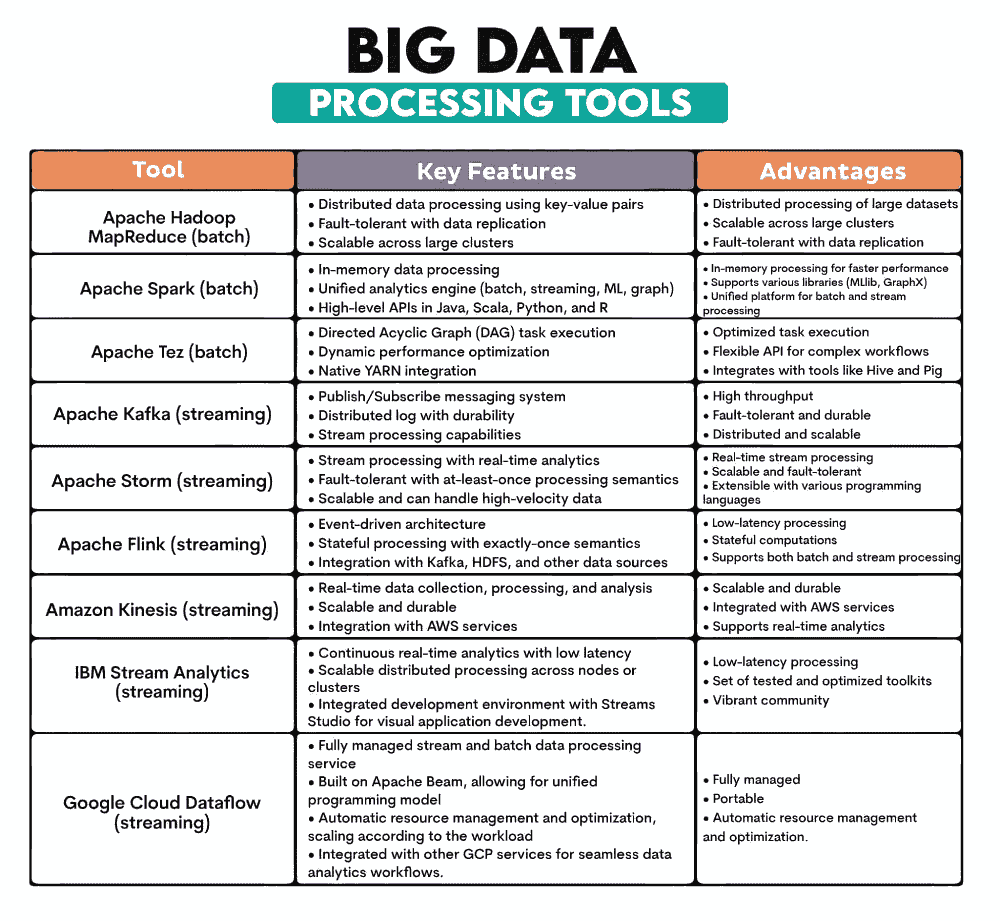
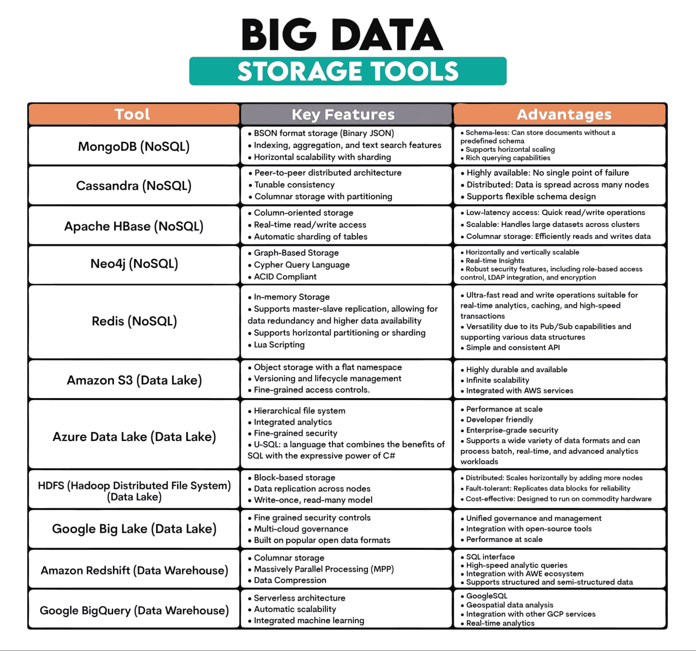
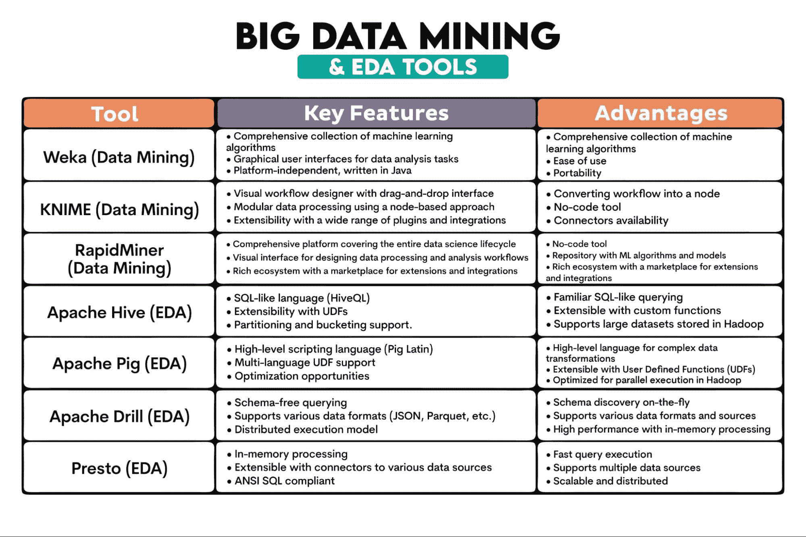
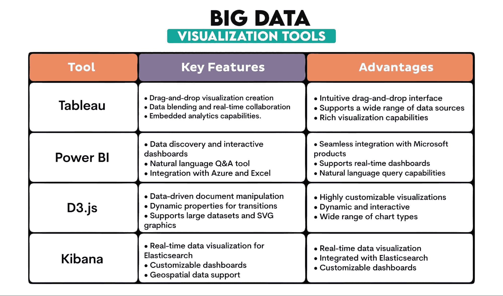

# 与大数据相关的工具和技术

> 原文：[`www.kdnuggets.com/working-with-big-data-tools-and-techniques`](https://www.kdnuggets.com/working-with-big-data-tools-and-techniques)

图片来源：[尼诺·苏扎](https://www.pexels.com/photo/macbook-pro-near-keyboard-2800552/)

以前，商业中你需要的所有数据都在你的“小黑本”里。然而，在数字革命的时代，即使是经典数据库也不再够用。

* * *

## 我们的前三大课程推荐

 1\. [Google 网络安全证书](https://www.kdnuggets.com/google-cybersecurity) - 快速进入网络安全职业生涯。

 2\. [Google 数据分析专业证书](https://www.kdnuggets.com/google-data-analytics) - 提升您的数据分析技能

 3\. [Google IT 支持专业证书](https://www.kdnuggets.com/google-itsupport) - 支持您的组织在 IT 方面

* * *

处理大数据已经成为企业和数据科学家的一项关键技能。大数据的特征包括体积、速度和多样性，为我们提供了前所未有的模式和趋势洞察。

要有效处理这些数据，需要使用专门的工具和技术。

# 什么是大数据？

不，这不仅仅是大量数据。

大数据通常由三个 V 来描述：

+   **体积 –** 是的，生成和存储的数据的大小是其特征之一。要被视为大数据，数据大小必须以 PB（1,024 TB）和 EB（1,024 PB）为单位来衡量。

+   **多样性 –** 大数据不仅包括结构化数据，还包括半结构化数据（JSON、XML、YAML、电子邮件、日志文件、电子表格）和非结构化数据（文本文件、图像和视频、音频文件、社交媒体帖子、网页、科学数据如卫星图像、地震波形数据或原始实验数据），重点是非结构化数据。

+   **速度 –** 生成和处理数据的速度。

# 大数据工具和技术

所有提到的大数据特征都会影响我们处理大数据所使用的工具和技术。

当我们谈论大数据技术时，它们只是我们用来处理、分析和管理大数据的方法、算法和方法。从表面上看，它们与常规数据相同。然而，我们讨论的大数据特征要求不同的方法和工具。

以下是大数据领域中一些突出的工具和技术。

## 1\. 大数据处理

**什么是数据处理？** 数据处理指的是将原始数据转换为有意义的信息的操作和活动。它包括从清理和结构化数据到运行复杂算法和分析的任务。

大数据有时会进行批处理，但更普遍的是数据流处理。

**关键特征：**

+   **并行处理：** 将任务分配到多个节点或服务器上，以便同时处理数据，从而加快计算速度。

+   **实时与批处理：** 数据可以实时处理（在生成时处理）或批量处理（在预定时间处理数据块）。

+   **可扩展性：** 大数据工具通过扩展来处理大量数据，增加更多资源或节点。

+   **容错性：** 如果节点失败，系统将继续处理，确保数据完整性和可用性。

+   **多样的数据来源：** 大数据来自许多来源，包括结构化数据库、日志、流或非结构化数据存储库。

**使用的大数据工具：** [Apache Hadoop MapReduce](https://hadoop.apache.org/docs/stable/hadoop-mapreduce-client/hadoop-mapreduce-client-core/MapReduceTutorial.html)、[Apache Spark](https://spark.apache.org)、[Apache Tez](https://tez.apache.org)、[Apache Kafka](https://kafka.apache.org)、[Apache Storm](https://storm.apache.org)、[Apache Flink](https://flink.apache.org)、[Amazon Kinesis](https://aws.amazon.com/kinesis/data-streams/)、[IBM Streams](https://www.ibm.com/cloud/streaming-analytics)、[Google Cloud Dataflow](https://cloud.google.com/dataflow)

**工具概述：**

## 2\. 大数据 ETL

**这是什么？** ETL 是 **提取** 数据从各种来源，**转换** 为结构化和可用格式，和 **加载** 到数据存储系统中以供分析或其他用途。

大数据的特点意味着 ETL 过程需要处理更多来自更多来源的数据。数据通常是半结构化或非结构化的，其转换和存储方式与结构化数据不同。

大数据中的 ETL 通常还需要实时处理数据。

**关键特征：**

+   **数据提取：** 从各种异构来源检索数据，包括数据库、日志、API 和文本文件。

+   **数据转换：** 将提取的数据转换成适合查询、分析或报告的格式。包括数据的清理、丰富、聚合和重新格式化。

+   **数据加载：** 将转换后的数据存储到目标系统中，例如数据仓库、数据湖或数据库。

+   **批处理或实时处理：** 实时 ETL 过程在大数据中比批处理更为普遍。

+   **数据集成：** ETL 将来自不同来源的数据整合起来，确保组织内的数据视图统一。

**使用的大数据工具：** [Apache NiFi](https://nifi.apache.org)、[Apache Sqoop](https://sqoop.apache.org)、[Apache Flume](https://flume.apache.org)、[Talend](https://www.talend.com)

**工具概述：**

| **大数据 ETL 工具** |  |  |
| --- | --- | --- |
|  |  |  |
| **工具** | **关键特性** | **优势** |
| Apache NiFi | • 通过基于 Web 的 UI 设计数据流• 数据来源跟踪• 可扩展的处理器架构 | • 视觉界面：易于设计数据流• 支持数据来源• 可通过广泛的处理器扩展 |
| Apache Sqoop | • 在 Hadoop 和数据库之间的大规模数据传输• 并行导入/导出• 压缩和直接导入功能 | • 在 Hadoop 和关系数据库之间的高效数据传输• 并行导入/导出• 增量数据传输功能 |
| Apache Flume | • 基于事件和可配置的架构• 可靠和持久的数据交付• 与 Hadoop 生态系统的本地集成 | • 可扩展和分布式• 容错架构• 可扩展的自定义源、通道和接收器 |
| Talend | • 视觉设计界面• 广泛连接到数据库、应用程序等• 数据质量和分析工具 | • 支持多种数据源的连接器• 图形界面用于设计数据集成流程• 支持数据质量和主数据管理 |

## 3\. 大数据存储

**什么是它？** 大数据存储必须存储大量以高速生成的各种格式的数据。

存储大数据的三种最明显方式是 NoSQL 数据库、数据湖和数据仓库。

NoSQL 数据库设计用于处理大量结构化和非结构化数据而不需要固定的模式（NoSQL - 不仅仅是 SQL）。这使得它们适应不断变化的数据结构。

与传统的垂直可扩展数据库不同，NoSQL 数据库是水平可扩展的，这意味着它们可以将数据分布到多个服务器上。通过向系统添加更多机器，扩展变得更加容易。它们具有容错性，低延迟（在需要实时数据访问的应用程序中受到青睐），并且在规模扩展时具有成本效益。

数据湖是存储库，存储大量原始数据的本地格式。这简化了数据访问和分析，因为所有数据都位于一个地方。

数据湖具有可扩展性和成本效益。它们提供灵活性（数据以原始形式摄取，结构在读取数据进行分析时定义），支持批处理和实时数据处理，并且可以与数据质量工具集成，从而实现更高级的分析和更丰富的见解。

数据仓库是一个集中式存储库，优化用于分析处理，从多个来源存储数据，并将其转化为适合分析和报告的格式。

它被设计用来存储大量数据，从各种来源进行集成，并允许历史分析，因为数据是按时间维度存储的。

**主要特点：**

+   **可扩展性：** 设计为通过增加更多节点或单元进行扩展。

+   **分布式架构：** 数据通常存储在多个节点或服务器上，确保高可用性和容错性。

+   **多种数据格式：** 可以处理结构化、半结构化和非结构化数据。

+   **耐久性：** 一旦存储，数据保持完整且可用，即使在硬件故障的情况下也不受影响。

+   **成本效益：** 许多大数据存储解决方案被设计为在普通硬件上运行，从而使其在规模化时更具经济性。

**使用的大数据工具：** [MongoDB](https://www.mongodb.com)（基于文档），[Cassandra](https://cassandra.apache.org/_/index.html)（基于列），[Apache HBase](https://hbase.apache.org)（基于列），[Neo4j](https://neo4j.com)（基于图），[Redis](https://redis.io)（键值存储），[Amazon S3](https://aws.amazon.com/s3/)，[Azure Data Lake](https://azure.microsoft.com/en-us/solutions/data-lake)，[Hadoop 分布式文件系统 (HDFS)](https://hadoop.apache.org/docs/r1.2.1/hdfs_design.html)，[Google Big Lake](https://cloud.google.com/biglake#section-4)，[Amazon Redshift](https://aws.amazon.com/redshift/)，[BigQuery](https://cloud.google.com/bigquery/)

**工具概述：**

## 4\. 大数据挖掘

**这是什么？：** 这是发现大型数据集中的模式、关联、异常和统计关系。它涉及机器学习、统计学等学科，并使用数据库系统从数据中提取见解。

挖掘的数据量巨大，庞大的数据量可以揭示在较小数据集中可能不明显的模式。大数据通常来自各种来源，且通常是半结构化或非结构化的。这需要更复杂的预处理和集成技术。与常规数据不同，大数据通常是实时处理的。

用于大数据挖掘的工具必须处理这些内容。为此，它们应用分布式计算，即数据处理分布在多个计算机上。

一些算法可能不适合大数据挖掘，因为这需要可扩展的并行处理算法，例如，[SVM](https://www.stratascratch.com/blog/machine-learning-algorithms-explained-support-vector-machine/?utm_source=blog&utm_medium=click&utm_campaign=kdn+big+data+tools)，[SGD](https://scikit-learn.org/stable/modules/sgd.html)，或[梯度提升](https://scikit-learn.org/stable/modules/generated/sklearn.ensemble.GradientBoostingClassifier.html)。

大数据挖掘还采用了探索性数据分析（EDA）技术。EDA 分析数据集以总结其主要特征，通常使用统计图形、图表和信息表。因此，我们将一起讨论大数据挖掘和 EDA 工具。

**关键特征：**

+   **模式识别：** 在大型数据集中识别规律或趋势。

+   **聚类和分类：** 根据相似性或预定义标准对数据点进行分组。

+   **关联分析：** 发现大型数据库中变量之间的关系。

+   **回归分析：** 理解和建模变量之间的关系。

+   **异常检测：** 识别不寻常的模式。

**大数据工具使用：** [Weka](https://www.weka.io)，[KNIME](https://www.knime.com)，[RapidMiner](https://rapidminer.com)，[Apache Hive](https://hive.apache.org)，[Apache Pig](https://pig.apache.org)，[Apache Drill](https://drill.apache.org)，[Presto](https://prestodb.io)

**工具概述：**

## 5\. 大数据可视化

**什么是它？：** 它是从庞大的数据集中提取的信息和数据的图形表示。通过使用图表、图形和地图等视觉元素，数据可视化工具提供了一种便于理解数据中的模式、异常值和趋势的方式。

再次强调，大数据的特征，如规模和复杂性，使其与常规数据可视化不同。

**关键特征：**

+   **互动性：** 大数据可视化需要互动式仪表盘和报告，允许用户深入查看具体细节并动态探索数据。

+   **可扩展性：** 大型数据集需要高效处理而不影响性能。

+   **多样化的可视化类型：** 例如，热力图、地理空间可视化和复杂的网络图。

+   **实时可视化：** 许多大数据应用需要实时数据流和可视化，以便监控和响应实时数据。

+   **与大数据平台的集成：** 可视化工具通常与大数据平台无缝集成。

**大数据工具使用：** [Tableau](https://www.tableau.com)，[PowerBI](https://powerbi.microsoft.com/en-us/)，[D3.js](https://d3js.org)，[Kibana](https://www.elastic.co/kibana)

**工具概述：**

# 结论

大数据与常规数据非常相似，但又完全不同。它们共享处理数据的技术。但由于大数据的特性，这些技术仅仅在名字上是相同的。否则，它们需要完全不同的方法和工具。

如果你想进入大数据领域，你需要使用各种大数据工具。我们对这些工具的概述应该是一个很好的起点。

**[内特·罗西迪](https://www.stratascratch.com)** 是一位数据科学家，从事产品战略工作。他还是一位兼职教授，教授分析学，并且是 [StrataScratch](https://www.stratascratch.com/) 的创始人，这是一个帮助数据科学家准备面试的平台注册平台，提供来自顶级公司的真实面试问题。可以在 [Twitter: StrataScratch](https://twitter.com/StrataScratch) 或 [LinkedIn](https://www.linkedin.com/in/nathanrosidi/) 上与他联系。

### 更多相关内容

+   [2022 年及以后顶级 AI 和数据科学工具与技术](https://www.kdnuggets.com/2022/03/nvidia-0317-top-ai-data-science-tools-techniques-2022-beyond.html)

+   [在实际应用中实现深度学习：一个数据中心化课程](https://www.kdnuggets.com/2022/04/corise-deep-learning-wild-data-centric-course.html)

+   [数据科学家远程工作的 6 项软技能](https://www.kdnuggets.com/2022/05/6-soft-skills-data-scientists-working-remotely.html)

+   [让深度学习在实际环境中运作：数据驱动的课程](https://www.kdnuggets.com/2022/11/corise-deep-learning-wild-data-centric-course.html)

+   [在 Python 中使用 SQLite 数据库的指南](https://www.kdnuggets.com/a-guide-to-working-with-sqlite-databases-in-python)

+   [在机器学习模型中使用稀疏特征](https://www.kdnuggets.com/2021/01/sparse-features-machine-learning-models.html)
