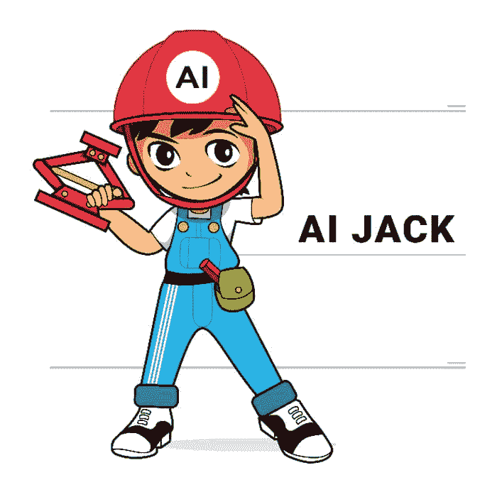
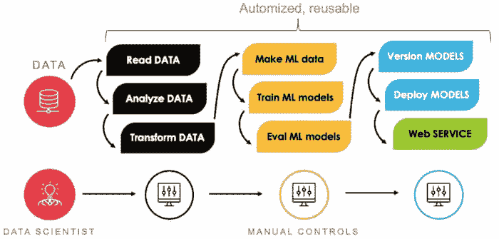
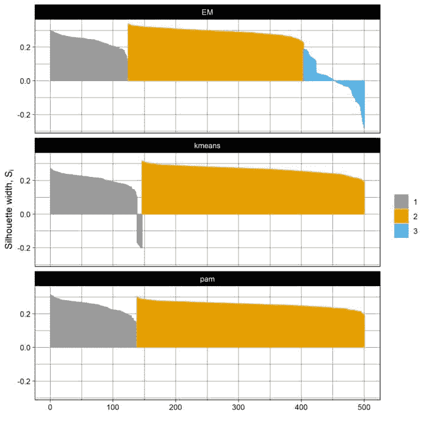

# 在 AI-JACK 库中封装机器学习技术

> 原文：[`www.kdnuggets.com/2020/07/wrapping-machine-learning-techniques-ai-jack-library-r.html`](https://www.kdnuggets.com/2020/07/wrapping-machine-learning-techniques-ai-jack-library-r.html)

评论

**由[Jędrzej Furmann](https://www.linkedin.com/in/jędrzej-furmann-553657153/)和[AI-JACK](https://twitter.com/AIJACK_AI)共同开发**

目前，人工智能的前沿技术包括但不限于在一个工具/库中比较多个机器学习模型。然而，手动[尝试不同的技术](https://machinelearningmastery.com/compare-the-performance-of-machine-learning-algorithms-in-r/)仍然非常普遍，这种做法一旦重复多次，不仅枯燥无味，而且容易出错。当代码量庞大时，降低失败风险变得更加重要，因为调试和测试变得繁琐。考虑到这一点，AI-JACK 应运而生。它是一个机器学习管道加速器，作为 R 语言库设计，旨在更快更好地解决问题。

### 这是什么？

AI-JACK 以[R 语言库](https://github.com/Bilot/AI-JACK-opensource-R)的形式编写，尽管**它不要求用户进行任何编码**，除非用户希望添加自定义功能。它包含多个内置功能，帮助完成整个管道。包括数据加载、预处理、模型训练和版本控制，以及部署等模块，**所有这些都可以通过一个配置文件中的几个参数来控制**。建模主要使用 H2O API，一个最先进的机器学习框架，提供了许多算法，如 XGBoost、随机森林、线性模型、深度学习、EM 聚类、孤立森林等。

尽管许多功能是内置的，但代码可以以任何方式修改。用户可以在 AI-JACK 基础上添加其他功能或模型。这是该工具的优势：它可以作为许多问题中的完整管道，也可以只是更大过程中的一个步骤。

AI-JACK 在不同的超参数集上训练选定的模型，根据选定的指标选择最佳模型，然后将其输出——元数据、验证结果、特征重要性和模型本身——保存到指定路径。结果还可以以 Web 服务的形式提供，你可以通过 API 访问这些结果。

### 如何使用 AI-JACK？

为了正常工作，你需要安装 R 运行时。RStudio 作为最常用的文本编辑器，写 R 代码时也会非常方便，尽管 AI-JACK 的基本版本不需要编码，一个简单的笔记本也足够。

**AI-JACK**还需要一个有效的 Java 运行环境安装。

在使用 AI-JACK 之前，您的数据集通常应该进行预处理。该库仅支持一些基本技术：去除特殊字符、缺失值处理、拆分测试/训练/验证集。数据集可以作为本地 csv 文件加载，或连接到 SQL 数据库。然后，您只需在选定路径中使用 `init_aijack` 函数初始化项目，并在新创建的配置文件 `config_model.R` 或 `config_clust_model.R` 中指定参数，具体取决于您是使用监督学习还是无监督学习。保存配置文件后，运行 `main_model.R` 或 `main_clust_model.R`，将训练几个模型。所有需要的文件都会自动保存到选定路径。

如果您正在训练监督模型，csv 输出包括所有技术的特征重要性信息，以及验证结果、创建的列名称（例如，如果模型使用了虚拟变量）、每次执行的准确度分数、可能的错误和有关模型的元数据。

如果你正在使用聚类，AI-JACK 会自动训练三种技术，并保存 png 图表，比较这些模型的轮廓系数。这些技术是 k-means、k-medoids 和期望最大化，它们是无监督技术中最常用的。

详细手册以及开发者联系方式可以在 GitHub 页面找到。AI-JACK 是一个开源项目，因此欢迎贡献！如果你觉得这个库有用，并想帮助开发它，你可以自由地参与其中。

**个人简介：[Jędrzej Furmann](https://www.linkedin.com/in/jędrzej-furmann-553657153/)** 是一名初级数据科学家和**[AI-JACK](https://twitter.com/AIJACK_AI)** 的共同开发者。

**相关：**

+   自动化机器学习：免费电子书

+   modelStudio 和互动解释性模型分析的语法

+   实用的超参数优化

* * *

## 我们的前三大课程推荐

 1\. [Google 网络安全证书](https://www.kdnuggets.com/google-cybersecurity) - 快速进入网络安全职业生涯。

 2\. [Google 数据分析专业证书](https://www.kdnuggets.com/google-data-analytics) - 提升你的数据分析技能

 3\. [Google IT 支持专业证书](https://www.kdnuggets.com/google-itsupport) - 支持你的组织的 IT 工作

* * *

### 了解更多相关话题

+   [停止学习数据科学以寻找目标，并以目标来……](https://www.kdnuggets.com/2021/12/stop-learning-data-science-find-purpose.html)

+   [数据科学统计学习的顶级资源](https://www.kdnuggets.com/2021/12/springboard-top-resources-learn-data-science-statistics.html)

+   [一个 90 亿美元的 AI 失败，经过审视](https://www.kdnuggets.com/2021/12/9b-ai-failure-examined.html)

+   [成功数据科学家的 5 个特征](https://www.kdnuggets.com/2021/12/5-characteristics-successful-data-scientist.html)

+   [是什么使 Python 成为初创企业的理想编程语言](https://www.kdnuggets.com/2021/12/makes-python-ideal-programming-language-startups.html)

+   [每个数据科学家都应该了解的三个 R 库（即使你使用 Python）](https://www.kdnuggets.com/2021/12/three-r-libraries-every-data-scientist-know-even-python.html)
