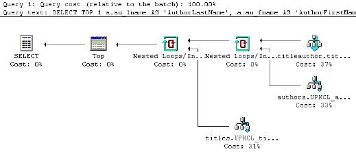

# 如何编写更好的 SQL 查询：权威指南 – 第二部分

> 原文：[`www.kdnuggets.com/2017/08/write-better-sql-queries-definitive-guide-part-2.html`](https://www.kdnuggets.com/2017/08/write-better-sql-queries-definitive-guide-part-2.html)

**作者：卡尔琳·威廉姆斯，数据科学记者及[DataCamp](https://www.datacamp.com/)贡献者**。

> **编辑注释：** 本文是第一部分的续篇，第一部分已于昨日发布，可在此处找到。虽然本文内容可以被视为独立于第一部分，但在继续之前阅读第一部分将极有帮助。
> 
> * * *
> 
> ## 我们的前三名课程推荐
> ## 
>  1\. [Google 网络安全证书](https://www.kdnuggets.com/google-cybersecurity) - 快速进入网络安全职业轨道
> 
>  2\. [Google 数据分析专业证书](https://www.kdnuggets.com/google-data-analytics) - 提升你的数据分析技能
> 
>  3\. [Google IT 支持专业证书](https://www.kdnuggets.com/google-itsupport) - 支持你所在组织的 IT
> 
> * * *
> 
> 首篇文章的引言段落如下，以设置教程的总体氛围。

结构化查询语言（SQL）是数据科学行业中必不可少的技能，通常来说，学习这项技能相对容易。然而，大多数人忘记了 SQL 不仅仅是编写查询，这只是走向成功的第一步。确保查询性能良好或符合你所处的上下文是另一回事。

### 基于集合的方法与过程方法的查询

上述反模式隐含的事实是，它们实际上归结为基于集合的方法与过程方法在构建查询时的区别。

过程方法的查询类似于编程：你告诉系统要做什么以及如何做。

这方面的一个例子是连接中的冗余条件或你滥用`HAVING`子句的情况，就像上述示例中那样，你通过执行一个函数然后调用另一个函数来查询数据库，或者你使用包含循环、条件、自定义函数（UDF）、游标等逻辑来获得最终结果。在这种方法中，你通常会发现自己先对数据的一个子集进行查询，然后再从数据中请求另一个子集，以此类推。

这种方法常常被称为“逐步”或“逐行”查询，这并不奇怪。

另一种方法是基于集合的方法，你只需指定要做的事情。你的角色是指定你希望从查询中获得的结果集的条件或要求。数据如何检索，则留给内部机制来确定查询的实现方式：你让数据库引擎确定执行查询的最佳算法或处理逻辑。

由于 SQL 是基于集合的，这种方法显然比过程式方法更有效，这也解释了为什么在某些情况下，SQL 可能比代码运行得更快。

**提示** 集合方法的查询也是数据科学行业中大多数顶级雇主要求你掌握的方法！你经常需要在这两种方法之间切换。

**注意** 如果你发现自己面对一个过程式查询，你应该考虑重写或重构它。

### 从查询到执行计划

了解反模式并非静态且会随着你作为 SQL 开发人员的成长而演变，并且考虑替代方案时有很多因素，也意味着避免查询反模式和重写查询可能是一个相当困难的任务。任何帮助都可能派上用场，这就是为什么使用一些工具来优化查询的结构化方法可能是一个好选择。

**注意** 此外，上一节提到的一些反模式根源于性能问题，例如`AND`、`OR`和`NOT`运算符及其缺乏索引的使用。考虑性能不仅需要更结构化的方法，还需要更深入的方法。

然而，这种结构化且深入的方法大多基于查询计划，正如你记得的，它是将查询首先解析为“解析树”的结果，并准确地定义了每个操作使用的算法以及操作执行的协调方式。

### 查询优化

如你在介绍中所读到的，可能需要手动检查和调整优化器生成的计划。在这种情况下，你需要通过查看查询计划再次分析你的查询。

要获取这个计划，你需要使用你的数据库管理系统提供的工具。你可能拥有的工具包括以下几种：

+   一些软件包提供了生成查询计划图形表示的工具。看看这个例子：



+   其他工具将能为你提供查询计划的文本描述。例如，Oracle 中的`EXPLAIN PLAN`语句，但根据你使用的 RDBMS，指令的名称会有所不同。在其他地方，你可能会找到`EXPLAIN`（MySQL、PostgreSQL）或`EXPLAIN QUERY PLAN`（SQLite）。

**注意**，如果你在使用 PostgreSQL，`EXPLAIN`和`EXPLAIN ANALYZE`的区别在于，`EXPLAIN`只会提供一个描述，说明规划者打算如何执行查询，而不实际运行查询，而`EXPLAIN ANALYZE`则会实际执行查询并返回期望的与实际的查询计划的分析。一般来说，实际执行计划是你实际运行查询的结果，而估算执行计划是预测它会做什么，而不执行查询。虽然在逻辑上等效，但实际执行计划要有用得多，因为它包含了关于实际执行查询时发生的额外细节和统计信息。

在本节的剩余部分，你将学习更多关于`EXPLAIN`和`ANALYZE`的内容，以及如何使用这两个工具来深入了解查询计划和查询的可能性能。为此，你将从一些示例开始，在这些示例中，你将处理两个表：`one_million`和`half_million`。

你可以借助`EXPLAIN`检索表`one_million`的当前信息；确保将其放在查询的最前面，当运行时，它会给你返回查询计划：

```py
EXPLAIN
SELECT *
FROM one_million;

QUERY PLAN
____________________________________________________
Seq Scan on one_million
(cost=0.00..18584.82 rows=1025082 width=36)
(1 row)
```

在这种情况下，你会看到查询的成本是`0.00..18584.82`，行数是`1025082`。列数的宽度是`36`。

此外，你还可以借助`ANALYZE`来更新统计信息。

```py
ANALYZE one_million;
EXPLAIN
SELECT *
FROM one_million;

QUERY PLAN
____________________________________________________
Seq Scan on one_million
(cost=0.00..18334.00 rows=1000000 width=37)
(1 row)
```

除了`EXPLAIN`和`ANALYZE`，你还可以通过`EXPLAIN ANALYZE`来获取实际执行时间：

```py
EXPLAIN ANALYZE
SELECT *
FROM one_million;

QUERY PLAN
___________________________________________________________
Seq Scan on one_million
(cost=0.00..18334.00 rows=1000000 width=37)
(actual time=0.015..1207.019 rows=1000000 loops=1)
Total runtime: 2320.146 ms
(2 rows)
```

使用`EXPLAIN ANALYZE`的缺点显而易见，即查询实际上会被执行，所以要小心！

到目前为止，你看到的所有算法都是`Seq Scan`（顺序扫描）或全表扫描：这是在数据库上进行的扫描，其中扫描的每一行以顺序（串行）方式读取，并检查找到的列是否满足条件。从性能的角度来看，顺序扫描绝对不是最佳执行计划，因为你仍然在进行*全表*扫描。然而，当表不适合内存时，它也不是太糟：即使在慢速磁盘上，顺序读取也很快。

当你谈论索引扫描时，你会看到更多内容。

但是，还有其他算法。举个例子，这里是一个连接的查询计划：

```py
EXPLAIN ANALYZE
SELECT *
FROM one_million JOIN half_million
ON (one_million.counter=half_million.counter);

QUERY PLAN
_________________________________________________________________
Hash Join (cost=15417.00..68831.00 rows=500000 width=42)
(actual time=1241.471..5912.553 rows=500000 loops=1)
Hash Cond: (one_million.counter = half_million.counter)
    -> Seq Scan on one_million
    (cost=0.00..18334.00 rows=1000000 width=37)
    (actual time=0.007..1254.027 rows=1000000 loops=1)
    -> Hash (cost=7213.00..7213.00 rows=500000 width=5)
    (actual time=1241.251..1241.251 rows=500000 loops=1)
    Buckets: 4096 Batches: 16 Memory Usage: 770kB
    -> Seq Scan on half_million
    (cost=0.00..7213.00 rows=500000 width=5)
(actual time=0.008..601.128 rows=500000 loops=1)
Total runtime: 6468.337 ms
```

你看到查询优化器选择了`Hash Join`！记住这个操作，因为你需要它来估算查询的时间复杂度。目前，注意`half_million.counter`上没有索引，你可以在下一个示例中添加：

```py
CREATE INDEX ON half_million(counter);
EXPLAIN ANALYZE
SELECT *
FROM one_million JOIN half_million
ON (one_million.counter=half_million.counter);

QUERY PLAN
________________________________________________________________
Merge Join (cost=4.12..37650.65 rows=500000 width=42)
(actual time=0.033..3272.940 rows=500000 loops=1)
Merge Cond: (one_million.counter = half_million.counter)
    -> Index Scan using one_million_counter_idx on one_million
    (cost=0.00..32129.34 rows=1000000 width=37)
    (actual time=0.011..694.466 rows=500001 loops=1)
    -> Index Scan using half_million_counter_idx on half_million
    (cost=0.00..14120.29 rows=500000 width=5)
(actual time=0.010..683.674 rows=500000 loops=1)
Total runtime: 3833.310 ms
(5 rows)
```

你会看到，通过创建索引，查询优化器现在决定使用`Merge join`，其中发生了`Index Scan`。

**注意** 索引扫描和完全表扫描或顺序扫描之间的区别：前者，也称为“表扫描”，扫描数据或索引页面以查找适当的记录，而后者扫描表的每一行。

你会看到总运行时间减少了，性能应该有所提升，但仍有两个索引扫描，这使得内存变得更为重要，特别是当表不能完全加载到内存时。在这种情况下，你首先需要进行完全索引扫描，这些是快速的顺序读取，不成问题，但之后你会有大量随机读取来根据索引值获取行。正是这些随机读取通常比顺序读取慢几个数量级。在这种情况下，完全表扫描确实比完全索引扫描更快。

**提示**：如果你想了解更多关于`EXPLAIN`的信息或查看更详细的示例，可以考虑阅读由 Guillaume Lelarge 编写的书籍[《Understanding Explain》](http://www.dalibo.org/_media/understanding_explain.pdf)。

### 相关话题

+   [转行数据科学的终极指南](https://www.kdnuggets.com/2022/05/definitive-guide-switching-career-data-science.html)

+   [Python 函数参数：终极指南](https://www.kdnuggets.com/2023/02/python-function-arguments-definitive-guide.html)

+   [解决 MySQL 幽灵读取的终极指南](https://www.kdnuggets.com/2022/06/definitive-guide-solving-phantom-read-mysql.html)

+   [逐步指南：阅读和理解 SQL 查询](https://www.kdnuggets.com/a-step-by-step-guide-to-reading-and-understanding-sql-queries)

+   [如何在原生 Python 中编写 SQL](https://www.kdnuggets.com/2022/02/easy-sql-native-python.html)

+   [KDnuggets 新闻，12 月 7 日：破解数据科学十大误区 • 4…](https://www.kdnuggets.com/2022/n47.html)
