# 使用管道编写干净的 Python 代码

> 原文：[`www.kdnuggets.com/2021/12/write-clean-python-code-pipes.html`](https://www.kdnuggets.com/2021/12/write-clean-python-code-pipes.html)

**由 [Khuyen Tran](https://www.linkedin.com/in/khuyen-tran-1401/)，数据科学实习生**

## 动机

`map` 和 `filter` 是两个高效的 Python 方法，用于处理可迭代对象。然而，如果同时使用 `map` 和 `filter`，代码可能会显得凌乱。

* * *

## 我们的前三名课程推荐

 1\. [谷歌网络安全证书](https://www.kdnuggets.com/google-cybersecurity) - 快速进入网络安全职业的快车道。

 2\. [谷歌数据分析专业证书](https://www.kdnuggets.com/google-data-analytics) - 提升你的数据分析技能

 3\. [谷歌 IT 支持专业证书](https://www.kdnuggets.com/google-itsupport) - 支持你的组织的 IT 需求

* * *

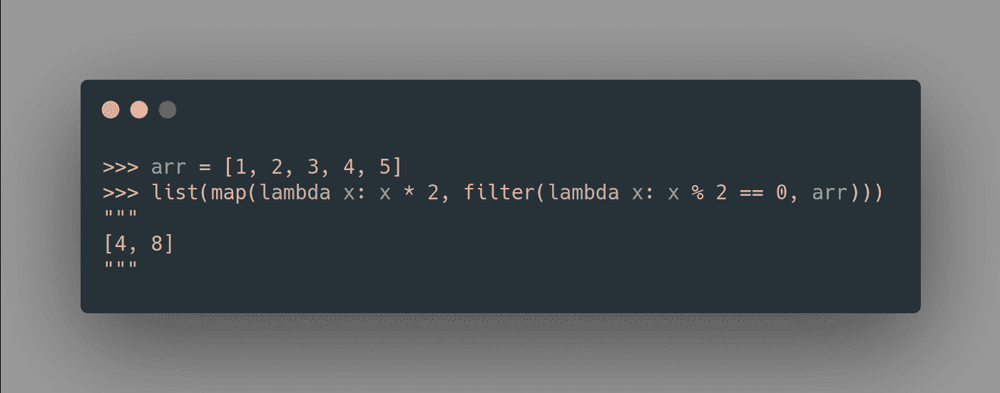

作者提供的图片

如果你可以像下面这样使用管道 `|` 来对可迭代对象应用多个方法，那不是很好吗？

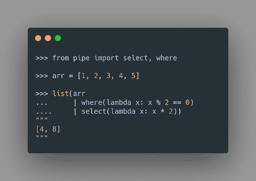

作者提供的图片

Pipe 库允许你做到这一点。

## 什么是 Pipe？

[Pipe](https://github.com/JulienPalard/Pipe) 是一个 Python 库，允许你在 Python 中使用管道。一个管道 (`|`) 将一个方法的结果传递给另一个方法。

我喜欢使用管道，因为当对 Python 可迭代对象应用多个方法时，它使我的代码看起来更简洁。由于管道只提供少量的方法，它也非常容易学习。在这篇文章中，我将展示一些我认为最有用的方法。

要安装 Pipe，请输入：

```py
pip install pipe
```

## Where — 过滤可迭代对象中的元素

类似于 SQL，Pipe 的 `where` 方法也可以用来过滤可迭代对象中的元素。

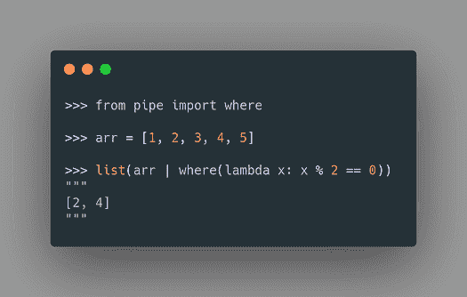

作者提供的图片

## Select — 对可迭代对象应用函数

`select` 方法类似于 `map` 方法。`select` 将一个方法应用到可迭代对象的每个元素上。

在下面的代码中，我使用 `select` 将列表中的每个元素乘以 2。

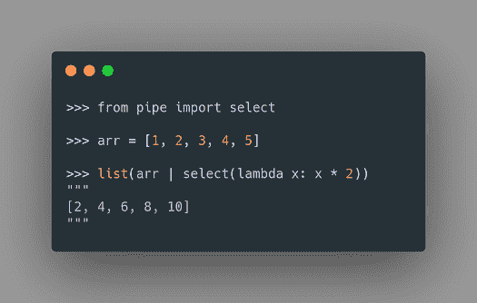

作者提供的图片

现在，你可能会想：既然 `where` 和 `select` 的功能与 `map` 和 `filter` 相同，我们为什么还需要它们呢？

因为你可以使用管道将一个方法接在另一个方法后面。因此，使用管道可以去除嵌套的括号，使代码更具可读性。


作者提供的图片

## 展开可迭代对象

## chain — 链接一系列可迭代对象

处理嵌套的可迭代对象可能很麻烦。幸运的是，你可以使用 `chain` 来连接一系列可迭代对象。


作者提供的图片

即使在应用了`chain`之后，可迭代对象的嵌套程度有所减少，我们仍然得到一个嵌套列表。要处理深度嵌套的列表，我们可以改用`traverse`。

## traverse — 递归展开可迭代对象

`traverse`方法可以用来递归展开可迭代对象。因此，你可以使用这种方法将深度嵌套的列表转化为平坦的列表。

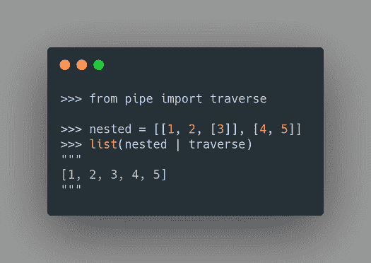

图片由作者提供

让我们将这种方法与`select`方法结合，获取字典的值并展平列表。

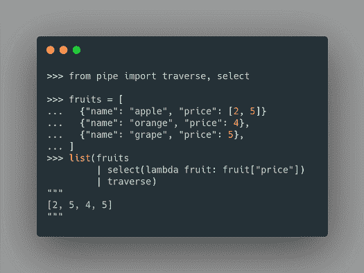

图片由作者提供

相当酷！

## 列表中的元素分组

有时，使用某个函数对列表中的元素进行分组可能会很有用。这可以通过`groupby`方法轻松实现。

为了查看这种方法的工作原理，让我们将一个数字列表转化为一个字典，该字典根据数字是偶数还是奇数进行分组。

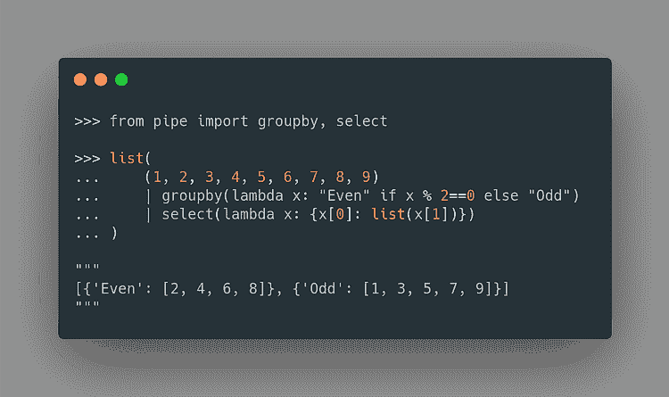

图片由作者提供

在上面的代码中，我们使用`groupby`将数字分组到`Even`组和`Odd`组。应用这种方法后的输出如下：

```py
[('Even', <itertools._grouper at 0x7fbea8030550>),
 ('Odd', <itertools._grouper at 0x7fbea80309a0>)]
```

接下来，我们使用`select`将一个元组列表转化为一个字典列表，其键是元组中的第一个元素，值是元组中的第二个元素。

```py
[{'Even': [2, 4, 6, 8]}, {'Odd': [1, 3, 5, 7, 9]}]
```

很酷！为了仅获取大于 2 的值，我们可以在`select`方法中添加`where`方法：

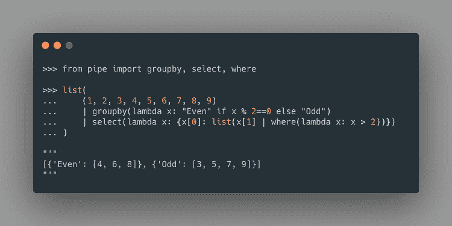

图片由作者提供

请注意，输出中不再包含`2`和`1`。

## dedup — 使用键去重

`dedup`方法用于移除列表中的重复项。

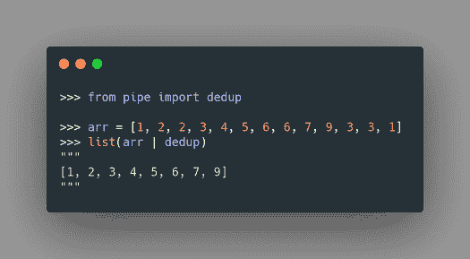

图片由作者提供

这可能听起来不那么有趣，因为`set`方法也能实现相同的功能。然而，这种方法更为灵活，因为它允许你通过键来获取唯一元素。

例如，你可以使用这种方法获取一个小于 5 的唯一元素，以及一个大于或等于 5 的唯一元素。

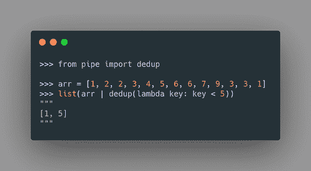

图片由作者提供

现在，让我们将这种方法与`select`和`where`结合，以获取具有重复键和`None`值的字典的值。

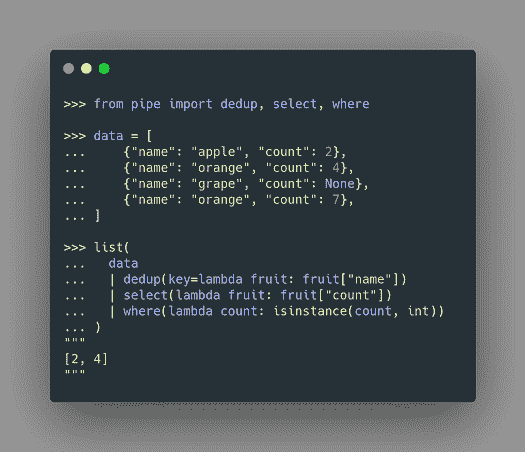

图片由作者提供

在上面的代码中，我们：

+   移除具有相同`name`的项

+   获取`count`的值

+   仅选择整数值。

通过几行代码，我们可以对一个可迭代对象应用多种方法，同时保持代码的简洁。很酷，不是吗？

## 结论

恭喜！你刚刚学会了如何使用 pipe 保持代码的整洁和简短。希望这篇文章能让你掌握将复杂的迭代操作转化为一行简单代码的知识。

欢迎在此处玩转并分叉本文的源代码：

[**Data-science/pipe.ipynb at master · khuyentran1401/Data-science**](https://github.com/khuyentran1401/Data-science/blob/master/productive_tools/pipe.ipynb)

我喜欢撰写基础数据科学概念，并玩弄不同的算法和数据科学工具。你可以通过 [LinkedIn](https://www.linkedin.com/in/khuyen-tran-1401/) 和 [Twitter](https://twitter.com/KhuyenTran16) 与我联系。

如果你想查看我撰写的所有文章的代码，请给 [这个仓库](https://github.com/khuyentran1401/Data-science) 点个星。关注我的 Medium，以获取最新的数据科学文章，如下所示：

[**Python 清洁代码: 使你的 Python 函数更具可读性的 6 个最佳实践**](https://towardsdatascience.com/python-clean-code-6-best-practices-to-make-your-python-functions-more-readable-7ea4c6171d60)

[**4 个 pre-commit 插件以自动化 Python 代码审查和格式化**](https://towardsdatascience.com/4-pre-commit-plugins-to-automate-code-reviewing-and-formatting-in-python-c80c6d2e9f5)

[**Pydash: 一个包含缺失 Python 工具的厨房水槽**](https://towardsdatascience.com/pydash-a-bucket-of-missing-python-utilities-5d10365be4fc)

[**3 个 Python 技巧来自动读取、创建和运行多个文件**](https://towardsdatascience.com/3-python-tricks-to-read-create-and-run-multiple-files-automatically-5221ebaad2ba)

**个人简介: [Khuyen Tran](https://www.linkedin.com/in/khuyen-tran-1401/)** 是一位多产的数据科学作家，撰写了 [一系列有用的数据科学主题，包括代码和文章](https://github.com/khuyentran1401/Data-science)。Khuyen 目前正在寻找一份机器学习工程师、数据科学家或开发者推广角色的职位，特别是在 2022 年 5 月之后的湾区，如果你需要她的技能，请联系她。

[原文](https://towardsdatascience.com/write-clean-python-code-using-pipes-1239a0f3abf5)。经许可转载。

**相关:**

+   Python 序列的 5 个高级技巧

+   初学者的端到端机器学习指南

+   生成 Python 的电子表格: Mito JupyterLab 扩展

### 更多相关话题

+   [建立一个强大的数据团队](https://www.kdnuggets.com/2021/12/build-solid-data-team.html)

+   [是什么让 Python 成为初创企业理想的编程语言](https://www.kdnuggets.com/2021/12/makes-python-ideal-programming-language-startups.html)

+   [每位数据科学家都应该知道的三个 R 库（即使你使用 Python）](https://www.kdnuggets.com/2021/12/three-r-libraries-every-data-scientist-know-even-python.html)

+   [停止学习数据科学以寻找目标，并找到目标去...](https://www.kdnuggets.com/2021/12/stop-learning-data-science-find-purpose.html)

+   [成为出色数据科学家所需的 5 项关键技能](https://www.kdnuggets.com/2021/12/5-key-skills-needed-become-great-data-scientist.html)

+   [每个初学者数据科学家应掌握的 6 种预测模型](https://www.kdnuggets.com/2021/12/6-predictive-models-every-beginner-data-scientist-master.html)
