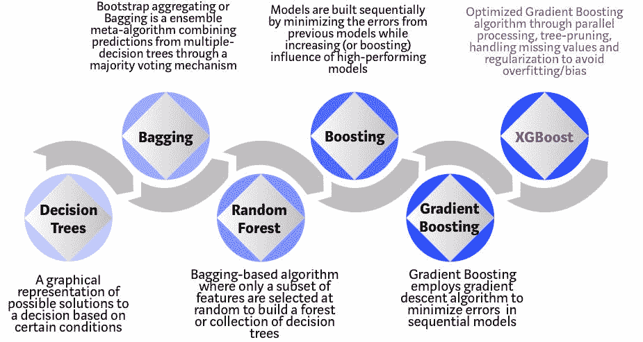
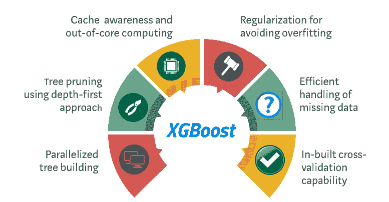
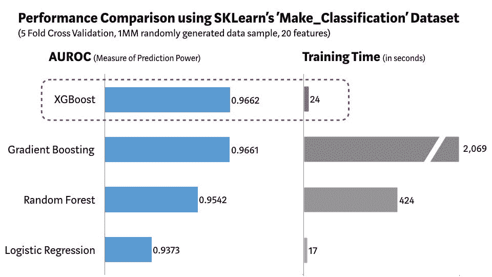

# XGBoost 算法：愿她长久统治

> 原文：[`www.kdnuggets.com/2019/05/xgboost-algorithm.html`](https://www.kdnuggets.com/2019/05/xgboost-algorithm.html)

 评论

**由 [Vishal Morde](https://www.linkedin.com/in/vishalmorde/) 和 [Anurag Setty](https://www.linkedin.com/in/venkatsetty/) 合著**

**照片由 [Jared Subia](https://unsplash.com/photos/QczH4IiPNx0?utm_source=unsplash&utm_medium=referral&utm_content=creditCopyText) 提供，来源于 [Unsplash](https://unsplash.com/search/photos/tiara?utm_source=unsplash&utm_medium=referral&utm_content=creditCopyText)**

（本文与 [Venkat Anurag Setty](https://medium.com/@setgeti) 共同撰写）

我仍然记得十五年前我第一份工作的第一天。我刚刚完成研究生学业，加入了一家全球投资银行担任分析师。在第一天，我不断整理领带，试图记住我学过的所有东西。与此同时，我深深地怀疑自己是否足够适合企业世界。感受到我的焦虑，我的老板微笑着说：

*“别担心！你唯一需要知道的就是回归建模！”*

我记得当时我在想，“我搞定了！”我了解回归建模，包括线性回归和逻辑回归。我的老板说得对。在我的任期内，我专注于构建基于回归的统计模型。我不是唯一的。事实上，那时回归建模是预测分析领域的无可争议的女王。快进十五年，回归建模的时代已经结束。老女王已逝，新女王以一个独特的名字登场；XGBoost 或极端梯度提升！

### XGBoost 是什么？

[XGBoost](https://xgboost.ai/) 是一种基于决策树的集成机器学习算法，使用了 [梯度提升](https://en.wikipedia.org/wiki/Gradient_boosting) 框架。在涉及非结构化数据（如图像、文本等）的预测问题中，人工神经网络通常优于所有其他算法或框架。然而，当涉及到小到中型的结构化/表格数据时，基于决策树的算法目前被认为是最优的。请参见下面的图表，了解决策树算法的演变过程。

**XGBoost 算法从决策树的演变**

XGBoost 算法是华盛顿大学的一个研究项目。**[Tianqi Chen and Carlos Guestrin](https://arxiv.org/pdf/1603.02754.pdf)** 在 2016 年的 SIGKDD 会议上展示了他们的论文，引起了机器学习界的广泛关注。自引入以来，该算法不仅因赢得众多 Kaggle 比赛而受到赞誉，还因在多个前沿行业应用中作为核心驱动力而广泛使用。因此，XGBoost 开源项目拥有一个强大的数据科学家社区，有约 350 位贡献者和约 3,600 次提交，分布在 **[GitHub](https://github.com/dmlc/xgboost/)** 上。该算法在以下方面有所不同：

1.  广泛的应用范围：可用于解决回归、分类、排序和用户定义的预测问题。

1.  可移植性：在 Windows、Linux 和 OS X 上运行流畅。

1.  语言：支持包括 C++、Python、R、Java、Scala 和 Julia 在内的所有主要编程语言。

1.  云集成：支持 AWS、Azure 和 Yarn 集群，并与 Flink、Spark 和其他生态系统良好兼容。

### 如何建立对 XGBoost 的直觉？

决策树在最简单的形式下，易于可视化且相当可解释，但为下一代基于树的算法建立直觉可能有些棘手。请参见下面的简单类比，以更好地理解基于树的算法的演变。

**照片由 [rawpixel](https://unsplash.com/photos/cnseVhmbA7k?utm_source=unsplash&utm_medium=referral&utm_content=creditCopyText) 提供，出处 [Unsplash](https://unsplash.com/search/photos/interview?utm_source=unsplash&utm_medium=referral&utm_content=creditCopyText)**

想象一下，你是一个招聘经理，正在面试几位资格出色的候选人。基于树的算法的每一步演变都可以被视为面试过程的一个版本。

1.  **决策树**：每个招聘经理都有一套标准，如教育水平、工作经验年限、面试表现。决策树类似于招聘经理根据他或她自己的标准面试候选人。

1.  **Bagging**：现在想象一下，不再是一个面试官，而是一个面试小组，其中每个面试官都有一票。Bagging 或自助聚合涉及通过民主投票过程结合所有面试官的输入来做出最终决策。

1.  **随机森林**：这是一种基于 bagging 的算法，其主要区别在于仅随机选择一部分特征。换句话说，每个面试官只会测试面试者某些随机选择的资格（例如，技术面试测试编程技能，行为面试评估非技术技能）。

1.  **提升**：这是一种替代方法，其中每个面试官根据前一位面试官的反馈调整评估标准。这种方法通过部署更具动态的评估过程来“提升”面试过程的效率。

1.  **梯度提升**：提升的一种特殊情况，其中通过梯度下降算法最小化错误，例如，战略咨询公司利用案例面试来筛选出不合格的候选人。

1.  **XGBoost**：将 XGBoost 看作是“增强版”的梯度提升（它被称为‘极端梯度提升’，这是有原因的！）。它是软件和硬件优化技术的完美结合，能够在最短时间内使用较少的计算资源获得卓越的结果。

### 为什么 XGBoost 表现如此出色？

XGBoost 和梯度提升机（GBMs）都是集成树方法，利用梯度下降架构应用提升弱学习者（通常是[CARTs](https://www.datasciencecentral.com/profiles/blogs/introduction-to-classification-regression-trees-cart)）。然而，XGBoost 通过系统优化和算法增强改进了基础的 GBM 框架。

**XGBoost 如何优化标准 GBM 算法**

**系统优化：**

1.  **并行化**：XGBoost 在构建树的过程中采用了[并行化](http://zhanpengfang.github.io/418home.html)方法。这是因为用于构建基础学习者的循环具有可交换的性质；外部循环枚举树的叶节点，内部循环计算特征。这种循环嵌套限制了并行化，因为在完成内部循环（计算上更具挑战性）之前，外部循环无法开始。因此，为了提高运行时间，通过对所有实例进行全局扫描和使用并行线程进行排序，来交换循环顺序。这种切换通过抵消计算中的任何并行化开销来提高算法性能。

1.  **树剪枝**：GBM 框架中的树分裂停止准则本质上是贪婪的，并依赖于分裂点的负损失准则。XGBoost 使用指定的‘max_depth’参数，而不是首先使用准则，并开始从后向前剪枝树。这种“深度优先”的方法显著提高了计算性能。

1.  **硬件优化**：该算法旨在高效利用硬件资源。这通过缓存感知来实现，即在每个线程中分配内部缓冲区以存储梯度统计数据。进一步的增强措施，如“外部核心”计算，优化了可用的磁盘空间，同时处理那些无法完全载入内存的大数据帧。

**算法增强：**

1.  **正则化**：它通过 LASSO (L1) 和 Ridge (L2) [正则化](https://towardsdatascience.com/l1-and-l2-regularization-methods-ce25e7fc831c) 来惩罚更复杂的模型，从而防止过拟合。

1.  **稀疏性意识**：XGBoost 自然地接受输入的稀疏特征，通过自动‘学习’最佳的缺失值，依据训练损失，并更有效地处理数据中的不同类型的[sparsity patterns](https://www.kdnuggets.com/2017/10/xgboost-concise-technical-overview.html)。

1.  **加权分位数草图**：XGBoost 采用了分布式[加权分位数草图算法](https://arxiv.org/pdf/1603.02754.pdf)来有效地在加权数据集中找到最佳的分裂点。

1.  **交叉验证**：该算法在每次迭代中都内置了[cross-validation](https://towardsdatascience.com/cross-validation-in-machine-learning-72924a69872f)方法，这样就不需要显式地编程进行搜索，也不需要在单次运行中指定确切的提升迭代次数。

### 证据在哪里？

我们使用了 Scikit-learn 的‘[Make_Classification](https://scikit-learn.org/stable/modules/generated/sklearn.datasets.make_classification.html)’ 数据包，创建了一个包含 100 万数据点的随机样本，具有 20 个特征（2 个信息性特征和 2 个冗余特征）。我们测试了几种算法，如逻辑回归、随机森林、标准梯度提升和 XGBoost。

**XGBoost 与其他机器学习算法在 SKLearn 的 Make_Classification 数据集上的比较**

如上图所示，XGBoost 模型在预测性能和处理时间方面相比其他算法具有最佳的组合。其他严谨的[基准测试](https://github.com/szilard/benchm-ml)研究也产生了类似的结果。难怪 XGBoost 在最近的数据科学比赛中被广泛使用。

*“当有疑问时，使用 XGBoost”*—**欧文·张**，Kaggle [Avito](https://blog.kaggle.com/2015/08/26/avito-winners-interview-1st-place-owen-zhang/) 上的广告点击预测比赛冠军

### 那么我们是否应该一直使用 XGBoost？

在机器学习（甚至生活中），没有免费的午餐。作为数据科学家，我们必须测试所有可能的算法，以找出最佳算法。此外，选择正确的算法还不够。我们还必须通过调整[超参数](https://www.analyticsvidhya.com/blog/2016/03/complete-guide-parameter-tuning-xgboost-with-codes-python/)来为数据集选择正确的算法配置。此外，还有其他因素，如计算复杂性、可解释性和实现的难易程度，这些也是选择获胜算法时需要考虑的。这正是机器学习从科学向艺术转变的地方，但说实话，这也是魔法发生的地方！

### 未来会怎样？

机器学习是一个非常活跃的研究领域，目前已经有几个可行的替代方案来挑战 XGBoost。微软研究院最近发布了 [LightGBM](https://www.microsoft.com/en-us/research/project/lightgbm/) 框架，用于梯度提升，显示出巨大潜力。 [CatBoost](https://catboost.ai/) 由 Yandex 技术开发，已经提供了令人印象深刻的基准结果。我们何时能够拥有一个更好的模型框架来超越 XGBoost，取决于预测性能、灵活性、可解释性和实用性。然而，在强有力的挑战者出现之前，XGBoost 将继续在机器学习领域占据主导地位！

[原文](https://towardsdatascience.com/https-medium-com-vishalmorde-xgboost-algorithm-long-she-may-rein-edd9f99be63d)。已获转载许可。

**个人简介**: [Vishal Morde](https://www.linkedin.com/in/vishalmorde/) 是一位经验丰富的高管和变革性领导者，在数据科学、机器学习、人工智能、大数据和战略分析方面拥有超过 15 年的渐进经验。

**资源：**

+   [在线和基于网页的：分析、数据挖掘、数据科学、机器学习教育](https://www.kdnuggets.com/education/online.html)

+   [用于分析、数据科学、数据挖掘和机器学习的软件](https://www.kdnuggets.com/software/index.html)

**相关：**

+   [XGBoost 在 GPU 上：释放机器学习性能和生产力](https://www.kdnuggets.com/2018/12/nvidia-xgboost-gpu-machine-learning-performance-productivity.html)

+   [揭示 XGBoost 背后的数学](https://www.kdnuggets.com/2018/08/unveiling-mathematics-behind-xgboost.html)

+   [数据科学家面试揭秘](https://www.kdnuggets.com/2018/08/data-scientist-interviews-demystified.html)

* * *

## 我们的前三个课程推荐

 1. [谷歌网络安全证书](https://www.kdnuggets.com/google-cybersecurity) - 快速进入网络安全职业生涯。

 2. [谷歌数据分析专业证书](https://www.kdnuggets.com/google-data-analytics) - 提升你的数据分析能力

 3. [谷歌 IT 支持专业证书](https://www.kdnuggets.com/google-itsupport) - 支持你的组织 IT

* * *

### 更多相关话题

+   [如何加速 XGBoost 模型训练](https://www.kdnuggets.com/2021/12/speed-xgboost-model-training.html)

+   [XGBoost 的假设是什么？](https://www.kdnuggets.com/2022/08/assumptions-xgboost.html)

+   [调优 XGBoost 超参数](https://www.kdnuggets.com/2022/08/tuning-xgboost-hyperparameters.html)

+   [利用 XGBoost 进行时间序列预测](https://www.kdnuggets.com/2023/08/leveraging-xgboost-timeseries-forecasting.html)

+   [GBM 和 XGBoost 之间的区别是什么？](https://www.kdnuggets.com/wtf-is-the-difference-between-gbm-and-xgboost)

+   [使用 BERT 对长文本进行分类](https://www.kdnuggets.com/2022/02/classifying-long-text-documents-bert.html)
