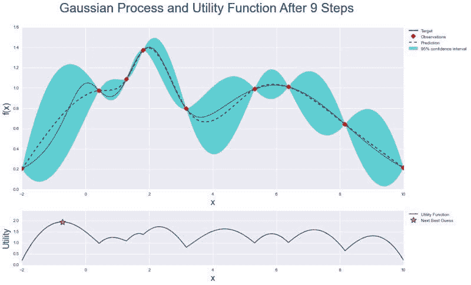
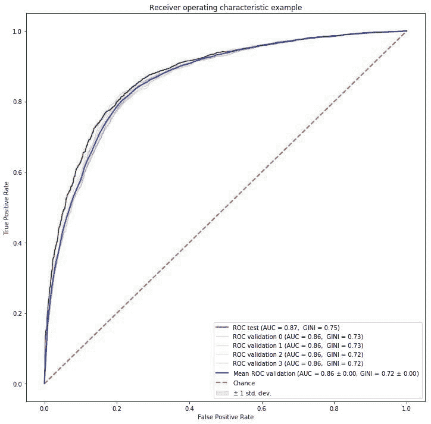

# XGBoost 和随机森林®与贝叶斯优化

> 原文：[`www.kdnuggets.com/2019/07/xgboost-random-forest-bayesian-optimisation.html`](https://www.kdnuggets.com/2019/07/xgboost-random-forest-bayesian-optimisation.html)

 评论

**由[Edwin Lisowski](https://addepto.com)，Addepto 首席技术官**

本文不仅比较了 XGBoost 和随机森林，还尝试解释如何将这两种非常流行的方法与贝叶斯优化结合使用，并讨论这些模型的主要优缺点。XGBoost（XGB）和随机森林（RF）都是集成学习方法，通过结合个别决策树的输出进行预测（分类或回归）（我们假设是基于树的 XGB 或 RF）。

* * *

## 我们的前三课程推荐

 1\. [谷歌网络安全证书](https://www.kdnuggets.com/google-cybersecurity) - 快速进入网络安全职业生涯。

 2\. [谷歌数据分析专业证书](https://www.kdnuggets.com/google-data-analytics) - 提升您的数据分析技能

 3\. [谷歌 IT 支持专业证书](https://www.kdnuggets.com/google-itsupport) - 支持您的组织的 IT 需求

* * *

### **深入比较 – XGBoost vs 随机森林**

### **XGBoost 或梯度提升**

XGBoost 每次构建一棵决策树。每棵新树都会修正之前训练的决策树所犯的错误。

**XGBoost 应用示例**

在 Addepto，我们使用 XGBoost 模型解决异常检测问题，例如在监督学习方法中。在这种情况下，XGB 非常有用，因为数据集通常高度不平衡。这些数据集的示例包括用户/消费者交易、能源消耗或移动应用中的用户行为。

**优点**

由于提升树是通过优化目标函数得出的，基本上 XGB 可以用来解决几乎所有我们可以写出梯度的目标函数。这包括排名和泊松回归等问题，而 RF 较难实现。

**缺点**

如果数据有噪声，XGB 模型更容易过拟合。训练通常需要更长时间，因为树是顺序构建的。GBM 比 RF 更难调整。通常有三个参数：树的数量、树的深度和学习率，每棵树通常较浅。

### **随机森林**

随机森林（RF）独立训练每棵树，使用数据的随机样本。这种随机性有助于使模型比单棵决策树更稳健。因此，RF 更不容易在训练数据上过拟合。

**随机森林应用示例**

随机森林差异性已被应用于各种应用中，例如，根据组织标记数据寻找患者的聚类。[1] 随机森林模型在以下两种情况下对于这类应用非常有吸引力：

我们的目标是对具有强相关特征的高维问题具有高预测准确性。

我们的数据集非常嘈杂，并包含大量缺失值，例如，某些属性是类别型或半连续型的。

**优点**

随机森林中的模型调整比 XGBoost 的要容易。在 RF 中，我们有两个主要参数：每个节点选择的特征数量和决策树的数量。RF 比 XGB 更难以过拟合。

**缺点**

随机森林算法的主要限制在于大量树木可能会使算法在实时预测中变得缓慢。对于包含具有不同级别数量的类别变量的数据，随机森林对那些具有更多级别的属性存在偏见。

贝叶斯优化是一种优化评估代价高昂的函数的技术。[2] 它为目标函数构建后验分布，并使用高斯过程回归计算该分布中的不确定性，然后使用采集函数来决定采样位置。贝叶斯优化专注于解决以下问题：

*max[x∈A] f(x)*

在大多数成功的应用中，超参数的维度（*x∈R^d*）通常是 d < 20。

通常设置 A i 为超矩形（*x∈R^d:a[i] ≤ x[i] ≤ b[i]*）。目标函数是连续的，这对于使用高斯过程回归建模是必要的。它还缺乏像凹性或线性这样的特殊结构，这使得利用这种结构来提高效率的技术变得无效。贝叶斯优化包含两个主要组件：用于建模目标函数的贝叶斯统计模型和用于决定下一个采样点的采集函数。

在根据初始空间填充实验设计评估目标后，它们被迭代地用于分配 N 评估的剩余预算，如下所示：

1.  观察初始点

1.  当*n ≤ N* 时

    使用所有可用数据更新后验概率分布

    让*x[n]*成为采集函数的最大值

    观察*y[n] = f(x[n])*

    增量*n*

    结束循环

1.  返回一个解决方案：评估点中最大的

我们可以总结这个问题，说贝叶斯优化是为了黑箱无导数全局优化而设计的。它在机器学习中调整超参数时变得极其流行。

下面是整个优化的图形总结：带有观察值和置信区间的高斯过程与后验分布，以及效用函数，其中最大值表示下一个采样点。



借助实用函数，贝叶斯优化在调优机器学习算法的参数时，比网格搜索或随机搜索技术更高效。它能够有效平衡“探索”和“开发”，以寻找全局最优解。

为了展示贝叶斯优化的实际效果，我们使用了 [BayesianOptimization](https://github.com/fmfn/BayesianOptimization) [3] 这个用 Python 编写的库来调优随机森林和 XGBoost 分类算法的超参数。我们需要通过 pip 安装它：

`pip install bayesian-optimization`

现在让我们训练我们的模型。首先，我们导入所需的库：

```py
#Import libraries
import pandas as pd
import numpy as np
from bayes_opt import BayesianOptimization
from sklearn.ensemble import RandomForestClassifier
from sklearn.model_selection import cross_val_score
```

我们定义了一个函数来运行贝叶斯优化，给定数据、要优化的函数及其超参数：

```py
#Bayesian optimization
def bayesian_optimization(dataset, function, parameters):
   X_train, y_train, X_test, y_test = dataset
   n_iterations = 5
   gp_params = {"alpha": 1e-4}

   BO = BayesianOptimization(function, parameters)
   BO.maximize(n_iter=n_iterations, **gp_params)

   return BO.max
```

我们定义了优化函数，即随机森林分类器及其超参数 n_estimators、max_depth 和 min_samples_split。此外，我们使用了给定数据集上的交叉验证得分的平均值：

```py
def rfc_optimization(cv_splits):
    def function(n_estimators, max_depth, min_samples_split):
        return cross_val_score(
               RandomForestClassifier(
                   n_estimators=int(max(n_estimators,0)),                                                               
                   max_depth=int(max(max_depth,1)),
                   min_samples_split=int(max(min_samples_split,2)), 
                   n_jobs=-1, 
                   random_state=42,   
                   class_weight="balanced"),  
               X=X_train, 
               y=y_train, 
               cv=cv_splits,
               scoring="roc_auc",
               n_jobs=-1).mean()

    parameters = {"n_estimators": (10, 1000),
                  "max_depth": (1, 150),
                  "min_samples_split": (2, 10)}

    return function, parameters
```

类似地，我们定义了 XGBoost 分类器的函数和超参数：

```py
def xgb_optimization(cv_splits, eval_set):
    def function(eta, gamma, max_depth):
            return cross_val_score(
                   xgb.XGBClassifier(
                       objective="binary:logistic",
                       learning_rate=max(eta, 0),
                       gamma=max(gamma, 0),
                       max_depth=int(max_depth),                                               
                       seed=42,
                       nthread=-1,
                       scale_pos_weight = len(y_train[y_train == 0])/
                                          len(y_train[y_train == 1])),  
                   X=X_train, 
                   y=y_train, 
                   cv=cv_splits,
                   scoring="roc_auc",
                   fit_params={
                        "early_stopping_rounds": 10, 
                        "eval_metric": "auc", 
                        "eval_set": eval_set},
                   n_jobs=-1).mean()

    parameters = {"eta": (0.001, 0.4),
                  "gamma": (0, 20),
                  "max_depth": (1, 2000)}

    return function, parameters
```

现在根据选择的分类器，我们可以优化它并训练模型：

```py
#Train model
def train(X_train, y_train, X_test, y_test, function, parameters):
    dataset = (X_train, y_train, X_test, y_test)
    cv_splits = 4

    best_solution = bayesian_optimization(dataset, function, parameters)      
    params = best_solution["params"]

    model = RandomForestClassifier(
             n_estimators=int(max(params["n_estimators"], 0)),
             max_depth=int(max(params["max_depth"], 1)),
             min_samples_split=int(max(params["min_samples_split"], 2)), 
             n_jobs=-1, 
             random_state=42,   
             class_weight="balanced")

    model.fit(X_train, y_train)

    return model
```

作为示例数据，我们使用了来自 AdventureWorksDW2017 SQL Server 数据库的视图 [dbo].[vTargetMail]，根据个人数据，我们需要预测一个人是否会购买自行车。通过贝叶斯优化的结果，我们展示了连续函数采样：

| **iter** | **AUC** | **max_depth** | **min_samples_split** | **n_estimators** |
| --- | --- | --- | --- | --- |
| 1 | 0.8549 | 45.88 | 6.099 | 34.82 |
| 2 | 0.8606 | 15.85 | 2.217 | 114.3 |
| 3 | 0.8612 | 47.42 | 8.694 | 306.0 |
| 4 | 0.8416 | 10.09 | 5.987 | 563.0 |
| 5 | 0.7188 | 4.538 | 7.332 | 766.7 |
| 6 | 0.8436 | 100.0 | 2.0 | 448.6 |
| 7 | 0.6529 | 1.012 | 2.213 | 315.6 |
| 8 | 0.8621 | 100.0 | 10.0 | 1e+03 |
| 9 | 0.8431 | 100.0 | 2.0 | 154.1 |
| 10 | 0.653 | 1.0 | 2.0 | 1e+03 |
| 11 | 0.8621 | 100.0 | 10.0 | 668.3 |
| 12 | 0.8437 | 100.0 | 2.0 | 867.3 |
| 13 | 0.637 | 1.0 | 10.0 | 10.0 |
| 14 | 0.8518 | 100.0 | 10.0 | 10.0 |
| 15 | 0.8435 | 100.0 | 2.0 | 317.6 |
| 16 | 0.8621 | 100.0 | 10.0 | 559.7 |
| 17 | 0.8612 | 89.86 | 10.0 | 82.96 |
| 18 | 0.8616 | 49.89 | 10.0 | 212.0 |
| 19 | 0.8622 | 100.0 | 10.0 | 771.7 |
| 20 | 0.8622 | 38.33 | 10.0 | 469.2 |
| 21 | 0.8621 | 39.43 | 10.0 | 638.6 |
| 22 | 0.8622 | 83.73 | 10.0 | 384.9 |
| 23 | 0.8621 | 100.0 | 10.0 | 936.1 |
| 24 | 0.8428 | 54.2 | 2.259 | 122.4 |
| 25 | 0.8617 | 99.62 | 9.856 | 254.8 |

如我们所见，贝叶斯优化在第 23 步找到了最佳参数，这在测试数据集上得到了 0.8622 的 AUC 分数。如果给更多样本进行检查，结果可能会更高。我们优化后的随机森林模型的 ROC AUC 曲线如下所示：



我们提出了一种简单的超参数调优方法，使用贝叶斯优化[4]，这是一种比网格搜索或随机搜索方法更快的寻找最优值的方法。

1.  [`www.researchgate.net/publication/225175169`](https://www.researchgate.net/publication/225175169_Random_Multiclass_Classification_Generalizing_Random_Forests_to_Random_MNL_and_Random_NB)

1.  [`en.wikipedia.org/wiki/Bayesian_optimization`](https://en.wikipedia.org/wiki/Bayesian_optimization)

1.  [`github.com/fmfn/BayesianOptimization`](https://github.com/fmfn/BayesianOptimization)

1.  [`addepto.com/automated-machine-learning-tasks-can-be-improved/`](https://addepto.com/automated-machine-learning-tasks-can-be-improved/)

**个人简介：** [Edwin Lisowski](https://addepto.com) 是 Addepto 的首席技术官。他是经验丰富的高级分析顾问，具有在信息技术和服务行业工作的丰富历史。他在预测建模、大数据、云计算和高级分析方面具有丰富的技能。

**相关内容：**

+   如何自动化超参数优化

+   XGBoost 简介：使用监督学习预测寿命期望

+   随机森林与神经网络：哪个更好，何时使用？

### 更多相关话题

+   [随机森林与决策树：关键区别](https://www.kdnuggets.com/2022/02/random-forest-decision-tree-key-differences.html)

+   [随机森林算法需要归一化吗？](https://www.kdnuggets.com/2022/07/random-forest-algorithm-need-normalization.html)

+   [调整随机森林超参数](https://www.kdnuggets.com/2022/08/tuning-random-forest-hyperparameters.html)

+   [GBM 和 XGBoost 之间的区别是什么？](https://www.kdnuggets.com/wtf-is-the-difference-between-gbm-and-xgboost)

+   [如何加速 XGBoost 模型训练](https://www.kdnuggets.com/2021/12/speed-xgboost-model-training.html)

+   [调整 XGBoost 超参数](https://www.kdnuggets.com/2022/08/tuning-xgboost-hyperparameters.html)
