# 你的特征很重要？这并不意味着它们是好的

> 原文：[`www.kdnuggets.com/your-features-are-important-it-doesnt-mean-they-are-good`](https://www.kdnuggets.com/your-features-are-important-it-doesnt-mean-they-are-good)

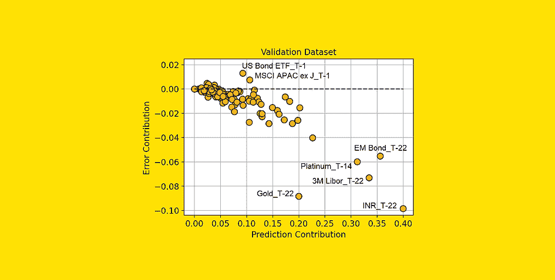

[图片来源：作者]

# “重要”和“好”不是同义词

“特征重要性”这个概念在机器学习中被广泛使用，作为最基本的模型解释性类型。例如，它被用于递归特征消除（RFE），以迭代地删除模型中最不重要的特征。

然而，对于这个概念存在一种误解。

> **一个特征重要并不意味着它对模型有益！**

实际上，当我们说一个特征很重要时，这只是意味着这个特征对模型的预测贡献很高。但我们应该考虑到**这种贡献可能是错误的**。

举个简单的例子：一个数据科学家不小心在模型的特征中忘记了客户 ID。模型将客户 ID 作为一个高度预测的特征。因此，即使这个特征实际上使模型表现更差，因为它不能很好地处理未见过的数据，它也会有很高的特征重要性。

为了使事情更清楚，我们需要区分两个概念：

+   **预测贡献**：预测中有多少部分是由于特征的存在；这相当于特征重要性。

+   **误差贡献**：预测误差中有多少部分是由于特征在模型中存在所致。

在本文中，我们将了解如何计算这些量，以及如何利用它们来获得关于预测模型的有价值见解（并加以改进）。

> 注意：本文集中于回归案例。如果你对分类案例更感兴趣，可以阅读[“哪些特征对你的分类模型有害？”](https://towardsdatascience.com/which-features-are-harmful-for-your-classification-model-6227859a44a6)

# 从一个简单的例子开始

假设我们构建了一个模型来预测人们的收入，基于他们的工作、年龄和国籍。现在我们使用模型对三个人进行预测。

因此，我们有了实际值、模型预测和结果误差：

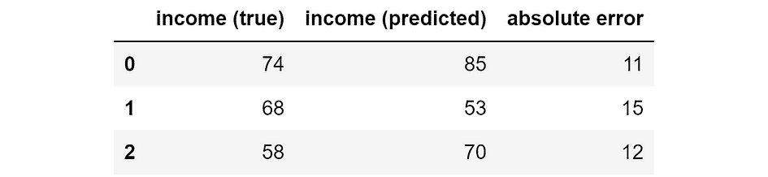

实际值、模型预测和绝对误差（以千美元计）。 [图片来源：作者]

# 计算“预测贡献”

当我们有一个预测模型时，我们可以将模型预测分解为单个特征带来的贡献。这可以通过 SHAP 值来完成（如果你不知道 SHAP 值的工作原理，你可以阅读我的文章：[SHAP 值解释：正如你希望别人向你解释的那样](https://towardsdatascience.com/shap-explained-the-way-i-wish-someone-explained-it-to-me-ab81cc69ef30)）。

因此，假设这些是相对于我们模型的三个个体的 SHAP 值。


我们模型预测的 SHAP 值（以千美元计）。 [图片由作者提供]

SHAP 值的主要属性是它们是可加性的。这意味着——通过对每一行求和——我们将得到模型对该个体的预测。例如，如果我们取第二行：72k $ +3k $ -22k $ = 53k $，这正是模型对第二个体的预测。

现在，SHAP 值是衡量特征对我们预测的重要性的良好指标。实际上，SHAP 值（绝对值）越高，该特征对特定个体的预测影响越大。注意，我说的是绝对 SHAP 值，因为这里的符号并不重要：一个特征无论是推动预测向上还是向下，都是同样重要的。

因此，**特征的预测贡献等于该特征绝对 SHAP 值的平均值**。如果你在 Pandas 数据框中存储了 SHAP 值，这就非常简单：

```py
prediction_contribution = shap_values.abs().mean()
```

在我们的示例中，这就是结果：


预测贡献。 [图片由作者提供]

正如你所见，*job*显然是最重要的特征，因为平均而言，它占最终预测的 71.67k $。国籍和年龄分别是第二和第三重要的特征。

然而，一个特征占据了最终预测的重要部分并不能说明该特征的性能。为了考虑这个方面，我们需要计算“错误贡献”。

# 计算“错误贡献”

假设我们想回答以下问题：“如果模型没有*job*特征，会做出什么预测？”SHAP 值可以让我们回答这个问题。实际上，由于它们是可加的，只需从模型的预测中减去相对于*job*特征的 SHAP 值即可。

当然，我们可以对每个特征重复这个过程。在 Pandas 中：

```py
y_pred_wo_feature = shap_values.apply(lambda feature: y_pred - feature)
```

这是结果：


如果我们去掉相应特征，得到的预测。 [图片由作者提供]

这意味着，如果我们没有*job*这个特征，那么模型会预测第一个个体 20k $，第二个个体-19k $，第三个个体-8k $。相反，如果我们没有*age*这个特征，模型会预测第一个个体 73k $，第二个个体 50k $，等等。

正如你所见，如果我们去掉不同的特征，每个个体的预测会有很大差异。因此，预测误差也会非常不同。我们可以轻松计算它们：

```py
abs_error_wo_feature = y_pred_wo_feature.apply(lambda feature: (y_true - feature).abs())
```

结果如下：


如果我们去除相应特征，我们将得到的绝对误差。[图像来自作者]

这些是如果我们去除相应特征将得到的误差。直观地说，如果误差很小，那么去除特征对模型不是问题——甚至是有益的。如果误差很高，那么去除特征就不是一个好主意。

但我们可以做得更多。实际上，我们可以计算完整模型误差和去除特征后误差之间的差异：

```py
error_diff = abs_error_wo_feature.apply(lambda feature: abs_error - feature)
```

即：


模型的误差与去除特征后误差之间的差异。[图像来自作者]

如果这个数字是：

+   如果是负数，那么特征的存在会导致预测误差的减少，因此该特征对该观察结果有效！

+   如果是正数，那么特征的存在会导致预测误差的增加，因此该特征对该观察结果不好。

**我们可以将每个特征的这些值的均值计算为“错误贡献”。** 在 Pandas 中：

```py
error_contribution = error_diff.mean()
```

结果如下：


错误贡献。[图像来自作者]

如果这个值是正数，那么这意味着，平均而言，特征在模型中的存在会导致更高的错误。因此，没有这个特征，预测结果会更好。换句话说，这个特征带来的负面影响大于正面影响！

相反，这个值越负，特征对预测的帮助就越大，因为它的存在会导致较小的误差。

让我们尝试在实际数据集上应用这些概念。

# 预测黄金回报

以下，我将使用一个来自[Pycaret](https://github.com/pycaret/pycaret)（一个基于[MIT 许可证](https://github.com/pycaret/pycaret/blob/master/LICENSE)的 Python 库）的数据集。该数据集名为“Gold”，包含金融数据的时间序列。

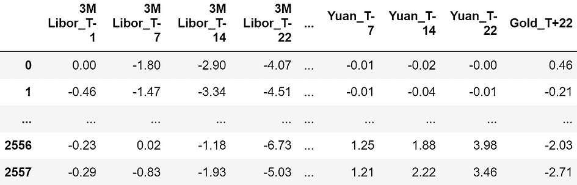

数据集样本。特征均以百分比表示，因此-4.07 意味着回报为-4.07%。[图像来自作者]

特征包括观察时刻（“T-22”、“T-14”、“T-7”、“T-1”）前 22 天、14 天、7 天和 1 天的金融资产回报。以下是用作预测特征的所有金融资产的详尽列表：

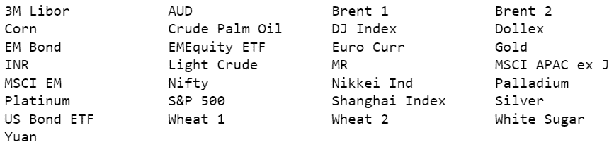

可用资产的列表。每个资产在时间-22、-14、-7 和-1 时被观察。[图像来自作者]

总共有 120 个特征。

目标是预测 22 天后的黄金价格（回报）(“Gold_T+22”)。让我们来看看目标变量。

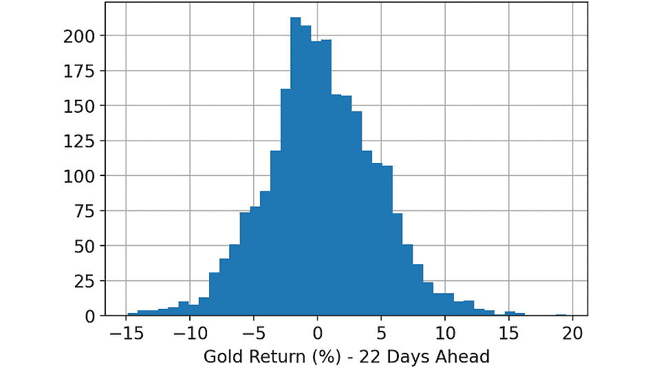

变量的直方图。 [图像来源：作者]

一旦加载了数据集，我执行了以下步骤：

1.  随机划分完整数据集：33%的行分配到训练数据集，另 33%到验证数据集，其余 33%到测试数据集。

1.  在训练数据集上训练一个 LightGBM 回归模型。

1.  在训练集、验证集和测试集上进行预测，使用在前一步训练的模型。

1.  计算训练集、验证集和测试集的 SHAP 值，使用 Python 库“shap”。

1.  计算每个特征在每个数据集（训练集、验证集和测试集）上的预测贡献和误差贡献，使用我们在前面段落中看到的代码。

# 比较预测贡献和误差贡献

让我们比较训练数据集中的误差贡献和预测贡献。我们将使用散点图，点表示模型的 120 个特征。

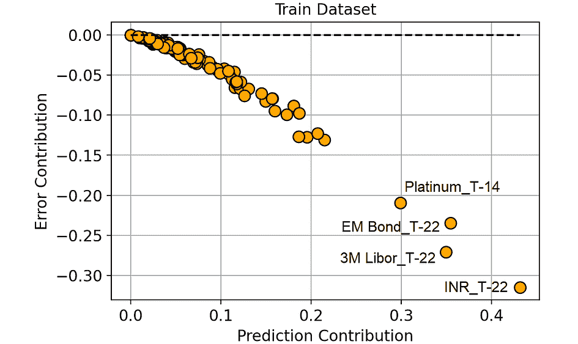

预测贡献与误差贡献（在训练数据集上）。 [图像来源：作者]

在训练集中，预测贡献和误差贡献之间存在高度负相关。

这也是有道理的：**因为模型在训练数据集上学习，它倾向于将高重要性（即高预测贡献）赋予那些导致预测误差大幅减少的特征（即高负误差贡献）**。

但这并没有增加太多我们的知识，对吧？

实际上，我们真正关心的是验证数据集。验证数据集实际上是我们关于特征在新数据上表现的最佳代理。因此，让我们在验证集上进行相同的比较。

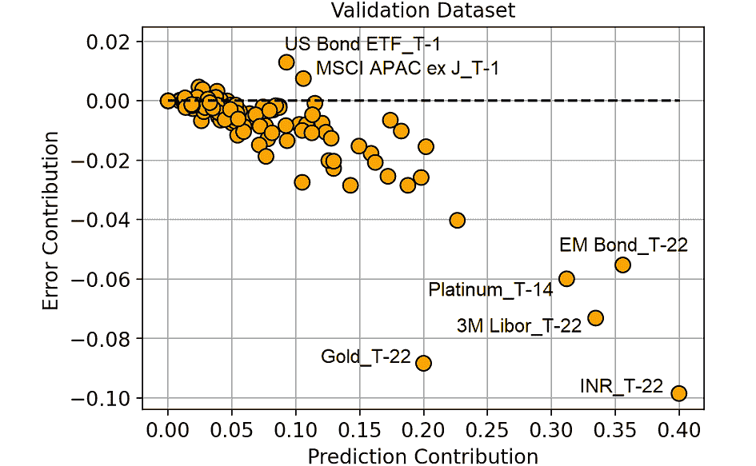

预测贡献与误差贡献（在验证数据集上）。 [图像来源：作者]

从这个图表中，我们可以提取一些更有趣的信息。

图表右下角的特征是模型正确地分配了高重要性的特征，因为它们实际减少了预测误差。

同样，需要注意的是“Gold_T-22”（观测期前 22 天的黄金回报）与模型赋予它的重要性相比，效果非常好。这意味着**这个特征可能存在欠拟合**。这一信息特别有趣，因为黄金是我们试图预测的资产（“Gold_T+22”）。

另一方面，**具有大于 0 的错误贡献的特征正在使我们的预测变差**。例如，“US Bond ETF_T-1”平均会将模型预测值改变 0.092%（预测贡献），但会导致模型预测比没有该特征时差 0.013%（错误贡献）。

我们可以假设**所有高错误贡献（与其预测贡献相比）的特征可能正在过拟合**，或者通常，它们在训练集和验证集上的表现有所不同。

让我们看看哪些特征具有最大的错误贡献。

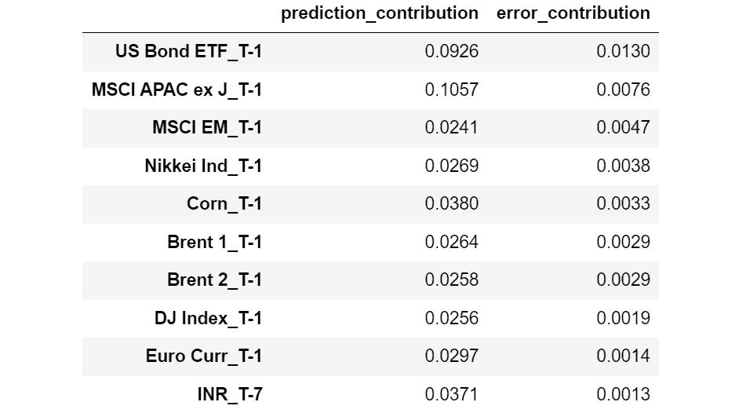

按错误贡献递减排序的特征。 [图像由作者提供]

现在来看错误贡献最低的特征：

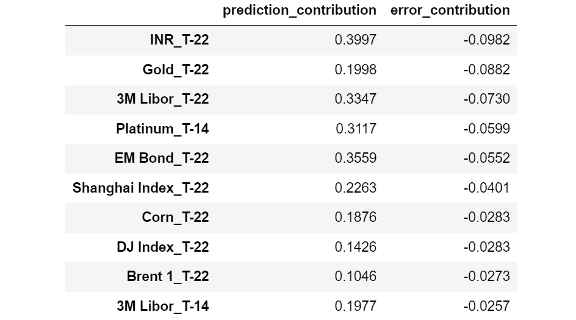

按错误贡献递增排序的特征。 [图像由作者提供]

有趣的是，我们可以观察到所有具有较高错误贡献的特征相对于 T-1（观察时刻前 1 天），而几乎所有具有较小错误贡献的特征相对于 T-22（观察时刻前 22 天）。

这似乎表明**最新的特征更容易过拟合，而时间较久的特征往往具有更好的泛化能力**。

请注意，没有错误贡献，我们永远不会知道这一点。

# 使用错误贡献的 RFE

传统的递归特征消除（RFE）方法基于移除不重要的特征。这相当于首先移除预测贡献较小的特征。

然而，根据我们在前一段中所说的，首先移除具有最高错误贡献的特征会更有意义。

为了验证我们的直觉，让我们比较这两种方法：

+   **传统 RFE：首先移除无用的特征**（最低的预测贡献）。

+   **我们的 RFE：首先移除有害的特征**（最高的错误贡献）。

让我们看看验证集上的结果：

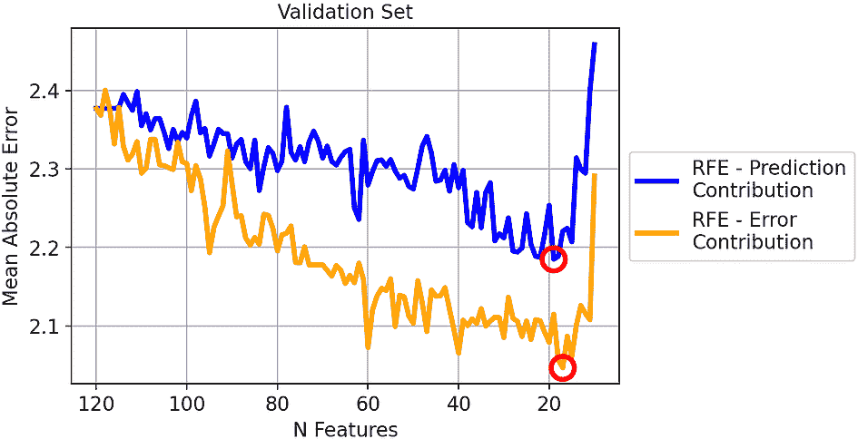

两种策略在验证集上的平均绝对误差。 [图像由作者提供]

每种方法的最佳迭代已被圈出：传统的 RFE（蓝线）是具有 19 个特征的模型，而我们的 RFE（橙线）是具有 17 个特征的模型。

总体而言，看来我们的方法效果很好：移除具有最高错误贡献的特征会导致 MAE consistently 较小，而不是移除具有最高预测贡献的特征。

然而，你可能会认为这只是因为我们过拟合了验证集。毕竟，我们更关心的是在测试集上得到的结果。

那么，让我们在测试集上看一下相同的比较。

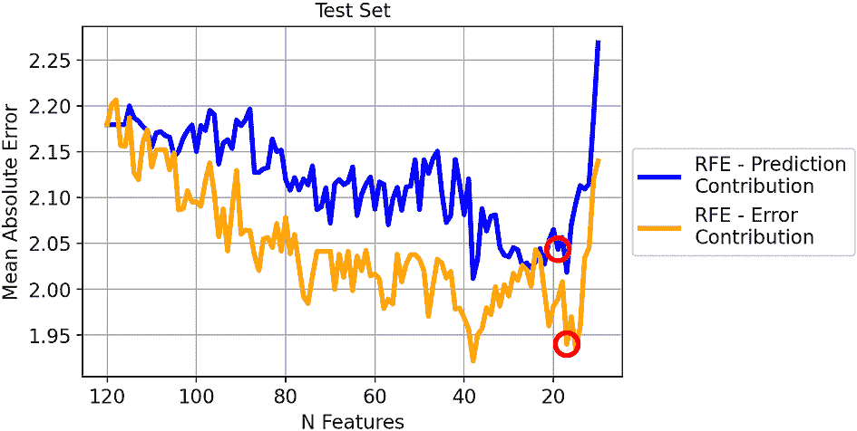

两种策略在测试集上的平均绝对误差。[图片来源作者]

结果与之前类似。即使两条线之间的距离较小，去除最高错误贡献者所得到的 MAE 明显优于去除最低预测贡献者所得到的 MAE。

由于我们选择了在验证集上产生最小 MAE 的模型，让我们看看它们在测试集上的表现：

+   RFE-预测贡献（19 个特征）。测试集上的 MAE：2.04。

+   RFE-错误贡献（17 个特征）。测试集上的 MAE：1.94。

所以，使用我们的方法得到的最佳 MAE 比传统 RFE 好 5%！

# 结论

特征重要性的概念在机器学习中扮演着基础性的角色。然而，“重要性”这一概念常被误解为“好处”。

为了区分这两个方面，我们引入了两个概念：预测贡献和错误贡献。这两个概念基于验证数据集的 SHAP 值，文章中我们已经看到计算它们的 Python 代码。

我们还在一个真实的金融数据集上进行了尝试（任务是预测黄金价格），并证明基于错误贡献的递归特征消除比基于预测贡献的传统 RFE 具有 5%的更好平均绝对误差。

*本文所用的所有代码可以在*[*这个笔记本*](https://github.com/smazzanti/tds_features_important_doesnt_mean_good/blob/main/regression.ipynb)*中找到。*

*感谢阅读！*

**[萨缪埃尔·马赞提](https://www.linkedin.com/in/samuelemazzanti/)** 是 Jakala 的首席数据科学家，目前居住在罗马。他拥有统计学学位，主要研究兴趣包括工业中的机器学习应用。他也是一名自由内容创作者。

[原文](https://towardsdatascience.com/your-features-are-important-it-doesnt-mean-they-are-good-ff468ae2e3d4)。转载经许可。

* * *

## 我们的前三名课程推荐

 1\. [谷歌网络安全证书](https://www.kdnuggets.com/google-cybersecurity) - 快速进入网络安全领域的职业轨道。

 2\. [谷歌数据分析专业证书](https://www.kdnuggets.com/google-data-analytics) - 提升您的数据分析能力

 3\. [谷歌 IT 支持专业证书](https://www.kdnuggets.com/google-itsupport) - 支持您的组织 IT 需求

* * *

### 更多相关话题

+   [什么是向量数据库，它们为什么对 LLMs 重要？](https://www.kdnuggets.com/2023/06/vector-databases-important-llms.html)

+   [大型语言模型是什么，它们是如何工作的？](https://www.kdnuggets.com/2023/05/large-language-models-work.html)

+   [基础模型是什么，它们是如何工作的？](https://www.kdnuggets.com/2023/05/foundation-models-work.html)

+   [人工智能驱动的 RPA 和 IA 对企业意味着什么？](https://www.kdnuggets.com/2022/12/aipowered-rpa-ia-mean-businesses.html)

+   [机器学习不像你的大脑 第七部分：神经元…](https://www.kdnuggets.com/2022/08/machine-learning-like-brain-part-seven-neurons-good.html)

+   [5 个 ChatGPT 功能提升你的日常工作](https://www.kdnuggets.com/2023/05/5-chatgpt-features-boost-daily-work.html)
